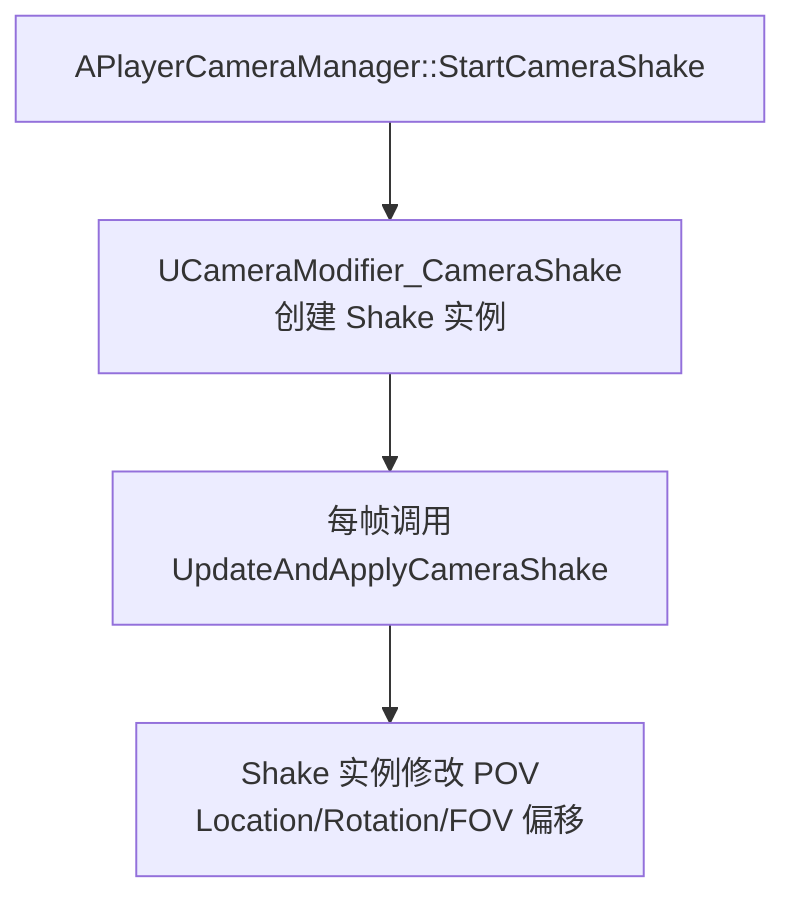
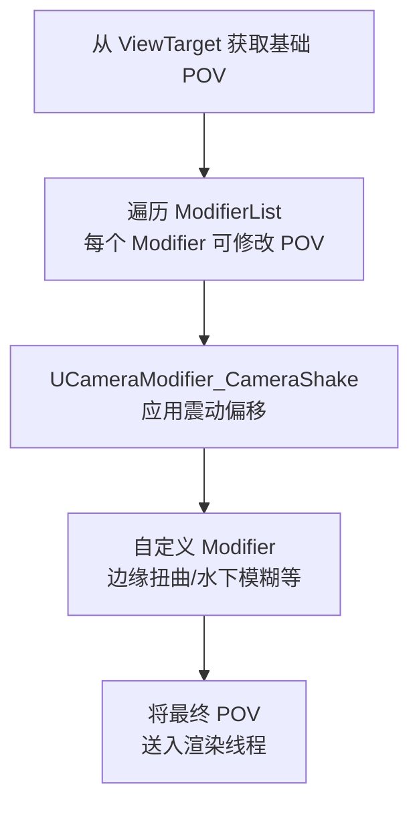

# CameraShake与CameraModifier

> 让摄像机「动起来」：震动、晃动、镜头扭曲的实现原理与使用方式。

## 概述

本课深入 UE 的摄像机震动（CameraShake）和镜头修饰器（CameraModifier）系统。学完本课你将理解：
- `UCameraShakeBase` 的生命周期和震动曲线驱动方式
- `UCameraModifier_CameraShake` 如何管理多个同时运行的 Shake 实例
- 如何通过 `APlayerCameraManager` 启动/停止 CameraShake
- 自定义 `UCameraModifier` 的方法
- Lyra 中如何通过 GameplayAbility 触发 CameraShake

---

## 核心概念

### 什么是 CameraShake？

`UCameraShakeBase` 是一个**描述摄像机如何晃动**的 Object。它不是 Component，而是一个**可实例化的效果对象**。



**直觉理解**：CameraShake 就像「**地震效果**」——你可以定义「震多强」、「震多久」、「震动的波形（Curve）」。

### CameraModifier 是什么？

`UCameraModifier` 是**后处理步骤**，在 `UpdateViewTarget()` 产出基础 `POV` 之后，允许修改 `POV`。



---

## 源码深度分析

### `UCameraShakeBase` 的生命周期

文件：`Engine/Source/Runtime/Engine/Classes/Camera/CameraShakeBase.h`

```cpp
// [1] UCameraShakeBase 是可实例化的 Object（非 Actor/Component）
//     每次 StartCameraShake() 会创建一个新的实例
UCLASS(Abstract, Blueprintable, EditInlineNew, BlueprintType)
class UCameraShakeBase : public UObject
{
    // [1-1] 震动总时长（秒），0 表示「一直运行直到手动停止」
    UPROPERTY(EditDefaultsAnywhere, Category = "Camera Shake")
    float Duration;

    // [1-2] 震动播放完后是否自动销毁
    UPROPERTY(EditDefaultsAnywhere, Category = "Camera Shake")
    bool bAutoPlay;

    // [1-3] ★ 核心：每帧更新并应用震动
    //     OutPOV 是「累加型」——在原有 POV 基础上加偏移
    virtual void UpdateAndApplyCameraShake(
        float DeltaTime,
        float Alpha,           // 由 Modifier 传入的混合权重
        FMinimalViewInfo& OutPOV);
};
```

**震动曲线驱动原理**（以 Location 偏移为例）：

```cpp
// [2] 典型的 CameraShake 实现（C++ 或 Blueprint）
//     用 UCurveVector 定义 X/Y/Z 偏移随时间的波形
UCLASS()
class UMyCameraShake : public UCameraShakeBase
{
    // [2-1] Location 偏移曲线（X/Y/Z 三个轴各自的波形）
    UPROPERTY(EditDefaultsAnywhere)
    UCurveVector* LocationCurve;

    // [2-2] Rotation 偏移曲线（Pitch/Yaw/Roll）
    UPROPERTY(EditDefaultsAnywhere)
    UCurveVector* RotationCurve;

    // [2-3] FOV 偏移曲线
    UPROPERTY(EditDefaultsAnywhere)
    UCurveFloat* FOVCurve;

    virtual void UpdateAndApplyCameraShake(float DeltaTime, float Alpha, FMinimalViewInfo& OutPOV) override
    {
        float Time = AccumulatedTime;

        // 从 Curve 读取当前帧的偏移值
        if (LocationCurve)
        {
            FVector LocOffset = LocationCurve->GetVectorValue(Time);
            OutPOV.Location += LocOffset * ShakeScale;
        }
        if (RotationCurve)
        {
            FRotator RotOffset = FRotator(
                RotationCurve->GetVectorValue(Time).Y,  // Pitch
                RotationCurve->GetVectorValue(Time).Z,  // Yaw
                RotationCurve->GetVectorValue(Time).X); // Roll
            OutPOV.Rotation += RotOffset * ShakeScale;
        }
    }
};
```

**设计决策分析**：为什么 CameraShake 用 `UCurve*` 而不是简单的正弦波？
> 因为**真实的震动不是正弦波**——枪击后坐力是「快冲 + 慢回」，地震是「随机噪声」，爆炸是「低频冲击」。`UCurve*` 允许美术在蓝图/编辑器中**手绘任意波形**，远比程序化波形灵活。

### `UCameraModifier_CameraShake` —— Shake 实例管理器

文件：`Engine/Source/Runtime/Engine/Classes/Camera/CameraModifier_CameraShake.h`

```cpp
// [3] 这个类是 UCameraModifier 的子类
//     它的职责是：管理多个同时运行的 Shake 实例
UCLASS()
class UCameraModifier_CameraShake : public UCameraModifier
{
    // [3-1] 启动一个 CameraShake（被 APlayerCameraManager::StartCameraShake() 调用）
    UFUNCTION(BlueprintCallable)
    UCameraShakeBase* StartCameraShake(
        TSubclassOf<UCameraShakeBase> ShakeClass,
        float Scale = 1.0f,
        ECameraShakePlaySpace PlaySpace = ECameraShakePlaySpace::CameraLocal);

    // [3-2] 停止一个 CameraShake
    UFUNCTION(BlueprintCallable)
    void StopCameraShake(UCameraShakeBase* ShakeInstance, bool bImmediately = false);

protected:
    // [3-3] ★ 每帧被调用的核心函数
    //     遍历所有活跃的 Shake 实例，调用它们的 UpdateAndApplyCameraShake()
    virtual void ModifyCamera(float DeltaTime, FMinimalViewInfo& OutPOV) override;
};
```

**Shake 实例池化（Pooling）**：

```cpp
// [4] 为了减少 GC 压力，UCameraModifier_CameraShake 使用对象池
//     重复利用已停止的 Shake 实例

// 文件：Engine/Source/Runtime/Engine/Private/Camera/CameraModifier_CameraShake.cpp

UCameraShakeBase* UCameraModifier_CameraShake::StartCameraShake(...)
{
    // [4-1] 先尝试从对象池里找一个「未使用」的实例
    UCameraShakeBase* ShakeInstance = FindAvailableShakeFromPool(ShakeClass);

    // [4-2] 池里没有，才新建
    if (!ShakeInstance)
    {
        ShakeInstance = NewObject<UCameraShakeBase>(this, ShakeClass);
        ShakePool.Push(ShakeInstance);
    }

    // [4-3] 初始化并加入活跃列表
    ShakeInstance->StartShake(PlayerCameraManager, Scale, PlaySpace);
    ActiveShakes.Add(ShakeInstance);

    return ShakeInstance;
}
```

---

## Lyra 实践

### Lyra 中如何触发 CameraShake？

Lyra **没有**在 C++ 层直接调用 `StartCameraShake()`，而是通过 **GameplayAbility** 触发。

典型流程：
```
玩家开枪
  → GameplayAbility 激活
    → PlayMontage（播放开枪动画）
    → 在 Montage 的某个 Notify 中触发 CameraShake
      → APlayerCameraManager::StartCameraShake()
```

**为什么通过 Ability 触发，而不是在 Weapon 类里直接触发？**
> 因为 CameraShake 的触发时机往往和**游戏逻辑**绑定（如：只有命中时才震动、蓄力越久震动越强），而这些逻辑已经在 GameplayAbility 中了。把 CameraShake 也放在 Ability 里，保持逻辑集中。

### Lyra 的 CameraShake 配置方式

Lyra 使用 **Blueprint 配置的 CameraShake 资产**（继承自 `UCameraShakeBase`），在 `ULyraGameplayAbility` 的 Blueprint 子类中配置。

```
Content/
└── LyraGame/
    └── CameraShakes/
        ├── CS_RifleRecoil       （步枪后坐力震动）
        ├── CS_ShotgunRecoil    （霰弹枪后坐力）
        └── CS_ExplosionImpact  （爆炸冲击）
```

**在 GameplayAbility Blueprint 中触发**：
```
Event ActivateAbility
  → Play Montage
  → Spawn Camera Shake at Camera
      └── Camera Shake Class = CS_RifleRecoil
```

---

## 常见问题与陷阱

### 1. CameraShake 不生效？

**排查清单**：
```cpp
// [1] 确认 PlayerCameraManager 存在
APlayerCameraManager* CamMgr = GetController<APlayerController>()->PlayerCameraManager;
check(CamMgr);

// [2] 确认 CameraShake 类有效
TSubclassOf<UCameraShakeBase> ShakeClass = UMyCameraShake::StaticClass();
check(ShakeClass);

// [3] 启动
CamMgr->StartCameraShake(ShakeClass);

// [4] 如果仍然不生效，检查是否有其他 Modifier 覆盖了结果
//     在 Console 输入：ShowDebug Camera
```

### 2. 多个 CameraShake 同时运行时「叠加过度」？

**原因**：多个 Shake 的 Location/Rotation 偏移是**累加**的，可能导致摄像机跑飞。

**解决**：使用 `Alpha` 参数控制每个 Shake 的贡献权重，或在 `UCameraShakeBase::UpdateAndApplyCameraShake()` 中限制最大偏移量。

### 3. CameraShake 在网络多人游戏中不同步？

**原因**：`StartCameraShake()` 只在**本地**运行，不会自动复制到服务器或其他客户端。

**解决**：在 GameplayAbility 中，用 `LocalPredicted` 或 `Server` 策略触发 CameraShake，确保只有本地玩家自己看到震动效果（通常这是正确的——你不希望别人的枪声震到你自己的屏幕）。

---

## 总结与要点

| # | 要点 | 说明 |
|---|------|------|
| 1 | `UCameraShakeBase` 是震动效果的描述 | 用 `UCurve*` 定义波形，每帧通过 `UpdateAndApplyCameraShake()` 修改 POV |
| 2 | `UCameraModifier_CameraShake` 管理实例池 | 减少 GC 压力，支持多个 Shake 同时运行 |
| 3 | 通过 `APlayerCameraManager::StartCameraShake()` 启动 | 这是 Blueprint 和 C++ 的统一入口 |
| 4 | Lyra 通过 GameplayAbility 触发 CameraShake | 逻辑集中，与游戏事件绑定 |
| 5 | CameraShake 是纯本地效果 | 不会自动网络复制，设计时需考虑多人同步策略 |

---

## 相关页面

- [[30-tutorials/camera-system/04-摄像机视图计算与投影]] ← 上一课：摄像机视图计算与投影
- [[30-tutorials/camera-system/06-LyraCameraComponent深度解析]] → 下一课：LyraCameraComponent 深度解析
- [[30-tutorials/gas/02-GA执行流程详解]] — GameplayAbility 执行流程（理解 Lyra 中如何通过 Ability 触发 Shake）

<!-- nav:auto -->

---

**导航**: ← [[30-tutorials/camera-system/04-摄像机视图计算与投影|04-摄像机视图计算与投影]] · [[30-tutorials/camera-system/06-LyraCameraComponent深度解析|06-LyraCameraComponent深度解析]] →

<!-- /nav:auto -->
