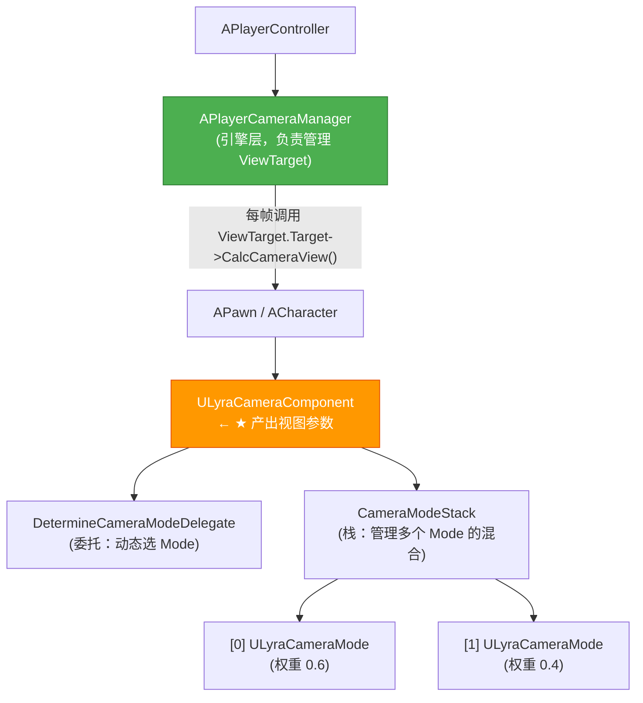

# LyraCameraComponent深度解析

> Lyra 对 `UCameraComponent` 的核心扩展：引入 CameraMode 栈，实现多模式混合。

## 概述

本课深入 `ULyraCameraComponent` 的设计与实现。学完本课你将理解：
- `DetermineCameraModeDelegate` 的工作机制（动态选择 CameraMode）
- `CameraModeStack` 如何管理多个 CameraMode 的混合权重
- `GetCameraView()` 重写后如何接入 CameraMode 系统
- `UpdateCameraModes()` 的 Push/Pop 逻辑
- 为什么这是多人游戏摄像机架构的推荐方案

---

## 核心概念

### `ULyraCameraComponent` 在架构中的位置



**直觉理解**：`ULyraCameraComponent` 就像一个「**摄像机导演**」——
- `DetermineCameraModeDelegate` = 选角导演（决定当前该用哪个 Mode）
- `CameraModeStack` = 多机位混合台（多个 Mode 可以同时激活，按权重混合）
- `GetCameraView()` = 最终出片（混合后的视图参数）

### `FLyraCameraModeDelegate` —— 动态选角机制

```cpp
// 文件：Source/LyraGame/Camera/LyraCameraComponent.h（L19）
DECLARE_DELEGATE_RetVal(TSubclassOf<ULyraCameraMode>, FLyraCameraModeDelegate);
```

**作用**：这是一个**委托（Delegate）**，返回「当前最适合的 CameraMode 类」。

**谁绑定了这个委托？**
> 通常是 `ULyraPawnExtensionComponent` 或 `ALyraCharacter` 在初始化时绑定，逻辑是：
> 1. 从 `ULyraPawnData` 中取 `DefaultCameraMode`
> 2. 如果角色当前有「特殊状态」（如：瞄准、驾驶），用对应的 CameraMode 覆盖

```cpp
// 典型绑定逻辑（在 Lyra 的 Pawn 初始化代码中）
LyraCameraComponent->DetermineCameraModeDelegate.BindUObject(this,
    &ALyraCharacter::DetermineBestCameraMode);

// ALyraCharacter::DetermineBestCameraMode() 的实现逻辑：
//   1. 如果在瞄准 → 返回 AimingCameraMode
//   2. 如果在驾驶 → 返回 VehicleCameraMode
//   3. 否则 → 返回 PawnData->DefaultCameraMode
```

---

## 源码深度分析

### `GetCameraView()` —— Lyra 重写的核心

文件：`Source/LyraGame/Camera/LyraCameraComponent.cpp` [32-83]

```cpp
// [1] Lyra 重写的 GetCameraView()
//     这是每帧产出最终视图参数的地方
void ULyraCameraComponent::GetCameraView(float DeltaTime, FMinimalViewInfo& DesiredView)
{
    check(CameraModeStack);

    // [1-1] ★ 核心：更新 CameraMode 栈
    //     内部会调用 DetermineCameraModeDelegate，根据需要 Push/Pop CameraMode
    UpdateCameraModes();

    // [1-2] 让 CameraModeStack 评估混合后的视图
    FLyraCameraModeView CameraModeView;
    CameraModeStack->EvaluateStack(DeltaTime, CameraModeView);

    // [1-3] ★ 同步 Controller 的 ControlRotation
    //     让 Pawn 的朝向和 Camera 的朝向保持一致
    if (APawn* TargetPawn = Cast<APawn>(GetTargetActor()))
    {
        if (APlayerController* PC = TargetPawn->GetController<APlayerController>())
        {
            // 关键：把 CameraMode 计算出的 ControlRotation 写回 Controller
            // 这样 Character 的朝向会跟随 Camera（如果是 bUseControllerDesiredRotation）
            PC->SetControlRotation(CameraModeView.ControlRotation);
        }
    }

    // [1-4] 应用单帧 FOV 偏移（如开镜时的临时 FOV 变化）
    CameraModeView.FieldOfView += FieldOfViewOffset;
    FieldOfViewOffset = 0.0f;  // 用完即清

    // [1-5] ★ 把混合后的结果写回 Component 的 Transform
    //     这样子组件（如 Mesh）可以正确 Attach
    SetWorldLocationAndRotation(
        CameraModeView.Location,
        CameraModeView.Rotation);

    // [1-6] 填充 DesiredView（交给 APlayerCameraManager 最终使用）
    DesiredView.Location    = CameraModeView.Location;
    DesiredView.Rotation    = CameraModeView.Rotation;
    DesiredView.FOV        = CameraModeView.FieldOfView;
    DesiredView.ProjectionMode = ProjectionMode;
    // ...
}
```

**设计决策分析**：为什么要把 `CameraModeView.ControlRotation` 写回 `PC->SetControlRotation()`？
> 因为 UE 的 `APawn::bUseControllerDesiredRotation` 会让 Pawn 的朝向**跟随 Controller 的 ControlRotation**。如果 CameraMode 计算出了一个新的「理想朝向」（如：瞄准时 Camera 略向左偏移），必须同步回 Controller，否则 Pawn 的 Mesh 朝向会和 Camera 不一致。

### `UpdateCameraModes()` —— 动态 Push/Pop CameraMode

文件：`Source/LyraGame/Camera/LyraCameraComponent.cpp` [85-99]

```cpp
// [2] UpdateCameraModes 每帧被调用
//     它的职责是：根据 DetermineCameraModeDelegate 的结果，维护 CameraModeStack
void ULyraCameraComponent::UpdateCameraModes()
{
    check(CameraModeStack);

    if (CameraModeStack->IsStackActivate())
    {
        // [2-1] 调用委托，获取「当前最合适的 CameraMode 类」
        if (DetermineCameraModeDelegate.IsBound())
        {
            if (const TSubclassOf<ULyraCameraMode> CameraMode = DetermineCameraModeDelegate.Execute())
            {
                // [2-2] ★ PushCameraMode 内部会：
                //   - 如果栈顶已经是该类 → 不做任何事
                //   - 如果是新的类 → Pop 旧模式，Push 新模式（带 Blend 过渡）
                CameraModeStack->PushCameraMode(CameraMode);
            }
        }
    }
}
```

**`PushCameraMode()` 的智能性**：

```cpp
// 文件：Source/LyraGame/Camera/LyraCameraMode.h [176]
void ULyraCameraModeStack::PushCameraMode(TSubclassOf<ULyraCameraMode> CameraModeClass)
{
    // [3-1] 如果栈顶已经是同一个类，不需要切换（避免重复 Blend）
    if (CameraModeStack.Num() > 0 &&
        CameraModeStack.Last()->GetClass() == CameraModeClass)
    {
        return;  // 栈顶已经是目标 Mode，直接返回
    }

    // [3-2] Pop 旧的栈顶（触发 OnDeactivation()）
    if (CameraModeStack.Num() > 0)
    {
        CameraModeStack.Pop()->OnDeactivation();
    }

    // [3-3] 获取（或复用）CameraMode 实例，Push 到栈顶
    ULyraCameraMode* NewMode = GetCameraModeInstance(CameraModeClass);
    CameraModeStack.Push(NewMode);
    NewMode->OnActivation();  // 触发 OnActivation()
}
```

---

## Lyra 实践

### `DetermineCameraModeDelegate` 的绑定时机

在 Lyra 中，`ULyraCameraComponent::DetermineCameraModeDelegate` 的绑定发生在：

```
ALyraCharacter::PossessedBy() 或 OnRep_PlayerState()
  → ULyraPawnExtensionComponent::SetupCameraComponent()
    → DetermineCameraModeDelegate.BindUObject(...)
```

**设计决策分析**：为什么用 Delegate 而不是直接在 `UpdateCameraModes()` 里硬编码逻辑？
> **解耦**。`ULyraCameraComponent` 本身不知道「什么情况下该用哪个 CameraMode」——这是 Gameplay 层的决策（如：Ability 系统、Vehicle 系统）。用 Delegate 把决策权交给外部，符合「**组件只做视图计算，不做游戏逻辑决策**」的原则。

### `FieldOfViewOffset` —— 单帧 FOV 偏移的妙用

```cpp
// 文件：Source/LyraGame/Camera/LyraCameraComponent.h [47]
void AddFieldOfViewOffset(float FovOffset) { FieldOfViewOffset += FovOffset; }
```

**使用场景**：开镜（ADS）时，FOV 需要从 90° 缩小到 60°。

**为什么不用直接设置 `FieldOfView`？**
> 因为 `FieldOfView` 是「基础 FOV」，而 `FieldOfViewOffset` 是「临时叠加量」。这样：
> - CameraMode 可以继续控制基础 FOV（如：奔跑时 FOV 微增）
> - 开镜效果可以叠加在基础 FOV 上，而不是覆盖它

```cpp
// 典型开镜逻辑：
void ULyraGameplayAbility_Aiming::OnADSStart()
{
    if (ULyraCameraComponent* Cam = ULyraCameraComponent::FindCameraComponent(this))
    {
        // 缩小 FOV（相当于「放大」效果）
        Cam->AddFieldOfViewOffset(-30.0f);
    }
}
```

---

## 常见问题与陷阱

### 1. CameraMode 切换时没有平滑过渡？

**原因**：`ULyraCameraMode::BlendTime` 为 0（默认值），表示立即切换。

**解决**：在 CameraMode 的 Blueprint 子类中，设置 `BlendTime = 0.2f`（200ms 过渡）。

### 2. `DetermineCameraModeDelegate` 没有被调用？

**排查清单**：
```cpp
// [1] 确认 Delegate 已绑定
check(LyraCameraComponent->DetermineCameraModeDelegate.IsBound());

// [2] 确认 CameraModeStack 已激活
check(LyraCameraComponent->CameraModeStack->IsStackActivate());

// [3] 确认每帧 UpdateCameraModes() 被调用
//     （在 GetCameraView() 内部调用，如果被跳过就不会更新）
```

### 3. CameraModeStack 中有多个 Mode 时，混合结果不符合预期？

**原因**：`EvaluateStack()` 的混合算法是**按权重线性混合**，但 Location/Rotation 的混合方式可能不符合预期（如：Rotation 应该用 `FMath::LerpRange()` 而不是简单线性）。

**解决**：在 `ULyraCameraMode` 中重写 `UpdateBlending()`，自定义混合算法。

---

## 总结与要点

| # | 要点 | 说明 |
|---|------|------|
| 1 | `DetermineCameraModeDelegate` 是动态选角机制 | 委托返回当前最合适的 CameraMode 类 |
| 2 | `CameraModeStack` 管理多个 Mode 的混合 | 支持同时激活多个 Mode，按权重混合 |
| 3 | `GetCameraView()` 重写后接入 CameraMode 系统 | 先让 Stack 评估，再填充 DesiredView |
| 4 | `FieldOfViewOffset` 是单帧临时偏移 | 用于开镜等临时 FOV 变化，不影响基础 FOV |
| 5 | Delegate 解耦了 CameraComponent 和 Gameplay 逻辑 | CameraComponent 不关心「为什么选这个 Mode」 |

---

## 相关页面

- [[30-tutorials/camera-system/05-CameraShake与CameraModifier]] ← 上一课：CameraShake 与 CameraModifier
- [[30-tutorials/camera-system/07-Lyra摄像机模式系统]] → 下一课：Lyra 摄像机模式系统

<!-- nav:auto -->

---

**导航**: ← [[30-tutorials/camera-system/05-CameraShake与CameraModifier|05-CameraShake与CameraModifier]] · [[30-tutorials/camera-system/07-Lyra摄像机模式系统|07-Lyra摄像机模式系统]] →

<!-- /nav:auto -->
