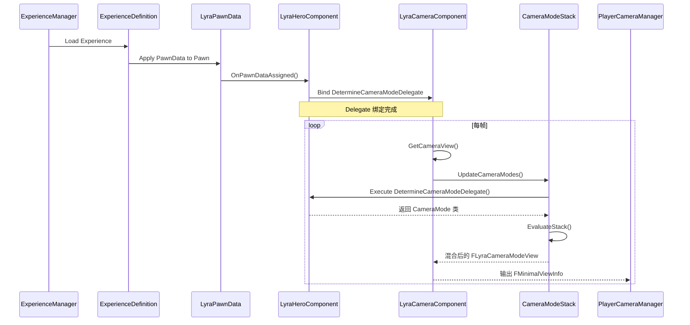

# Lyra摄像机与ExperiencePawnData集成

> Lyra 摄像机系统的「装配流程」：Experience 加载 → PawnData 注入 → CameraComponent 初始化 → Mode 选择。

## 概述

本课深入 Lyra 中摄像机系统如何与 Experience/PawnData 集成。学完本课你将理解：
- `ULyraPawnData::DefaultCameraMode` 如何配置和注入
- `ULyraHeroComponent` 如何绑定 `DetermineCameraModeDelegate`
- `ULyraPawnExtensionComponent` 的桥接作用
- 从 Pawn Spawn 到 Camera View 输出的完整调用链
- 为什么这是多人游戏摄像机架构的推荐方案

---

## 核心概念

### 完整装配流程（mermaid 时序图）



### `ULyraPawnData::DefaultCameraMode` 的作用

```cpp
// 文件：Source/LyraGame/Character/LyraPawnData.h
// [1] 这是 Pawn 的「默认摄像机模式」
//     在 Blueprint 中配置，Experience 加载时自动注入
UPROPERTY(EditDefaultsOnly, Category = "Lyra|Camera")
TSubclassOf<ULyraCameraMode> DefaultCameraMode;
```

**直觉理解**：`DefaultCameraMode` 就像「**默认镜头语言**」——每个 Pawn 类型（如：步兵、狙击手、驾驶员）可以配置不同的默认 CameraMode。

---

## 源码深度分析

### `ULyraHeroComponent::DetermineCameraMode()` —— Delegate 绑定目标

文件：`Source/LyraGame/Character/LyraHeroComponent.cpp`

```cpp
// [2] 这个函数被绑定到 DetermineCameraModeDelegate
//     它的职责是：返回「当前最合适的 CameraMode 类」
TSubclassOf<ULyraCameraMode> ULyraHeroComponent::DetermineCameraMode()
{
    // [2-1] 优先：如果有「特殊状态」的 CameraMode（如：瞄准、驾驶）
    if (AbilityCameraMode != nullptr)
    {
        return AbilityCameraMode;  // 由 GameplayAbility 设置
    }

    // [2-2] 回退：使用 PawnData 的 DefaultCameraMode
    if (ULyraPawnData* PawnData = GetPawnData<ULyraPawnData>())
    {
        return PawnData->DefaultCameraMode;
    }

    return nullptr;  // 没有 Mode，CameraComponent 回退到 Super::GetCameraView()
}
```

**绑定时机**：

```cpp
// [3] 在 LyraHeroComponent::InitializeAbilitySystem() 或类似初始化函数中
void ULyraHeroComponent::InitializeAbilitySystem(...)
{
    if (ULyraCameraComponent* CameraComponent = ULyraCameraComponent::FindCameraComponent(GetPawn()))
    {
        // ★ 绑定委托
        CameraComponent->DetermineCameraModeDelegate.BindUObject(
            this, &ThisClass::DetermineCameraMode);
    }
}
```

### `ULyraPawnExtensionComponent` 的桥接作用

`ULyraPawnExtensionComponent` 是 Lyra 的**Pawn 初始化枢纽**，它确保：
1. `ULyraPawnData` 被正确注入到 Pawn
2. CameraComponent 被正确初始化
3. InputComponent 被正确配置

```cpp
// 文件：Source/LyraGame/Character/LyraPawnExtensionComponent.cpp
// [4] 当 PawnData 被赋值后，触发一系列初始化
void ULyraPawnExtensionComponent::HandleChangePawnData(...)
{
    // [4-1] 初始化 CameraComponent
    if (ULyraCameraComponent* Cam = ULyraCameraComponent::FindCameraComponent(GetPawn()))
    {
        Cam->DetermineCameraModeDelegate.BindUObject(
            GetHeroComponent(), &ULyraHeroComponent::DetermineCameraMode);
    }

    // [4-2] 初始化 InputComponent
    // [4-3] 初始化 AbilitySystemComponent
    // ...
}
```

**设计决策分析**：为什么用 `ULyraPawnExtensionComponent` 做桥接，而不在 `ALyraCharacter::BeginPlay()` 里直接初始化？
> 因为 Lyra 的 Pawn 初始化是**分阶段的**（通过 `InitState` 系统）。`ULyraPawnExtensionComponent` 监听 `InitState` 的变化，确保在正确的时机初始化 CameraComponent（而不是在 BeginPlay 时可能 PawnData 还没加载完成）。

---

## Lyra 实践

### 如何配置一个新的 CameraMode？

完整步骤：

```
1. 创建 ULyraCameraMode 的 Blueprint 子类
   Content/LyraGame/CameraModes/BP_LyraCameraMode_Sniper

2. 配置参数：
   - FieldOfView = 30.0（狙击镜：小 FOV = 放大）
   - BlendTime = 0.3f（切换时 300ms 过渡）
   - ViewPitchMin/Max = -60/+60（限制俯仰角）

3. 在 PawnData 中配置 DefaultCameraMode
   Content/LyraGame/PawnData/B_HeroPawnData
     → DefaultCameraMode = BP_LyraCameraMode_Sniper

4. （可选）在 GameplayAbility 中动态覆盖
   ULyraGameplayAbility::OnAbilityActivated()
     → AbilityCameraMode = BP_LyraCameraMode_Aiming
```

### `AbilityCameraMode` —— 动态覆盖机制

```cpp
// 文件：Source/LyraGame/AbilitySystem/Abilities/LyraGameplayAbility.h
// [5] GameplayAbility 可以动态覆盖 CameraMode
//     这比在 PawnData 中硬编码更灵活

UPROPERTY()
TSubclassOf<ULyraCameraMode> AbilityCameraMode;

// 在 Ability 激活时设置
void ULyraGameplayAbility::ActivateAbilityFromEvent(...)
{
    if (ULyraHeroComponent* Hero = ...)
    {
        // 设置动态 CameraMode
        Hero->AbilityCameraMode = AbilityCameraMode;
    }
}

// 在 Ability 结束时清除
void ULyraGameplayAbility::EndAbility(...)
{
    if (ULyraHeroComponent* Hero = ...)
    {
        Hero->AbilityCameraMode = nullptr;  // 回退到 DefaultCameraMode
    }
}
```

**设计决策分析**：为什么用 `AbilityCameraMode` 而不是在 `DetermineCameraModeDelegate` 里直接判断 Ability 状态？
> 解耦。`ULyraHeroComponent::DetermineCameraMode()` 只负责「选 Mode」，不关心「为什么选这个 Mode」。把决策权交给 GameplayAbility，符合 Lyra 的「**Ability 驱动游戏逻辑**」架构。

---

## 常见问题与陷阱

### 1. CameraMode 没有生效？

**排查清单**：
```cpp
// [1] 确认 PawnData 已正确加载
ULyraPawnData* PD = LyraHeroComponent->GetPawnData<ULyraPawnData>();
check(PD && PD->DefaultCameraMode);

// [2] 确认 Delegate 已绑定
check(LyraCameraComponent->DetermineCameraModeDelegate.IsBound());

// [3] 确认 CameraModeStack 已激活
check(LyraCameraComponent->CameraModeStack->IsStackActivate());
```

### 2. 切换 PawnData 后 CameraMode 没有更新？

**原因**：`DetermineCameraModeDelegate` 在 PawnData 切换后没有被重新绑定。

**解决**：监听 `OnPawnDataChanged` 事件，重新绑定 Delegate：
```cpp
void ULyraPawnExtensionComponent::HandleChangePawnData(...)
{
    if (ULyraCameraComponent* Cam = ...)
    {
        Cam->DetermineCameraModeDelegate.BindUObject(
            GetHeroComponent(), &ThisClass::DetermineCameraMode);
    }
}
```

### 3. 多人游戏中，其他玩家的 CameraMode 也同步了？

**原因**：`DetermineCameraModeDelegate` 是**本地决策**，不会网络复制。其他玩家看到的「你」使用的是他们本地的 CameraMode 设置。

**这是正确行为**：每个玩家应该用自己的 CameraMode，不需要网络复制。

### 4. `DefaultCameraMode` 未配置时 Camera 不工作？

**原因**：`ULyraHeroComponent::DetermineCameraMode()` 在 `AbilityCameraMode == nullptr` 且 `PawnData->DefaultCameraMode == nullptr` 时返回 `nullptr`，导致 `CameraModeStack` 为空，`GetCameraView()` 回退到 `Super::GetCameraView()`（使用 Component 自身的 Transform）。

**解决**：在 PawnData Blueprint 中配置 DefaultCameraMode：
```cpp
// Content/LyraGame/PawnData/B_HeroPawnData
//   → DefaultCameraMode = BP_LyraCameraMode_ThirdPerson
```

**排查**：在控制台输入 `ShowDebug Camera`，查看 "CameraMode: None" 表示未配置 DefaultCameraMode。

---

## 总结与要点

| # | 要点 | 说明 |
|---|------|------|
| 1 | `DefaultCameraMode` 在 PawnData 中配置 | Experience 加载时自动注入 |
| 2 | `DetermineCameraModeDelegate` 由 `LyraHeroComponent` 绑定 | 动态选择当前最合适的 CameraMode |
| 3 | `AbilityCameraMode` 允许 Ability 动态覆盖 | 解耦了 Camera 选择和游戏逻辑 |
| 4 | `LyraPawnExtensionComponent` 是初始化枢纽 | 确保 CameraComponent 在正确时机初始化 |
| 5 | 完整流程：Experience → PawnData → Delegate 绑定 → Mode 选择 → View 计算 | 分阶段初始化，避免 Race Condition |

---

## 相关页面

- [[30-tutorials/camera-system/07-Lyra摄像机模式系统]] ← 上一课：Lyra 摄像机模式系统
- [[30-tutorials/camera-system/09-高级主题与常见陷阱]] → 下一课：高级主题与常见陷阱
- [[30-tutorials/modular-gameplay/04-Lyra实战]] — Lyra Modular Gameplay 实战

<!-- nav:auto -->

---

**导航**: ← [[30-tutorials/camera-system/07-Lyra摄像机模式系统|07-Lyra摄像机模式系统]] · [[30-tutorials/camera-system/09-高级主题与常见陷阱|09-高级主题与常见陷阱]] →

<!-- /nav:auto -->
