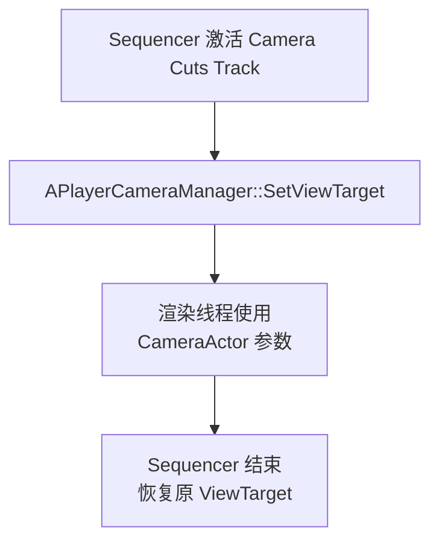
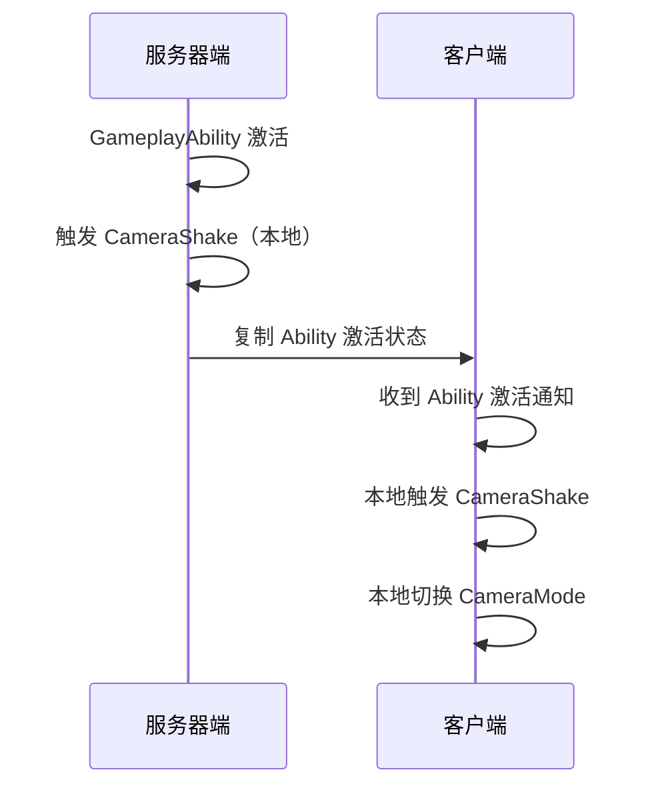

# 高级主题与常见陷阱

> 多摄像机切换、Sequencer 驱动、网络同步、性能优化——进阶实战必读。

## 概述

本课覆盖摄像机系统的高级主题。学完本课你将理解：
- 同一 Pawn 上多个 CameraComponent 的切换策略
- Sequencer（过场动画）如何接管摄像机
- 网络多人游戏中的摄像机同步注意事项
- 性能优化：LOD、UpdateRate、Tick 优化
- 常见陷阱与调试技巧

---

## 核心概念

### 多摄像机切换

同一 Pawn 上可能有多个 CameraComponent（如：第一人称 Camera、第三人称 Camera、载具 Camera）。

**策略对比**：

| 策略 | 实现方式 | 适用场景 |
|--------|-----------|----------|
| 多个 CameraComponent，SetActive() 切换 | `Cam1->SetActive(false); Cam2->SetActive(true);` | 简单的 View 切换 |
| 多个 CameraMode（Lyra 方案） | 切换时 Push/Pop CameraMode | 需要平滑混合的复杂切换 |
| 多个 ViewTarget | `PlayerCameraManager->SetViewTarget(NewTarget)` | 切换到另一个 Actor 的视角 |

**推荐**：使用 **CameraMode 方案**（Lyra 方案），因为：
1. 支持平滑混合（Blend）
2. 不需要销毁/重建 CameraComponent
3. 逻辑集中在 `DetermineCameraModeDelegate` 中

### Cinematic Camera（Sequencer 驱动）

Sequencer 可以通过 **Camera Cuts Track** 切换摄像机，或者用 **Camera Animation Track** 驱动现有 CameraComponent。



**关键类**：
- `ULevelSequence` —— 序列资源
- `ACameraCutsCameraActor` —— 摄像机剪辑代理
- `ULevelSequencePlayer` —— 序列播放器

---

## 网络同步注意事项

### 摄像机参数需要网络复制吗？

**原则**：**摄像机参数是纯本地效果**，不需要网络复制。

| 参数 | 是否需要复制 | 原因 |
|--------|-----------|------|
| Camera Location/Rotation | ❌ 不需要 | 每个玩家本地计算 |
| FOV | ❌ 不需要 | 本地效果，不影响游戏逻辑 |
| CameraShake | ❌ 不需要 | 纯视觉效果 |
| CameraMode 选择 | ✅ 需要（间接） | CameraMode 由 GameplayAbility 触发，Ability 会复制 |

### 网络同步的正确姿势



**常见错误**：试图把 `FMinimalViewInfo` 通过网络复制——这是**错误**的，会导致延迟和抖动。

---

## 性能优化

### 1. Tick 优化

`UCameraComponent::GetCameraView()` 每帧被调用，如果计算量过大，会成为性能瓶颈。

**优化策略**：

```cpp
// [1] 降低 CameraComponent 的 Tick 频率
CameraComponent->PrimaryComponentTick.TickInterval = 0.05f;  // 每 50ms 更新一次

// [2] 使用 Interp 而不是每帧精确计算
//     在 UpdateView() 中用 FMath::Lerp() 平滑过渡

// [3] 当 Camera 不可见时跳过计算
if (!IsVisible())
{
    return;  // 直接返回上一帧的 View
}
```

### 2. 射线检测优化（Lyra 穿透避免）

`ULyraCameraMode_ThirdPerson` 的 `PreventCameraPenetration()` 每帧做多条射线检测，开销较大。

**优化策略**：

```cpp
// [1] 降低检测频率
static float LastCheckTime = 0.0f;
if (GetWorld()->TimeSeconds - LastCheckTime < 0.033f)  // 每 33ms 检测一次
{
    return;  // 使用上一帧结果
}

// [2] 只在 Camera 移动时检测
if ((CameraLoc - LastCameraLoc).SizeSquared() < KINDA_SMALL_NUMBER)
{
    return;  // Camera 没动，不需要重新检测
}
```

### 3. LOD（Level of Detail）for Camera

对于「远处玩家不需要精确 Camera 计算」的场景，可以实现 Camera LOD：

```cpp
// [3] 根据距离调整 Camera 更新频率
float DistanceToViewer = (CameraLoc - ViewerLoc).Size();
if (DistanceToViewer > 1000.0f)  // 10 米外
{
    // 降低更新频率
    TickInterval = 0.1f;
}
```

---

## 常见问题与陷阱

### 1. 切换 CameraMode 时出现「跳变」？

**原因**：`BlendTime` 太短，或者 `BlendFunction` 选择不当。

**解决**：
```cpp
// 在 CameraMode Blueprint 中：
BlendTime = 0.3f;             // 300ms 过渡
BlendFunction = EaseInOut;      // 缓入缓出
BlendExponent = 2.0f;        // 曲线指数
```

### 2. 多人游戏中，其他玩家看到的我的 Camera 位置不对？

**原因**：Camera 是**本地计算**的，其他玩家看到的是你的 **Mesh 的位置**，而不是你的 Camera 位置。

**解决**：如果需要让其他玩家看到「第一人称视角」（如：观战），需要：
1. 在网络上复制 `bIsFirstPerson` 标志
2. 其他客户端根据标志切换到第一人称 CameraActor

### 3. Sequencer 播放时，玩家输入仍然控制 Camera？

**原因**：Sequencer 的 Camera Cuts Track **不会自动禁用** PlayerController 的输入。

**解决**：
```cpp
// 在 Sequencer 播放前：
PlayerController->SetIgnoreMoveInput(true);
PlayerController->SetIgnoreLookInput(true);

// 在 Sequencer 播放完成后（绑定 OnFinished 事件）：
PlayerController->SetIgnoreMoveInput(false);
PlayerController->SetIgnoreLookInput(false);
```

### 4. CameraComponent 的 `FieldOfView` 和 `PostProcessSettings` 不生效？

**原因**：这些属性需要在 `GetCameraView()` 中**显式写入** `FMinimalViewInfo`。

**排查**：
```cpp
// 在 ULyraCameraComponent::GetCameraView() 中检查：
DesiredView.FOV = CameraModeView.FieldOfView;  // 是否正确写入？
DesiredView.PostProcessSettings = PostProcessSettings;  // 是否启用？
```

---

## 调试技巧

### Console 命令

```
showdebug camera          // 显示 Camera 调试信息
camera bookmarks         // 创建 Camera 书签（快速切换到指定视角）
camera lock            // 锁定当前 Camera 位置（用于截图）
```

### Visual Studio 调试

```cpp
// [1] 在 GetCameraView() 中打断点
//     检查 DesiredView 的值是否正确

// [2] 在 UpdateCameraModes() 中打断点
//     检查 CameraModeStack 的状态

// [3] 使用 DrawDebugLine() 可视化射线检测
DrawDebugLine(
    GetWorld(),
    StartLoc,
    EndLoc,
    FColor::Red,
    false,  // 不持久化
    0.0f,   // 生命周期（0 = 一帧）
    0,
    5.0f    // 线宽
);
```

---

## 总结与要点

| # | 要点 | 说明 |
|---|------|------|
| 1 | 多 Camera 切换用 CameraMode 方案 | 支持平滑混合，逻辑集中 |
| 2 | Camera 参数是纯本地效果 | 不需要网络复制 |
| 3 | Sequencer 通过 CameraCuts Track 接管 | 需要手动禁用玩家输入 |
| 4 | 性能优化：降低 Tick 频率、优化射线检测 | 每帧计算量过大时会成为瓶颈 |
| 5 | 调试用 showdebug camera 和 DrawDebugLine() | 可视化 Camera 位置和射线 |

---

## 相关页面

- [[30-tutorials/camera-system/08-Lyra摄像机与ExperiencePawnData集成]] ← 上一课：Lyra 摄像机与 Experience 集成
- [[30-tutorials/camera-system/10-Lyra摄像机系统完整案例分析]] → 下一课：Lyra 摄像机系统完整案例分析
- [[30-tutorials/gas/02-GA执行流程详解]] — GameplayAbility 执行流程（理解 CameraShake 的网络复制）

<!-- nav:auto -->

---

**导航**: ← [[30-tutorials/camera-system/08-Lyra摄像机与ExperiencePawnData集成|08-Lyra摄像机与ExperiencePawnData集成]] · [[30-tutorials/camera-system/10-Lyra摄像机系统完整案例分析|10-Lyra摄像机系统完整案例分析]] →

<!-- /nav:auto -->
