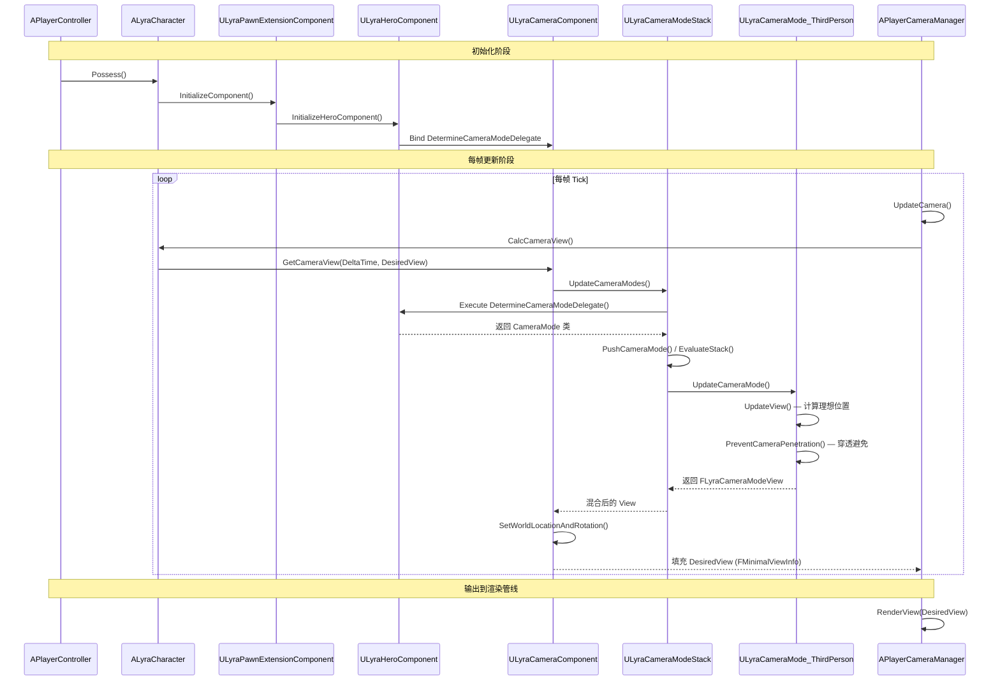
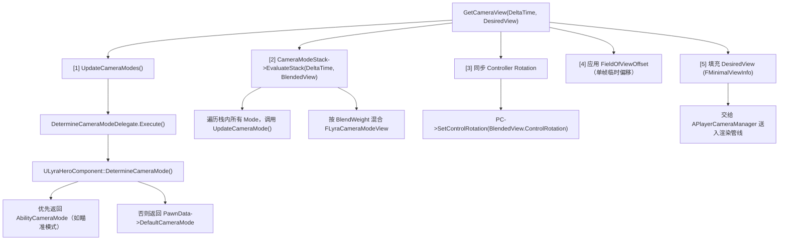
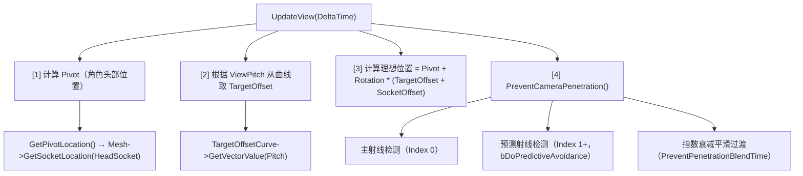

# Lyra摄像机系统完整案例分析

> 串联本系列所有知识，从 Pawn Spawn 到最终渲染的完整调用链。

## 概述

本课是系列的**综合案例**，将前 9 课的知识串联起来，完整走读 Lyra 摄像机系统从初始化到每帧渲染的全链路。

学完本课你将理解：
- 从 Pawn Spawn 到 Camera View 输出的**完整调用链**
- Lyra 摄像机架构的**设计决策**和**权衡**
- 如何在自己的项目中**复用**这套架构

---

## 完整调用链（mermaid 时序图）



---

## 阶段详解

### 阶段 1：初始化（Pawn Spawn → CameraComponent 就绪）

| 步骤 | 调用链 | 关键文件 |
|------|--------|---------|
| 1. PlayerController Possess Pawn | `APlayerController::OnPossess()` | Engine |
| 2. PawnExtensionComponent 初始化 | `ULyraPawnExtensionComponent::InitializeComponent()` | `LyraPawnExtensionComponent.cpp` |
| 3. HeroComponent 绑定委托 | `ULyraHeroComponent::InitializeAbilitySystem()` → `DetermineCameraModeDelegate.BindUObject()` | `LyraHeroComponent.cpp` |
| 4. CameraComponent 创建 Stack | `ULyraCameraComponent::OnRegister()` → `NewObject<ULyraCameraModeStack>()` | `LyraCameraComponent.cpp` |

**关键设计决策**：委托绑定放在 `InitializeAbilitySystem()` 而不是 `BeginPlay()`，确保 PawnData 已加载完成。

### 阶段 2：每帧更新（GetCameraView 核心流程）

`ULyraCameraComponent::GetCameraView()` 每帧被 `APlayerCameraManager` 调用：



### 阶段 3：ThirdPerson Mode 的穿透避免（Lyra 特有）

`ULyraCameraMode_ThirdPerson::UpdateView()`：



---

## Lyra 摄像机架构设计决策分析

### 为什么用 CameraMode + Stack 而不是 CameraModifier？

| 维度 | CameraModifier（引擎原生） | CameraMode Stack（Lyra） |
|------|--------------------------|----------------------|
| 抽象层级 | 全局后处理（修改最终 POV） | 每个 Mode 完整定义自己的 View 计算 |
| 混合方式 | 叠加（Additive） | 按权重 Blend（Location/Rotation/FOV 分别混合） |
| 状态感知 | 难以感知当前游戏状态 | Mode 可以访问 Pawn/Controller/AbilitySystem |
| 扩展性 | 需要继承 UCameraModifier | 继承 ULyraCameraMode 即可 |

**结论**：CameraMode Stack 更适合「**不同游戏状态下完全不同的摄像机行为**」的场景（如：行走 / 瞄准 / 驾驶）。

### 为什么穿透避免不用 USpringArmComponent？

`USpringArmComponent` 的穿透避免策略是**缩短臂长**，会导致 Camera 钻进角色体内。

Lyra 的方案（`ULyraCameraMode_ThirdPerson`）：
1. **多条射线检测**（主射线 + 预测射线）
2. **横向推开**（不是单纯缩短），保持 Camera 可见性
3. **曲线驱动 TargetOffset**（Pitch 越大，Camera 越往后上方偏移）

### 为什么 `DetermineCameraModeDelegate` 是 Delegate 而不是虚函数？

**解耦**：`ULyraCameraComponent` 是通用组件，不应知道「什么情况下该用哪个 CameraMode」——这是 Gameplay 层的决策（Ability 系统、Vehicle 系统）。

用 Delegate 允许**运行时动态绑定**不同的决策逻辑，不需要继承 `ULyraCameraComponent`。

---

## 在自有项目中复用这套架构

### 最小集成步骤

```
1. 将 Lyra/Camera/ 目录复制到你的项目
   └── LyraCameraComponent.h/cpp
   └── LyraCameraMode.h/cpp
   └── LyraCameraMode_ThirdPerson.h/cpp
   └── LyraCameraModeStack.h/cpp

2. 让你的 Pawn 使用 ULyraCameraComponent
   └── 在 Pawn Blueprint 中，将 CameraComponent 的类改为 ULyraCameraComponent

3. 创建你的 CameraMode 子类
   └── BP_MyGame_CameraMode（继承 ULyraCameraMode）
         ├── FieldOfView = 90.0
         ├── BlendTime = 0.3s
         └── 重写 UpdateView()（如需要特殊逻辑）

4. 在 PawnData 中配置 DefaultCameraMode
   └── DefaultCameraMode = BP_MyGame_CameraMode

5. （可选）在 GameplayAbility 中动态切换 CameraMode
   └── MyAbility::ActivateAbility()
         └── HeroComponent->AbilityCameraMode = AmingCameraMode
```

### 常见问题

**Q：只想用 Lyra 的 CameraMode 系统，不想用 Experience/PawnData 系统？**
A：可以。手动绑定 `DetermineCameraModeDelegate` 即可：
```cpp
// 在你的 Pawn 的 BeginPlay() 中：
if (ULyraCameraComponent* Cam = ULyraCameraComponent::FindCameraComponent(this))
{
    Cam->DetermineCameraModeDelegate.BindUObject(this, &AMyPawn::DetermineCameraMode);
}
```

---

## 总结与要点

| # | 要点 | 说明 |
|---|------|------|
| 1 | 完整调用链：Possess → Init → Delegate 绑定 → 每帧 UpdateCameraModes → EvaluateStack → 输出 FMinimalViewInfo | 理解链路才能debug |
| 2 | Delegate 解耦了 CameraComponent 和 Gameplay 逻辑 | 架构核心设计决策 |
| 3 | 穿透避免用多条射线而非 USpringArmComponent | Lyra 方案更稳定 |
| 4 | CameraMode Stack 支持多模式按权重混合 | 比 CameraModifier 更灵活 |
| 5 | 架构可复用：复制 Camera/ 目录 + 绑定委托即可 | 适合多人游戏项目 |

---

## 相关页面

- [[30-tutorials/camera-system/00-UE摄像机-Camera系统从入门到实战]] — 系列概览
- [[30-tutorials/camera-system/06-LyraCameraComponent深度解析]] — ULyraCameraComponent 详解
- [[30-tutorials/camera-system/07-Lyra摄像机模式系统]] — CameraMode 系统详解

<!-- nav:auto -->

---

**导航**: ← [[30-tutorials/camera-system/09-高级主题与常见陷阱|09-高级主题与常见陷阱]]

<!-- /nav:auto -->
