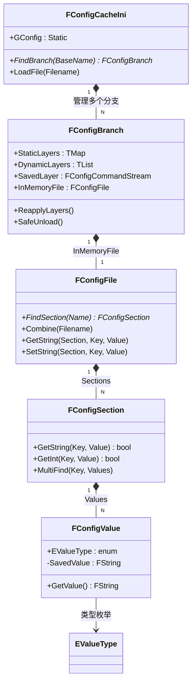
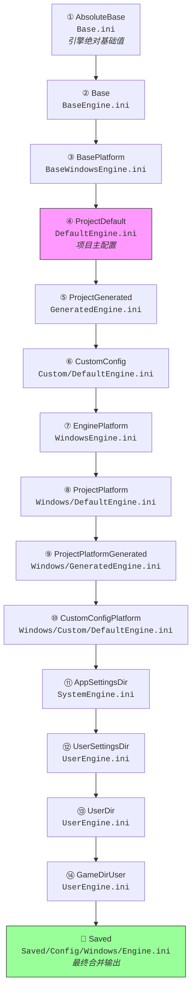

# UEConfigINI系统深度解析

> UE5 配置系统全解析：从 INI 文件层级、引擎源码机制，到 Lyra 项目实战与高级主题。

## 概述

UE 使用 `.ini` 配置文件来管理引擎与项目的初始化参数。**配置系统**由 `FConfigCacheIni` 类统筹，通过多层 INI 文件**由低到高逐层合并**，最终在内存中形成一份"最终配置"供引擎和游戏代码查询。

核心价值：
- **跨平台统一配置入口**：一份配置，多平台按层级覆盖
- **引擎与项目解耦**：Base → Default → Platform → Saved 分层管理
- **支持热更新（Hotfix）**：通过动态层在运行时注入配置

```
引擎启动
  → 加载 BaseEngine.ini（引擎默认值）
  → 加载 DefaultEngine.ini（项目覆盖）
  → 加载 WindowsEngine.ini（平台覆盖）
  → 合并为内存中的最终配置
  → GConfig 全局可查
```

## 配置系统全景图



## INI 文件层级（14 层）

引擎用 `GConfigLayers[]` 数组定义了一套**固定的 14 层 INI 文件加载顺序**（定义见 `ConfigHierarchy.h` L9-46）。以 `Engine.ini` 为例：



> 📌 实际层级定义见 `Engine/Source/Runtime/Core/Public/Misc/ConfigHierarchy.h` L9-46

各层详细说明：

| 层级 | 名称 | 路径模板 | 说明 |
|---|---|---|---|
| ① | AbsoluteBase | `{ENGINE}/Config/Base.ini` | 引擎绝对基础值，所有 INI 的 root |
| ② | Base | `{ENGINE}/Config/Base{TYPE}.ini` | 引擎默认配置（如 `BaseEngine.ini`） |
| ③ | BasePlatform | `{ENGINE}/Config/{PLATFORM}/Base{PLATFORM}{TYPE}.ini` | 引擎平台基础配置 |
| ④ | ProjectDefault | `{PROJECT}/Config/Default{TYPE}.ini` | **项目主配置**（如 `DefaultEngine.ini`） |
| ⑤ | ProjectGenerated | `{PROJECT}/Config/Generated{TYPE}.ini` | 构建过程生成的文件，不提交版本控制 |
| ⑥ | CustomConfig | `{PROJECT}/Config/Custom/{CUSTOMCONFIG}/Default{TYPE}.ini` | 自定义配置（需要定义 `CustomConfig`） |
| ⑦ | EnginePlatform | `{ENGINE}/Config/{PLATFORM}/{PLATFORM}{TYPE}.ini` | 引擎平台覆盖 |
| ⑧ | ProjectPlatform | `{PROJECT}/Config/{PLATFORM}/{PLATFORM}{TYPE}.ini` | 项目平台覆盖 |
| ⑨ | ProjectPlatformGenerated | `{PROJECT}/Config/{PLATFORM}/Generated{PLATFORM}{TYPE}.ini` | 项目平台生成文件 |
| ⑩ | CustomConfigPlatform | `{PROJECT}/Config/{PLATFORM}/Custom/{CUSTOMCONFIG}/{PLATFORM}{TYPE}.ini` | 平台自定义配置 |
| ⑪ | AppSettingsDir | `{APPSETTINGS}Unreal Engine/Engine/Config/System{TYPE}.ini` | 系统级配置（如 `%APPDATA%`） |
| ⑫ | UserSettingsDir | `{USERSETTINGS}Unreal Engine/Engine/Config/User{TYPE}.ini` | 用户设置目录配置 |
| ⑬ | UserDir | `{USER}Unreal Engine/Engine/Config/User{TYPE}.ini` | 用户目录配置 |
| ⑭ | GameDirUser | `{PROJECT}/Config/User{TYPE}.ini` | 项目用户配置 |

合并后的最终文件输出到：`{PROJECT}/Saved/Config/{PLATFORM}/{TYPE}.ini`

## INI 操作符速查

INI 文件中使用特殊前缀符号来控制配置的合并行为。这些符号在引擎内部映射为 `FConfigValue::EValueType` 枚举（`ConfigCacheIni.h` L126-149）。

| INI 文件写法 | EValueType | 含义 | 示例 |
|---|---|---|---|
| `Key=Value` | `Set` | 普通赋值（默认） | `GameUserSettingsClassName=/Script/Engine.GameUserSettings` |
| `.Key=Value` | `ArrayAdd` | 追加到数组（允许重复） | `.ArrayProperty=Item1` |
| `+Key=Value` | `ArrayAddUnique` | 追加到数组（去重） | `+GameplayCueNotifyPaths=/Game/GameplayCues` |
| `-Key=Value` | `Remove` | 从数组移除指定元素 | `-PrimaryAssetTypesToScan=...` |
| `!Key=Value` | `Clear` | 清空整个 Key | `!FilterConfigs=ClearArray` |
| `^Key=Value` | `InitializeToEmpty` | 在添加前先清空数组 | `^ArrayProperty=...` |
| `@Key=Value` | `ArrayOfStructKey` | 结构体数组，按 Key 合并 | `@Array=StructKey` |
| `*Key=Value` | `POCArrayOfStructKey` | PerObjectConfig 结构体数组 | `*Array=PerObjectConfigStructKey` |

> 📌 `CommandLookup` 表定义见 `ConfigCacheIni.cpp`（匿名命名空间内）

## 与 Lyra 项目的关系

| Lyra 配置文件 | 对应层级 | 主要内容 |
|---|---|---|
| `Config/DefaultEngine.ini` | ④ ProjectDefault | 引擎设置、碰撞配置、渲染设置、Iris 网络配置 |
| `Config/DefaultGame.ini` | ④ ProjectDefault | GAS 配置、AssetManager、Lyra 自定义类 |
| `Config/DefaultInput.ini` | ④ ProjectDefault | 输入映射（但 Lyra 主要用 EnhancedInput） |
| `Config/DefaultGameUserSettings.ini` | ④ ProjectDefault | 图形、音频等用户设置默认值 |
| `Config/Windows/WindowsEngine.ini` | ⑦ EnginePlatform 或 ⑧ ProjectPlatform | Windows 平台专用覆盖 |
| `Saved/Config/Windows/Engine.ini` | 最终合并输出 | 运行时保存的用户修改值 |

### Lyra 中的实际示例

从 `Config/DefaultGame.ini`：
```ini
[/Script/EngineSettings.GeneralProjectSettings]
ProjectName=Lyra

[/Script/GameplayAbilities.AbilitySystemGlobals]
AbilitySystemGlobalsClassName=/Script/LyraGame.LyraAbilitySystemGlobals
+GameplayCueNotifyPaths=/Game/GameplayCueNotifies
+GameplayCueNotifyPaths=/Game/GameplayCues
```

从 `Config/DefaultEngine.ini`：
```ini
[/Script/Engine.GameEngine]
GameEngine=/Script/LyraGame.LyraGameEngine

[/Script/IrisCore.ObjectReplicationBridgeConfig]
!FilterConfigs=ClearArray
+FilterConfigs=(ClassName=/Script/Engine.Pawn, DynamicFilterName=Spatial)
```

## 快速上手

### 在 C++ 中读取配置

```cpp
// 读取字符串配置
FString GameEngineClass;
if (GConfig->GetString(
    TEXT("/Script/Engine.GameEngine"),
    TEXT("GameEngine"),
    GameEngineClass,
    GEngineIni))
{
    UE_LOG(LogTemp, Log, TEXT("GameEngine = %s"), *GameEngineClass);
}
```

### 在 C++ 中写入配置

```cpp
// 修改内存中的配置
GConfig->SetString(
    TEXT("/Script/Engine.GameEngine"),
    TEXT("SomeKey"),
    TEXT("NewValue"),
    GEngineIni);

// 保存到 INI 文件（写入 Saved/ 目录）
GConfig->Flush(false, GEngineIni);
```

### 使用 `config` 说明符让 UObject 自动加载配置

```cpp
UCLASS(config=Game, defaultconfig)
class ULyraSettingsLocal : public ULocalPlayerSubsystem
{
    UPROPERTY(config)
    FString TestString;  // 会自动从 DefaultGame.ini 的 [ULyraSettingsLocal] 段加载
};
```

## 系列阅读指南

### 第一阶段：基础认知

| 课程序号 | 标题 | 学习目标 |
|---|---|---|
| `00-overview`（本篇） | UE Config/INI 系统概览 | 建立全景认识，理解层级概念 |
| `01-ini-file-types` | INI 文件类型与命名规范 | 掌握 Base / Default / Platform / Saved 的区别 |

### 第二阶段：核心机制

| 课程序号 | 标题 | 学习目标 |
|---|---|---|
| `02-config-hierarchy` | 配置层级与合并规则深度解析 | 读懂源码中的层级定义与合并算法 |
| `03-ini-operators` | INI 操作符深度解析 | 理解 `.` `+` `-` `!` `^` `@` `*` 的引擎层含义 |
| `04-gconfig-api` | GConfig 与 FConfigFile API 实战 | 掌握 C++ 中读写配置的正确方式 |

### 第三阶段：系统集成与实战

| 课程序号 | 标题 | 学习目标 |
|---|---|---|
| `05-uobject-config` | UObject 与 Config 系统集成 | 理解 `config` 说明符、`LoadConfig`/`SaveConfig` |
| `06-lyra-config-examples` | Lyra 项目 Config 实战分析 | 逐段解读 Lyra 的 INI 文件 |

### 第四阶段：高级主题

| 课程序号 | 标题 | 学习目标 |
|---|---|---|
| `07-advanced-topics` | 高级主题：命令行覆盖、Hotfix、平台差异化 | 掌握动态层、命令行覆盖、`SafeUnload` 等进阶用法 |

## 相关页面

- [[30-tutorials/ue-framework/00-UE框架概述|UE 框架总览]] — 前置基础
- [[30-tutorials/ue-framework/10-engine-layer/00-UE引擎层详解|Engine 类详解]] — 引擎初始化流程
- [[30-tutorials/gas/00-GAS系统总览|GAS 总览]] — Lyra 中 GAS 配置的实战背景

---
> 最后更新：2026-05-19

<!-- nav:auto -->

---

**导航**: [[30-tutorials/config-ini/01-INI文件类型与命名规范|01-INI文件类型与命名规范]] →

<!-- /nav:auto -->
