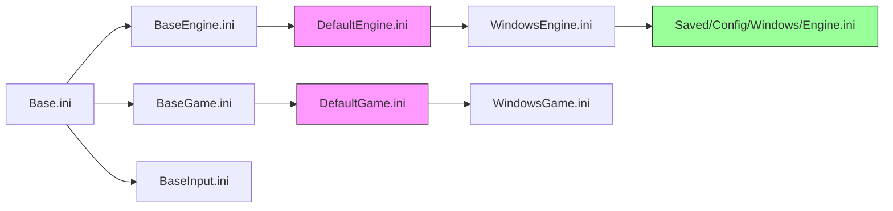

# INI文件类型与命名规范

> 了解 UE 中各类 `.ini` 文件的命名规则、存放位置及加载优先级。

## 概述

本课学完你将能：列出 UE 项目中所有 INI 文件类型，理解 `{TYPE}` 占位符的替换规则，并能预测某个配置应该放在哪个文件中。

## INI 文件命名规则

UE 的 INI 文件命名遵循固定模式：

```
{Prefix}{TYPE}.ini
```

其中：
- **`{Prefix}`**：`Base` / `Default` / `{Platform}` / `Generated` / `System` / `User` 等
- **`{TYPE}`**：由 `ENUMERATE_KNOWN_INI_FILES` 宏定义（`ConfigCacheIni.h` L95-105）

### `{TYPE}` 取值

```cpp
// ConfigCacheIni.h L95-105
#define ENUMERATE_KNOWN_INI_FILES(op) \
    op(Engine) \
    op(Game) \
    op(Input) \
    op(DeviceProfiles) \
    op(GameUserSettings) \
    op(Scalability) \
    op(RuntimeOptions) \
    op(InstallBundle) \
    op(Hardware) \
    op(GameplayTags)
```

对应的 INI 文件名示例：

| TYPE | 完整文件名 |
|---|---|
| `Engine` | `DefaultEngine.ini` / `WindowsEngine.ini` |
| `Game` | `DefaultGame.ini` / `WindowsGame.ini` |
| `Input` | `DefaultInput.ini` / `WindowsInput.ini` |
| `GameUserSettings` | `DefaultGameUserSettings.ini` |
| `Scalability` | `DefaultScalability.ini` |
| `GameplayTags` | `DefaultGameplayTags.ini` |

## 五类 INI 文件详解

### 1. Base*.ini —— 引擎基础值

**路径规则**：`{ENGINE}/Config/Base{TYPE}.ini`

| 文件 | 说明 |
|---|---|
| `BaseEngine.ini` | 引擎核心设置 |
| `BaseGame.ini` | 引擎游戏基础设置 |
| `BaseInput.ini` | 引擎输入基础设置 |

**特点**：
- 由 Epic 提供，位于引擎安装目录
- 只读（不应修改）
- 所有项目的基石

**实际路径示例**：`\Engine\Config\BaseEngine.ini`

### 2. Default*.ini —— 项目主配置文件

**路径规则**：`{PROJECT}/Config/Default{TYPE}.ini`

| 文件 | 说明 |
|---|---|
| `DefaultEngine.ini` | 项目引擎设置（渲染、碰撞、网络等） |
| `DefaultGame.ini` | 项目游戏逻辑设置（GAS、AssetManager 等） |
| `DefaultInput.ini` | 项目输入映射 |
| `DefaultGameUserSettings.ini` | 用户可调整的设置默认值（分辨率、画质等） |
| `DefaultScalability.ini` | 可扩展性设置（画质档位） |

**特点**：
- **最常用**的配置文件，放在项目 `Config/` 目录下
- 提交到版本控制（Git/SVN）
- 可以被平台专用文件覆盖

### 3. Platform*.ini —— 平台专用覆盖

**路径规则**：`{PROJECT}/Config/{PLATFORM}/{PLATFORM}{TYPE}.ini`

| 平台 | 文件名示例 |
|---|---|
| Windows | `Windows/WindowsEngine.ini` |
| Android | `Android/AndroidEngine.ini` |
| iOS | `IOS/IOSEngine.ini` |
| Linux | `Linux/LinuxEngine.ini` |

**特点**：
- 可选文件，仅在需要时创建
- 覆盖 `Default*.ini` 中的同名配置
- 用于平台差异化（如移动端降低画质）

### 4. Saved*.ini —— 运行时保存的修改值

**路径规则**：`{PROJECT}/Saved/Config/{PLATFORM}/{TYPE}.ini`

**特点**：
- 由 `SaveConfig()` 或引擎自动写入
- **不提交**到版本控制（加入 `.gitignore`）
- 存储用户运行时修改的设置（如分辨率、音量）
- 加载时优先级最高（覆盖所有静态层）

### 5. User*.ini —— 用户级配置

**路径规则**：
- `{APPSETTINGS}Unreal Engine/Engine/Config/System{TYPE}.ini`
- `{USERSETTINGS}Unreal Engine/Engine/Config/User{TYPE}.ini`
- `{USER}Unreal Engine/Engine/Config/User{TYPE}.ini`
- `{PROJECT}/Config/User{TYPE}.ini`

**特点**：
- 跨项目共享的用户配置
- 通常不需要手动编辑

## `{TYPE}` 替换规则详解

当 UE 加载 INI 文件时，会根据 `GConfigLayers[]` 中定义的模板进行替换：

```
{TYPE} → Engine / Game / Input / ...
{ENGINE} → 引擎安装路径（如 \Engine）
{PROJECT} → 项目路径（如 \ue_lyra_analysis）
{PLATFORM} → 当前平台（Windows / Android / iOS / ...）
{CUSTOMCONFIG} → 自定义配置名（如果定义了）
```

### 替换示例

以 `DefaultEngine.ini` 在 Windows 平台为例：

```
层级 ④ ProjectDefault: {PROJECT}/Config/Default{TYPE}.ini
                                        ↓
                     /Config/DefaultEngine.ini

层级 ⑦ EnginePlatform: {ENGINE}/Config/{PLATFORM}/{PLATFORM}{TYPE}.ini
                                        ↓
                    /Engine/Config/Windows/WindowsEngine.ini

层级 ⑧ ProjectPlatform: {PROJECT}/Config/{PLATFORM}/{PLATFORM}{TYPE}.ini
                                        ↓
                     /Config/Windows/WindowsEngine.ini
```



## Lyra 项目实际文件对照

Lyra 项目的 `Config/` 目录下有以下 INI 文件：

| 文件路径 | 类型 | 主要内容 |
|---|---|---|
| `Config/DefaultGame.ini` | Default*.ini | GAS 配置、AssetManager、Lyra 自定义类 |
| `Config/DefaultEngine.ini` | Default*.ini | 引擎设置、碰撞配置、Iris 网络配置 |
| `Config/DefaultInput.ini` | Default*.ini | 输入映射（Lyra 主要用 EnhancedInput，此处较少） |
| `Config/DefaultGameUserSettings.ini` | Default*.ini | 图形、音频等用户设置默认值 |
| `Config/DefaultScalability.ini` | Default*.ini | 可扩展性设置（画质档位） |
| `Config/Windows/WindowsEngine.ini` | Platform*.ini | Windows 平台专用覆盖（可选） |
| `Saved/Config/Windows/Engine.ini` | Saved*.ini | 运行时保存的用户修改值（自动生成） |

### Lyra 的 Custom 目录

Lyra 还使用了 `Config/Custom/` 目录实现差异化配置：

```
Config/
├── Custom/
│   └── Steam/
│       └── DefaultEngine.ini   # Steam 平台专用配置
```

这对应 `GConfigLayers[]` 的第 ⑥ 层（`CustomConfig`）和第 ⑨ 层（`CustomConfigPlatform`）。

## INI 文件加载顺序实战

假设你有以下文件：

```
\Engine\Config\BaseEngine.ini                     ← ① AbsoluteBase + ② Base
\Engine\Config\Windows\BaseWindowsEngine.ini      ← ③ BasePlatform
\ue_lyra_analysis\Config\DefaultEngine.ini     ← ④ ProjectDefault
\ue_lyra_analysis\Config\Windows\WindowsEngine.ini  ← ⑧ ProjectPlatform
```

加载时按层级从低到高，后加载的覆盖先加载的。

**同名 Key 的覆盖规则**：
- 如果都是普通赋值（`Key=Value`），后加载的生效
- 如果使用了数组操作符（`+` `-` `!` `^`），则按数组规则合并

## 常见错误

### 错误 1：把平台配置写到 Default*.ini

**问题**：`DefaultEngine.ini` 中所有平台都会加载，如果写了 Windows 专用的设置，其他平台可能出错。

**解决**：平台专用设置应放在 `Config/Windows/WindowsEngine.ini`。

### 错误 2：提交 Saved 目录下的 INI 文件

**问题**：`Saved/Config/` 目录下的文件是用户运行时修改的，提交到 Git 会导致团队协作问题。

**解决**：在 `.gitignore` 中忽略 `Saved/` 目录。

### 错误 3：不理解 `{TYPE}` 替换规则

**问题**：创建了一个 `DefaultMyConfig.ini`，但引擎不会自动加载它。

**解决**：只有 `ENUMERATE_KNOWN_INI_FILES` 中定义的 TYPE 才会被引擎自动识别。自定义 INI 需要手动加载。

## 小结

- INI 文件命名规则：`{Prefix}{TYPE}.ini`
- `{TYPE}` 取值由 `ENUMERATE_KNOWN_INI_FILES` 宏定义
- 最常用的文件：`DefaultEngine.ini` 和 `DefaultGame.ini`
- 平台差异化通过 `Config/{PLATFORM}/` 目录实现
- `Saved/Config/` 目录存放运行时修改，不提交版本控制

## 相关页面

- [[30-tutorials/config-ini/00-UEConfigINI系统深度解析|← 上一课：UE Config/INI 系统概览]]
- [[30-tutorials/config-ini/02-配置层级与合并规则深度解析|下一课：配置层级与合并规则深度解析 →]]
- [[30-tutorials/config-ini/04-GConfigAPI实战|GConfig 常用 API 实战]]

<!-- nav:auto -->

---

**导航**: ← [[30-tutorials/config-ini/00-UEConfigINI系统深度解析|00-UEConfigINI系统深度解析]] · [[30-tutorials/config-ini/02-配置层级与合并规则深度解析|02-配置层级与合并规则深度解析]] →

<!-- /nav:auto -->
