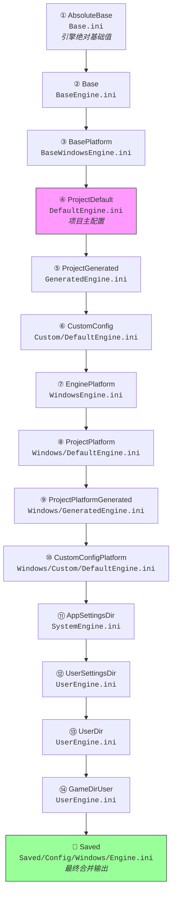

# 配置层级与合并规则深度解析

> 从引擎源码出发，理解 UE 多层 INI 文件的加载顺序、合并算法和覆盖规则。

## 概述

本课学完你将能：读懂 `GConfigLayers[]` 数组的每一层含义，理解配置合并的源码级机制，并能预测某个配置值的最终来源。

## GConfigLayers 数组全景

（源码位置：`Engine/Source/Runtime/Core/Public/Misc/ConfigHierarchy.h` L9-46）

UE5 用 `GConfigLayers[]` 定义了一套**固定的 14 层 INI 文件加载顺序**。以 `Engine.ini` 为例：



> ⚠️ 注意：`GConfigLayers[]` 定义的是**静态加载层**（①-⑭）。最终合并输出到 `Saved/Config/{PLATFORM}/{TYPE}.ini`，它不在 `GConfigLayers[]` 中，而是合并的结果。

## 各层详解

### ① AbsoluteBase — `Base.ini`

```
路径：{ENGINE}/Config/Base.ini
标志：NoExpand（不展开宏）
```

- 引擎的**绝对基础值**，所有 INI 的 root
- 只有一层，不分 `Engine`/`Game` 等类型
- 通常很小，只定义最基础的设置

### ② Base — `Base{TYPE}.ini`

```
路径：{ENGINE}/Config/BaseEngine.ini、BaseGame.ini 等
标志：UseGlobalConfigCache
```

- 按 `{TYPE}` 区分不同配置域（Engine、Game、Input 等）
- Epic 官方提供的引擎各模块默认值
- 只读（不应修改）

示例：`\Engine\Config\BaseEngine.ini`

### ③ BasePlatform — `Base{PLATFORM}{TYPE}.ini`

```
路径：{ENGINE}/Config/{PLATFORM}/BaseWindowsEngine.ini 等
标志：UseGlobalConfigCache
```

- 引擎平台基础配置
- 覆盖 `Base{TYPE}.ini` 中的平台相关设置

### ④ ProjectDefault — `Default{TYPE}.ini ⭐ 最重要`

```
路径：{PROJECT}/Config/DefaultEngine.ini、DefaultGame.ini 等
标志：AllowCommandLineOverride | UseGlobalConfigCache
```

- **项目级主配置文件**，开发者最常编辑
- 支持命令行覆盖（`-IniFile=`）
- Lyra 的 `Config/DefaultGame.ini` 和 `Config/DefaultEngine.ini` 即属此层

### ⑤ ProjectGenerated — `Generated{TYPE}.ini`

```
路径：{PROJECT}/Config/GeneratedEngine.ini 等
标志：UseGlobalConfigCache
```

- 构建过程自动生成的文件
- **不应提交**到版本控制
- 通常为空或很小

### ⑥ CustomConfig — `Custom/{CUSTOMCONFIG}/Default{TYPE}.ini`

```
路径：{PROJECT}/Config/Custom/{CUSTOMCONFIG}/DefaultEngine.ini
标志：RequiresCustomConfig | UseGlobalConfigCache
```

- 需要定义 `CustomConfig`（通过命令行或环境变量）
- Lyra 使用此机制实现 Steam 等平台差异化配置
- 可选层，如果 `CustomConfig` 未定义则跳过

### ⑦ EnginePlatform — `{PLATFORM}{TYPE}.ini`

```
路径：{ENGINE}/Config/{PLATFORM}/WindowsEngine.ini 等
标志：UseGlobalConfigCache
```

- 引擎提供的平台覆盖
- 覆盖 `BasePlatform` 层

### ⑧ ProjectPlatform — `{PLATFORM}/Default{TYPE}.ini`

```
路径：{PROJECT}/Config/{PLATFORM}/WindowsDefaultEngine.ini 等
标志：UseGlobalConfigCache
```

- 项目提供的平台覆盖
- 覆盖 `Default{TYPE}.ini` 中的平台相关设置

### ⑨ ProjectPlatformGenerated — `{PLATFORM}/Generated{PLATFORM}{TYPE}.ini`

```
路径：{PROJECT}/Config/{PLATFORM}/GeneratedWindowsEngine.ini 等
标志：UseGlobalConfigCache
```

- 构建过程自动生成的平台专用文件
- 不应提交到版本控制

### ⑩ CustomConfigPlatform — `{PLATFORM}/Custom/{CUSTOMCONFIG}/{PLATFORM}{TYPE}.ini`

```
路径：{PROJECT}/Config/{PLATFORM}/Custom/{CUSTOMCONFIG}/WindowsEngine.ini
标志：RequiresCustomConfig | UseGlobalConfigCache
```

- 平台专用的自定义配置
- 需要定义 `CustomConfig`

### ⑪ AppSettingsDir — `System{TYPE}.ini`

```
路径：{APPSETTINGS}Unreal Engine/Engine/Config/System{TYPE}.ini
标志：NoExpand
```

- 系统级配置（如 `%APPDATA%\Unreal Engine\Engine\Config\SystemEngine.ini`）
- 跨项目共享
- `NoExpand` 标志，不展开宏

### ⑫ UserSettingsDir — `User{TYPE}.ini`

```
路径：{USERSETTINGS}Unreal Engine/Engine/Config/User{TYPE}.ini
标志：NoExpand
```

- 用户设置目录配置
- 跨项目共享

### ⑬ UserDir — `User{TYPE}.ini`

```
路径：{USER}Unreal Engine/Engine/Config/User{TYPE}.ini
标志：NoExpand
```

- 用户目录配置
- 跨项目共享

### ⑭ GameDirUser — `User{TYPE}.ini`

```
路径：{PROJECT}/Config/User{TYPE}.ini
标志：NoExpand
```

- 项目专用用户配置
- 不跨项目共享

## 合并规则（引擎层源码分析）

### `FConfigContext::AddStaticLayersToHierarchy`

（源码位置：`Engine/Source/Runtime/Core/Private/Misc/ConfigContext.cpp`）

核心逻辑：

```cpp
// 伪代码
void FConfigContext::AddStaticLayersToHierarchy()
{
    for (const FConfigLayer& Layer : GConfigLayers)
    {
        // 1. 展开宏：{ENGINE}、{PROJECT}、{PLATFORM}、{CUSTOMCONFIG}
        FString LayerPath = PerformBasicReplacements(Layer.Path);

        // 2. 检查文件是否存在
        if (FPaths::FileExists(LayerPath))
        {
            // 3. 加载文件并合并到当前分支
            FConfigFile LayerFile;
            LayerFile.Read(LayerPath);
            Branch->InMemoryFile.Combine(LayerFile);
        }
    }
}
```

**合并规则**：后加载的层覆盖先加载层中的同名键值（对于 `EValueType::Set` 类型）。

### `FConfigFile::Combine()`

（源码位置：`Engine/Source/Runtime/Core/Private/Misc/ConfigCacheIni.cpp`）

`Combine()` 方法将一个 `FConfigFile` 合并到另一个：

```cpp
void FConfigFile::Combine(const FConfigFile& Other)
{
    for (const auto& [SectionName, OtherSection] : Other)
    {
        FConfigSection& MySection = FindOrAddSection(SectionName);

        for (const auto& [Key, OtherValue] : *OtherSection)
        {
            // 根据 EValueType 决定合并行为
            switch (OtherValue.ValueType)
            {
                case EValueType::Set:
                    // 直接覆盖
                    MySection.Add(Key, OtherValue);
                    break;
                case EValueType::ArrayAdd:
                    // 追加到数组（允许重复）
                    MySection.Add(Key, OtherValue);
                    break;
                case EValueType::ArrayAddUnique:
                    // 唯一追加（跳过重复）
                    MySection.AddUnique(Key, OtherValue);
                    break;
                case EValueType::Remove:
                    // 从数组移除匹配项
                    MySection.Remove(Key, OtherValue);
                    break;
                case EValueType::Clear:
                    // 清空整个 Key
                    MySection.Remove(Key);
                    break;
                case EValueType::InitializeToEmpty:
                    // 在添加前先清空数组
                    MySection.Empty();
                    MySection.Add(Key, OtherValue);
                    break;
            }
        }
    }
}
```

### 合并行为总结

| EValueType | INI 写法 | 合并行为 |
|---|---|---|
| `Set` | `Key=Value` | 直接覆盖同名 Key |
| `ArrayAdd` | `.Key=Value` | 追加到数组（允许重复） |
| `ArrayAddUnique` | `+Key=Value` | 唯一追加（跳过重复） |
| `Remove` | `-Key=Value` | 从数组移除匹配项 |
| `Clear` | `!Key=Value` | 清空整个 Key |
| `InitializeToEmpty` | `^Key=Value` | 在添加前先清空数组 |

## Lyra 实例：DefaultGame.ini 如何覆盖

读取 Lyra 的 `Config/DefaultGame.ini`（`④ ProjectDefault` 层）：

```ini
[/Script/EngineSettings.GeneralProjectSettings]
ProjectName=Lyra
```

此值会覆盖 `Base.ini` 或 `BaseGame.ini` 中的对应值。

### 数组操作的合并示例

Lyra 的 `DefaultGame.ini` 中有：

```ini
[/Script/GameplayAbilities.AbilitySystemGlobals]
+GameplayCueNotifyPaths=/Game/GameplayCueNotifies
+GameplayCueNotifyPaths=/Game/GameplayCues
```

如果 `BaseGame.ini` 中也有：

```ini
[/Script/GameplayAbilities.AbilitySystemGlobals]
+GameplayCueNotifyPaths=/Game/BaseGameplayCues
```

最终合并结果（内存中）：

```
GameplayCueNotifyPaths =
  - /Game/BaseGameplayCues    (来自 BaseGame.ini)
  - /Game/GameplayCueNotifies  (来自 DefaultGame.ini)
  - /Game/GameplayCues        (来自 DefaultGame.ini)
```

### 使用 `!` 清空数组

如果 Lyra 需要清空基类定义的数组：

```ini
[/Script/SomeClass]
!GameplayCueNotifyPaths=ClearArray
```

这会清空 `GameplayCueNotifyPaths` 数组，然后可以重新添加。

## 动态层（Dynamic Layers）

除了 `GConfigLayers[]` 定义的 14 层静态层外，UE 还支持**动态层**（Hotfix）：

（源码位置：`Engine/Source/Runtime/Core/Private/Misc/ConfigContext.cpp` —— `AddDynamicLayerToHierarchy`）

动态层可以在运行时注入，无需重新打包。通常用于：
- 在线热修复配置错误
- A/B 测试不同参数
- 平台差异化配置（如 Steam/Epic 不同设置）

Lyra 中可通过 `UOnlineHotfixManager` 实现动态层注入。

## 总结与要点

| 要点 | 说明 |
|---|---|
| 加载顺序 | 从 `Base.ini` → `Saved/Config/...` 依次加载 |
| 覆盖规则 | 后加载的层覆盖先加载层（对于 `Set` 类型） |
| 数组操作 | `+` `.-` `!` `^` 有不同合并语义 |
| 项目主配置 | `Default*.ini` 是最常编辑的文件 |
| 最终输出 | `Saved/Config/{PLATFORM}/*.ini` |
| 动态层 | 运行时可注入，用于 Hotfix |

## 相关页面

- [[30-tutorials/config-ini/01-INI文件类型与命名规范|← 上一课：INI 文件类型]]
- [[30-tutorials/config-ini/03-INI文件操作符详解|下一课：INI 操作符详解 →]]
- [[30-tutorials/ue-framework/10-engine-layer/00-UE引擎层详解|Engine 类详解]]

<!-- nav:auto -->

---

**导航**: ← [[30-tutorials/config-ini/01-INI文件类型与命名规范|01-INI文件类型与命名规范]] · [[30-tutorials/config-ini/03-INI文件操作符详解|03-INI文件操作符详解]] →

<!-- /nav:auto -->
