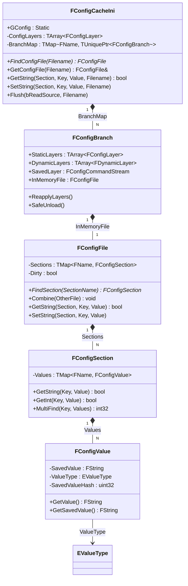

# GConfigAPI实战

> 深入理解 `GConfig` 全局指针、`FConfigFile`、`FConfigSection`、`FConfigValue` 的核心 API 与使用示例。

## 概述

本课学完你将能：熟练使用 `GConfig->GetString()` 等 API 读取配置，理解 `FConfigFile` 的内部结构，并能正确地在运行时查询 INI 值。

## GConfig 全局指针

`GConfig` 是 UE 暴露的全局配置访问入口，定义在 `ConfigCacheIni.h`：

```cpp
// ConfigCacheIni.h
extern CORE_API FConfigCacheIni* GConfig;
```

`GConfig` 实际指向一个 `FConfigCacheIni` 实例，它缓存了所有已加载的 INI 文件。

### 常用 INI 文件名常量

```cpp
extern CORE_API FString GEngineIni;        // Engine.ini
extern CORE_API FString GGameIni;          // Game.ini
extern CORE_API FString GInputIni;         // Input.ini
extern CORE_API FString GGameUserSettingsIni; // GameUserSettings.ini
extern CORE_API FString GSavedDir;         // Saved/Config/ 目录
```

这些常量在引擎启动时初始化，指向当前平台的实际 INI 文件路径。

### GConfig 类关系图



> 📌 类关系对应 `ConfigCacheIni.h` 中的类定义。

## FConfigCacheIni 核心 API

`FConfigCacheIni` 是配置系统的大门面，提供了加载、查询、修改 INI 文件的完整 API。

### 获取 FConfigFile 引用

```cpp
// 获取指定 INI 文件的 FConfigFile 引用
FConfigFile* FindConfigFile(const FString& InFilename);
FConfigFile& GetConfigFile(const FString& InFilename);
```

**示例**：

```cpp
FConfigFile& EngineConfig = GConfig->GetConfigFile(GEngineIni);
```

### 读取键值 API（模板方法）

```cpp
// 读取字符串
bool GetString(const TCHAR* Section, const TCHAR* Key, FString& Value, const FString& Filename);

// 读取整数
bool GetInt(const TCHAR* Section, const TCHAR* Key, int32& Value, const FString& Filename);

// 读取浮点数
bool GetFloat(const TCHAR* Section, const TCHAR* Key, double& Value, const FString& Filename);

// 读取布尔值
bool GetBool(const TCHAR* Section, const TCHAR* Key, bool& Value, const FString& Filename);

// 读取数组
bool GetArray(const TCHAR* Section, const TCHAR* Key, TArray<FString>& Value, const FString& Filename);
```

**返回值**：`true` 表示成功找到并读取；`false` 表示 Key 不存在。

### 写入键值 API

```cpp
void SetString(const TCHAR* Section, const TCHAR* Key, const FString& Value, const FString& Filename);
void SetInt(const TCHAR* Section, const TCHAR* Key, int32 Value, const FString& Filename);
void SetFloat(const TCHAR* Section, const TCHAR* Key, float Value, const FString& Filename);
void SetBool(const TCHAR* Section, const TCHAR* Key, bool Value, const FString& Filename);
```

### 查找 Section

```cpp
// 查找 Section（只读）
const FConfigSection* FindSection(const TCHAR* SectionName) const;

// 查找或添加 Section（可写）
FConfigSection* FindOrAddSection(const TCHAR* SectionName);
```

### 保存配置到磁盘

```cpp
// 将内存中的修改 flush 到磁盘
void Flush(bool bReadSourceFileBeforeWrite = false, const FString& Filename = TEXT(""));
```

**示例**：

```cpp
// 修改配置
GConfig->SetString(TEXT("/Script/Engine.GameEngine"), TEXT("SomeKey"), TEXT("NewValue"), GEngineIni);

// 保存到磁盘（写入 Saved/ 目录）
GConfig->Flush(false, GEngineIni);
```

## FConfigFile 详解

`FConfigFile` 代表一个已加载并合并后的 INI 文件内存表示。它继承自 `TMap<FString, FConfigSection>`（私有继承）。

### 核心方法

```cpp
// 从磁盘加载 INI 文件
bool Read(const FString& Filename);

// 合并另一个 FConfigFile（用于层级合并）
void Combine(const FConfigFile& Other);

// 查找 Section
FConfigSection* FindSection(const TCHAR* SectionName);
const FConfigSection* FindSection(const TCHAR* SectionName) const;

// 查找或添加 Section
FConfigSection& FindOrAddSection(const TCHAR* SectionName);
```

### 重要成员

```cpp
bool Dirty;              // 是否有未保存的修改
bool NoSave;             // 是否禁止保存
FName Name;              // Config file name (e.g., "Engine")
FString PlatformName;     // Platform name (e.g., "Windows")
```

## FConfigSection 详解

`FConfigSection` 继承自 `TMap<FName, FConfigValue>`，代表 INI 文件中的一个 `[SectionName]`。

### 核心方法

```cpp
// 读取字符串值
bool GetString(const TCHAR* Key, FString& Value) const;

// 读取整数值
bool GetInt(const TCHAR* Key, int32& Value) const;

// 读取浮点数
bool GetFloat(const TCHAR* Key, float& Value) const;

// 读取布尔值
bool GetBool(const TCHAR* Key, bool& Value) const;

// 读取数组（返回数组元素个数）
int32 GetArray(const TCHAR* Key, TArray<FString>& Value) const;

// 多维数组（用于 +Key= 操作符）
template<typename Allocator>
void MultiFind(const FName Key, TArray<FConfigValue, Allocator>& OutValues, const bool bMaintainOrder = false) const;
```

### 数组操作

```cpp
// 添加元素到数组（允许重复）
void HandleAddCommand(FName ValueName, FString&& Value, bool bAppendValueIfNotArrayOfStructsKeyUsed);

// 处理结构体数组的 Key
bool HandleArrayOfKeyedStructsCommand(FName Key, FString&& Value);
```

## FConfigValue 详解

`FConfigValue` 存储一个配置值，包含值和类型信息。

### 核心成员

```cpp
FString SavedValue;           // 原始值（未展开宏）
EValueType ValueType;         // 值类型（Set/ArrayAdd/Remove/Clear 等）
uint32 SavedValueHash;        // 值哈希（用于快速比较）
bool bExpandOnDemand;        // 是否需要展开宏（如 {ENGINE_DIR}）
```

### 核心方法

```cpp
// 获取展开后的值（会自动展开宏）
FString GetValue() const;

// 获取原始值（未展开宏）
const FString& GetSavedValue() const;

// 静态方法：展开宏
static FString ExpandValue(const FString& InCollapsedValue);
static bool ExpandValue(const FString& InCollapsedValue, FString& OutExpandedValue);
```

### EValueType 枚举

（定义见 `ConfigCacheIni.h` L126-149）

```cpp
enum class EValueType : uint8
{
    Set,                    // Foo=Bar（普通赋值）
    ArrayAdd,              // .Foo=Bar（追加到数组，允许重复）
    ArrayAddUnique,         // +Foo=Bar（唯一追加）
    Remove,                 // -Foo=Bar（从数组移除）
    Clear,                  // !Foo=Bar（清空数组或 Key）
    InitializeToEmpty,      // ^Array=Empty（初始化为空数组）
    ArrayOfStructKey,      // @Array=StructKey（结构体数组按 Key 合并）
    POCArrayOfStructKey,   // *Array=PerObjectConfigStructKey（POC 结构体数组）
    Combined,               // 虚拟类型：Set 操作的最终合并结果
    ArrayCombined,          // 虚拟类型：Array 操作的最终合并结果
};
```

## 实战示例

### 示例 1：读取 Lyra 的配置值

```cpp
// 读取 DefaultGame.ini 中的 ProjectName
FString ProjectName;
if (GConfig->GetString(
    TEXT("/Script/EngineSettings.GeneralProjectSettings"),
    TEXT("ProjectName"),
    ProjectName,
    GGameIni))
{
    UE_LOG(LogTemp, Log, TEXT("ProjectName = %s"), *ProjectName);
    // 输出：ProjectName = Lyra
}
```

### 示例 2：读取数组配置

```cpp
// 读取 GameplayCueNotifyPaths 数组
TArray<FString> NotifyPaths;
GConfig->GetArray(
    TEXT("/Script/GameplayAbilities.AbilitySystemGlobals"),
    TEXT("GameplayCueNotifyPaths"),
    NotifyPaths,
    GGameIni);

for (const FString& Path : NotifyPaths)
{
    UE_LOG(LogTemp, Log, TEXT("NotifyPath: %s"), *Path);
}
```

### 示例 3：遍历 Section 中的所有键值

```cpp
const FConfigFile& ConfigFile = GConfig->GetConfigFile(GEngineIni);
const FConfigSection* Section = ConfigFile.FindSection(TEXT("/Script/Engine.GameEngine"));

if (Section)
{
    for (const auto& Pair : *Section)
    {
        UE_LOG(LogTemp, Log, TEXT("%s = %s (Type=%d)"),
            *Pair.Key.ToString(),
            *Pair.Value.GetValue(),
            static_cast<int32>(Pair.Value.ValueType));
    }
}
```

### 示例 4：运行时修改配置并保存

```cpp
// 修改内存中的配置
GConfig->SetString(
    TEXT("/Script/Engine.GameEngine"),
    TEXT("SomeKey"),
    TEXT("NewValue"),
    GEngineIni);

// 保存到 INI 文件（写入 Saved/ 目录）
GConfig->Flush(false, GEngineIni);
```

### 示例 5：检查 Key 是否存在

```cpp
const FConfigFile& ConfigFile = GConfig->GetConfigFile(GGameIni);
const FConfigSection* Section = ConfigFile.FindSection(TEXT("/Script/EngineSettings.GeneralProjectSettings"));

if (Section)
{
    FString Value;
    if (Section->GetString(TEXT("ProjectName"), Value))
    {
        UE_LOG(LogTemp, Log, TEXT("Found ProjectName = %s"), *Value);
    }
    else
    {
        UE_LOG(LogTemp, Warning, TEXT("ProjectName not found"));
    }
}
```

## Lyra 中的实际使用

### LyraGameInstance::Init()

Lyra 在 `ULyraGameInstance::Init()` 中会读取配置：

```cpp
// Source/LyraGame/LyraGameInstance.cpp
void ULyraGameInstance::Init()
{
    Super::Init();

    // 读取配置示例（伪代码）
    FString DefaultMap;
    GConfig->GetString(
        TEXT("/Script/EngineSettings.GameMapsSettings"),
        TEXT("GameDefaultMap"),
        DefaultMap,
        GGameIni);
}
```

### LyraSettingsLocal::LoadSettings()

`ULyraSettingsLocal` 使用 `LoadConfig()` 从 INI 文件加载用户设置：

```cpp
// Source/LyraGame/LyraSettingsLocal.cpp
void ULyraSettingsLocal::LoadSettings(bool bForceReload)
{
    LoadConfig();  // 从 DefaultGameUserSettings.ini 加载配置
}
```

## 常见使用模式

### 模式 1：启动时读取配置

在 `UGameInstance::Init()` 或 `AGameModeBase::InitGame()` 中读取：

```cpp
void AMyGameMode::InitGame(const FString& MapName, const FString& Options, FString& ErrorMessage)
{
    Super::InitGame(MapName, Options, ErrorMessage);

    // 读取配置
    FString GameModeClass;
    GConfig->GetString(TEXT("/Script/Engine.GameSession"), TEXT("DefaultGameMode"), GameModeClass, GGameIni);
}
```

### 模式 2：运行时动态修改

```cpp
// 修改配置
GConfig->SetInt(TEXT("/Script/Engine.Settings"), TEXT("SomeIntValue"), 42, GGameIni);

// 立即保存到磁盘
GConfig->Flush(false, GGameIni);
```

### 模式 3：平台差异化读取

```cpp
FString ConfigFile = GEngineIni;

#if PLATFORM_WINDOWS
// Windows 平台专用逻辑
#elif PLATFORM_ANDROID
// Android 平台专用逻辑
#endif

FString Value;
GConfig->GetString(TEXT("Section"), TEXT("Key"), Value, ConfigFile);
```

## 性能优化建议

### 建议 1：缓存配置值

不要每次都调用 `GConfig->GetString()`，在初始化时读取一次并缓存：

```cpp
// 不要这样（每次调用都查 INI）
void Tick(float DeltaTime)
{
    FString Value;
    GConfig->GetString(TEXT("Section"), TEXT("Key"), Value, GGameIni);
    // ...
}

// 应该这样（缓存到成员变量）
FString CachedValue;

void BeginPlay()
{
    GConfig->GetString(TEXT("Section"), TEXT("Key"), CachedValue, GGameIni);
}
```

### 建议 2：批量修改后统一 Flush

```cpp
// 不要每次修改都 Flush
GConfig->SetString(...);
GConfig->Flush(false, GEngineIni);  // 磁盘 I/O
GConfig->SetString(...);
GConfig->Flush(false, GEngineIni);  // 磁盘 I/O

// 应该批量修改后统一 Flush
GConfig->SetString(...);
GConfig->SetString(...);
GConfig->SetString(...);
GConfig->Flush(false, GEngineIni);  // 一次磁盘 I/O
```

## 小结

- `GConfig` 是全局配置访问入口，指向 `FConfigCacheIni` 实例
- `FConfigFile` 代表一个已加载的 INI 文件（内存中表示）
- `FConfigSection` 代表一个 `[Section]`（继承自 `TMap<FName, FConfigValue>`）
- `FConfigValue` 存储一个配置值和其类型（`EValueType`）
- 运行时修改配置后，调用 `Flush()` 保存到磁盘
- 性能优化：缓存配置值，批量修改后统一 Flush

## 相关页面

- [[30-tutorials/config-ini/03-INI文件操作符详解|← 上一课：INI 操作符详解]]
- [[30-tutorials/config-ini/05-UObject与Config系统集成|下一课：UObject 与 Config 系统集成 →]]
- [[30-tutorials/config-ini/06-Lyra项目配置实例解读|Lyra 项目 Config 实战分析]]

<!-- nav:auto -->

---

**导航**: ← [[30-tutorials/config-ini/03-INI文件操作符详解|03-INI文件操作符详解]] · [[30-tutorials/config-ini/05-UObject与Config系统集成|05-UObject与Config系统集成]] →

<!-- /nav:auto -->
