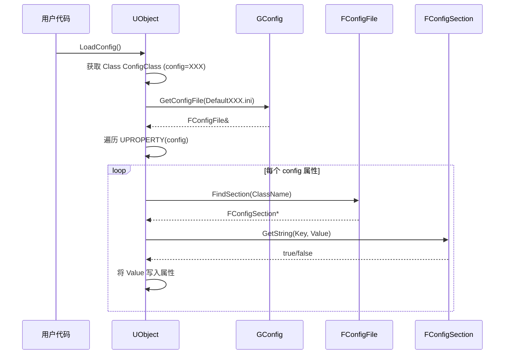
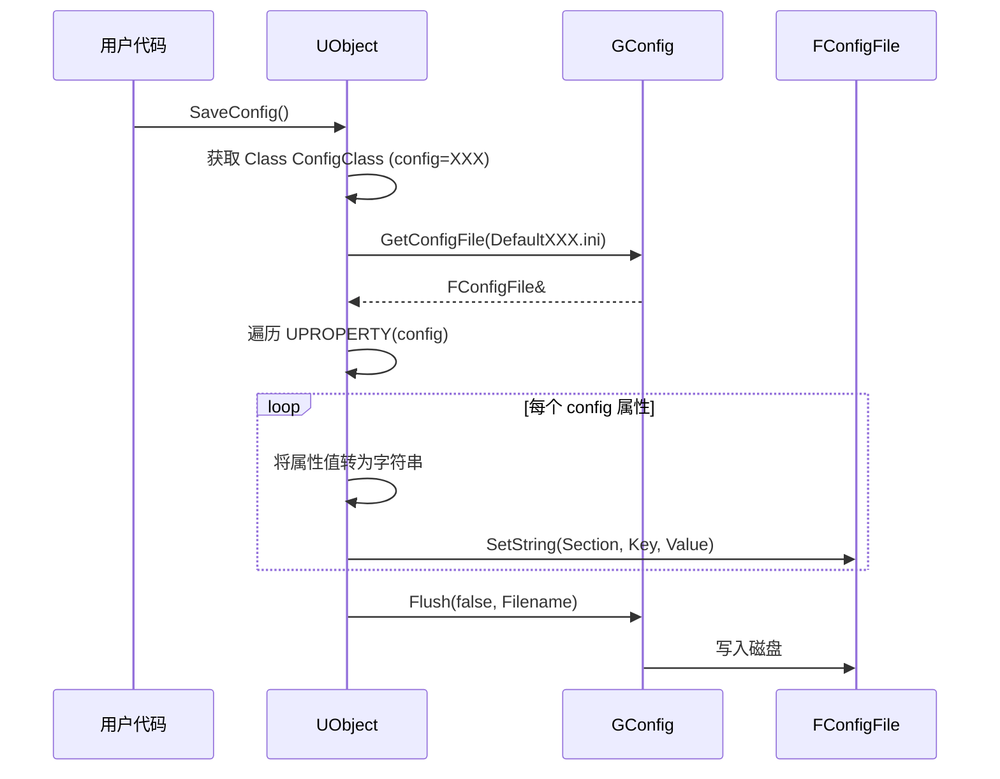

# UObject与Config系统集成

> 理解 `config` 说明符、`LoadConfig`/`SaveConfig` 机制，以及 `UCLASS`/`UPROPERTY` 中的配置说明符如何与 INI 文件联动。

## 概述

本课学完你将能：理解 `UCLASS(config=Game)` 的含义，掌握 `LoadConfig` 的调用链，并能正确在 Lyra 中扩展配置类。

## `config` 说明符详解

### `UCLASS(config=XXX)`

指定该类从哪个 INI 文件读取配置，`XXX` 对应 `DefaultXXX.ini`。

```cpp
// Engine/Source/Runtime/CoreUObject/Public/UObject/ObjectMacros.h
// UCLASS(config=GameUserSettings) 宏展开后会设置 ConfigClass
```

**Lyra 中的实例**（`Source/LyraGame/Settings/LyraSettingsLocal.h`）：

```cpp
UCLASS()
class ULyraSettingsLocal : public UGameUserSettings
{
    GENERATED_BODY()

    // UGameUserSettings 使用 config=GameUserSettings
    // 因此 ULyraSettingsLocal 也从 DefaultGameUserSettings.ini 读取配置
};
```

`defaultconfig`：表示该类是配置的主所有者，保存时写入对应 INI 文件。

### `UPROPERTY(config)`

标记该属性需要从 INI 文件加载/保存。

**Lyra 中的实例**（`LyraSettingsLocal.h`）：

```cpp
UPROPERTY(Config)
TMap<ELyraDisplayablePerformanceStat, ELyraStatDisplayMode> DisplayStatList;

UPROPERTY(Config)
bool bEnableLatencyFlashIndicators = false;

UPROPERTY(Config)
bool bEnableLatencyTrackingStats;

UPROPERTY(Config)
float DisplayGamma = 2.2;
```

这些属性会从 `[/Script/LyraGame.LyraSettingsLocal]` 段加载：

```ini
[/Script/LyraGame.LyraSettingsLocal]
DisplayGamma=2.2
bEnableLatencyFlashIndicators=False
bEnableLatencyTrackingStats=True
```

## LoadConfig / SaveConfig 机制

### LoadConfig 调用链



### SaveConfig 调用链



## UObject::LoadConfig() 源码分析

（源码位置：`Engine/Source/Runtime/CoreUObject/Private/UObject/UObjectBaseUtility.cpp`）

核心逻辑：

```cpp
// 伪代码
void UObject::LoadConfig(UClass* ConfigClass, const TCHAR* Filename)
{
    // 1. 确定要读取的 INI 文件
    if (Filename == nullptr)
    {
        // 使用 UCLASS(config=XXX) 指定的文件
        Filename = GetDefaultConfigFilename();
    }

    // 2. 遍历所有 UPROPERTY(config) 属性
    for (TFieldIterator<FProperty> It(GetClass()); It; ++It)
    {
        if (It->HasAnyPropertyFlags(CPF_Config))
        {
            FString KeyName = It->GetName();
            FString Value;

            // 3. 从 INI 文件读取
            if (GConfig->GetString(*SectionName, *KeyName, Value, Filename))
            {
                // 4. 将字符串转为属性类型并写入
                It->ImportText(*Value, It->ContainerPtrToValuePtr<uint8>(this), 0, this);
            }
        }
    }
}
```

## UObject::SaveConfig() 源码分析

```cpp
// 伪代码
void UObject::SaveConfig(IniFlags)
{
    // 1. 确定要写入的 INI 文件
    FString Filename = GetDefaultConfigFilename();

    // 2. 遍历所有 UPROPERTY(config) 属性
    for (TFieldIterator<FProperty> It(GetClass()); It; ++It)
    {
        if (It->HasAnyPropertyFlags(CPF_Config))
        {
            FString KeyName = It->GetName();
            FString Value;

            // 3. 将属性值转为字符串
            It->ExportText(Value, It->ContainerPtrToValuePtr<uint8>(this), 0, this, 0);

            // 4. 写入 INI 文件（内存）
            GConfig->SetString(*SectionName, *KeyName, *Value, Filename);
        }
    }

    // 5. 刷写到磁盘
    GConfig->Flush(false, Filename);
}
```

## PerObjectConfig

`PerObjectConfig` 说明符让每个对象实例有独立的配置 Section。

### 使用方法

```cpp
UCLASS(PerObjectConfig)
class UMyPerObjectConfigClass : public UObject
{
    GENERATED_BODY()

    UPROPERTY(Config)
    FString TestString;
};
```

### INI 文件中的表示

```ini
[/Script/MyModule.MyPerObjectConfigClass:InstanceName1]
TestString=Value1

[/Script/MyModule.MyPerObjectConfigClass:InstanceName2]
TestString=Value2
```

每个对象实例有独立的 Section（格式：`ClassName:InstanceName`）。

## Lyra 实战：`ULyraSettingsLocal`

### 类定义

```cpp
// Source/LyraGame/Settings/LyraSettingsLocal.h
UCLASS()
class ULyraSettingsLocal : public UGameUserSettings
{
    GENERATED_BODY()

public:
    // 加载配置
    virtual void LoadSettings(bool bForceReload) override;

    // 保存配置
    virtual void SetToDefaults() override;

protected:
    // config 属性
    UPROPERTY(Config)
    TMap<ELyraDisplayablePerformanceStat, ELyraStatDisplayMode> DisplayStatList;

    UPROPERTY(Config)
    bool bEnableLatencyFlashIndicators = false;

    UPROPERTY(Config)
    float DisplayGamma = 2.2;
};
```

### LoadSettings() 实现

```cpp
// Source/LyraGame/Settings/LyraSettingsLocal.cpp
void ULyraSettingsLocal::LoadSettings(bool bForceReload)
{
    // 调用父类的 LoadConfig()，从 DefaultGameUserSettings.ini 加载
    Super::LoadSettings(bForceReload);

    // 可以在这里添加自定义加载逻辑
    // ...
}
```

### SetToDefaults() 实现

```cpp
void ULyraSettingsLocal::SetToDefaults()
{
    // 调用 LoadConfig() 从 INI 文件重新加载默认值
    LoadConfig();

    // 应用默认设置
    ApplyNonResolutionSettings();
}
```

### 对应的 INI 文件

> ⚠️ `DefaultGameUserSettings.ini` **不在 `Config/` 目录中**，而是由 `ULyraSettingsLocal::SaveConfig()` 运行时生成到 `Saved/Config/{PLATFORM}/GameUserSettings.ini`。

`Saved/Config/Windows/GameUserSettings.ini`（运行时生成后）：

```ini
[/Script/LyraGame.LyraSettingsLocal]
DisplayGamma=2.2
bEnableLatencyFlashIndicators=False
bEnableLatencyTrackingStats=True
```

## 配置系统调用时机

### 引擎启动时

```cpp
// Engine/Source/Runtime/Engine/Private/GameEngine.cpp
void UGameEngine::Init(IEngineLoop* InEngineLoop)
{
    // 加载引擎配置
    GConfig->LoadFile(GEngineIni);

    // 创建 UGameUserSettings 并加载配置
    UGameUserSettings* Settings = UGameUserSettings::Get();
    Settings->LoadSettings();
}
```

### 用户修改设置时

```cpp
// 用户修改了画质设置
ULyraSettingsLocal* Settings = ULyraSettingsLocal::Get();
Settings->SetOverallScalabilityLevel(3);  // 设置为高画质
Settings->SaveConfig();  // 保存到 INI 文件
```

## 常见错误

### 错误 1：忘记标记 `UPROPERTY(config)`

**问题**：属性值不会从 INI 文件加载。

**解决**：添加 `UPROPERTY(Config)` 说明符。

### 错误 2：Section 名称不匹配

**问题**：INI 文件中的 Section 名称必须是 `ClassName`（包含模块前缀）。

**正确示例**：

```ini
[/Script/LyraGame.LyraSettingsLocal]
DisplayGamma=2.2
```

**错误示例**：

```ini
[ULyraSettingsLocal]   ← 错误！必须是 /Script/ModuleName.ClassName
```

### 错误 3：PerObjectConfig 的 Section 名称错误

**正确格式**：`ClassName:InstanceName`

```ini
[/Script/MyModule.MyPerObjectConfigClass:InstanceName]
TestString=Value
```

## 小结

- `UCLASS(config=XXX)` 指定从 `DefaultXXX.ini` 加载配置
- `UPROPERTY(config)` 标记需要从 INI 加载的属性
- `LoadConfig()` 从 INI 文件加载配置到对象属性
- `SaveConfig()` 将对象属性保存到 INI 文件
- `PerObjectConfig` 让每个对象实例有独立的配置 Section
- Lyra 的 `ULyraSettingsLocal` 是学习 `config` 系统的绝佳示例

## 相关页面

- [[30-tutorials/config-ini/04-GConfigAPI实战|← 上一课：GConfig 与 FConfigFile API 实战]]
- [[30-tutorials/config-ini/06-Lyra项目配置实例解读|下一课：Lyra 项目 Config 实战分析 →]]
- [[30-tutorials/config-ini/07-ConfigINI高级主题|高级主题：命令行覆盖、Hotfix、平台差异化]]

<!-- nav:auto -->

---

**导航**: ← [[30-tutorials/config-ini/04-GConfigAPI实战|04-GConfigAPI实战]] · [[30-tutorials/config-ini/06-Lyra项目配置实例解读|06-Lyra项目配置实例解读]] →

<!-- /nav:auto -->
