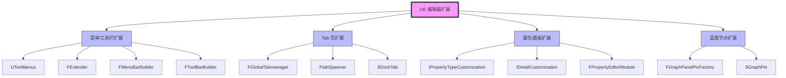

# UE编辑器扩展系列概览

> 系统学习 UE5 编辑器扩展机制，掌握菜单、工具栏、属性面板、蓝图节点的自定义方法。

## 概述

**UE 编辑器扩展**是指通过 C++ 代码或蓝图，对 Unreal Editor 的用户界面和行为进行定制的能力。通过编辑器扩展，你可以：

- 添加自定义菜单项和工具栏按钮
- 创建新的编辑器 Tab 页面
- 自定义 UStruct/UClass 在 Details 面板中的显示方式
- 自定义蓝图节点的 Pin 显示

本系列将系统性地讲解 UE5 编辑器扩展的核心机制，从基础概念到实战案例，帮助你掌握：

1. **UToolMenus 系统** — 菜单和工具栏扩展的统一框架
2. **FTabManager 系统** — Tab 页面注册和管理
3. **IPropertyTypeCustomization** — 自定义属性显示
4. **IDetailCustomization** — 自定义 Details 面板
5. **FGraphPanelPinFactory** — 自定义蓝图节点 Pin 显示

## 核心概念全景图

## 系列阅读指南

本系列共 **9 篇**，分为 **3 个阶段**：

### 阶段 1：基础概念（文章 00-01）

| 文章 | 标题 | 核心内容 | 预计行数 |
|------|------|---------|---------|
| 00 | [UE 编辑器扩展概览](00-UE编辑器扩展系列概览.md) | 系列导航、核心概念全景图 | 200-400 |
| 01 | [编辑器扩展基础](01-UE编辑器扩展基础.md) | 模块创建、注册机制、Slate 基础 | 300-500 |

**学习目标**：理解 UE 编辑器扩展的基本架构和注册机制。

### 阶段 2：核心机制（文章 02-04）

| 文章 | 标题 | 核心内容 | 预计行数 |
|------|------|---------|---------|
| 02 | [菜单项定制](02-菜单项定制.md) | UToolMenus、MenuSection、MenuEntry、SubMenu | 400-600 |
| 03 | [ToolBar 定制](03-ToolBar定制.md) | ToolBar 扩展、按钮添加、下拉菜单 | 300-500 |
| 04 | [Tab 页定制](04-Tab页定制.md) | FGlobalTabmanager、FTabSpawner、SDockTab | 400-600 |

**学习目标**：掌握菜单、工具栏、Tab 页的扩展方法。

### 阶段 3：属性与面板（文章 05-07）

| 文章 | 标题 | 核心内容 | 预计行数 |
|------|------|---------|---------|
| 05 | [自定义属性显示](05-自定义属性显示.md) | IPropertyTypeCustomization、CustomizeHeader、CustomizeChildren | 400-700 |
| 06 | [自定义 Details 面板显示](06-自定义Details面板显示.md) | IDetailCustomization、CustomizeDetails、属性布局 | 400-700 |
| 07 | [自定义蓝图 Pin 显示](07-自定义蓝图参数节点-Pin显示.md) | FGraphPanelPinFactory、SGraphPin、Pin 自定义 | 300-500 |

**学习目标**：掌握属性和 Details 面板的自定义方法，以及蓝图节点 Pin 的定制。

### 阶段 4：高级主题（文章 08）

| 文章 | 标题 | 核心内容 | 预计行数 |
|------|------|---------|---------|
| 08 | [高级主题与最佳实践](08-高级主题与最佳实践.md) | 性能优化、常见陷阱、Lyra 实战案例 | 300-500 |

**学习目标**：了解高级主题和最佳实践，避免在项目中踩坑。

## 与 Lyra 项目的关系

Lyra 项目中使用了多种编辑器扩展技术：

| Lyra 实现 | 扩展类型 | 文件路径 |
|-----------|-----------|----------|
| `FGameplayAbilitiesEditorModule` | 蓝图 Pin 自定义 | `Plugins/Runtime/GameplayAbilities/Source/GameplayAbilitiesEditor/` |
| `FLyraEditorModule` | 菜单/工具栏扩展 | `Source/LyraEditor/` |
| 各种 `IPropertyTypeCustomization` 实现 | 属性自定义 | `Source/LyraEditor/Private/Customizations/` |

本系列将在适当的地方引用 Lyra 的真实实现作为案例研究。

## 前置知识

本系列假设你已经了解：

- ✅ UE C++ 基础（UObject、USTRUCT、UPROPERTY 等）
- ✅ 模块系统（.Build.cs、.uplugin、IModuleInterface）
- ✅ 基本的 Slate UI 概念（SWidget、SCompoundWidget）

如果对上述任何主题不熟悉，请先学习：

- [[30-tutorials/ue-framework/00-UE框架概述]] - UE 框架总览
- [[30-tutorials/blueprint-system/01-蓝图基础概念]] - 蓝图基础概念
- [[30-tutorials/umg/01-UMG基础与核心类架构]] - UMG 基础（Slate 概念）

## 参考资料

- [UE5 官方文档：Details Panel Customizations](https://dev.epicgames.com/documentation/unreal-engine/details-panel-customizations-in-unreal-engine)
- [UToolMenus 探索 - 知乎](https://zhuanlan.zhihu.com/p/652246543)
- [Details Panel Customization - 知乎](https://zhuanlan.zhihu.com/p/342345064)
- 引擎源码：`Engine/Source/Editor/DetailCustomizations/`（参考实现）
- 引擎源码：`Engine/Source/Editor/PropertyEditor/Public/`（接口定义）

## 相关页面

- [[30-tutorials/umg/03-UMG与Slate绑定机制深度分析]] - UMG 与 Slate 绑定机制
- [[30-tutorials/blueprint-system/02-蓝图VM与字节码]] - 蓝图 VM 与字节码
- [[30-tutorials/ue-reflection/02-核心宏详解]] - 核心宏详解（UPROPERTY 等）

---

> 最后更新：2026-05-19

<!-- nav:auto -->

---

**导航**: [[30-tutorials/editor-extension/01-UE编辑器扩展基础|01-UE编辑器扩展基础]] →

<!-- /nav:auto -->
