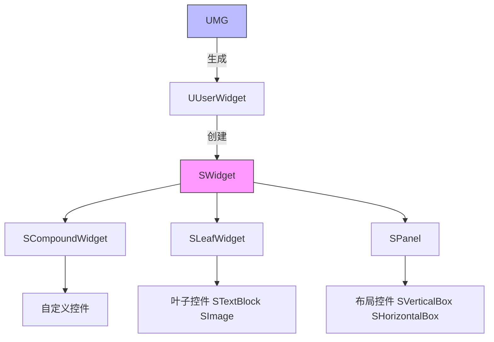
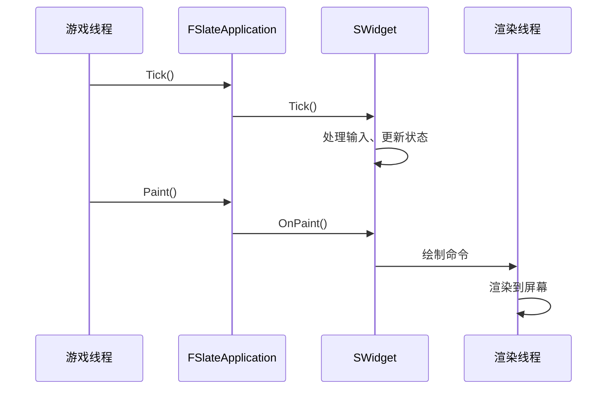

# UE编辑器扩展基础

> 学习如何创建编辑器插件/模块，理解模块注册机制，掌握 Slate UI 基础概念。

## 概述

本课将学习 UE 编辑器扩展的**基础架构**：

1. **创建编辑器插件/模块** — 如何选择插件类型、配置 .Build.cs
2. **模块注册机制** — StartupModule() / ShutdownModule()
3. **Slate UI 基础** — SWidget、SCompoundWidget、Slate 渲染管线
4. **核心模块简介** — FPropertyEditorModule、UToolMenus

学完本课，你将能够：
- ✅ 创建一个编辑器插件并正确配置
- ✅ 理解模块的启动和关闭流程
- ✅ 编写简单的 Slate 控件
- ✅ 理解后续课程的核心模块

## 核心概念

### 编辑器扩展的两种方式

UE 提供了两种扩展编辑器的方式：

| 方式 | 适用场景 | 优点 | 缺点 |
|------|---------|------|--------|
| **编辑器插件（Editor Plugin，一种可在编辑器中加载的模块化扩展）** | 独立功能、可分发 | 独立、易分享 | 配置稍复杂 |
| **项目模块（Project Module）** | 项目特有功能 | 简单、直接 | 绑定项目 |

**推荐**：如果是通用功能（如自定义 Details 面板、菜单扩展），使用**编辑器插件**；如果是项目特有功能（如 Lyra 的武器编辑器），使用**项目模块**。

### 模块注册机制

每个 UE 模块都有一个 **IModuleInterface** 实现，负责模块的启动和关闭：

```cpp
// MyEditorPluginModule.h
class FMyEditorPluginModule : public IModuleInterface
{
public:
    // 模块启动时调用
    virtual void StartupModule() override;
    
    // 模块关闭时调用
    virtual void ShutdownModule() override;
};

IMPLEMENT_MODULE(FMyEditorPluginModule, MyEditorPlugin)
```

**关键点**：
- `StartupModule()` — 在这里注册你的扩展（菜单、工具栏、自定义属性等）
- `ShutdownModule()` — 在这里注销你的扩展（防止崩溃和内存泄漏）

### Slate UI 基础

**Slate**（UE 的即时模式 UI 框架，类似 IMGUI）是 UE 的官方 UI 框架，用于构建编辑器界面。



**核心类**：

| 类 | 类型 | 说明 |
|----|------|------|
| `SWidget` | 基类 | 所有 Slate 控件的基类 |
| `SCompoundWidget` | 复合控件 | 包含子控件的控件（最常用） |
| `SLeafWidget` | 叶子控件 | 不包含子控件（STextBlock、SImage） |
| `SPanel` | 布局控件 | 管理子控件布局（SVerticalBox、SHorizontalBox） |

**Slate 语法示例**：

```cpp
// 创建一个垂直布局，包含两个按钮
SNew(SVerticalBox)
+ SVerticalBox::Slot()
    [
        SNew(SButton)
        .Text(FText::FromString("Button 1"))
        .OnClicked(this, &FMyClass::OnButton1Clicked)
    ]
+ SVerticalBox::Slot()
    [
        SNew(SButton)
        .Text(FText::FromString("Button 2"))
        .OnClicked(this, &FMyClass::OnButton2Clicked)
    ]
```

## 源码深度分析

### 引擎层：IModuleInterface

**文件路径**：`Engine/Source/Runtime/Core/Public/Modules/IModuleInterface.h`

```cpp
// Engine/Source/Runtime/Core/Public/Modules/IModuleInterface.h
// 约 L20-L50
class CORE_API IModuleInterface
{
public:
    // [1] 模块启动时调用
    virtual void StartupModule() {}
    
    // [2] 模块关闭时调用
    virtual void ShutdownModule() {}
    
    // [3] 检查模块是否支持热重载
    virtual bool SupportsDynamicReloading() { return true; }
};
```

**设计决策**：
- UE 使用 **延迟注册** 机制：模块在第一次被引用时才加载（通过 `FModuleManager::LoadModule()`）
- 支持 **热重载**（Hot Reload）：修改 C++ 代码后，编辑器可以动态重新加载模块

### 引擎层：Slate 渲染管线

**Slate 渲染管线** 分为两个阶段：

1. **Tick 阶段** — 处理输入、更新状态
2. **Paint 阶段** — 绘制控件到屏幕



**关键点**：
- Slate 是 **单线程** 的（所有 Tick 和 Paint 都在游戏线程）
- 如果需要多线程渲染，使用 **Slate RHIs**（Render Hardware Interface）

## Lyra 实践

### Lyra 的编辑器模块

Lyra 项目有一个 **LyraEditor** 模块，位于 `Source/LyraEditor/`。

**文件路径**：`Source/LyraEditor/LyraEditorModule.h`

```cpp
// Source/LyraEditor/LyraEditorModule.h
// 约 L10-L30
class FLyraEditorModule : public IModuleInterface
{
public:
    virtual void StartupModule() override;
    virtual void ShutdownModule() override;

private:
    // [1] 注册自定义 Property Type Customization
    void RegisterPropertyTypeCustomizations();
    
    // [2] 注册自定义 Class Type Customization
    void RegisterClassTypeCustomizations();
    
    // [3] 注册自定义 Graph Panel Pin Factory
    void RegisterGraphPanelPinFactory();
};
```

**Lyra 为什么这样设计**：

| 设计决策 | 原因 | 好处 |
|-----------|------|------|
| 独立编辑器模块 | 编辑器功能不混入运行时模块 | 减少运行时包体、清晰分离 |
| 统一注册函数 | 将同类注册放在一个函数 | 易于维护、易于查找 |
| 使用 `TSharedRef` 管理 Slate 对象 | Slate 使用共享指针管理生命周期 | 防止悬空指针、自动释放 |

## 实战：创建编辑器插件

### 步骤 1：创建插件

1. 打开 UE 编辑器
2. **编辑** → **插件** → **新建插件**
3. 选择 **编辑器工具栏**（Editor Toolbar Button）
4. 输入插件名称：`MyEditorExtension`
5. 点击 **创建插件**

### 步骤 2：配置 .Build.cs

**文件路径**：`Source/MyEditorExtension/MyEditorExtension.Build.cs`

```csharp
// MyEditorExtension.Build.cs
// 约 L10-L30
public class MyEditorExtension : ModuleRules
{
    public MyEditorExtension(ReadOnlyTargetRules Target) : base(Target)
    {
        // [1] 这是编辑器插件，只在编辑器模式下编译
        if (Target.bBuildEditor)
        {
            PublicDependencyModuleNames.AddRange(new string[]
            {
                "Core",
                "CoreUObject",
                "Engine",
                "Slate",
                "SlateCore",
                "UnrealEd",          // 编辑器核心
                "PropertyEditor",     // 属性编辑器
                "ToolMenus",         // 菜单系统
                "EditorStyle",        // 编辑器样式
            });
        }
    }
}
```

### 步骤 3：实现模块类

**文件路径**：`Source/MyEditorExtension/MyEditorExtensionModule.h`

```cpp
// MyEditorExtensionModule.h
// 约 L10-L40
#pragma once

#include "CoreMinimal.h"
#include "Modules/IModuleInterface.h"

class FMyEditorExtensionModule : public IModuleInterface
{
public:
    virtual void StartupModule() override;
    virtual void ShutdownModule() override;
};

IMPLEMENT_MODULE(FMyEditorExtensionModule, MyEditorExtension)
```

**文件路径**：`Source/MyEditorExtension/MyEditorExtensionModule.cpp`

```cpp
// MyEditorExtensionModule.cpp
// 约 L10-L50
#include "MyEditorExtensionModule.h"
#include "PropertyEditorModule.h"
#include "ToolMenus.h"

void FMyEditorExtensionModule::StartupModule()
{
    // [1] 加载 PropertyEditor 模块
    FPropertyEditorModule& PropertyModule = FModuleManager::LoadModuleChecked<FPropertyEditorModule>("PropertyEditor");
    
    // [2] 加载 ToolMenus 模块
    UToolMenus::Get();
    
    UE_LOG(LogTemp, Log, TEXT("MyEditorExtension: Module loaded successfully!"));
}

void FMyEditorExtensionModule::ShutdownModule()
{
    UE_LOG(LogTemp, Log, TEXT("MyEditorExtension: Module unloaded successfully!"));
}
```

## 常见问题与陷阱

### 陷阱 1：忘记在 ShutdownModule 中注销

**错误代码**：

```cpp
void FMyEditorExtensionModule::ShutdownModule()
{
    // ❌ 错误：没有注销自定义属性
    // 这会导致编辑器崩溃！
}
```

**正确代码**：

```cpp
void FMyEditorExtensionModule::ShutdownModule()
{
    // ✅ 正确：注销自定义属性
    if (FModuleManager::Get().IsModuleLoaded("PropertyEditor"))
    {
        FPropertyEditorModule& PropertyModule = FModuleManager::GetModuleChecked<FPropertyEditorModule>("PropertyEditor");
        PropertyModule.UnregisterCustomPropertyTypeLayout("MyStruct");
        PropertyModule.NotifyCustomizationModuleChanged();
    }
}
```

### 陷阱 2：在运行时模块中引用 Slate

**错误**：在 `MyGameModule`（运行时模块）中 `#include "Slate.h"`

**原因**：Slate 只在编辑器模式下可用，运行时模块不能依赖 Slate。

**解决**：将编辑器相关代码移到编辑器模块（如 `MyEditorModule`）。

## 总结与要点

| # | 要点 | 说明 |
|---|------|------|
| 1 | **编辑器扩展两种方式** | 插件（通用功能）vs 项目模块（项目特有功能） |
| 2 | **模块注册机制** | StartupModule() 注册，ShutdownModule() 注销 |
| 3 | **Slate UI 基础** | SCompoundWidget（最常用），Slate 语法使用 `SNew()` |
| 4 | **核心模块** | PropertyEditor（属性编辑）、ToolMenus（菜单系统） |
| 5 | **Lyra 实践** | 独立编辑器模块，统一注册函数，使用 `TSharedRef` 管理 Slate 对象 |

## 相关页面

- [[30-tutorials/editor-extension/00-UE编辑器扩展系列概览]] - UE 编辑器扩展概览
- [[30-tutorials/editor-extension/02-菜单项定制]] - 菜单项定制（下一课）
- [[30-tutorials/umg/01-UMG基础与核心类架构]] - UMG 基础（Slate 概念）
- [[30-tutorials/ue-framework/01-UE游戏主循环详解]] - 游戏主循环（了解 Tick 机制）

---

> 最后更新：2026-05-19

<!-- nav:auto -->

---

**导航**: ← [[30-tutorials/editor-extension/00-UE编辑器扩展系列概览|00-UE编辑器扩展系列概览]] · [[30-tutorials/editor-extension/02-菜单项定制|02-菜单项定制]] →

<!-- /nav:auto -->
