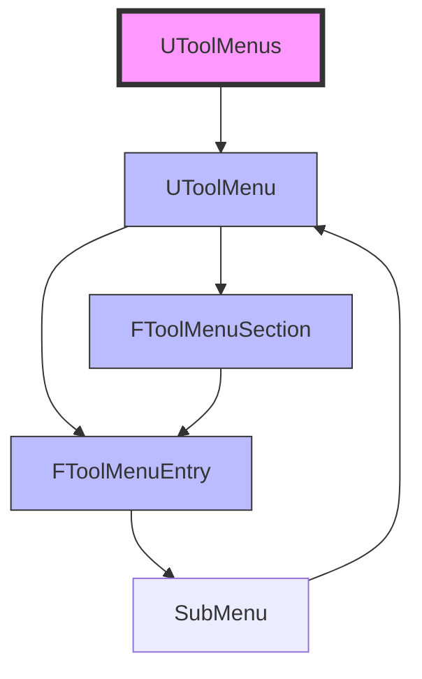

# 菜单项定制

> 学习如何使用 UToolMenus 系统定制 UE 编辑器的菜单项。

## 概述

本课将学习如何**定制 UE 编辑器的菜单**：

1. **UToolMenus 系统** — 菜单、MenuSection、MenuEntry 的关系
2. **扩展主菜单** — 在 LevelEditor.MainMenu 添加菜单项
3. **扩展右键菜单** — 在 ContentBrowser 添加右键菜单项
4. **创建子菜单** — SubMenu 的创建和使用

学完本课，你将能够：
- ✅ 理解 UToolMenus 的架构
- ✅ 扩展编辑器主菜单
- ✅ 扩展 Content Browser 右键菜单
- ✅ 创建嵌套子菜单

## 核心概念

### UToolMenus 系统架构

UE5 使用 **UToolMenus** 系统统一管理所有菜单：



**核心概念**：

| 类 | 说明 | 类比 |
|----|------|------|
| `UToolMenu` | 菜单栏（如主菜单、右键菜单） | 菜单容器 |
| `FToolMenuSection` | 菜单栏区块（用分隔线分隔） | 菜单分组 |
| `FToolMenuEntry` | 菜单项（执行单元） | 菜单按钮 |
| `SubMenu` | 子菜单（嵌套菜单） | 下拉菜单 |

### 常用菜单栏

UE 编辑器提供了多个**预定义菜单栏**，可以直接扩展：

| 菜单栏 ID | 说明 | 使用场景 |
|-----------|------|---------|
| `LevelEditor.MainMenu` | 编辑器主菜单 | 添加顶级菜单项 |
| `ContentBrowser.FolderContextMenu` | Content Browser 文件夹右键菜单 | 文件夹操作 |
| `ContentBrowser.AssetContextMenu` | Content Browser 资产右键菜单 | 资产操作 |

**获取菜单栏**：

```cpp
// 获取主菜单
UToolMenu* MainMenu = UToolMenus::Get()->ExtendMenu("LevelEditor.MainMenu");

// 获取文件夹右键菜单
UToolMenu* FolderContextMenu = UToolMenus::Get()->ExtendMenu("ContentBrowser.FolderContextMenu");

// 获取资产右键菜单
UToolMenu* AssetContextMenu = UToolMenus::Get()->ExtendMenu("ContentBrowser.AssetContextMenu");
```

## 源码深度分析

### 引擎层：UToolMenu 和 FToolMenuSection

**文件路径**：`Engine/Source/Editor/ToolMenus/Public/ToolMenus.h`

```cpp
// Engine/Source/Editor/ToolMenus/Public/ToolMenus.h
// 约 L200-L250
class UToolMenu : public UObject
{
    GENERATED_BODY()

public:
    // [1] 查找或添加 MenuSection
    FToolMenuSection& FindOrAddSection(FName SectionName, const FText& SectionLabel);
    
    // [2] 添加 MenuEntry
    void AddMenuEntry(FName SectionName, const FToolMenuEntry& Entry);
    
    // [3] 所有 Sections
    TArray<FToolMenuSection> Sections;
};
```

**文件路径**：`Engine/Source/Editor/ToolMenus/Public/ToolMenuEntry.h`

```cpp
// Engine/Source/Editor/ToolMenus/Public/ToolMenuEntry.h
// 约 L50-L100
struct FToolMenuSection
{
    // [1] Section 名称
    FName SectionName;
    
    // [2] Section 标签（显示文本）
    FText SectionLabel;
    
    // [3] 所有 MenuEntry
    TArray<FToolMenuEntry> Blocks;
    
    // [4] 添加 MenuEntry
    FToolMenuEntry& AddMenuEntry(FName EntryName, const FText& Label, const FText& ToolTip);
};
```

### 引擎层：FToolMenuEntry 和 SubMenu

**文件路径**：`Engine/Source/Editor/ToolMenus/Public/ToolMenuEntry.h`

```cpp
// Engine/Source/Editor/ToolMenus/Public/ToolMenuEntry.h
// 约 L150-L200
struct FToolMenuEntry
{
    // [1] 创建 SubMenu
    static FToolMenuEntry InitSubMenu(
        FName EntryName,
        const FText& Label,
        const FText& ToolTip,
        FNewToolMenuDelegate MakeMenuDelegate,
        bool bOpenSubMenuOnClick = false
    );
    
    // [2] 创建普通 MenuEntry
    static FToolMenuEntry InitMenuEntry(
        FName EntryName,
        const FText& Label,
        const FText& ToolTip,
        FSlateIcon Icon,
        FUIAction Action
    );
    
    // [3] SubMenu 数据
    struct FSubMenuData
    {
        bool bIsSubMenu;
        FNewToolMenuDelegate ConstructMenu;
    };
};
```

**设计决策**：
- UE5 使用 **UToolMenu** 统一管理菜单，替代了 UE4 的 `FExtender` 方式
- `FNewToolMenuDelegate` 是 **Lambda 委托**，用于延迟构造子菜单内容
- 支持 **动态菜单项**：菜单项可以在打开时动态生成

## Lyra 实践

### Lyra 的菜单扩展

Lyra 项目在主菜单添加了 **"Lyra"** 菜单，包含项目相关工具。

**文件路径**：`Source/LyraEditor/LyraEditorModule.cpp`

```cpp
// Source/LyraEditor/LyraEditorModule.cpp
// 约 L50-L100
void FLyraEditorModule::StartupModule()
{
    // [1] 获取 LevelEditor 模块
    FLevelEditorModule& LevelEditorModule = FModuleManager::LoadModuleChecked<FLevelEditorModule>("LevelEditor");
    
    // [2] 扩展主菜单
    UToolMenu* MainMenu = UToolMenus::Get()->ExtendMenu("LevelEditor.MainMenu");
    
    // [3] 创建 "Lyra" 菜单 Section
    FToolMenuSection& LyraSection = MainMenu->FindOrAddSection(FName("LyraMenu"), FText::FromString("Lyra"));
    
    // [4] 添加 "Open Lyra Settings" 菜单项
    LyraSection.AddMenuEntry(
        FName("OpenLyraSettings"),
        FText::FromString("Open Lyra Settings"),
        FText::FromString("Open the Lyra project settings"),
        FSlateIcon(),
        FUIAction(FExecuteAction::CreateLambda([]()
        {
            // 打开 Lyra 设置窗口
            FLyraEditorModule::OpenSettings();
        }))
    );
}
```

**Lyra 为什么这样设计**：

| 设计决策 | 原因 | 好处 |
|-----------|------|------|
| 独立 "Lyra" 菜单 | 项目工具集中管理 | 易于查找、不污染其他菜单 |
| 使用 Lambda 委托 | 代码简洁、逻辑内聚 | 易于维护、易于理解 |
| 延迟构造 | 菜单项在点击时才构造 | 提高编辑器启动速度 |

## 实战：扩展主菜单

### 步骤 1：在 StartupModule() 中扩展菜单

**文件路径**：`Source/MyEditorExtension/MyEditorExtensionModule.cpp`

```cpp
// MyEditorExtensionModule.cpp
// 约 L20-L80
#include "ToolMenus.h"
#include "LevelEditor.h"

void FMyEditorExtensionModule::StartupModule()
{
    // [1] 加载 LevelEditor 模块
    FLevelEditorModule& LevelEditorModule = FModuleManager::LoadModuleChecked<FLevelEditorModule>("LevelEditor");
    
    // [2] 扩展主菜单
    UToolMenu* MainMenu = UToolMenus::Get()->ExtendMenu("LevelEditor.MainMenu");
    
    // [3] 创建 "My Tools" 菜单 Section
    FToolMenuSection& MyToolsSection = MainMenu->FindOrAddSection(
        FName("MyTools"),
        FText::FromString("My Tools")
    );
    
    // [4] 添加 "My Action" 菜单项
    MyToolsSection.AddMenuEntry(
        FName("MyAction"),
        FText::FromString("My Action"),
        FText::FromString("Execute my custom action"),
        FSlateIcon(),
        FUIAction(FExecuteAction::CreateLambda([]()
        {
            UE_LOG(LogTemp, Log, TEXT("My Action clicked!"));
        }))
    );
    
    // [5] 添加子菜单
    FNewToolMenuDelegate SubMenuDelegate = FNewToolMenuDelegate::CreateLambda([](UToolMenu* SubMenu)
    {
        // 创建子菜单的 Section
        FToolMenuSection& SubSection = SubMenu->FindOrAddSection(
            FName("SubSection"),
            FText::FromString("Sub Section")
        );
        
        // 添加子菜单项
        SubSection.AddMenuEntry(
            FName("SubAction"),
            FText::FromString("Sub Action"),
            FText::FromString("Execute sub action"),
            FSlateIcon(),
            FUIAction(FExecuteAction::CreateLambda([]()
            {
                UE_LOG(LogTemp, Log, TEXT("Sub Action clicked!"));
            }))
        );
    });
    
    // 创建 SubMenu Entry
    FToolMenuEntry SubMenuEntry = FToolMenuEntry::InitSubMenu(
        FName("SubMenu"),
        FText::FromString("Sub Menu"),
        FText::FromString("Open sub menu"),
        SubMenuDelegate
    );
    
    MyToolsSection.AddEntry(SubMenuEntry);
}
```

### 步骤 2：在 ShutdownModule() 中注销（可选）

**注意**：UToolMenus 系统会自动管理菜单项的生命周期，**不需要**手动注销。

但是，如果你创建了 **持久化对象**（如 Slate 窗口），需要在 `ShutdownModule()` 中销毁：

```cpp
// MyEditorExtensionModule.cpp
// 约 L90-L110
void FMyEditorExtensionModule::ShutdownModule()
{
    // [1] 如果创建了 Slate 窗口，需要关闭
    if (MyWindow.IsValid())
    {
        MyWindow->RequestDestroyWindow();
        MyWindow.Reset();
    }
    
    UE_LOG(LogTemp, Log, TEXT("MyEditorExtension: Module unloaded successfully!"));
}
```

## 实战：扩展右键菜单

### 扩展文件夹右键菜单

```cpp
// MyEditorExtensionModule.cpp
// 约 L120-L160
void FMyEditorExtensionModule::StartupModule()
{
    // [1] 扩展文件夹右键菜单
    UToolMenu* FolderContextMenu = UToolMenus::Get()->ExtendMenu("ContentBrowser.FolderContextMenu");
    
    // [2] 创建 Section
    FToolMenuSection& FolderSection = FolderContextMenu->FindOrAddSection(
        FName("MyFolderActions"),
        FText::FromString("My Folder Actions")
    );
    
    // [3] 添加菜单项
    FolderSection.AddMenuEntry(
        FName("MyFolderAction"),
        FText::FromString("My Folder Action"),
        FText::FromString("Execute action on folder"),
        FSlateIcon(),
        FUIAction(FExecuteAction::CreateLambda([]()
        {
            UE_LOG(LogTemp, Log, TEXT("Folder Action clicked!"));
        }))
    );
}
```

### 扩展资产右键菜单

```cpp
// MyEditorExtensionModule.cpp
// 约 L170-L210
void FMyEditorExtensionModule::StartupModule()
{
    // [1] 扩展资产右键菜单
    UToolMenu* AssetContextMenu = UToolMenus::Get()->ExtendMenu("ContentBrowser.AssetContextMenu");
    
    // [2] 创建 Section
    FToolMenuSection& AssetSection = AssetContextMenu->FindOrAddSection(
        FName("MyAssetActions"),
        FText::FromString("My Asset Actions")
    );
    
    // [3] 添加菜单项
    AssetSection.AddMenuEntry(
        FName("MyAssetAction"),
        FText::FromString("My Asset Action"),
        FText::FromString("Execute action on asset"),
        FSlateIcon(),
        FUIAction(FExecuteAction::CreateLambda([]()
        {
            UE_LOG(LogTemp, Log, TEXT("Asset Action clicked!"));
        }))
    );
}
```

## 常见问题与陷阱

### 陷阱 1：菜单项不显示

**原因 1**：菜单 ID 错误

**错误代码**：

```cpp
// ❌ 错误：菜单 ID 错误
UToolMenu* WrongMenu = UToolMenus::Get()->ExtendMenu("Wrong.Menu.ID");
```

**正确代码**：

```cpp
// ✅ 正确：使用正确的菜单 ID
UToolMenu* MainMenu = UToolMenus::Get()->ExtendMenu("LevelEditor.MainMenu");
```

**原因 2**：没有调用 `NotifyToolMenusChanged()`

**正确代码**：

```cpp
// ✅ 正确：修改菜单后通知系统
UToolMenu* MainMenu = UToolMenus::Get()->ExtendMenu("LevelEditor.MainMenu");
// ... 添加菜单项 ...
UToolMenus::Get()->NotifyToolMenusChanged();
```

### 陷阱 2：子菜单不显示

**原因**：`FNewToolMenuDelegate` 没有正确绑定

**错误代码**：

```cpp
// ❌ 错误：Lambda 没有捕获 SubMenu
FNewToolMenuDelegate SubMenuDelegate = FNewToolMenuDelegate::CreateLambda([](UToolMenu* SubMenu)
{
    // 这个 Lambda 不会被调用！
});
```

**正确代码**：

```cpp
// ✅ 正确：使用 CreateLambda，确保 Lambda 被正确绑定
FNewToolMenuDelegate SubMenuDelegate = FNewToolMenuDelegate::CreateLambda([](UToolMenu* SubMenu)
{
    // 这个 Lambda 会在子菜单打开时被调用
    FToolMenuSection& SubSection = SubMenu->FindOrAddSection(FName("SubSection"));
    // ... 添加子菜单项 ...
});
```

## 总结与要点

| # | 要点 | 说明 |
|---|------|------|
| 1 | **UToolMenus 系统** | 统一管理菜单，替代 UE4 的 FExtender |
| 2 | **核心概念** | UToolMenu → FToolMenuSection → FToolMenuEntry |
| 3 | **常用菜单 ID** | LevelEditor.MainMenu、ContentBrowser.FolderContextMenu、ContentBrowser.AssetContextMenu |
| 4 | **子菜单创建** | 使用 FToolMenuEntry::InitSubMenu() 和 FNewToolMenuDelegate |
| 5 | **Lyra 实践** | 独立 "Lyra" 菜单，使用 Lambda 委托，延迟构造 |

## 相关页面

- [[30-tutorials/editor-extension/01-UE编辑器扩展基础]] - 编辑器扩展基础（上一课）
- [[30-tutorials/editor-extension/03-ToolBar定制]] - ToolBar 定制（下一课）
- [[30-tutorials/umg/03-UMG与Slate绑定机制深度分析]] - UMG 与 Slate 绑定机制（Slate 概念）

---

> 最后更新：2026-05-19

<!-- nav:auto -->

---

**导航**: ← [[30-tutorials/editor-extension/01-UE编辑器扩展基础|01-UE编辑器扩展基础]] · [[30-tutorials/editor-extension/03-ToolBar定制|03-ToolBar定制]] →

<!-- /nav:auto -->
