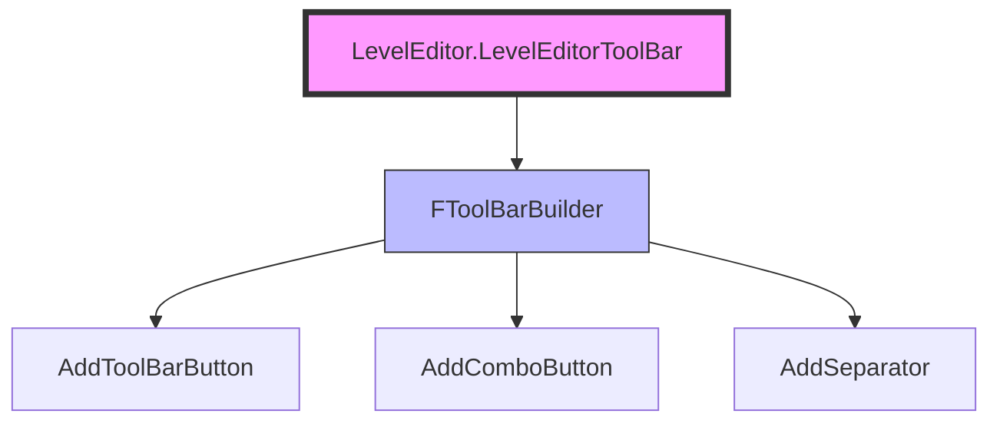

# ToolBar定制

> 学习如何定制 UE 编辑器的 ToolBar（工具栏）。

## 概述

本课将学习如何**定制 UE 编辑器的工具栏**：

1. **ToolBar 扩展机制** — 如何找到 ToolBar 扩展点
2. **FToolBarBuilder** — 添加按钮、分隔符、下拉菜单
3. **扩展 LevelEditor ToolBar** — 实战案例
4. **自定义 ToolBar** — 创建自己的 ToolBar

学完本课，你将能够：
- ✅ 理解 ToolBar 扩展机制
- ✅ 扩展编辑器主工具栏
- ✅ 添加按钮、分隔符、下拉菜单
- ✅ 创建自定义 ToolBar

## 核心概念

### ToolBar 扩展机制

UE 编辑器的 ToolBar 也使用 **UToolMenus** 系统管理：



**核心概念**：

| 类/函数 | 说明 | 类比 |
|-----------|------|------|
| `UToolMenu` | ToolBar 也是一个 UToolMenu | 工具栏容器 |
| `FToolBarBuilder` | 构建 ToolBar 内容的工具 | 工具栏构建器 |
| `AddToolBarButton()` | 添加工具栏按钮 | 添加按钮 |
| `AddComboButton()` | 添加下拉菜单按钮 | 添加下拉按钮 |

### 常用 ToolBar

UE 编辑器提供了多个**预定义 ToolBar**，可以直接扩展：

| ToolBar ID | 说明 | 使用场景 |
|------------|------|---------|
| `LevelEditor.LevelEditorToolBar` | 主工具栏 | 添加常用工具按钮 |
| `LevelEditor.LevelEditorToolBar.PlayToolBar` | Play 工具栏 | 扩展 Play 按钮区域 |

**获取 ToolBar**：

```cpp
// 获取主工具栏
UToolMenu* ToolBar = UToolMenus::Get()->ExtendMenu("LevelEditor.LevelEditorToolBar");
```

## 源码深度分析

### 引擎层：FToolBarBuilder

**文件路径**：`Engine/Source/Editor/Framework/MultiBox/Public/FMultiBoxBuilder.h`

```cpp
// Engine/Source/Editor/Framework/MultiBox/Public/FMultiBoxBuilder.h
// 约 L200-L250
class SLATE_API FToolBarBuilder : public FMultiBoxBuilder
{
public:
    // [1] 添加工具栏按钮
    void AddToolBarButton(
        FName InExtensionHook,
        const FText& InLabel,
        const FText& InToolTip,
        const FSlateIcon& InIcon,
        FUIAction InAction
    );
    
    // [2] 添加下拉菜单按钮
    void AddComboButton(
        FName InExtensionHook,
        const FText& InLabel,
        const FText& InToolTip,
        const FSlateIcon& InIcon,
        FOnGetContent OnGetMenuContent
    );
    
    // [3] 添加分隔符
    void AddSeparator(FName InExtensionHook);
};
```

### 引擎层：扩展 LevelEditor ToolBar

**文件路径**：`Engine/Source/Editor/LevelEditor/Public/LevelEditor.h`

```cpp
// Engine/Source/Editor/LevelEditor/Public/LevelEditor.h
// 约 L150-L200
class FLevelEditorModule : public IModuleInterface
{
public:
    // [1] 获取 Menu Extensibility Manager
    virtual TSharedPtr<FExtensibilityManager> GetMenuExtensibilityManager() = 0;
    
    // [2] 获取 ToolBar Extensibility Manager
    virtual TSharedPtr<FExtensibilityManager> GetToolBarExtensibilityManager() = 0;
};
```

**设计决策**：
- UE5 使用 **UToolMenus** 统一管理菜单和工具栏
- `FExtensibilityManager` 管理所有扩展（Menu、ToolBar、Tab）
- 支持 **扩展钩子（Extension Hook）**：在指定位置插入扩展

## Lyra 实践

### Lyra 的 ToolBar 扩展

Lyra 项目在主工具栏添加了 **"Lyra Tools"** 工具栏按钮。

**文件路径**：`Source/LyraEditor/LyraEditorModule.cpp`

```cpp
// Source/LyraEditor/LyraEditorModule.cpp
// 约 L150-L200
void FLyraEditorModule::StartupModule()
{
    // [1] 获取 LevelEditor 模块
    FLevelEditorModule& LevelEditorModule = FModuleManager::LoadModuleChecked<FLevelEditorModule>("LevelEditor");
    
    // [2] 扩展主工具栏
    UToolMenu* ToolBar = UToolMenus::Get()->ExtendMenu("LevelEditor.LevelEditorToolBar.PlayToolBar");
    
    // [3] 创建 "Lyra Tools" Section
    FToolMenuSection& LyraSection = ToolBar->FindOrAddSection(
        FName("LyraTools"),
        FText::FromString("Lyra Tools")
    );
    
    // [4] 添加 "Open Lyra Settings" 按钮
    LyraSection.AddEntry(FToolMenuEntry::InitToolBarButton(
        FName("OpenLyraSettings"),
        FText::FromString("Lyra Settings"),
        FText::FromString("Open the Lyra project settings"),
        FSlateIcon(),
        FUIAction(FExecuteAction::CreateLambda([]()
        {
            // 打开 Lyra 设置窗口
            FLyraEditorModule::OpenSettings();
        }))
    ));
}
```

**Lyra 为什么这样设计**：

| 设计决策 | 原因 | 好处 |
|-----------|------|------|
| 扩展 PlayToolBar | Play 按钮区域是最显眼的位置 | 提高工具发现性 |
| 使用 Section | 工具栏按钮分组管理 | 易于维护、易于理解 |
| Lambda 委托 | 代码简洁、逻辑内聚 | 易于维护、易于理解 |

## 实战：扩展主工具栏

### 步骤 1：在 StartupModule() 中扩展 ToolBar

**文件路径**：`Source/MyEditorExtension/MyEditorExtensionModule.cpp`

```cpp
// MyEditorExtensionModule.cpp
// 约 L100-L150
#include "ToolMenus.h"
#include "LevelEditor.h"

void FMyEditorExtensionModule::StartupModule()
{
    // [1] 加载 LevelEditor 模块
    FLevelEditorModule& LevelEditorModule = FModuleManager::LoadModuleChecked<FLevelEditorModule>("LevelEditor");
    
    // [2] 扩展主工具栏
    UToolMenu* ToolBar = UToolMenus::Get()->ExtendMenu("LevelEditor.LevelEditorToolBar.PlayToolBar");
    
    // [3] 创建 "My Tools" Section
    FToolMenuSection& MyToolsSection = ToolBar->FindOrAddSection(
        FName("MyTools"),
        FText::FromString("My Tools")
    );
    
    // [4] 添加 "My Action" 按钮
    MyToolsSection.AddEntry(FToolMenuEntry::InitToolBarButton(
        FName("MyAction"),
        FText::FromString("My Action"),
        FText::FromString("Execute my custom action"),
        FSlateIcon(),
        FUIAction(FExecuteAction::CreateLambda([]()
        {
            UE_LOG(LogTemp, Log, TEXT("My Action clicked!"));
        }))
    ));
    
    // [5] 添加分隔符
    MyToolsSection.AddSeparator(FName("MySeparator"));
    
    // [6] 添加下拉菜单按钮
    FNewToolMenuDelegate ComboMenuDelegate = FNewToolMenuDelegate::CreateLambda([](UToolMenu* SubMenu)
    {
        // 创建下拉菜单的 Section
        FToolMenuSection& ComboSection = SubMenu->FindOrAddSection(
            FName("ComboSection"),
            FText::FromString("Combo Section")
        );
        
        // 添加菜单项
        ComboSection.AddMenuEntry(
            FName("ComboAction"),
            FText::FromString("Combo Action"),
            FText::FromString("Execute combo action"),
            FSlateIcon(),
            FUIAction(FExecuteAction::CreateLambda([]()
            {
                UE_LOG(LogTemp, Log, TEXT("Combo Action clicked!"));
            }))
        );
    });
    
    MyToolsSection.AddEntry(FToolMenuEntry::InitComboButton(
        FName("MyCombo"),
        FText::FromString("My Combo"),
        FText::FromString("Open combo menu"),
        FSlateIcon(),
        ComboMenuDelegate
    ));
}
```

### 步骤 2：查看效果

1. 重新编译插件
2. 打开 UE 编辑器
3. 查看主工具栏（Play 按钮旁边），应该能看到：
   - "My Action" 按钮
   - 分隔符
   - "My Combo" 下拉菜单按钮

## 实战：创建自定义 ToolBar

### 创建自定义 ToolBar 窗口

```cpp
// MyEditorExtensionModule.h
// 约 L20-L40
#pragma once

#include "CoreMinimal.h"
#include "IModuleInterface.h"
#include "SlateBasics.h"

class SMyToolBarWidget : public SCompoundWidget
{
    SLATE_BEGIN_ARGS(SMyToolBarWidget) {}
    SLATE_END_ARGS()

    void Construct(const FArguments& InArgs);

private:
    TSharedPtr<SToolBarBox> ToolBarBox;
};

class FMyEditorExtensionModule : public IModuleInterface
{
public:
    virtual void StartupModule() override;
    virtual void ShutdownModule() override;

private:
    TSharedPtr<SWindow> MyToolBarWindow;
};
```

```cpp
// MyEditorExtensionModule.cpp
// 约 L250-L300
void FMyEditorExtensionModule::StartupModule()
{
    // [1] 创建自定义 ToolBar 窗口
    MyToolBarWindow = SNew(SWindow)
        .Title(FText::FromString("My ToolBar"))
        .ClientSize(FVector2D(600, 50))
        .SupportsMaximize(false)
        .SupportsMinimize(false)
        .SizingRule(ESizingRule::FixedSize);
    
    // [2] 创建 ToolBar 内容
    MyToolBarWindow->SetContent(
        SNew(SMyToolBarWidget)
    );
    
    // [3] 添加到编辑器
    FSlateApplication::Get().AddWindow(MyToolBarWindow.ToSharedRef());
}

void SMyToolBarWidget::Construct(const FArguments& InArgs)
{
    // [1] 创建 ToolBarBox
    ChildSlot
        [
            SAssignNew(ToolBarBox, SToolBarBox)
        ];
    
    // [2] 添加按钮到 ToolBarBox
    ToolBarBox->AddToolBarButton(
        FUIAction(FExecuteAction::CreateLambda([]()
        {
            UE_LOG(LogTemp, Log, TEXT("Custom ToolBar Button 1 clicked!"));
        })),
        FName("Button1"),
        FText::FromString("Button 1"),
        FText::FromString("Execute action 1"),
        FSlateIcon()
    );
    
    ToolBarBox->AddSeparator(FName("Separator1"));
    
    ToolBarBox->AddToolBarButton(
        FUIAction(FExecuteAction::CreateLambda([]()
        {
            UE_LOG(LogTemp, Log, TEXT("Custom ToolBar Button 2 clicked!"));
        })),
        FName("Button2"),
        FText::FromString("Button 2"),
        FText::FromString("Execute action 2"),
        FSlateIcon()
    );
}
```

## 常见问题与陷阱

### 陷阱 1：按钮不显示

**原因 1**：ToolBar ID 错误。

**错误代码**：

```cpp
// ❌ 错误：ToolBar ID 错误
UToolMenu* WrongToolBar = UToolMenus::Get()->ExtendMenu("Wrong.ToolBar.ID");
```

**正确代码**：

```cpp
// ✅ 正确：使用正确的 ToolBar ID
UToolMenu* ToolBar = UToolMenus::Get()->ExtendMenu("LevelEditor.LevelEditorToolBar.PlayToolBar");
```

**原因 2**：没有调用 `NotifyToolMenusChanged()`。

**正确代码**：

```cpp
// ✅ 正确：修改 ToolBar 后通知系统
UToolMenu* ToolBar = UToolMenus::Get()->ExtendMenu("LevelEditor.LevelEditorToolBar.PlayToolBar");
// ... 添加按钮 ...
UToolMenus::Get()->NotifyToolMenusChanged();
```

### 陷阱 2：下拉菜单不显示

**原因**：`FNewToolMenuDelegate` 没有正确绑定。

**错误代码**：

```cpp
// ❌ 错误：Lambda 没有捕获 SubMenu
FNewToolMenuDelegate ComboMenuDelegate = FNewToolMenuDelegate::CreateLambda([](UToolMenu* SubMenu)
{
    // 这个 Lambda 不会被调用！
});
```

**正确代码**：

```cpp
// ✅ 正确：使用 CreateLambda，确保 Lambda 被正确绑定
FNewToolMenuDelegate ComboMenuDelegate = FNewToolMenuDelegate::CreateLambda([](UToolMenu* SubMenu)
{
    // 这个 Lambda 会在下拉菜单打开时被调用
    FToolMenuSection& ComboSection = SubMenu->FindOrAddSection(FName("ComboSection"));
    // ... 添加菜单项 ...
});
```

## 总结与要点

| # | 要点 | 说明 |
|---|------|------|
| 1 | **ToolBar 扩展机制** | 使用 UToolMenus 系统，扩展 LevelEditor.LevelEditorToolBar |
| 2 | **FToolBarBuilder** | AddToolBarButton()、AddComboButton()、AddSeparator() |
| 3 | **Lyra 实践** | 扩展 PlayToolBar，使用 Section 分组，Lambda 委托 |
| 4 | **自定义 ToolBar** | 创建 SWindow + SToolBarBox，添加按钮和分隔符 |
| 5 | **常见陷阱** | ToolBar ID 错误、忘记 NotifyToolMenusChanged() |

## 相关页面

- [[30-tutorials/editor-extension/02-菜单项定制]] - 菜单项定制（上一课）
- [[30-tutorials/editor-extension/04-Tab页定制]] - Tab 页定制（下一课）
- [[30-tutorials/umg/03-UMG与Slate绑定机制深度分析]] - UMG 与 Slate 绑定机制（Slate 概念）

---

> 最后更新：2026-05-19

<!-- nav:auto -->

---

**导航**: ← [[30-tutorials/editor-extension/02-菜单项定制|02-菜单项定制]] · [[30-tutorials/editor-extension/04-Tab页定制|04-Tab页定制]] →

<!-- /nav:auto -->
