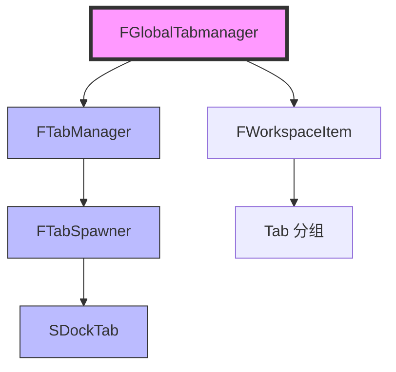

# Tab页定制

> 学习如何创建和定制 UE 编辑器的 Tab 页面。

## 概述

本课将学习如何**定制 UE 编辑器的 Tab 页面**：

1. **FGlobalTabmanager 系统** — Tab 页面的注册和管理
2. **FTabSpawner** — 注册 Tab 页面
3. **SDockTab** — 创建自定义 Tab 内容
4. **Tab 分组和菜单集成** — 将 Tab 入口添加到菜单

学完本课，你将能够：
- ✅ 理解 FGlobalTabmanager 的架构
- ✅ 注册 Nomad Tab（浮动 Tab）
- ✅ 创建自定义 Tab 内容
- ✅ 将 Tab 入口集成到菜单

## 核心概念

### FGlobalTabmanager 系统架构

UE 使用 **FGlobalTabmanager** 管理所有 Tab 页面：



**核心概念**：

| 类 | 说明 | 类比 |
|----|------|------|
| `FGlobalTabmanager` | 全局 Tab 管理器 | Tab 管理器 |
| `FTabManager` | Tab 管理器（每个编辑器窗口有一个） | 窗口 Tab 管理器 |
| `FTabSpawner` | Tab 注册器 | Tab 工厂 |
| `SDockTab` | Tab 控件（Slate） | Tab 页面 |
| `FWorkspaceItem` | Tab 分组（菜单中的分组） | 菜单分组 |

### Nomad Tab vs 固定 Tab

UE 支持两种 Tab：

| 类型 | 说明 | 使用场景 |
|------|------|---------|
| **Nomad Tab** | 浮动 Tab，可以在多个窗口间移动 | 工具窗口（如 Output Log） |
| **固定 Tab** | 固定在某个编辑器窗口 | 关卡编辑器中的 Tab |

**创建 Nomad Tab**：

```cpp
// 注册 Nomad Tab
FGlobalTabmanager::Get()->RegisterNomadTabSpawner(
    FName("MyTab"),
    FOnSpawnTab::CreateLambda([](const FSpawnTabArgs& Args)
    {
        return SNew(SDockTab)
            .TabRole(ETabRole::NomadTab)
            .Label(FText::FromString("My Tab"))
            [
                SNew(STextBlock)
                .Text(FText::FromString("Hello, World!"))
            ];
    })
);
```

## 源码深度分析

### 引擎层：FGlobalTabmanager 和 FTabSpawner

**文件路径**：`Engine/Source/Editor/Framework/Public/FGlobalTabmanager.h`

```cpp
// Engine/Source/Editor/Framework/Public/FGlobalTabmanager.h
// 约 L100-L150
class SLATE_API FGlobalTabmanager
{
public:
    // [1] 获取全局 Tab 管理器
    static TSharedPtr<FGlobalTabmanager> Get();
    
    // [2] 注册 Nomad Tab
    TSharedRef<FTabSpawner> RegisterNomadTabSpawner(
        const FName& TabId,
        const FOnSpawnTab& OnSpawnTab
    );
    
    // [3] 注销 Nomad Tab
    void UnregisterNomadTabSpawner(const FName& TabId);
    
    // [4] 尝试打开 Tab
    TSharedPtr<SDockTab> TryInvokeTab(const FTabId& TabId);
    
private:
    // [5] 所有注册的 Tab Spawner
    TMap<FName, TSharedPtr<FTabSpawner>> NomadTabSpawners;
};
```

**文件路径**：`Engine/Source/Editor/Framework/Public/FTabSpawner.h`

```cpp
// Engine/Source/Editor/Framework/Public/FTabSpawner.h
// 约 L50-L100
class FTabSpawner
{
public:
    // [1] 设置 Tab 分组
    FTabSpawner& SetGroup(TSharedPtr<FWorkspaceItem> InGroup);
    
    // [2] 设置菜单类型
    FTabSpawner& SetMenuType(ETabSpawnerMenuType::Type InMenuType);
    
    // [3] 创建 Tab
    TSharedRef<SDockTab> SpawnTab(const FSpawnTabArgs& Args);
    
private:
    // [4] 创建 Tab 的委托
    FOnSpawnTab OnSpawnTab;
    
    // [5] Tab 分组
    TSharedPtr<FWorkspaceItem> Group;
};
```

### 引擎层：SDockTab

**文件路径**：`Engine/Source/Editor/Framework/Public/SDockTab.h`

```cpp
// Engine/Source/Editor/Framework/Public/SDockTab.h
// 约 L50-L100
class SLATE_API SDockTab : public SCompoundWidget
{
public:
    // [1] 设置 Tab 标签
    SDockTab& Label(const TAttribute<FText>& InLabel);
    
    // [2] 设置 Tab 内容
    SDockTab& operator[](const TSharedRef<SWidget>& InContent);
    
    // [3] Tab 角色
    SDockTab& TabRole(ETabRole::Type InRole);
    
    // [4] 关闭 Tab
    void RequestCloseTab();
    
private:
    // [5] Tab 内容
    TSharedPtr<SWidget> TabContent;
};
```

**设计决策**：
- UE 使用 **延迟构造** 机制：Tab 只在第一次打开时才创建（通过 `FOnSpawnTab` 委托）
- 支持 **Tab 分组**：将相关 Tab 放在同一个菜单分组中，便于管理
- 支持 **菜单集成**：Tab 入口可以自动添加到菜单（通过 `SetMenuType()`）

## Lyra 实践

### Lyra 的 Tab 扩展

Lyra 项目创建了 **"Lyra References"** Tab，用于查看资产引用。

**文件路径**：`Source/LyraEditor/LyraEditorModule.cpp`

```cpp
// Source/LyraEditor/LyraEditorModule.cpp
// 约 L250-L300
void FLyraEditorModule::StartupModule()
{
    // [1] 创建 Tab 分组
    TSharedPtr<FWorkspaceItem> ToolsCategory = 
        FGlobalTabmanager::Get()->AddLocalWorkspaceMenuCategory(
            FText::FromString("Lyra Tools")
        );
    
    // [2] 注册 Nomad Tab
    FGlobalTabmanager::Get()->RegisterNomadTabSpawner(
        FName("LyraReferences"),
        FOnSpawnTab::CreateLambda([](const FSpawnTabArgs& Args)
        {
            return SNew(SDockTab)
                .TabRole(ETabRole::NomadTab)
                .Label(FText::FromString("Lyra References"))
                [
                    SNew(SLyraReferenceWidget)  // 自定义 Widget
                ];
        })
    )
    .SetGroup(ToolsCategory.ToSharedRef())  // 设置分组
    .SetMenuType(ETabSpawnerMenuType::Enabled);  // 启用菜单入口
}
```

**Lyra 为什么这样设计**：

| 设计决策 | 原因 | 好处 |
|-----------|------|------|
| 独立 Tab 分组 | Tab 集中管理 | 易于查找、不污染其他分组 |
| 使用 Lambda 委托 | 代码简洁、逻辑内聚 | 易于维护、易于理解 |
| 延迟构造 | Tab 只在第一次打开时才创建 | 提高编辑器启动速度 |

## 实战：创建自定义 Tab

### 步骤 1：在 StartupModule() 中注册 Tab

**文件路径**：`Source/MyEditorExtension/MyEditorExtensionModule.cpp`

```cpp
// MyEditorExtensionModule.cpp
// 约 L250-L320
#include "Framework/Public/FGlobalTabmanager.h"
#include "Widgets/Docking/SDockTab.h"

void FMyEditorExtensionModule::StartupModule()
{
    // [1] 创建 Tab 分组
    TSharedPtr<FWorkspaceItem> ToolsCategory = 
        FGlobalTabmanager::Get()->AddLocalWorkspaceMenuCategory(
            FText::FromString("My Tools")
        );
    
    // [2] 注册 Nomad Tab
    FGlobalTabmanager::Get()->RegisterNomadTabSpawner(
        FName("MyCustomTab"),
        FOnSpawnTab::CreateLambda([this](const FSpawnTabArgs& Args)
        {
            return SNew(SDockTab)
                .TabRole(ETabRole::NomadTab)
                .Label(FText::FromString("My Custom Tab"))
                [
                    SNew(SVerticalBox)
                    + SVerticalBox::Slot()
                        .AutoHeight()
                        [
                            SNew(SButton)
                            .Text(FText::FromString("Click Me!"))
                            .OnClicked(this, &FMyEditorExtensionModule::OnButtonClicked)
                        ]
                    + SVerticalBox::Slot()
                        .FillHeight(1.0f)
                        [
                            SNew(STextBlock)
                            .Text(FText::FromString("Hello, World!"))
                        ]
                ];
        })
    )
    .SetGroup(ToolsCategory.ToSharedRef())  // 设置分组
    .SetMenuType(ETabSpawnerMenuType::Enabled);  // 启用菜单入口
}

FReply FMyEditorExtensionModule::OnButtonClicked()
{
    UE_LOG(LogTemp, Log, TEXT("Button clicked!"));
    return FReply::Handled();
}
```

### 步骤 2：在菜单中添加 Tab 入口

**文件路径**：`Source/MyEditorExtension/MyEditorExtensionModule.cpp`

```cpp
// MyEditorExtensionModule.cpp
// 约 L330-L380
void FMyEditorExtensionModule::StartupModule()
{
    // ... [上面的代码]
    
    // [3] 扩展主菜单，添加 Tab 入口
    UToolMenu* MainMenu = UToolMenus::Get()->ExtendMenu("LevelEditor.MainMenu");
    
    FToolMenuSection& MyToolsSection = MainMenu->FindOrAddSection(
        FName("MyTools"),
        FText::FromString("My Tools")
    );
    
    // [4] 添加菜单项，点击时打开 Tab
    MyToolsSection.AddMenuEntry(
        FName("OpenMyCustomTab"),
        FText::FromString("Open My Custom Tab"),
        FText::FromString("Open my custom tab"),
        FSlateIcon(),
        FUIAction(FExecuteAction::CreateLambda([]()
        {
            FGlobalTabmanager::Get()->TryInvokeTab(FTabId("MyCustomTab"));
        }))
    );
}
```

### 步骤 3：在 ShutdownModule() 中注销 Tab

**文件路径**：`Source/MyEditorExtension/MyEditorExtensionModule.cpp`

```cpp
// MyEditorExtensionModule.cpp
// 约 L400-L430
void FMyEditorExtensionModule::ShutdownModule()
{
    // [1] 注销 Nomad Tab
    if (FModuleManager::Get().IsModuleLoaded("LevelEditor"))
    {
        FGlobalTabmanager::Get()->UnregisterNomadTabSpawner(FName("MyCustomTab"));
    }
    
    UE_LOG(LogTemp, Log, TEXT("MyEditorExtension: Module unloaded successfully!"));
}
```

### 步骤 4：查看效果

1. 重新编译插件
2. 打开 UE 编辑器
3. 查看主菜单，应该能看到 **"My Tools"** → **"Open My Custom Tab"**
4. 点击菜单项，应该能看到 **"My Custom Tab"** 窗口

## 实战：创建隐藏的 Tab

### 创建不显示在菜单中的 Tab

```cpp
// MyEditorExtensionModule.cpp
// 约 L450-L500
void FMyEditorExtensionModule::StartupModule()
{
    // [1] 注册 Nomad Tab，设置菜单类型为 Hidden
    FGlobalTabmanager::Get()->RegisterNomadTabSpawner(
        FName("MyHiddenTab"),
        FOnSpawnTab::CreateLambda([](const FSpawnTabArgs& Args)
        {
            return SNew(SDockTab)
                .TabRole(ETabRole::NomadTab)
                .Label(FText::FromString("My Hidden Tab"))
                [
                    SNew(STextBlock)
                    .Text(FText::FromString("This tab is hidden from menu!"))
                ];
        })
    )
    .SetMenuType(ETabSpawnerMenuType::Hidden);  // 隐藏菜单入口
    
    // [2] 手动打开 Tab（例如在按钮点击时）
    // FGlobalTabmanager::Get()->TryInvokeTab(FTabId("MyHiddenTab"));
}
```

**使用场景**：
- 只在特定条件下显示的 Tab（例如：只在选中某个资产时显示）
- 通过快捷键打开的 Tab

## 常见问题与陷阱

### 陷阱 1：Tab 不显示

**原因 1**：Tab ID 错误。

**错误代码**：

```cpp
// ❌ 错误：Tab ID 错误
FGlobalTabmanager::Get()->TryInvokeTab(FTabId("WrongTabId"));
```

**正确代码**：

```cpp
// ✅ 正确：使用正确的 Tab ID
FGlobalTabmanager::Get()->TryInvokeTab(FTabId("MyCustomTab"));
```

**原因 2**：没有调用 `SetMenuType(Enabled)`。

**正确代码**：

```cpp
// ✅ 正确：启用菜单入口
FGlobalTabmanager::Get()->RegisterNomadTabSpawner(...)
.SetMenuType(ETabSpawnerMenuType::Enabled);
```

### 陷阱 2：Tab 内容不更新

**原因**：Tab 内容没有正确绑定数据。

**错误代码**：

```cpp
// ❌ 错误：Tab 内容没有绑定数据
return SNew(SDockTab)
    .Label(FText::FromString("My Tab"))
    [
        SNew(STextBlock)
        .Text(FText::FromString(MyData.Name))  // MyData 可能已失效！
    ];
```

**正确代码**：

```cpp
// ✅ 正确：使用 TAttribute 绑定数据
return SNew(SDockTab)
    .Label(FText::FromString("My Tab"))
    [
        SNew(STextBlock)
        .Text(TAttribute<FText>::Create(TAttribute<FText>::FGetter::CreateLambda([this]()
        {
            return FText::FromString(MyData.Name);  // 每次绘制时重新获取
        })))
    ];
```

## 总结与要点

| # | 要点 | 说明 |
|---|------|------|
| 1 | **FGlobalTabmanager 系统** | 管理所有 Tab 页面，使用 RegisterNomadTabSpawner() 注册 |
| 2 | **Nomad Tab vs 固定 Tab** | Nomad Tab 是浮动 Tab，固定 Tab 固定在编辑器窗口 |
| 3 | **SDockTab** | Tab 控件，使用 SNew(SDockTab) 创建，设置 Label 和 Content |
| 4 | **Tab 分组和菜单集成** | 使用 SetGroup() 设置分组，SetMenuType(Enabled) 启用菜单入口 |
| 5 | **Lyra 实践** | 独立 Tab 分组，使用 Lambda 委托，延迟构造 |

## 相关页面

- [[30-tutorials/editor-extension/03-ToolBar定制]] - ToolBar 定制（上一课）
- [[30-tutorials/editor-extension/05-自定义属性显示]] - 自定义属性显示（下一课）
- [[30-tutorials/umg/03-UMG与Slate绑定机制深度分析]] - UMG 与 Slate 绑定机制（Slate 概念）

---

> 最后更新：2026-05-19

<!-- nav:auto -->

---

**导航**: ← [[30-tutorials/editor-extension/03-ToolBar定制|03-ToolBar定制]] · [[30-tutorials/editor-extension/05-自定义属性显示|05-自定义属性显示]] →

<!-- /nav:auto -->
