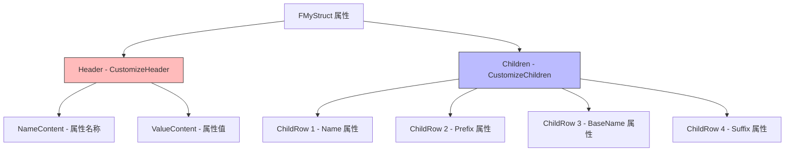

# 自定义属性显示

> 学习如何使用 IPropertyTypeCustomization 自定义 UStruct 在 Details 面板中的显示方式。

## 概述

本课将学习如何**自定义属性显示**：

1. **IPropertyTypeCustomization 接口** — CustomizeHeader() 和 CustomizeChildren()
2. **注册自定义属性** — RegisterCustomPropertyTypeLayout()
3. **实战案例** — 自定义 FMyStruct 显示
4. **高级技巧** — 自定义 Header 和 Children

学完本课，你将能够：
- ✅ 理解 IPropertyTypeCustomization 的架构
- ✅ 自定义 UStruct 在 Details 面板中的显示
- ✅ 注册和注销自定义属性
- ✅ 创建实用的属性编辑器

## 核心概念

### 属性自定义 vs 细节面板自定义

UE 提供了两种自定义 Details 面板的方式：

| 类型 | 接口 | 作用对象 | 使用场景 |
|------|------|---------|---------|
| **属性自定义** | `IPropertyTypeCustomization` | UStruct 的 UPROPERTY | 自定义结构体的显示 |
| **细节面板自定义** | `IDetailCustomization` | UClass 的 UPROPERTY | 自定义整个对象的 Details 面板 |

**本課讲解属性自定义**，下一課讲解细节面板自定义。

### IPropertyTypeCustomization 接口

**核心函数**：

```cpp
// Engine/Source/Editor/PropertyEditor/Public/IPropertyTypeCustomization.h
// 约 L50-L100
class IPropertyTypeCustomization
{
public:
    // [1] 自定义属性头部（红色部分）
    virtual void CustomizeHeader(
        TSharedRef<IPropertyHandle> PropertyHandle,
        FDetailWidgetRow& HeaderRow,
        IPropertyTypeCustomizationUtils& CustomizationUtils) = 0;
    
    // [2] 自定义属性子项（绿色部分）
    virtual void CustomizeChildren(
        TSharedRef<IPropertyHandle> PropertyHandle,
        IDetailChildrenBuilder& ChildBuilder,
        IPropertyTypeCustomizationUtils& CustomizationUtils) = 0;
};
```

**CustomizeHeader() vs CustomizeChildren()**：



## 源码深度分析

### 引擎层：IPropertyHandle

**文件路径**：`Engine/Source/Editor/PropertyEditor/Public/IPropertyHandle.h`

```cpp
// Engine/Source/Editor/PropertyEditor/Public/IPropertyHandle.h
// 约 L100-L150
class IPropertyHandle
{
public:
    // [1] 获取属性名称
    virtual FText GetPropertyDisplayName() const = 0;
    
    // [2] 获取属性值
    virtual FText GetValueAsText() const = 0;
    
    // [3] 设置属性值
    virtual FText SetValueFromFormattedText(const FText& NewText) = 0;
    
    // [4] 获取子属性
    virtual TSharedPtr<IPropertyHandle> GetChildHandle(uint32 Index) = 0;
};
```

### 引擎层：FDetailWidgetRow

**文件路径**：`Engine/Source/Editor/PropertyEditor/Public/DetailWidgetRow.h`

```cpp
// Engine/Source/Editor/PropertyEditor/Public/DetailWidgetRow.h
// 约 L50-L100
struct FDetailWidgetRow
{
    // [1] Name 列（左侧）
    TSharedPtr<SWidget> NameContent;
    
    // [2] Value 列（右侧）
    TSharedPtr<SWidget> ValueContent;
    
    // [3] 添加筛选字符串
    FDetailWidgetRow& FilterString(const FText& InFilterString);
};
```

**设计决策**：
- UE 使用 **两列布局**：Name 列（左侧）和 Value 列（右侧）
- 支持 **筛选字符串**：用户输入筛选条件时，会匹配 FilterString
- 支持 **自定义 Widget**：NameContent 和 ValueContent 可以是任何 Slate Widget

## Lyra 实践

### Lyra 的属性自定义

Lyra 项目可能有自定义属性类型（例如：`FLyraGameplayAbilityTargetData_SingleTargetHit`）。

**参考实现**：`Engine/Source/Editor/DetailCustomizations/Private/SoftClassPathCustomization.cpp`

```cpp
// Engine/Source/Editor/DetailCustomizations/Private/SoftClassPathCustomization.cpp
// 约 L20-L80
class FSoftClassPathCustomization : public IPropertyTypeCustomization
{
public:
    static TSharedRef<IPropertyTypeCustomization> MakeInstance();
    
    virtual void CustomizeHeader(
        TSharedRef<IPropertyHandle> PropertyHandle,
        FDetailWidgetRow& HeaderRow,
        IPropertyTypeCustomizationUtils& CustomizationUtils) override;
    
    virtual void CustomizeChildren(
        TSharedRef<IPropertyHandle> PropertyHandle,
        IDetailChildrenBuilder& ChildBuilder,
        IPropertyTypeCustomizationUtils& CustomizationUtils) override;
};

TSharedRef<IPropertyTypeCustomization> FSoftClassPathCustomization::MakeInstance()
{
    return MakeShared<FSoftClassPathCustomization>();
}
```

**Lyra 为什么这样设计**：

| 设计决策 | 原因 | 好处 |
|-----------|------|------|
| 使用 `MakeShared<>()` | 创建共享指针 | 符合 UE 内存管理规范 |
| 分离 Header 和 Children | 模块化、易于维护 | 可以只自定义 Header，不自定义 Children |
| 使用 `IPropertyHandle` | 统一访问属性 | 不依赖具体类型，通用性强 |

## 实战：自定义 FMyStruct 显示

### 步骤 1：创建自定义类

**文件路径**：`Source/MyEditorExtension/MyStructCustomization.h`

```cpp
// MyStructCustomization.h
// 约 L10-L50
#pragma once

#include "PropertyEditor/Public/IPropertyTypeCustomization.h"

class FMyStructCustomization : public IPropertyTypeCustomization
{
public:
    // [1] 创建实例的静态函数
    static TSharedRef<IPropertyTypeCustomization> MakeInstance();
    
    // [2] 自定义头部
    virtual void CustomizeHeader(
        TSharedRef<IPropertyHandle> PropertyHandle,
        FDetailWidgetRow& HeaderRow,
        IPropertyTypeCustomizationUtils& CustomizationUtils) override;
    
    // [3] 自定义子项
    virtual void CustomizeChildren(
        TSharedRef<IPropertyHandle> PropertyHandle,
        IDetailChildrenBuilder& ChildBuilder,
        IPropertyTypeCustomizationUtils& CustomizationUtils) override;
};
```

**文件路径**：`Source/MyEditorExtension/MyStructCustomization.cpp`

```cpp
// [1] MyStructCustomization.cpp - MakeInstance()
// MyStructCustomization.cpp
// 约 L10-L20
#include "MyStructCustomization.h"
#include "PropertyEditorModule.h"

TSharedRef<IPropertyTypeCustomization> FMyStructCustomization::MakeInstance()
{
    return MakeShared<FMyStructCustomization>();
}
```

```cpp
// [2] MyStructCustomization.cpp - CustomizeHeader()
// 约 L22-L35
void FMyStructCustomization::CustomizeHeader(
    TSharedRef<IPropertyHandle> PropertyHandle,
    FDetailWidgetRow& HeaderRow,
    IPropertyTypeCustomizationUtils& CustomizationUtils)
{
    // [2-1] 自定义 Header：只显示属性名称
    HeaderRow
        .NameContent()
        [
            SNew(STextBlock)
            .Text(PropertyHandle->GetPropertyDisplayName())
            .Font(FCoreStyle::GetDefaultFontStyle("Bold", 10))  // [N1] 使用粗体突出属性名
        ];
}
```

```cpp
// [3] MyStructCustomization.cpp - CustomizeChildren()
// 约 L37-L55
void FMyStructCustomization::CustomizeChildren(
    TSharedRef<IPropertyHandle> PropertyHandle,
    IDetailChildrenBuilder& ChildBuilder,
    IPropertyTypeCustomizationUtils& CustomizationUtils)
{
    // [3-1] 获取子属性句柄（使用 GET_MEMBER_NAME_CHECKED 编译期检查）
    TSharedPtr<IPropertyHandle> NameHandle = PropertyHandle->GetChildHandle(GET_MEMBER_NAME_CHECKED(FMyStruct, Name));     // [N2]
    TSharedPtr<IPropertyHandle> PrefixHandle = PropertyHandle->GetChildHandle(GET_MEMBER_NAME_CHECKED(FMyStruct, Prefix));
    TSharedPtr<IPropertyHandle> BaseNameHandle = PropertyHandle->GetChildHandle(GET_MEMBER_NAME_CHECKED(FMyStruct, BaseName));
    TSharedPtr<IPropertyHandle> SuffixHandle = PropertyHandle->GetChildHandle(GET_MEMBER_NAME_CHECKED(FMyStruct, Suffix));
    
    // [3-2] 添加子属性到 Children Builder
    ChildBuilder.AddProperty(NameHandle.ToSharedRef());
    ChildBuilder.AddProperty(PrefixHandle.ToSharedRef());
    ChildBuilder.AddProperty(BaseNameHandle.ToSharedRef());
    ChildBuilder.AddProperty(SuffixHandle.ToSharedRef());
}
```

### 步骤 2：注册自定义属性

**文件路径**：`Source/MyEditorExtension/MyEditorExtensionModule.cpp`

```cpp
// MyEditorExtensionModule.cpp
// 约 L50-L100
#include "PropertyEditorModule.h"
#include "MyStructCustomization.h"

void FMyEditorExtensionModule::StartupModule()
{
    // [1] 加载 PropertyEditor 模块
    FPropertyEditorModule& PropertyModule = FModuleManager::LoadModuleChecked<FPropertyEditorModule>("PropertyEditor");
    
    // [2] 注册自定义属性
    PropertyModule.RegisterCustomPropertyTypeLayout(
        FMyStruct::StaticStruct()->GetFName(),
        FOnGetPropertyTypeCustomizationInstance::CreateStatic(&FMyStructCustomization::MakeInstance)
    );
    
    PropertyModule.NotifyCustomizationModuleChanged();
}

void FMyEditorExtensionModule::ShutdownModule()
{
    // [1] 注销自定义属性
    if (FModuleManager::Get().IsModuleLoaded("PropertyEditor"))
    {
        FPropertyEditorModule& PropertyModule = FModuleManager::GetModuleChecked<FPropertyEditorModule>("PropertyEditor");
        
        PropertyModule.UnregisterCustomPropertyTypeLayout(FMyStruct::StaticStruct()->GetFName());
        
        PropertyModule.NotifyCustomizationModuleChanged();
    }
}
```

### 步骤 3：查看效果

1. 重新编译插件
2. 打开 UE 编辑器
3. 创建一个蓝图，添加 `FMyStruct` 类型变量
4. 查看 Details 面板，应该能看到自定义的显示效果

## 常见问题与陷阱

### 陷阱 1：忘记调用 NotifyCustomizationModuleChanged()

**错误代码**：

```cpp
// ❌ 错误：注册后没有通知系统
PropertyModule.RegisterCustomPropertyTypeLayout(...);
// 忘记调用 NotifyCustomizationModuleChanged()
```

**正确代码**：

```cpp
// ✅ 正确：注册后通知系统
PropertyModule.RegisterCustomPropertyTypeLayout(...);
PropertyModule.NotifyCustomizationModuleChanged();
```

### 陷阱 2：子属性句柄获取失败

**错误代码**：

```cpp
// ❌ 错误：成员变量名称错误
TSharedPtr<IPropertyHandle> NameHandle = PropertyHandle->GetChildHandle(GET_MEMBER_NAME_CHECKED(FMyStruct, WrongName));
```

**正确代码**：

```cpp
// ✅ 正确：使用 GET_MEMBER_NAME_CHECKED 宏，编译时检查
TSharedPtr<IPropertyHandle> NameHandle = PropertyHandle->GetChildHandle(GET_MEMBER_NAME_CHECKED(FMyStruct, Name));
```

## 总结与要点

| # | 要点 | 说明 |
|---|------|------|
| 1 | **IPropertyTypeCustomization** | 自定义 UStruct 的显示，CustomizeHeader() 和 CustomizeChildren() |
| 2 | **注册自定义属性** | 使用 RegisterCustomPropertyTypeLayout()，记住调用 NotifyCustomizationModuleChanged() |
| 3 | **注销自定义属性** | 在 ShutdownModule() 中注销，防止崩溃 |
| 4 | **Lyra 实践** | 参考 Engine/Source/Editor/DetailCustomizations/ 下的实现 |
| 5 | **常见陷阱** | 忘记 NotifyCustomizationModuleChanged()、成员变量名称错误 |

## 相关页面

- [[30-tutorials/editor-extension/04-Tab页定制]] - Tab 页定制（上一课）
- [[30-tutorials/editor-extension/06-自定义Details面板显示]] - 自定义 Details 面板显示（下一课）
- [[30-tutorials/ue-reflection/02-核心宏详解]] - 核心宏详解（UPROPERTY 等）

---

> 最后更新：2026-05-19

<!-- nav:auto -->

---

**导航**: ← [[30-tutorials/editor-extension/04-Tab页定制|04-Tab页定制]] · [[30-tutorials/editor-extension/06-自定义Details面板显示|06-自定义Details面板显示]] →

<!-- /nav:auto -->
