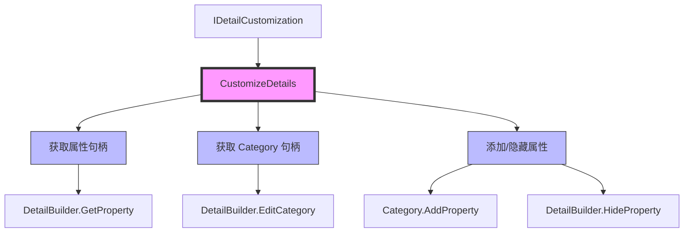

# 自定义Details面板显示

> 学习如何使用 IDetailCustomization 自定义 UClass 在 Details 面板中的显示方式。

## 概述

本课将学习如何**自定义 Details 面板**：

1. **IDetailCustomization 接口** — CustomizeDetails()
2. **IDetailLayoutBuilder** — 管理 Details 面板布局
3. **注册自定义类** — RegisterCustomClassLayout()
4. **实战案例** — 自定义 AMyClass 的 Details 面板

学完本课，你将能够：
- ✅ 理解 IDetailCustomization 的架构
- ✅ 自定义 UClass 在 Details 面板中的显示
- ✅ 注册和注销自定义类
- ✅ 创建实用的 Details 面板编辑器

## 核心概念

### 属性自定义 vs 细节面板自定义

UE 提供了两种自定义 Details 面板的方式：

| 类型 | 接口 | 作用对象 | 使用场景 |
|------|------|---------|---------|
| **属性自定义** | `IPropertyTypeCustomization` | UStruct 的 UPROPERTY | 自定义结构体的显示 |
| **细节面板自定义** | `IDetailCustomization` | UClass 的 UPROPERTY | 自定义整个对象的 Details 面板 |

**本课讲解细节面板自定义**，上一课讲解了属性自定义。

### IDetailCustomization 接口

**核心函数**：

```cpp
// Engine/Source/Editor/PropertyEditor/Public/IDetailCustomization.h
// 约 L50-L100
class IDetailCustomization
{
public:
    // [1] 自定义 Details 面板
    virtual void CustomizeDetails(
        IDetailLayoutBuilder& DetailBuilder) = 0;
    
    // [2] 创建实例的静态函数
    static TSharedRef<IDetailCustomization> MakeInstance();
};
```

**CustomizeDetails() 的工作流程**：



## 源码深度分析

### 引擎层：IDetailLayoutBuilder

**文件路径**：`Engine/Source/Editor/PropertyEditor/Public/IDetailLayoutBuilder.h`

```cpp
// Engine/Source/Editor/PropertyEditor/Public/IDetailLayoutBuilder.h
// 约 L100-L150
class IDetailLayoutBuilder
{
public:
    // [1] 获取属性句柄
    TSharedPtr<IPropertyHandle> GetProperty(FName PropertyName) const;
    
    // [2] 获取或创建 Category
    IDetailCategoryBuilder& EditCategory(FName CategoryName, const FText& CategoryLabel = FText::GetEmpty());
    
    // [3] 隐藏属性
    void HideProperty(TSharedPtr<IPropertyHandle> PropertyHandle);
    
    // [4] 隐藏 Category
    void HideCategory(FName CategoryName);
};
```

### 引擎层：IDetailCategoryBuilder

**文件路径**：`Engine/Source/Editor/PropertyEditor/Public/IDetailCategoryBuilder.h`

```cpp
// Engine/Source/Editor/PropertyEditor/Public/IDetailCategoryBuilder.h
// 约 L50-L100
class IDetailCategoryBuilder
{
public:
    // [1] 添加属性到 Category
    void AddProperty(TSharedPtr<IPropertyHandle> PropertyHandle);
    
    // [2] 添加自定义 Widget 到 Category
    void AddCustomRow(const FText& FilterString, TSharedRef<SWidget> Widget);
    
    // [3] 获取 Category 名称
    FName GetCategoryName() const;
};
```

**设计决策**：
- UE 使用 **Category 分组**：Details 面板按 Category 分组显示属性
- 支持 **自定义 Widget**：可以在 Category 中添加任意 Slate Widget
- 支持 **属性隐藏**：可以隐藏不需要显示的属性

## Lyra 实践

### Lyra 的 Details 面板扩展

Lyra 项目可能有自定义 Details 面板（例如：`ULyraWeaponInstance`）。

**参考实现**：`Engine/Source/Editor/DetailCustomizations/Private/`

```cpp
// 参考：Engine/Source/Editor/DetailCustomizations/Private/SoftClassPathCustomization.cpp
// 约 L20-L80
class FSoftClassPathCustomization : public IPropertyTypeCustomization
{
public:
    static TSharedRef<IPropertyTypeCustomization> MakeInstance();
    
    virtual void CustomizeHeader(
        TSharedRef<IPropertyHandle> PropertyHandle,
        FDetailWidgetRow& HeaderRow,
        IPropertyTypeCustomizationUtils& CustomizationUtils) override;
    
    virtual void CustomizeChildren(
        TSharedRef<IPropertyHandle> PropertyHandle,
        IDetailChildrenBuilder& ChildBuilder,
        IPropertyTypeCustomizationUtils& CustomizationUtils) override;
};
```

**Lyra 为什么这样设计**：

| 设计决策 | 原因 | 好处 |
|-----------|------|------|
| 使用 `MakeShared<>()` | 创建共享指针 | 符合 UE 内存管理规范 |
| 分离 Header 和 Children | 模块化、易于维护 | 可以只自定义 Header，不自定义 Children |
| 使用 `IPropertyHandle` | 统一访问属性 | 不依赖具体类型，通用性强 |

## 实战：自定义 AMyClass 的 Details 面板

### 步骤 1：创建自定义类

**文件路径**：`Source/MyEditorExtension/MyClassCustomization.h`

```cpp
// MyClassCustomization.h
// 约 L10-L50
#pragma once

#include "PropertyEditor/Public/IDetailCustomization.h"

class FMyClassCustomization : public IDetailCustomization
{
public:
    // [1] 创建实例的静态函数
    static TSharedRef<IDetailCustomization> MakeInstance();
    
    // [2] 自定义 Details 面板
    virtual void CustomizeDetails(IDetailLayoutBuilder& DetailBuilder) override;
};
```

**文件路径**：`Source/MyEditorExtension/MyClassCustomization.cpp`

```cpp
// MyClassCustomization.cpp
// 约 L10-L80
#include "MyClassCustomization.h"
#include "PropertyEditorModule.h"
#include "DetailCategoryBuilder.h"
#include "MyClass.h"

TSharedRef<IDetailCustomization> FMyClassCustomization::MakeInstance()
{
    return MakeShared<FMyClassCustomization>();
}

void FMyClassCustomization::CustomizeDetails(IDetailLayoutBuilder& DetailBuilder)
{
    // [1] 获取属性句柄
    TSharedPtr<IPropertyHandle> SumPropertyHandle = DetailBuilder.GetProperty(GET_MEMBER_NAME_CHECKED(AMyClass, Sum));
    TSharedPtr<IPropertyHandle> APropertyHandle = DetailBuilder.GetProperty(GET_MEMBER_NAME_CHECKED(AMyClass, A));
    
    // [2] 获取 Category 句柄，如果没有该 Category 则新建一个
    IDetailCategoryBuilder& NewCat = DetailBuilder.EditCategory(FName("NewCategory"));
    
    // [3] 添加属性到新 Category
    NewCat.AddProperty(SumPropertyHandle);
    
    // [4] 隐藏属性
    DetailBuilder.HideProperty(APropertyHandle);
}
```

### 步骤 2：注册自定义类

**文件路径**：`Source/MyEditorExtension/MyEditorExtensionModule.cpp`

```cpp
// MyEditorExtensionModule.cpp
// 约 L50-L100
#include "PropertyEditorModule.h"
#include "MyClassCustomization.h"

void FMyEditorExtensionModule::StartupModule()
{
    // [1] 加载 PropertyEditor 模块
    FPropertyEditorModule& PropertyModule = FModuleManager::LoadModuleChecked<FPropertyEditorModule>("PropertyEditor");
    
    // [2] 注册自定义 Details 面板的类
    PropertyModule.RegisterCustomClassLayout(
        AMyClass::StaticClass()->GetFName(),
        FOnGetDetailCustomizationInstance::CreateStatic(&FMyClassCustomization::MakeInstance)
    );
    
    PropertyModule.NotifyCustomizationModuleChanged();
}

void FMyEditorExtensionModule::ShutdownModule()
{
    // [1] 注销自定义 Details 面板类
    if (FModuleManager::Get().IsModuleLoaded("PropertyEditor"))
    {
        FPropertyEditorModule& PropertyModule = FModuleManager::GetModuleChecked<FPropertyEditorModule>("PropertyEditor");
        
        PropertyModule.UnregisterCustomClassLayout(AMyClass::StaticClass()->GetFName());
        
        PropertyModule.NotifyCustomizationModuleChanged();
    }
}
```

### 步骤 3：查看效果

1. 重新编译插件
2. 打开 UE 编辑器
3. 创建一个 `BP_MyClass` 蓝图
4. 打开蓝图，查看 Details 面板：
   - 应该能看到新的 **"NewCategory"** Category
   - **Sum** 属性应该在 **"NewCategory"** 中
   - **A** 属性应该被隐藏

## 实战：创建自定义 Widget 到 Details 面板

### 添加自定义 Widget

```cpp
// MyClassCustomization.cpp
// 约 L100-L150
#include "Widgets/SBox.h"
#include "Widgets/STextBlock.h"

void FMyClassCustomization::CustomizeDetails(IDetailLayoutBuilder& DetailBuilder)
{
    // [1] 获取 Category 句柄
    IDetailCategoryBuilder& NewCat = DetailBuilder.EditCategory(FName("NewCategory"));
    
    // [2] 创建自定义 Widget
    TSharedRef<SHorizontalBox> CustomWidget = SNew(SHorizontalBox)
        + SHorizontalBox::Slot()
            .AutoWidth()
            [
                SNew(STextBlock)
                .Text(FText::FromString("Custom Widget: "))
            ]
        + SHorizontalBox::Slot()
            .FillWidth(1.0f)
            [
                SNew(STextBlock)
                .Text(FText::FromString("Hello, World!"))
            ];
    
    // [3] 添加自定义 Widget 到 Category
    NewCat.AddCustomRow(FText::FromString("CustomWidget"), CustomWidget);
}
```

## 常见问题与陷阱

### 陷阱 1：忘记调用 NotifyCustomizationModuleChanged()

**错误代码**：

```cpp
// ❌ 错误：注册后没有通知系统
PropertyModule.RegisterCustomClassLayout(...);
// 忘记调用 NotifyCustomizationModuleChanged()
```

**正确代码**：

```cpp
// ✅ 正确：注册后通知系统
PropertyModule.RegisterCustomClassLayout(...);
PropertyModule.NotifyCustomizationModuleChanged();
```

### 陷阱 2：成员变量名称错误

**错误代码**：

```cpp
// ❌ 错误：成员变量名称错误
TSharedPtr<IPropertyHandle> WrongHandle = DetailBuilder.GetProperty(GET_MEMBER_NAME_CHECKED(AMyClass, WrongName));
```

**正确代码**：

```cpp
// ✅ 正确：使用 GET_MEMBER_NAME_CHECKED 宏，编译时检查
TSharedPtr<IPropertyHandle> SumHandle = DetailBuilder.GetProperty(GET_MEMBER_NAME_CHECKED(AMyClass, Sum));
```

## 总结与要点

| # | 要点 | 说明 |
|---|------|------|
| 1 | **IDetailCustomization** | 自定义 UClass 的 Details 面板，CustomizeDetails() |
| 2 | **注册自定义类** | 使用 RegisterCustomClassLayout()，记住调用 NotifyCustomizationModuleChanged() |
| 3 | **注销自定义类** | 在 ShutdownModule() 中注销，防止崩溃 |
| 4 | **Lyra 实践** | 参考 Engine/Source/Editor/DetailCustomizations/ 下的实现 |
| 5 | **常见陷阱** | 忘记 NotifyCustomizationModuleChanged()、成员变量名称错误 |

## 相关页面

- [[30-tutorials/editor-extension/05-自定义属性显示]] - 自定义属性显示（上一课）
- [[30-tutorials/editor-extension/07-自定义蓝图参数节点-Pin显示]] - 自定义蓝图参数节点(Pin)显示（下一课）
- [[30-tutorials/ue-reflection/02-核心宏详解]] - 核心宏详解（UPROPERTY 等）

---

> 最后更新：2026-05-19

<!-- nav:auto -->

---

**导航**: ← [[30-tutorials/editor-extension/05-自定义属性显示|05-自定义属性显示]] · [[30-tutorials/editor-extension/07-自定义蓝图参数节点-Pin显示|07-自定义蓝图参数节点-Pin显示]] →

<!-- /nav:auto -->
