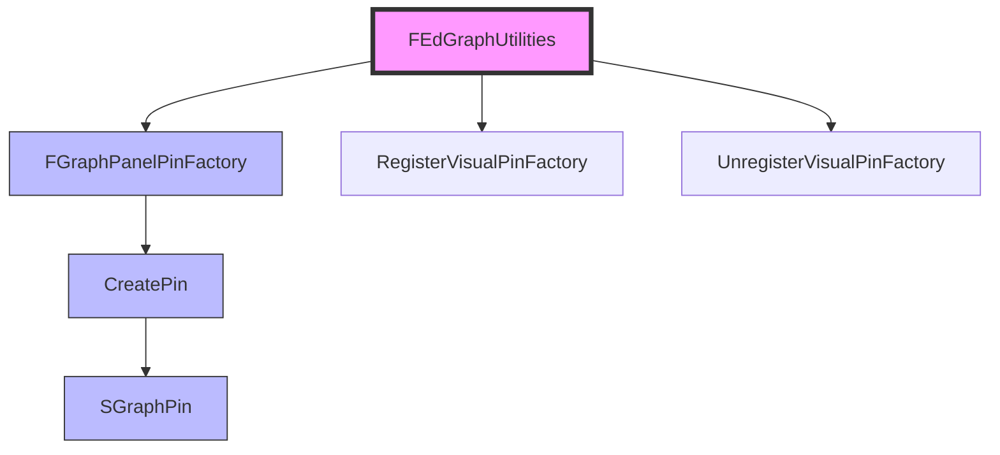

# 自定义蓝图参数节点-Pin显示

> 学习如何使用 FGraphPanelPinFactory 自定义蓝图节点的 Pin 显示方式。

## 概述

本课将学习如何**自定义蓝图节点的 Pin 显示**：

1. **FGraphPanelPinFactory 机制** — Pin Factory 的注册和管理
2. **SGraphPin** — 自定义 Pin Widget
3. **注册 Pin Factory** — FEdGraphUtilities::RegisterVisualPinFactory()
4. **实战案例** — GameplayAbilities 插件的 Pin 自定义

学完本课，你将能够：
- ✅ 理解 FGraphPanelPinFactory 的架构
- ✅ 创建自定义 SGraphPin
- ✅ 注册和注销 Pin Factory
- ✅ 参考 Lyra/GameplayAbilities 的实战案例

## 核心概念

### 蓝图节点 Pin 显示机制

UE 使用 **FGraphPanelPinFactory** 系统管理蓝图节点的 Pin 显示：



**核心概念**：

| 类/函数 | 说明 | 类比 |
|-----------|------|---------|
| `FGraphPanelPinFactory` | Pin Factory 基类 | Pin 工厂 |
| `SGraphPin` | Pin Widget（Slate） | Pin 控件 |
| `FEdGraphUtilities::RegisterVisualPinFactory()` | 注册 Pin Factory | 注册工厂 |
| `FEdGraphUtilities::UnregisterVisualPinFactory()` | 注销 Pin Factory | 注销工厂 |

### Pin 类型

蓝图节点的 Pin 有多种类型：

| Pin 类型 | 说明 | 使用场景 |
|---------|------|---------|
| `PC_Boolean` | 布尔类型 | 条件判断 |
| `PC_Byte` | 字节类型 | 枚举 |
| `PC_Class` | 类类型 | 类引用 |
| `PC_Struct` | 结构体类型 | 复杂数据 |
| `PC_Object` | 对象类型 | 对象引用 |

## 源码深度分析

### 引擎层：FGraphPanelPinFactory

**文件路径**：`Engine/Source/Editor/GraphEditor/Public/FGraphPanelPinFactory.h`

```cpp
// Engine/Source/Editor/GraphEditor/Public/FGraphPanelPinFactory.h
// 约 L20-L50
class FGraphPanelPinFactory
{
public:
    // [1] 创建 Pin Widget
    virtual TSharedPtr<SGraphPin> CreatePin(class UEdGraphPin* InPin) const = 0;
    
    // [2] 获取 Factory 名称
    virtual FText GetFactoryName() const { return FText::FromString("Unknown"); }
    
    // [3] 优先级（数字越大，优先级越高）
    virtual int32 GetPriority() const { return 0; }
};
```

### 引擎层：FEdGraphUtilities

**文件路径**：`Engine/Source/Editor/GraphEditor/Public/FEdGraphUtilities.h`

```cpp
// Engine/Source/Editor/GraphEditor/Public/FEdGraphUtilities.h
// 约 L150-L200
class FEdGraphUtilities
{
public:
    // [1] 注册 Pin Factory
    static void RegisterVisualPinFactory(TSharedRef<FGraphPanelPinFactory> Factory);
    
    // [2] 注销 Pin Factory
    static void UnregisterVisualPinFactory(TSharedRef<FGraphPanelPinFactory> Factory);
    
    // [3] 创建 Pin Widget（遍历所有 Factory）
    static TSharedPtr<SGraphPin> CreatePinWidget(UEdGraphPin* InPin);
};
```

**设计决策**：
- UE 使用 **工厂模式**：每个 Pin Factory 可以处理特定类型的 Pin
- 支持 **优先级**：多个 Factory 可以处理同一类型，`GetPriority()` 决定谁先处理
- **遍历所有 Factory**：`CreatePinWidget()` 按优先级遍历所有 Factory，第一个返回非 `null` 的 Factory 胜出

## Lyra 实践

### GameplayAbilities 插件的 Pin 自定义

**文件路径**：`Plugins/Runtime/GameplayAbilities/Source/GameplayAbilitiesEditor/Private/GameplayAbilitiesGraphPanelPinFactory.h`

```cpp
// Plugins/Runtime/GameplayAbilities/Source/GameplayAbilitiesEditor/Private/GameplayAbilitiesGraphPanelPinFactory.h
// 约 L10-L50
class FGameplayAbilitiesGraphPanelPinFactory : public FGraphPanelPinFactory
{
public:
    // [1] 创建 Pin Widget
    virtual TSharedPtr<class SGraphPin> CreatePin(class UEdGraphPin* InPin) const override
    {
        // [2] 只处理 GameplayAttribute 类型的 Pin
        if (InPin->PinType.PinCategory == UEdGraphSchema_K2::PC_Struct && 
            InPin->PinType.PinSubCategoryObject == FGameplayAttribute::StaticStruct())
        {
            // [3] 返回自定义 SGraphPin
            return SNew(SGameplayAttributeGraphPin, InPin);
        }
        
        // [4] 返回 null，让其他 Factory 处理
        return nullptr;
    }
};
```

### 注册 Pin Factory

**文件路径**：`Plugins/Runtime/GameplayAbilities/Source/GameplayAbilitiesEditor/Private/GameplayAbilitiesEditorModule.cpp`

```cpp
// Plugins/Runtime/GameplayAbilities/Source/GameplayAbilitiesEditor/Private/GameplayAbilitiesEditorModule.cpp
// 约 L50-L100
void FGameplayAbilitiesEditorModule::StartupModule()
{
    // [1] 创建 Pin Factory
    GameplayAbilitiesGraphPanelPinFactory = MakeShareable(new FGameplayAbilitiesGraphPanelPinFactory());
    
    // [2] 注册 Pin Factory
    FEdGraphUtilities::RegisterVisualPinFactory(GameplayAbilitiesGraphPanelPinFactory);
}

void FGameplayAbilitiesEditorModule::ShutdownModule()
{
    // [1] 注销 Pin Factory
    if (GameplayAbilitiesGraphPanelPinFactory.IsValid())
    {
        FEdGraphUtilities::UnregisterVisualPinFactory(GameplayAbilitiesGraphPanelPinFactory);
        GameplayAbilitiesGraphPanelPinFactory.Reset();
    }
}
```

### Lyra 为什么这样设计

| 设计决策 | 原因 | 好处 |
|-----------|------|------|
| 独立 Pin Factory | GameplayAttribute 是 GAS 特有的类型 | 模块化、易于维护 |
| 使用 `MakeShareable<>()` | 创建共享指针 | 符合 UE 内存管理规范 |
| 在 `CreatePin()` 中做类型判断 | 只处理特定类型 | 不影响其他 Pin 类型 |

## 实战：创建自定义 Pin 显示

### 步骤 1：创建自定义 SGraphPin

**文件路径**：`Source/MyEditorExtension/MyCustomGraphPin.h`

```cpp
// MyCustomGraphPin.h
// 约 L10-L50
#pragma once

#include "Widgets/SGraphPin.h"

class SMyCustomGraphPin : public SGraphPin
{
public:
    SLATE_BEGIN_ARGS(SMyCustomGraphPin) {}
    SLATE_END_ARGS()

    void Construct(const FArguments& InArgs, UEdGraphPin* InPin);

protected:
    // [1] 自定义默认值 Widget
    virtual TSharedRef<SWidget> GetDefaultValueWidget() override;
};
```

**文件路径**：`Source/MyEditorExtension/MyCustomGraphPin.cpp`

```cpp
// MyCustomGraphPin.cpp
// 约 L10-L80
#include "MyCustomGraphPin.h"
#include "Widgets/SBox.h"
#include "Widgets/STextBlock.h"

void SMyCustomGraphPin::Construct(const FArguments& InArgs, UEdGraphPin* InPin)
{
    SGraphPin::Construct(SGraphPin::FArguments(), InPin);
}

TSharedRef<SWidget> SMyCustomGraphPin::GetDefaultValueWidget()
{
    // [1] 创建自定义 Widget
    return SNew(SVerticalBox)
        + SVerticalBox::Slot()
            .AutoHeight()
            [
                SNew(STextBlock)
                .Text(FText::FromString("Custom Pin Widget!"))
            ];
}
```

### 步骤 2：创建 Pin Factory

**文件路径**：`Source/MyEditorExtension/MyGraphPanelPinFactory.h`

```cpp
// MyGraphPanelPinFactory.h
// 约 L10-L50
#pragma once

#include "GraphEditor/FGraphPanelPinFactory.h"

class FMyGraphPanelPinFactory : public FGraphPanelPinFactory
{
public:
    virtual TSharedPtr<SGraphPin> CreatePin(UEdGraphPin* InPin) const override;
};
```

**文件路径**：`Source/MyEditorExtension/MyGraphPanelPinFactory.cpp`

```cpp
// MyGraphPanelPinFactory.cpp
// 约 L10-L80
#include "MyGraphPanelPinFactory.h"
#include "MyCustomGraphPin.h"
#include "K2Node.h"

TSharedPtr<SGraphPin> FMyGraphPanelPinFactory::CreatePin(UEdGraphPin* InPin) const
{
    // [1] 只处理 MyCustomStruct 类型的 Pin
    if (InPin->PinType.PinCategory == UEdGraphSchema_K2::PC_Struct && 
        InPin->PinType.PinSubCategoryObject == FMyCustomStruct::StaticStruct())
    {
        // [2] 返回自定义 SGraphPin
        return SNew(SMyCustomGraphPin, InPin);
    }
    
    // [3] 返回 null，让其他 Factory 处理
    return nullptr;
}
```

### 步骤 3：注册 Pin Factory

**文件路径**：`Source/MyEditorExtension/MyEditorExtensionModule.h`

```cpp
// MyEditorExtensionModule.h
// 约 L10-L50
#pragma once

#include "CoreMinimal.h"
#include "Modules/IModuleInterface.h"

class FMyEditorExtensionModule : public IModuleInterface
{
public:
    virtual void StartupModule() override;
    virtual void ShutdownModule() override;

private:
    TSharedPtr<FMyGraphPanelPinFactory> MyGraphPanelPinFactory;
};

IMPLEMENT_MODULE(FMyEditorExtensionModule, MyEditorExtension)
```

**文件路径**：`Source/MyEditorExtension/MyEditorExtensionModule.cpp`

```cpp
// MyEditorExtensionModule.cpp
// 约 L10-L80
#include "MyEditorExtensionModule.h"
#include "MyGraphPanelPinFactory.h"
#include "GraphEditor/FEdGraphUtilities.h"

void FMyEditorExtensionModule::StartupModule()
{
    // [1] 创建 Pin Factory
    MyGraphPanelPinFactory = MakeShareable(new FMyGraphPanelPinFactory());
    
    // [2] 注册 Pin Factory
    FEdGraphUtilities::RegisterVisualPinFactory(MyGraphPanelPinFactory);
}

void FMyEditorExtensionModule::ShutdownModule()
{
    // [1] 注销 Pin Factory
    if (MyGraphPanelPinFactory.IsValid())
    {
        FEdGraphUtilities::UnregisterVisualPinFactory(MyGraphPanelPinFactory);
        MyGraphPanelPinFactory.Reset();
    }
}
```

## 常见问题与陷阱

### 陷阱 1：Pin Factory 不生效

**原因 1**：Pin 类型判断错误。

**错误代码**：

```cpp
// ❌ 错误：Pin 类型判断错误
if (InPin->PinType.PinCategory == UEdGraphSchema_K2::PC_Boolean)  // 错误类型
{
    return SNew(SMyCustomGraphPin, InPin);
}
```

**正确代码**：

```cpp
// ✅ 正确：使用正确的 Pin 类型
if (InPin->PinType.PinCategory == UEdGraphSchema_K2::PC_Struct && 
    InPin->PinType.PinSubCategoryObject == FMyCustomStruct::StaticStruct())
{
    return SNew(SMyCustomGraphPin, InPin);
}
```

**原因 2**：忘记注册 Pin Factory。

**正确代码**：

```cpp
// ✅ 正确：在 StartupModule() 中注册
void FMyEditorExtensionModule::StartupModule()
{
    MyGraphPanelPinFactory = MakeShareable(new FMyGraphPanelPinFactory());
    FEdGraphUtilities::RegisterVisualPinFactory(MyGraphPanelPinFactory);
}
```

### 陷阱 2：内存泄漏

**错误代码**：

```cpp
// ❌ 错误：忘记注销 Pin Factory
void FMyEditorExtensionModule::ShutdownModule()
{
    // 没有注销！
}
```

**正确代码**：

```cpp
// ✅ 正确：在 ShutdownModule() 中注销
void FMyEditorExtensionModule::ShutdownModule()
{
    if (MyGraphPanelPinFactory.IsValid())
    {
        FEdGraphUtilities::UnregisterVisualPinFactory(MyGraphPanelPinFactory);
        MyGraphPanelPinFactory.Reset();
    }
}
```

## 总结与要点

| # | 要点 | 说明 |
|---|------|------|
| 1 | **FGraphPanelPinFactory** | Pin Factory 基类，CreatePin() 创建自定义 SGraphPin |
| 2 | **SGraphPin** | Pin Widget（Slate），可以重写 GetDefaultValueWidget() |
| 3 | **注册 Pin Factory** | 使用 FEdGraphUtilities::RegisterVisualPinFactory() |
| 4 | **Lyra 实践** | GameplayAbilities 插件的 Pin 自定义，独立 Pin Factory |
| 5 | **常见陷阱** | Pin 类型判断错误、忘记注册/注销 |

## 相关页面

- [[30-tutorials/editor-extension/06-自定义Details面板显示]] - 自定义 Details 面板显示（上一课）
- [[30-tutorials/editor-extension/08-高级主题与最佳实践]] - 高级主题与最佳实践（下一课）
- [[30-tutorials/blueprint-system/02-蓝图VM与字节码]] - 蓝图 VM 与字节码（蓝图概念）

---

> 最后更新：2026-05-19

<!-- nav:auto -->

---

**导航**: ← [[30-tutorials/editor-extension/06-自定义Details面板显示|06-自定义Details面板显示]] · [[30-tutorials/editor-extension/08-高级主题与最佳实践|08-高级主题与最佳实践]] →

<!-- /nav:auto -->
