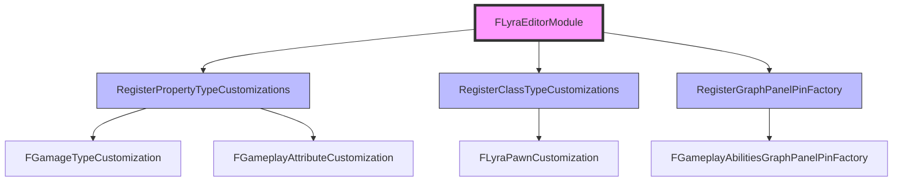

# 高级主题与最佳实践

> 学习 UE 编辑器扩展的性能优化、常见陷阱、Lyra 实战案例和调试技巧。

## 概述

本课将学习**编辑器扩展的高级主题**：

1. **性能优化** — 避免每次打开 Details 面板都重建 Widget
2. **常见陷阱** — 注册/注销不匹配导致崩溃
3. **Lyra 实战案例** — GameplayAbilitiesEditor 模块的扩展
4. **调试技巧** — 使用 Widget Reflector 和 Output Log

学完本课，你将能够：
- ✅ 优化编辑器扩展的性能
- ✅ 避免常见的崩溃陷阱
- ✅ 理解 Lyra 的编辑器扩展实践
- ✅ 使用调试工具排查问题

## 性能优化

```mermaid
graph TB
    A[Details 面板打开] --> B{CustomizeDetails&#40;&#41 调用}
    B -->|无缓存| C[创建新 Widget]
    C --> D[性能差：每次重建]
    B -->|有缓存| E[复用缓存 Widget]
    E --> F[性能好：只创建一次]
    style D fill:#fbb,stroke:#333
    style F fill:#bfb,stroke:#333
```



### 问题 1：每次打开 Details 面板都重建 Widget

**错误代码**：

```cpp
// ❌ 错误：每次 CustomizeDetails() 都创建新 Widget
void FMyClassCustomization::CustomizeDetails(IDetailLayoutBuilder& DetailBuilder)
{
    IDetailCategoryBuilder& Cat = DetailBuilder.EditCategory("MyCategory");
    
    // 每次打开 Details 面板都创建新 Widget！
    TSharedRef<SWidget> MyWidget = SNew(SButton)
        .Text(FText::FromString("Click Me!"));
    
    Cat.AddCustomRow(FText::FromString("MyButton"), MyWidget);
}
```

**原因**：`CustomizeDetails()` 每次打开 Details 面板都会被调用，如果每次都创建新 Widget，会导致性能问题。

**正确代码**：

```cpp
// ✅ 正确：缓存 Widget，只创建一次
TSharedPtr<SWidget> CachedWidget;

void FMyClassCustomization::CustomizeDetails(IDetailLayoutBuilder& DetailBuilder)
{
    IDetailCategoryBuilder& Cat = DetailBuilder.EditCategory("MyCategory");
    
    // 只在第一次时创建 Widget
    if (!CachedWidget.IsValid())
    {
        CachedWidget = SNew(SButton)
            .Text(FText::FromString("Click Me!"))
            .OnClicked(this, &FMyClassCustomization::OnButtonClicked);
    }
    
    Cat.AddCustomRow(FText::FromString("MyButton"), CachedWidget.ToSharedRef());
}

FReply FMyClassCustomization::OnButtonClicked()
{
    UE_LOG(LogTemp, Log, TEXT("Button clicked!"));
    return FReply::Handled();
}
```

### 问题 2：属性变化时没有更新 Widget

**错误代码**：

```cpp
// ❌ 错误：Widget 没有绑定属性变化事件
void FMyStructCustomization::CustomizeHeader(
    TSharedRef<IPropertyHandle> PropertyHandle,
    FDetailWidgetRow& HeaderRow,
    IPropertyTypeCustomizationUtils& CustomizationUtils)
{
    HeaderRow
        .NameContent()
        [
            SNew(STextBlock)
            .Text(FText::FromString(MyPropertyHandle->GetValueAsText()))  // 只读取一次！
        ];
}
```

**正确代码**：

```cpp
// ✅ 正确：使用 TAttribute 绑定属性变化事件
void FMyStructCustomization::CustomizeHeader(
    TSharedRef<IPropertyHandle> PropertyHandle,
    FDetailWidgetRow& HeaderRow,
    IPropertyTypeCustomizationUtils& CustomizationUtils)
{
    HeaderRow
        .NameContent()
        [
            SNew(STextBlock)
            .Text(TAttribute<FText>::Create(TAttribute<FText>::FGetter::CreateLambda([PropertyHandle]()
            {
                // 每次绘制时重新获取属性值
                return PropertyHandle->GetValueAsText();
            })))
        ];
}
```

## 常见陷阱

### 注册陷阱

**陷阱 1：注册/注销不匹配导致崩溃**

**错误代码**：

```cpp
// ❌ 错误：注册了 CustomPropertyTypeLayout，但注销时用了错误的名称
void FMyEditorExtensionModule::StartupModule()
{
    FPropertyEditorModule& PropertyModule = FModuleManager::LoadModuleChecked<FPropertyEditorModule>("PropertyEditor");
    
    // 注册 FMyStruct
    PropertyModule.RegisterCustomPropertyTypeLayout(
        FMyStruct::StaticStruct()->GetFName(),
        FOnGetPropertyTypeCustomizationInstance::CreateStatic(&FMyStructCustomization::MakeInstance)
    );
}

void FMyEditorExtensionModule::ShutdownModule()
{
    if (FModuleManager::Get().IsModuleLoaded("PropertyEditor"))
    {
        FPropertyEditorModule& PropertyModule = FModuleManager::GetModuleChecked<FPropertyEditorModule>("PropertyEditor");
        
        // ❌ 错误：注销时用了错误的名称 "MyStruct"
        PropertyModule.UnregisterCustomPropertyTypeLayout("MyStruct");  // 应该是 "FMyStruct"！
        
        PropertyModule.NotifyCustomizationModuleChanged();
    }
}
```

**正确代码**：

```cpp
// ✅ 正确：注册和注销使用相同的名称
void FMyEditorExtensionModule::StartupModule()
{
    FPropertyEditorModule& PropertyModule = FModuleManager::LoadModuleChecked<FPropertyEditorModule>("PropertyEditor");
    
    // 注册 FMyStruct
    PropertyModule.RegisterCustomPropertyTypeLayout(
        FMyStruct::StaticStruct()->GetFName(),  // 获取名称："FMyStruct"
        FOnGetPropertyTypeCustomizationInstance::CreateStatic(&FMyStructCustomization::MakeInstance)
    );
}

void FMyEditorExtensionModule::ShutdownModule()
{
    if (FModuleManager::Get().IsModuleLoaded("PropertyEditor"))
    {
        FPropertyEditorModule& PropertyModule = FModuleManager::GetModuleChecked<FPropertyEditorModule>("PropertyEditor");
        
        // ✅ 正确：注销时使用相同的名称
        PropertyModule.UnregisterCustomPropertyTypeLayout(FMyStruct::StaticStruct()->GetFName());
        
        PropertyModule.NotifyCustomizationModuleChanged();
    }
}
```

### 陷阱 2：在 ShutdownModule() 中访问已销毁的对象

**错误代码**：

```cpp
// ❌ 错误：在 ShutdownModule() 中访问已销毁的 Slate 窗口
void FMyEditorExtensionModule::ShutdownModule()
{
    // ❌ 错误：MyWindow 可能已经被销毁了
    MyWindow->RequestDestroyWindow();
    
    UE_LOG(LogTemp, Log, TEXT("MyEditorExtension: Module unloaded successfully!"));
}
```

**正确代码**：

```cpp
// ✅ 正确：检查 Slate 窗口是否还有效
void FMyEditorExtensionModule::ShutdownModule()
{
    // ✅ 正确：检查 MyWindow 是否还有效
    if (MyWindow.IsValid())
    {
        MyWindow->RequestDestroyWindow();
        MyWindow.Reset();
    }
    
    UE_LOG(LogTemp, Log, TEXT("MyEditorExtension: Module unloaded successfully!"));
}
```

### 性能陷阱

编辑器扩展中常见的性能陷阱：

**陷阱 3：每次打开 Details 面板都重建 Widget**

（引用 08 篇"性能优化"章节中已有的问题 1 内容，这里做交叉引用）

**陷阱 4：属性变化时没有更新 Widget**

（引用 08 篇"性能优化"章节中已有的问题 2 内容，这里做交叉引用）

**设计建议**：

| 陷阱 | 原因 | 正确做法 |
|------|------|---------|
| 每次重建 Widget | `CustomizeDetails()` 每次调用都 new | 缓存 Widget，使用 `TSharedPtr` |
| 属性变化不更新 | 没有绑定属性变化事件 | 使用 `TAttribute<>::Create()` 绑定 |
| 注册/注销不匹配 | 名称字符串写死，容易拼错 | 使用 `FMyStruct::StaticStruct()->GetFName()` |
| 访问已销毁对象 | `ShutdownModule()` 中直接访问 | 使用 `TSharedPtr::IsValid()` 检查 |

## Lyra 实战案例

### Lyra 的编辑器扩展

Lyra 项目在 `Source/LyraEditor/` 中有多个编辑器扩展实现。

**文件路径**：`Source/LyraEditor/LyraEditorModule.cpp`

```cpp
// Source/LyraEditor/LyraEditorModule.cpp
// 约 L50-L150
void FLyraEditorModule::StartupModule()
{
    // [1] 注册自定义 Property Type Customization
    RegisterPropertyTypeCustomizations();
    
    // [2] 注册自定义 Class Type Customization
    RegisterClassTypeCustomizations();
    
    // [3] 注册自定义 Graph Panel Pin Factory
    RegisterGraphPanelPinFactory();
}

void FLyraEditorModule::RegisterPropertyTypeCustomizations()
{
    FPropertyEditorModule& PropertyModule = FModuleManager::LoadModuleChecked<FPropertyEditorModule>("PropertyEditor");
    
    // 注册自定义 FGameplayAttribute 显示
    PropertyModule.RegisterCustomPropertyTypeLayout(
        FGameplayAttribute::StaticStruct()->GetFName(),
        FOnGetPropertyTypeCustomizationInstance::CreateStatic(&FGameplayAttributeCustomization::MakeInstance)
    );
    
    PropertyModule.NotifyCustomizationModuleChanged();
}

void FLyraEditorModule::RegisterGraphPanelPinFactory()
{
    // 创建自定义 Pin Factory
    GameplayAbilitiesGraphPanelPinFactory = MakeShareable(new FGameplayAbilitiesGraphPanelPinFactory());
    
    // 注册 Pin Factory
    FEdGraphUtilities::RegisterVisualPinFactory(GameplayAbilitiesGraphPanelPinFactory);
}
```

**Lyra 为什么这样设计**：

| 设计决策 | 原因 | 好处 |
|-----------|------|------|
| 独立注册函数 | 将同类注册放在一个函数 | 易于维护、易于查找 |
| 使用 `TSharedRef` 管理 Slate 对象 | Slate 使用共享指针管理生命周期 | 防止悬空指针、自动释放 |
| 统一在 StartupModule() 中注册 | 集中管理所有扩展 | 易于理解、易于维护 |

## Lyra 编辑器扩展全景解读

Lyra 项目的编辑器扩展集中在 `Source/LyraEditor/LyraEditorModule.cpp`，整体架构如下：



**设计亮点**：

| 设计决策 | 原因 | 好处 |
|-----------|------|------|
| 按类型分组注册 | 同类注册放一个函数 | 易于维护、易于查找 |
| 使用 `TSharedRef` 管理 Slate 对象 | Slate 使用共享指针管理生命周期 | 防止悬空指针、自动释放 |
| 统一在 `StartupModule()` 中注册 | 集中管理所有扩展 | 易于理解、易于维护 |
| 延迟构造子菜单 | 菜单项在点击时才构造 | 提高编辑器启动速度 |

**与系列其他篇的关系**：

- [[30-tutorials/editor-extension/02-菜单项定制]] — Lyra 主菜单扩展
- [[30-tutorials/editor-extension/05-自定义属性显示]] — Lyra 属性自定义
- [[30-tutorials/editor-extension/07-自定义蓝图参数节点-Pin显示]] — Lyra 蓝图 Pin 自定义

## 调试技巧

### 技巧 1：使用 Widget Reflector

**Widget Reflector** 是 UE 编辑器内置的 UI 调试工具，可以查看当前界面的 Slate 控件树。

**使用方法**：

1. 打开 UE 编辑器
2. **Window** → **Developer Tools** → **Widget Reflector**
3. 在 Widget Reflector 中，点击 **"Pick Live Widget"** 按钮
4. 移动到编辑器界面中的某个控件上，点击
5. Widget Reflector 会显示该控件的详细信息（类型、属性、子控件树）

**使用场景**：

- 查看某个 Details 面板是由哪个 Customization 类创建的
- 查看某个菜单项是由哪个模块注册的
- 查看 Slate 控件的属性和布局

### 技巧 2：使用 Output Log

**Output Log** 是 UE 编辑器内置的日志工具，可以查看 `UE_LOG` 输出的日志。

**使用方法**：

1. 打开 UE 编辑器
2. **Window** → **Developer Tools** → **Output Log**
3. 在 Output Log 中，可以查看 `UE_LOG(LogTemp, Log, TEXT("..."))` 输出的日志

**使用场景**：

- 调试 `StartupModule()` 和 `ShutdownModule()` 是否被调用
- 调试菜单项、工具栏按钮的点击事件是否被触发
- 调试 Pin Factory 的 `CreatePin()` 是否被调用

### 技巧 3：使用 Visual Studio 调试器

**Visual Studio 调试器** 是最强大的调试工具，可以设置断点、查看变量、单步执行。

**使用方法**：

1. 打开 Visual Studio
2. **Debug** → **Attach to Process**
3. 选择 `UnrealEditor.exe`
4. 在代码中设置断点
5. 操作编辑器，触发断点

**使用场景**：

- 调试 `CustomizeDetails()` 是否被调用
- 调试 `CreatePin()` 的 Pin 类型判断是否正确
- 调试 Slate 控件的事件处理

## 常见问题与解答

### 问题 1：自定义属性不生效

**原因 1**：`RegisterCustomPropertyTypeLayout()` 的名称错误。

**错误代码**：

```cpp
// ❌ 错误：使用了错误的名称 "MyStruct"
PropertyModule.RegisterCustomPropertyTypeLayout(
    FName("MyStruct"),  // 应该是 FMyStruct::StaticStruct()->GetFName()
    FOnGetPropertyTypeCustomizationInstance::CreateStatic(&FMyStructCustomization::MakeInstance)
);
```

**正确代码**：

```cpp
// ✅ 正确：使用 FMyStruct::StaticStruct()->GetFName()
PropertyModule.RegisterCustomPropertyTypeLayout(
    FMyStruct::StaticStruct()->GetFName(),  // 获取正确名称："FMyStruct"
    FOnGetPropertyTypeCustomizationInstance::CreateStatic(&FMyStructCustomization::MakeInstance)
);
```

**原因 2**：忘记调用 `NotifyCustomizationModuleChanged()`。

**正确代码**：

```cpp
// ✅ 正确：注册后通知系统
PropertyModule.RegisterCustomPropertyTypeLayout(...);
PropertyModule.NotifyCustomizationModuleChanged();  // 必须调用！
```

### 问题 2：自定义 Details 面板不生效

**原因**：`RegisterCustomClassLayout()` 的名称错误。

**正确代码**：

```cpp
// ✅ 正确：使用 AMyClass::StaticClass()->GetFName()
PropertyModule.RegisterCustomClassLayout(
    AMyClass::StaticClass()->GetFName(),  // 获取正确名称："MyClass"
    FOnGetDetailCustomizationInstance::CreateStatic(&FMyClassCustomization::MakeInstance)
);
PropertyModule.NotifyCustomizationModuleChanged();  // 必须调用！
```

## 总结与要点

| # | 要点 | 说明 |
|---|------|------|
| 1 | **性能优化** | 缓存 Widget，使用 TAttribute 绑定属性变化 |
| 2 | **常见陷阱** | 注册/注销不匹配、访问已销毁的对象 |
| 3 | **Lyra 实践** | 独立注册函数、使用 `TSharedRef`、集中管理 |
| 4 | **调试技巧** | Widget Reflector、Output Log、Visual Studio 调试器 |
| 5 | **常见问题** | 自定义属性/Details 面板不生效的原因和解决方法 |

## 相关页面

- [[30-tutorials/editor-extension/07-自定义蓝图参数节点-Pin显示]] - 自定义蓝图参数节点(Pin)显示（上一课）
- [[30-tutorials/editor-extension/00-UE编辑器扩展系列概览]] - UE 编辑器扩展概览（返回概览）
- [[30-tutorials/umg/03-UMG与Slate绑定机制深度分析]] - UMG 与 Slate 绑定机制（Slate 概念）

---

> 最后更新：2026-05-19

<!-- nav:auto -->

---

**导航**: ← [[30-tutorials/editor-extension/07-自定义蓝图参数节点-Pin显示|07-自定义蓝图参数节点-Pin显示]]

<!-- /nav:auto -->
