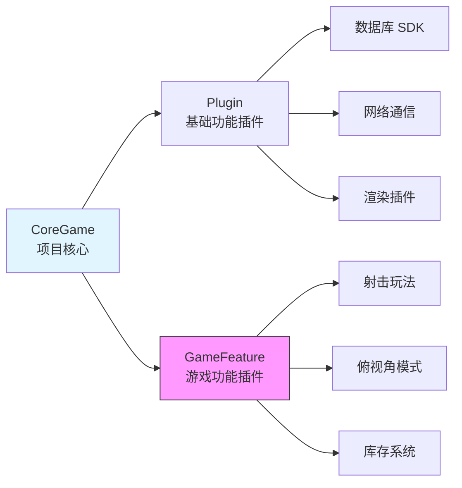
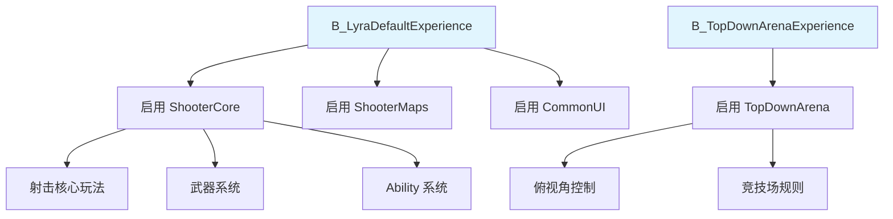
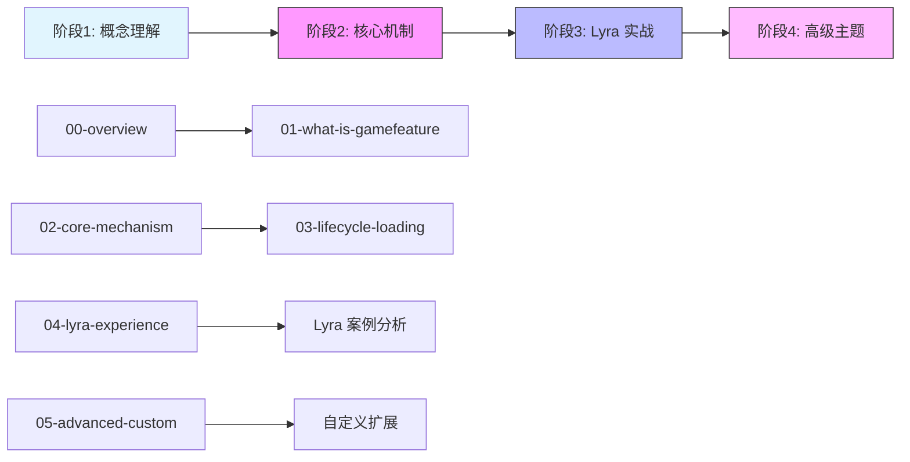

# GameFeature系统从入门到实战

> UE5 新一代模块化游戏架构，通过插件机制实现游戏功能的动态加载与卸载。

## 概述

**GameFeature** 是 UE5 引入的全新游戏架构模式，旨在解决传统游戏开发中功能耦合严重、难以复用、难以动态更新等问题。

**核心价值**：
- **模块化**：将游戏功能分解为独立的插件单元
- **动态性**：支持运行时动态加载/卸载功能
- **可复用**：功能模块可在多个项目间共享
- **团队协作**：不同团队成员可独立开发不同功能模块

**本系列目标**：
通过 5 个课时的系统学习，从概念理解到 Lyra 项目实战，全面掌握 GameFeature 架构。

---

## 核心概念

### GameFeature 是什么？

GameFeature 是一种**特殊的插件**，专门用于封装游戏功能：

**类比理解**：
- **Plugin** = 主板上的内存/显卡（基础功能，编译时确定）
- **GameFeature** = USB 设备（可热插拔，运行时动态加载）
- **CoreGame** = 主机（提供基础运行环境）

### 为什么需要 GameFeature？

**传统架构的痛点**（《堡垒之夜》案例）：
- Pawn 类代码膨胀到几千行
- 活动功能代码与核心代码深度耦合
- 难以动态开关某个功能（如节日活动）
- 新成员上手困难，需要了解整个项目

**GameFeature 的解决方案**：
- 功能模块化，每个模块独立开发测试
- 运行时动态加载/卸载，适合 LiveOps 游戏
- 降低团队协冲突，提高开发效率

---

## 与 Lyra 项目的关系

Lyra 项目大量使用了 GameFeature 架构：

**Lyra 中的 GameFeature 插件**：
- `ShooterCore` - 射击游戏核心玩法
- `TopDownArena` - 俯视角竞技场模式
- `ShooterExplorer` - 射击+探索混合模式
- `ShooterMaps` - 射击游戏地图资源
- `ShooterTests` - 自动化测试套件

---

## 系列学习路径

本系列分为 4 个阶段，由浅入深：

### 阶段 1：概念理解（2 课时）

| 课时 | 标题 | 内容 | 难度 |
|------|------|------|------|
| 00 | [系列概览] | 系列介绍、学习路径 | 入门 |
| 01 | [GameFeature 是什么] | 架构演进、核心概念、与 Plugin 的区别 | 入门 |

### 阶段 2：核心机制（2 课时）

| 课时 | 标题 | 内容 | 难度 |
|------|------|------|------|
| 02 | [核心机制详解] | GameFeaturePlugin、GameFeatureData、GameFeatureAction | 中级 |
| 03 | [生命周期与加载流程] | 状态机、加载时序、API 使用 | 中级 |

### 阶段 3：Lyra 实战（1 课时）

| 课时 | 标题 | 内容 | 难度 |
|------|------|------|------|
| 04 | [Lyra 中的 Experience System 实践] | Experience Definition、插件管理、实际案例分析 | 中高级 |

### 阶段 4：高级主题（1 课时）

| 课时 | 标题 | 内容 | 难度 |
|------|------|------|------|
| 05 | [高级主题与最佳实践] | 自定义 Action、最佳实践、常见陷阱 | 高级 |

---

## 前置知识

本系列假设读者已具备：

- ✅ UE 基础框架理解（GameInstance、World、Level、GameMode）
- ✅ 插件系统基础（`.uplugin` 文件、插件加载机制）
- ✅ Modular GamePlay 基础（Component 架构）
- ✅ 基本 C++ 编程能力

**推荐先修系列**：
- [[30-tutorials/ue-framework/00-UE框架概述]] - UE 框架总览
- [[30-tutorials/modular-gameplay/01-ModularGameplay是什么]] - Modular GamePlay 架构

---

## 参考资料

### 外部资料

- [《InsideUE5》GameFeatures架构（一）发展由来](https://zhuanlan.zhihu.com/p/467236675)
- [《InsideUE5》GameFeatures架构（二）基础用法](https://zhuanlan.zhihu.com/p/470184973)
- [【UE5】聊聊ModularGameplay](https://zhuanlan.zhihu.com/p/377632346)

### 引擎源码路径

- `Engine/Plugins/Experimental/GameFeatures/` - GameFeatures 插件源码
- `Engine/Source/Runtime/Engine/Private/GameFramework/GameFeaturePlugin.cpp` - 核心实现
- `Engine/Source/Runtime/Engine/Classes/GameFramework/GameFeaturePlugin.h` - 头文件

### Lyra 项目路径

- `Plugins/GameFeatures/` - Lyra 的 GameFeature 插件目录
- `Source/LyraGame/GameModes/LyraExperienceDefinition.h` - Experience 定义
- `Source/LyraGame/GameModes/LyraExperienceManagerComponent.h` - Experience 管理器

---

## 相关页面

- [[30-tutorials/lyra-practical/02-ExperienceSystem详解]] - Lyra Experience 系统详解
- [[30-tutorials/modular-gameplay/01-ModularGameplay是什么]] - Modular GamePlay 架构详解
- [[30-tutorials/gas/00-GAS系统总览]] - GAS 系统总览（GameFeature 常配合 GAS 使用）

---

## 下一步

→ [[30-tutorials/game-feature/01-GameFeature是什么|课时 1：GameFeature 是什么]]

---
> 最后更新：2026-05-17

<!-- nav:auto -->

---

**导航**: [[30-tutorials/game-feature/01-GameFeature是什么|01-GameFeature是什么]] →

<!-- /nav:auto -->
