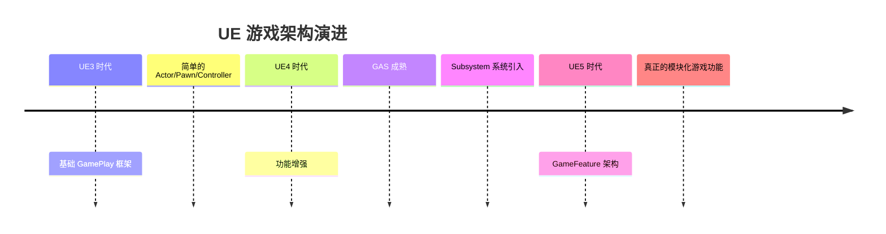
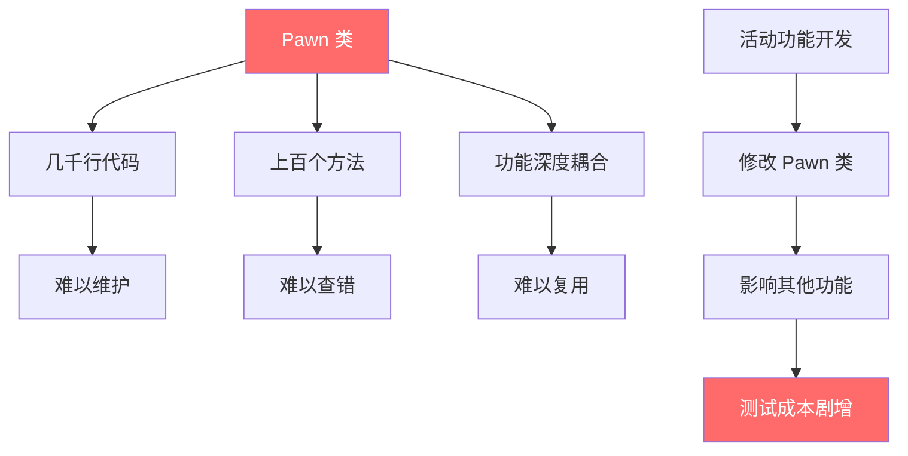
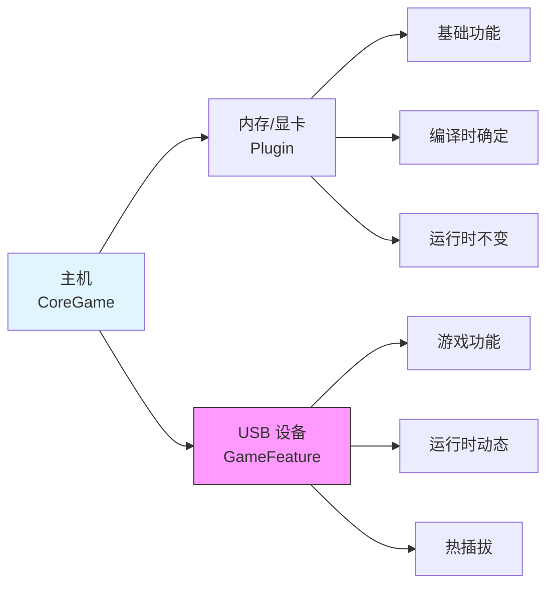
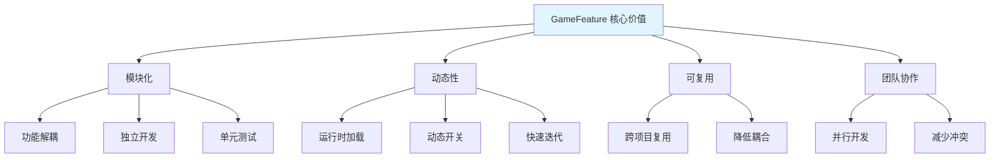
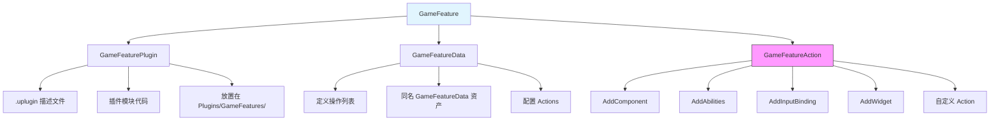
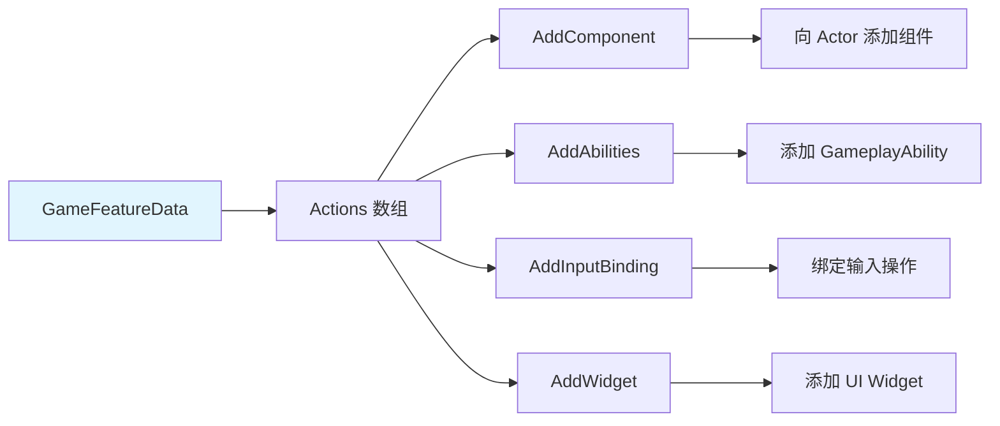
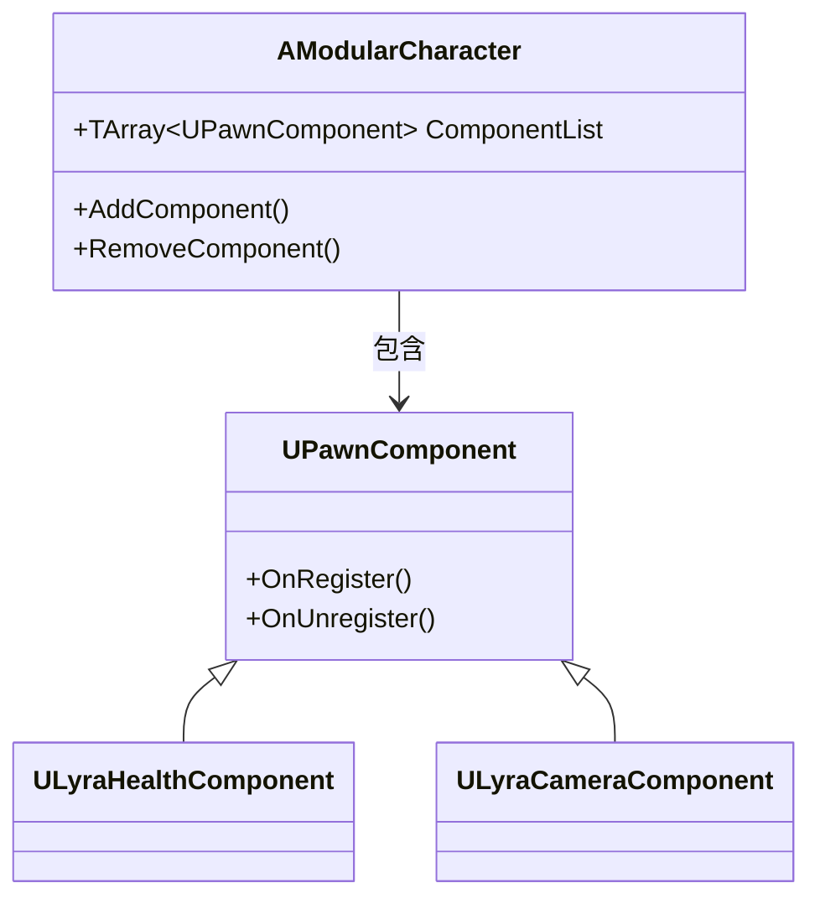
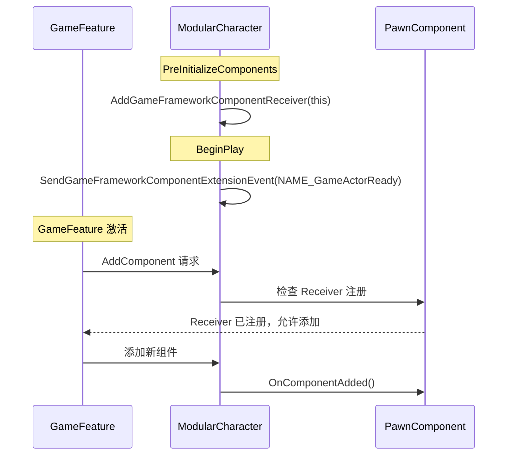
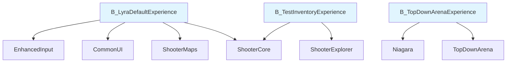
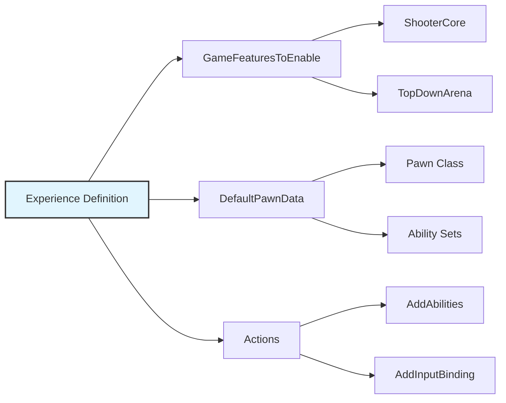

# GameFeature是什么

> 从架构演进理解 GameFeature 的诞生背景，掌握核心概念。

## 概述

本课时要解决的问题：
- **为什么**需要 GameFeature？
- GameFeature **是什么**？
- 与 **Plugin** 有什么区别？
- GameFeature 的**核心价值**是什么？

---

## 一、传统架构的痛点

### 1.1 UE 游戏架构演进



### 1.2 传统开发的问题

**案例：《堡垒之夜》的开发痛点**

随着每次赛季更新和活动内容迭代，开发团队很快发现：



**典型问题**：
1. **代码膨胀**：Pawn 类迅速膨胀到几千行
2. **功能耦合**：活动功能与核心代码深度耦合
3. **难以复用**：游戏玩法模块难以干净拆出来复用
4. **团队协作难**：多人修改同一文件，冲突频繁
5. **动态更新难**：无法动态开关某个功能

---

## 二、GameFeature 核心概念

### 2.1 GameFeature 是什么？

**定义**：GameFeature 是一种**特殊的插件**，专门用于封装游戏功能。

**关键特性**：
- 运行时动态加载/卸载
- 独立自包含，低耦合
- 可被多个项目复用
- 支持热插拔（类似 USB 设备）

### 2.2 类比理解

**形象比喻**：把游戏比作一台主机



**关键区别**：

| 特性 | Plugin | GameFeature |
|------|--------|-------------|
| **加载时机** | 启动时 | 运行时动态 |
| **依赖关系** | CoreGame 依赖 Plugin | GameFeature 依赖 CoreGame |
| **变更频率** | 低（基础功能） | 高（游戏玩法） |
| **复用性** | 跨项目基础功能 | 游戏玩法模块 |
| **热插拔** | ❌ | ✅ |

### 2.3 GameFeature 的核心价值



**具体优势**：

1. **团队内新人更易上手**
   - 无需了解项目内其他内在工作机制
   - 可以创建 GameFeature 然后独立开发测试

2. **更少漏洞，更易读代码**
   - GameFeature 独立自包含
   - 天然易于单元测试
   - 避免意外依赖其他代码

3. **更轻松的在多个团队或项目中共享功能**
   - 独立玩法封装成 GameFeature
   - 大大增大复用可能

4. **更容易在"快迭代更新"游戏中迭代功能**
   - 模块化分发
   - 快速安全删除问题功能
   - 动态关闭出错功能

---

## 三、GameFeature 架构组成

### 3.1 三大核心组件



### 3.2 GameFeaturePlugin

**职责**：定义插件的元数据

**关键文件**：`ShooterCore.uplugin`

```json
{
    "FileVersion": 3,
    "Version": 1,
    "FriendlyName": "Shooter Core",
    "Description": "Core shooting gameplay mechanics",
    "Category": "Game Features",
    "EnabledByDefault": false,
    "CanContainContent": true,
    "Modules": [
        {
            "Name": "ShooterCore",
            "Type": "Runtime",
            "LoadingPhase": "Default"
        }
    ]
}
```

**关键配置**：
- `Category`: 必须为 `"Game Features"`
- `CanContainContent`: 必须为 `true`
- `EnabledByDefault`: 通常为 `false`（运行时动态加载）

### 3.3 GameFeatureData

**职责**：定义 GameFeature 要执行的操作列表

**关键特性**：
- 必须与插件同名（如 `ShooterCore_GameFeatureData`）
- 存储在 `Content/` 目录下
- 定义 `Actions` 数组

**配置示例**：



### 3.4 GameFeatureAction

**职责**：定义 GameFeature 激活时要执行的操作

**内置 Action 类型**：

| Action 类型 | 功能 | 使用场景 |
|-------------|------|----------|
| `AddComponent` | 向 Actor 添加组件 | 动态添加功能组件 |
| `AddAbilities` | 添加 GameplayAbility | 授予角色技能 |
| `AddInputBinding` | 添加输入绑定 | 配置按键操作 |
| `AddWidget` | 添加 UI Widget | 显示界面元素 |
| `AddGameplayCuePath` | 添加 GameplayCue 路径 | 特效系统 |
| `SplitscreenConfig` | 配置分屏 | 多人游戏 |

**自定义 Action**：
- 继承自 `UGameFeatureAction`
- 重写 `OnGameFeatureActivating(FGameFeatureActivatingContext& Context)` 和 `OnGameFeatureDeactivating(FGameFeatureDeactivatingContext& Context)`
- 可实现任意自定义逻辑

---

## 四、与 Modular GamePlay 的关系

### 4.1 Modular GamePlay 简介

**核心理念**：组合优于继承



### 4.2 协同工作

**GameFeature + Modular GamePlay = 完美组合**



**关键步骤**：

1. **Actor 注册为 Receiver**（在 `PreInitializeComponents`）：
   - 调用 `UGameFrameworkComponentManager::AddGameFrameworkComponentReceiver(this)`
   - 或继承自 `AModularCharacter`/`AModularGameState`（已自动注册）

2. **GameFeature 激活时添加组件**：
   - 通过 `GameFeatureData` 配置 `AddComponent` Action
   - 动态添加组件到已注册的 Actor

3. **组件初始化**：
   - 等待 Pawn 初始化完成
   - 执行组件逻辑

---

## 五、在 Lyra 中的应用

### 5.1 Lyra 的 GameFeature 插件

Lyra 项目在 `Plugins/GameFeatures/` 目录下提供了多个 GameFeature 插件：



### 5.2 Experience System 与 GameFeature 的关系

**Lyra 通过 Experience Definition 管理 GameFeature**：



**ULyraExperienceDefinition 关键属性**：
```cpp
UCLASS()
class ULyraExperienceDefinition : public UPrimaryDataAsset
{
    // 要启用的 Game Feature 插件列表
    UPROPERTY(EditDefaultsOnly, Category = "Gameplay")
    TArray<FString> GameFeaturesToEnable;
    
    // 默认 Pawn 数据
    UPROPERTY(EditDefaultsOnly, Category = "Gameplay")
    TObjectPtr<const ULyraPawnData> DefaultPawnData;
    
    // 加载/激活/停用/卸载时执行的操作
    UPROPERTY(EditDefaultsOnly, Instanced, Category = "Actions")
    TArray<TObjectPtr<UGameFeatureAction>> Actions;
};
```

---

## 动手练习

### 练习 1：创建第一个 GameFeature 插件
1. 在编辑器中打开 **编辑 → 插件**，点击 **New Plugin**
2. 选择 **GameFeature** 模板，命名为 `MyFirstGF`
3. 验证生成的目录结构：`Plugins/GameFeatures/MyFirstGF/`
4. 确认 `MyFirstGF_GameFeatureData.uasset` 已自动创建

### 练习 2：配置 GameFeatureData
1. 在内容浏览器中双击打开 `MyFirstGF_GameFeatureData`
2. 点击 **Add Action**，添加一个 `AddWidget` Action
3. 配置 Widget Class 为一个测试 Widget（如 `W_TestWidget`）
4. 保存并在编辑器中激活插件，观察 Widget 是否显示

### 练习 3：使用蓝图节点控制 GameFeature
1. 创建一个蓝图 Actor，在 `Event BeginPlay` 中添加 `Load And Activate Game Feature Plugin` 节点
2. 输入插件名称 `MyFirstGF`，绑定完成回调
3. 在回调中打印日志，验证加载成功
4. PIE 运行游戏，观察输出日志

---

## 总结与要点

### 本课重点

1. **为什么需要 GameFeature？**
   - 传统架构代码膨胀、耦合严重
   - 需要模块化、动态加载的解决方案

2. **GameFeature 是什么？**
   - 特殊的插件，用于封装游戏功能
   - 支持运行时动态加载/卸载

3. **与 Plugin 的区别？**
   - Plugin：基础功能，编译时确定
   - GameFeature：游戏功能，运行时动态

4. **核心价值？**
   - 模块化、动态性、可复用、团队协作

### 下一步

→ [[30-tutorials/game-feature/02-核心机制详解|课时 2：核心机制详解]]

---

## 相关页面

- [[30-tutorials/game-feature/00-GameFeature系统从入门到实战]] - 系列概览
- [[30-tutorials/lyra-practical/02-ExperienceSystem详解]] - Lyra Experience 系统详解
- [[30-tutorials/modular-gameplay/01-ModularGameplay是什么]] - Modular GamePlay 架构详解

---

## 参考资料

- [《InsideUE5》GameFeatures架构（一）发展由来](https://zhuanlan.zhihu.com/p/467236675)
- [《InsideUE5》GameFeatures架构（二）基础用法](https://zhuanlan.zhihu.com/p/470184973)

---
> 最后更新：2026-05-17

<!-- nav:auto -->

---

**导航**: ← [[30-tutorials/game-feature/00-GameFeature系统从入门到实战|00-GameFeature系统从入门到实战]] · [[30-tutorials/game-feature/02-核心机制详解|02-核心机制详解]] →

<!-- /nav:auto -->
