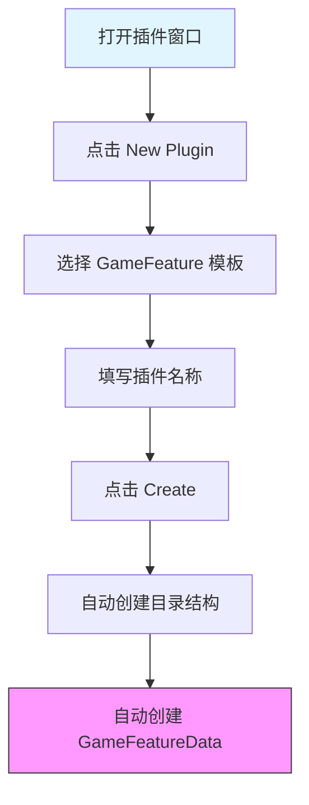
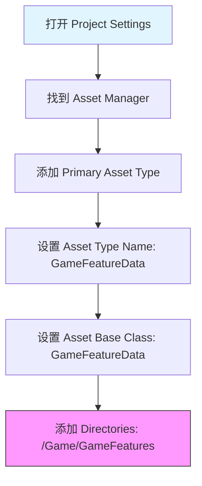
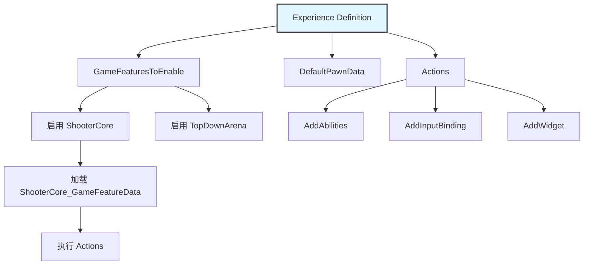
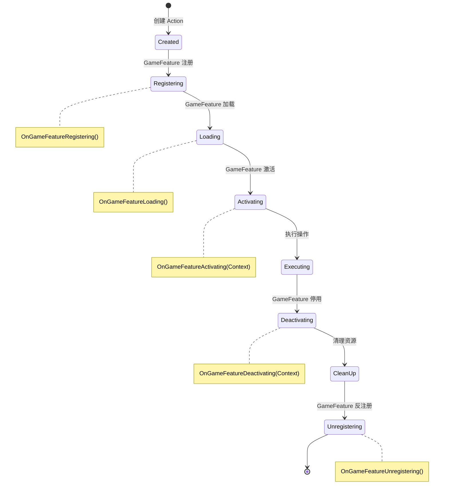
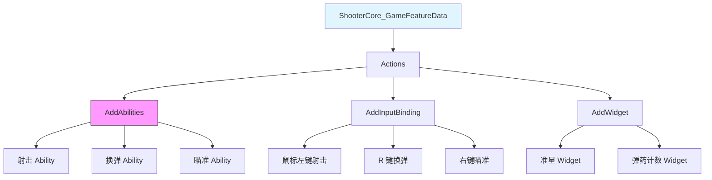
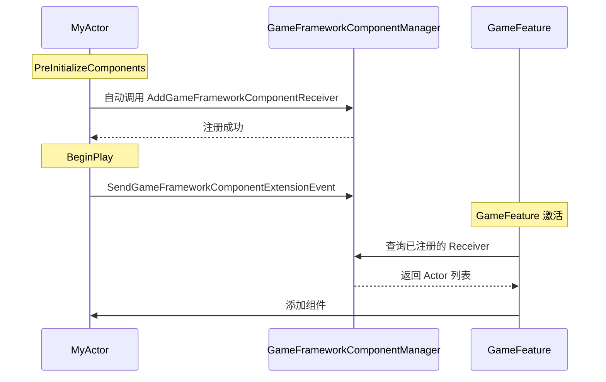

# 核心机制详解

> 深入掌握 GameFeature 的三大核心组件：Plugin、Data、Action。

## 概述

本课时要解决的问题：
- **GameFeaturePlugin** 的结构与配置？
- **GameFeatureData** 如何定义操作列表？
- **GameFeatureAction** 有哪些类型，如何使用？
- 如何在 **Lyra** 中实际使用这些机制？

---

## 一、GameFeaturePlugin 详解

### 1.1 插件结构

**目录结构**：
```text
Plugins/GameFeatures/ShooterCore/
├── ShooterCore.uplugin          # 插件描述文件
├── Resources/                  # 资源目录
├── Content/                    # 内容目录
│   └── ShooterCore_GameFeatureData.uasset  # GameFeatureData 资产
├── Source/                     # 源代码目录
│   └── ShooterCore/
│       ├── ShooterCore.Build.cs
│       ├── Private/
│       └── Public/
└── ShooterCore.uplugin         # 插件描述文件（另一种位置）
```

**关键约束**：
1. **必须放在 `Plugins/GameFeatures/` 目录下**
2. **必须包含同名的 GameFeatureData 资产**
3. **`.uplugin` 文件中 `Category` 必须为 `"Game Features"`**

### 1.2 .uplugin 文件详解

**示例**：`Plugins/GameFeatures/ShooterCore/ShooterCore.uplugin`

```json
{
    "FileVersion": 3,
    "Version": 1,
    "VersionName": "1.0",
    "FriendlyName": "Shooter Core",
    "Description": "Core shooting gameplay mechanics",
    "Category": "Game Features",
    "CreatedBy": "Epic Games",
    "EnabledByDefault": false,
    "CanContainContent": true,
    "IsBetaVersion": false,
    "Installed": false,
    "Modules": [
        {
            "Name": "ShooterCore",
            "Type": "Runtime",
            "LoadingPhase": "Default"
        }
    ]
}
```

**关键字段说明**：

| 字段 | 说明 | 注意事项 |
|------|------|----------|
| `Category` | 插件类别 | **必须为 `"Game Features"` |
| `EnabledByDefault` | 是否默认启用 | 通常为 `false`（运行时动态加载） |
| `CanContainContent` | 是否包含内容 | **必须为 `true`** |
| `Modules` | 模块列表 | 定义插件的代码模块 |

### 1.3 创建 GameFeaturePlugin

**方法 1：通过编辑器创建（推荐）**



**优点**：
- 自动配置目录结构
- 自动创建 GameFeatureData 资产
- 自动配置 AssetManager

**方法 2：手动创建（从现有插件拷贝）**

**步骤**：
1. 拷贝现有 GameFeature 插件目录
2. 修改 `.uplugin` 文件
3. 重命名 GameFeatureData 资产（必须与插件同名）
4. 配置 AssetManager（手动）

**注意**：手动创建容易出错，不推荐！

---

## 二、GameFeatureData 详解

### 2.1 什么是 GameFeatureData？

**定义**：GameFeatureData 是一个 **Primary Asset**，定义了 GameFeature 要执行的操作列表。

**关键特性**：
- 必须与插件同名（如 `ShooterCore_GameFeatureData`）
- 存储在 `Content/` 目录下
- 可以被 AssetManager 自动发现和管理

### 2.2 配置 AssetManager

**为什么需要配置？**
GameFeature 的实现强烈依赖于 AssetManager 的资源探测发现来加载释放相应的资产。

**配置步骤**：



**如果没有配置**：
- 编辑器启动时会报出警告
- GameFeatureData 无法被正确加载

### 2.3 GameFeatureData 结构

**UGameFeatureData 类定义**：

```cpp
UCLASS()
class UGameFeatureData : public UPrimaryDataAsset
{
    GENERATED_BODY()

public:
    // 要执行的操作列表
    UPROPERTY(EditAnywhere, Category = "Actions")
    TArray<TObjectPtr<UGameFeatureAction>> Actions;

    // 要加载的 Asset Manager 搜索路径
    UPROPERTY(EditAnywhere, Category = "Asset Management")
    TArray<FString> AssetManagerSearchPaths;
};
```

### 2.4 在 Lyra 中的实际应用

**Lyra 的 Experience Definition 与 GameFeatureData 的关系**：



**ULyraExperienceDefinition 关键属性**：

> 详见 [[30-tutorials/game-feature/01-GameFeature是什么#ULyraExperienceDefinition-关键属性]]，此处不再重复。`ULyraExperienceDefinition` 的完整属性定义和说明请在课时 1 中查看。

---

## 三、GameFeatureAction 详解

### 3.1 什么是 GameFeatureAction？

**定义**：GameFeatureAction 定义了 GameFeature 激活时要执行的操作。

**生命周期**：



### 3.2 内置 Action 类型

#### 1. AddComponent

**功能**：向 Actor 添加组件

**使用场景**：
- 动态添加功能组件到 Pawn
- 为场景 Actor 添加标记组件

**配置示例**：

```cpp
// 在 GameFeatureData 中配置
UGameFeatureAction_AddComponents* AddCompAction = CreateDefaultSubobject<UGameFeatureAction_AddComponents>();
AddCompAction->ActorClass = ALyraCharacter::StaticClass();
AddCompAction->ComponentClass = ULyraMyFeatureComponent::StaticClass();
```

**前提条件**：Actor 必须注册为 Receiver！

#### 2. AddAbilities

**功能**：添加 GameplayAbility 到 Ability System Component

**使用场景**：
- 授予角色新技能
- 动态添加能力集

**配置示例**：

```cpp
UGameFeatureAction_AddAbilities* AddAbilitiesAction = CreateDefaultSubobject<UGameFeatureAction_AddAbilities>();
AddAbilitiesAction->AbilitiesToGrant.Add(ULyraGameplayAbility::StaticClass());
```

#### 3. AddInputBinding

**功能**：添加输入绑定

**使用场景**：
- 绑定新的输入操作
- 配置按键映射

**配置示例**：

```cpp
UGameFeatureAction_AddInputBinding* AddInputAction = CreateDefaultSubobject<UGameFeatureAction_AddInputBinding>();
AddInputAction->InputConfig = ULyraInputConfig::StaticClass();
```

#### 4. AddWidget

**功能**：添加 UI Widget

**使用场景**：
- 显示新的 UI 界面
- 动态添加 HUD 元素

#### 5. AddGameplayCuePath

**功能**：添加 GameplayCue 路径

**使用场景**：
- 注册新的 GameplayCue 路径
- 让 GameplayCue 管理器能发现新的 Cue

### 3.3 在 Lyra 中的实际应用

**Lyra 的 ShooterCore 插件配置示例**：



**实际流程**：

1. **Experience Definition** 启用 `ShooterCore`
2. **GameFeatureSubsystem** 加载 `ShooterCore` 插件
3. **ShooterCore_GameFeatureData** 的 Actions 被执行
4. **AddAbilities** 添加射击相关 Ability
5. **AddInputBinding** 绑定输入操作
6. **AddWidget** 添加 HUD Widget

---

## 四、注册 Actor 为 Receiver

### 4.1 为什么需要注册？

**问题**：配置了 `AddComponent` Action，但 Actor 没有变化。

**原因**：Actor 没有注册为 Receiver，GameFeature 无法向其添加组件。

### 4.2 注册方法

#### 方法 1：继承自 ModularCharacter（推荐用于 Pawn）

```cpp
UCLASS()
class AMyActor : public AModularCharacter,
                      public IAbilitySystemInterface
{
    // AModularCharacter 已自动注册为 Receiver
    // PreInitializeComponents 中调用 AddGameFrameworkComponentReceiver(this)
    // EndPlay 中调用 RemoveGameFrameworkComponentReceiver(this)
};
```

**AModularCharacter 的自动注册机制**：



#### 方法 2：手动注册（用于自定义 Actor）

```cpp
void AMyActor::PreInitializeComponents()
{
    Super::PreInitializeComponents();

    // 注册为 Receiver
    UGameFrameworkComponentManager::AddGameFrameworkComponentReceiver(this);
}

void AMyActor::BeginPlay()
{
    Super::BeginPlay();

    // 通知组件管理器 Actor 已就绪
    UGameFrameworkComponentManager::SendGameFrameworkComponentExtensionEvent(
        this, UGameFrameworkComponentManager::NAME_GameActorReady);
}

void AMyActor::EndPlay(const EEndPlayReason::Type EndPlayReason)
{
    // 取消注册
    UGameFrameworkComponentManager::RemoveGameFrameworkComponentReceiver(this);

    Super::EndPlay(EndPlayReason);
}
```

---

## 五、最佳实践

### 5.1 合理划分 GameFeature

**原则**：
- **单一职责**：每个 GameFeature 只负责一个独立功能
- **可复用性**：设计时考虑在其他项目中复用
- **低耦合**：避免 GameFeature 之间的相互依赖

**反例**：

```cpp
// ❌ 错误：一个 GameFeature 包含太多不相关功能
UMyGameFeatureData::UMyGameFeatureData()
{
    // 射击功能
    Actions.Add(ShooterAction);
    // UI 功能
    Actions.Add(UIAction);
    // 网络功能
    Actions.Add(NetworkAction);
    // 音效功能
    Actions.Add(AudioAction);
}
```

**正例**：

```cpp
// ✅ 正确：每个 GameFeature 负责一个功能
// ShooterCore GameFeature: 只负责射击功能
UShooterCore_GameFeatureData::UShooterCore_GameFeatureData()
{
    Actions.Add(ShootingAction);
    Actions.Add(ReloadAction);
    Actions.Add(AimAction);
}

// UI GameFeature: 只负责 UI 功能
UUI_GameFeatureData::UUI_GameFeatureData()
{
    Actions.Add(WidgetAction);
}
```

### 5.2 使用 Experience Definition 管理 GameFeature

**原则**：通过 Experience Definition 管理 GameFeature，而不是硬编码。

**反例**：

```cpp
// ❌ 错误：硬编码激活
void AMyGameMode::StartGame()
{
    UGameFeaturesSubsystem::Get().LoadAndActivateGameFeaturePlugin("ShooterCore");
}
```

**正例**：

```cpp
// ✅ 正确：通过 Experience Definition 管理
ULyraExperienceDefinition* Experience = LoadObject<ULyraExperienceDefinition>(...);
Experience->GameFeaturesToEnable.Add("ShooterCore");
Experience->GameFeaturesToEnable.Add("ShooterMaps");
```

### 5.3 处理异步加载

**问题**：GameFeature 是异步加载的，需要等待加载完成。

**解决方案**：使用 `AsyncAction_ExperienceReady`

```cpp
void AMyGameMode::LoadExperience()
{
    UAsyncAction_ExperienceReady* AsyncAction = UAsyncAction_ExperienceReady::WaitForExperienceReady(this);
    AsyncAction->OnReady.AddDynamic(this, &ThisClass::OnExperienceReady);
}
```

---

## 动手练习

### 练习 1：手动配置 AssetManager
1. 打开 **项目设置 → Asset Manager**
2. 添加 Primary Asset Type：`GameFeatureData`
3. 设置 Asset Base Class：`GameFeatureData`
4. 添加 Directories：`/Game/GameFeatures`
5. 重启编辑器，验证 GameFeatureData 能被正确识别

### 练习 2：注册 Receiver 并验证 AddComponent
1. 创建一个 C++ Actor 类 `AMyTestActor`
2. 重写 `PreInitializeComponents`，调用 `UGameFrameworkComponentManager::AddGameFrameworkComponentReceiver(this)`
3. 创建一个 GameFeature，添加 `AddComponents` Action，目标 Actor Class 设为 `AMyTestActor`
4. 激活 GameFeature，验证组件被正确添加到 Actor

### 练习 3：观察 Actions 执行顺序
1. 创建一个 GameFeatureData，添加 3 个不同的 Action（如 `AddWidget`、`AddInputBinding`、`AddAbilities`）
2. 在每个 Action 的配置中添加日志输出
3. 激活 GameFeature，在 Output Log 中观察 Actions 的执行顺序
4. 验证 Actions 是否按添加顺序执行

---

## 总结与要点

### 本课重点

1. **GameFeaturePlugin**
   - 必须放在 `Plugins/GameFeatures/` 目录下
   - `.uplugin` 文件中 `Category` 必须为 `"Game Features"`
   - 必须包含同名的 GameFeatureData 资产

2. **GameFeatureData**
   - 定义 GameFeature 要执行的操作列表
   - 必须配置 AssetManager
   - 必须与插件同名

3. **GameFeatureAction**
   - 内置类型：AddComponent、AddAbilities、AddInputBinding、AddWidget、AddGameplayCuePath
   - 可以自定义 Action 类型

4. **注册 Receiver**
   - Actor 必须注册为 Receiver，AddComponent 才能工作
   - 继承自 `AModularCharacter` 可自动注册（`AddGameFrameworkComponentReceiver`）
   - 手动注册在 `PreInitializeComponents` 中调用

### 下一步

→ [[30-tutorials/game-feature/03-生命周期与加载流程|课时 3：生命周期与加载流程]]

---

## 相关页面

- [[30-tutorials/game-feature/01-GameFeature是什么]] - 课时 1：GameFeature 是什么？
- [[30-tutorials/game-feature/03-生命周期与加载流程]] - 课时 3：生命周期与加载流程
- [[30-tutorials/lyra-practical/02-ExperienceSystem详解]] - Lyra Experience 系统详解
- [[30-tutorials/modular-gameplay/01-ModularGameplay是什么]] - Modular GamePlay 架构详解

---

## 参考资料

- [《InsideUE5》GameFeatures架构（二）基础用法](https://zhuanlan.zhihu.com/p/470184973)
- UE5 官方文档：Game Features and Modular Gameplay

---
> 最后更新：2026-05-17

<!-- nav:auto -->

---

**导航**: ← [[30-tutorials/game-feature/01-GameFeature是什么|01-GameFeature是什么]] · [[30-tutorials/game-feature/03-生命周期与加载流程|03-生命周期与加载流程]] →

<!-- /nav:auto -->
