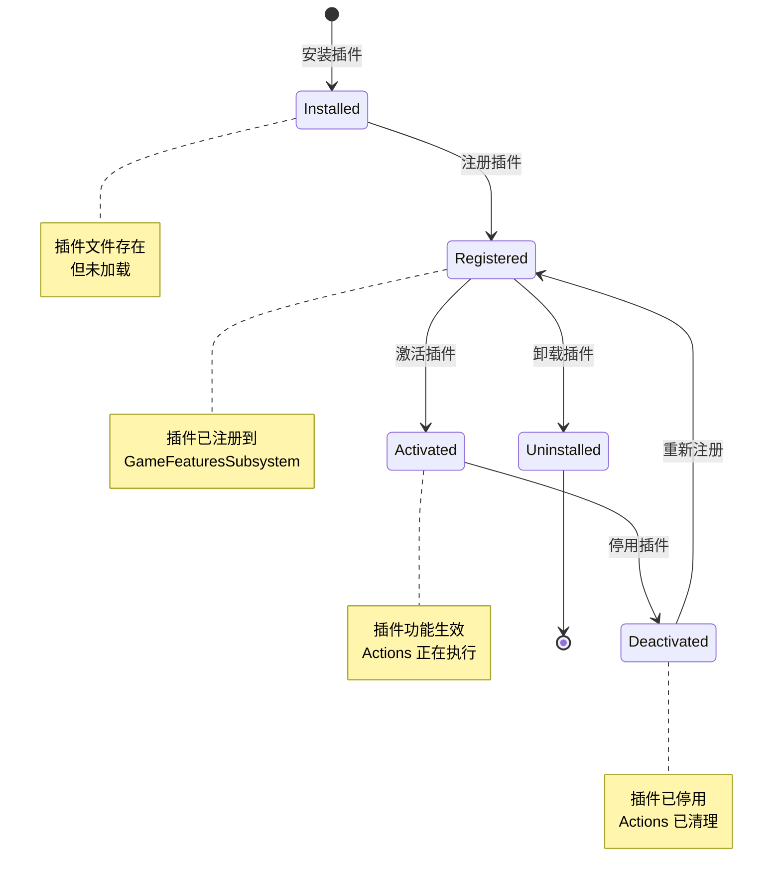
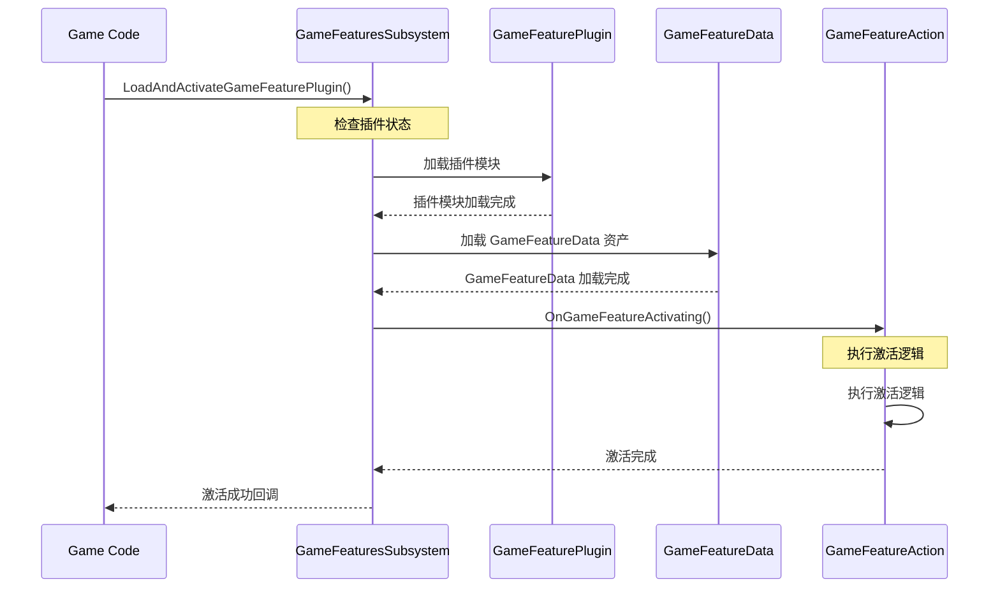
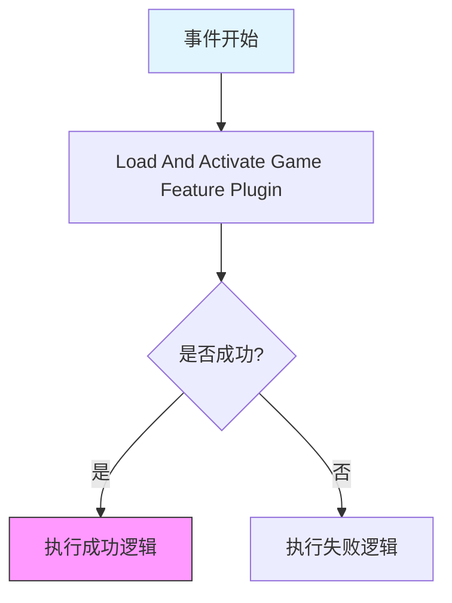
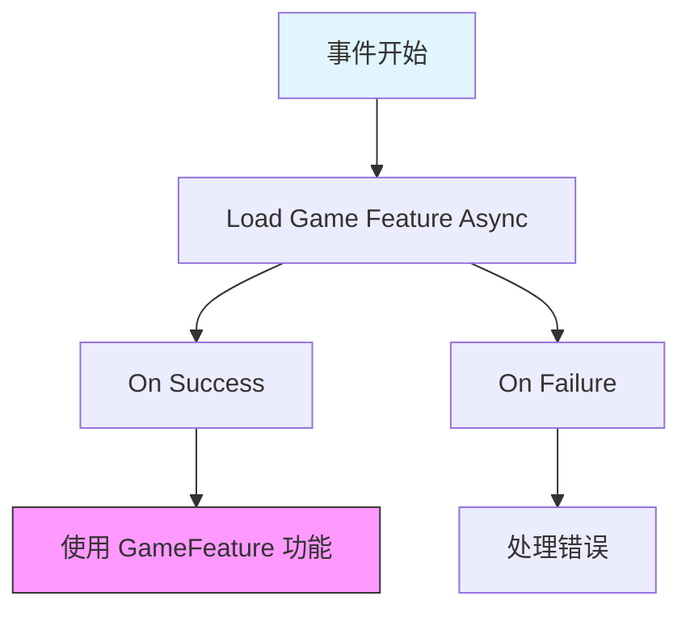

# 生命周期与加载流程

> 掌握 GameFeature 的完整生命周期，学会在代码中控制加载与激活。

## 概述

本课时要解决的问题：
- GameFeature 的**生命周期状态**有哪些？
- **加载流程**是怎样的？
- 如何通过 **C++ API** 控制 GameFeature？
- 如何通过**蓝图**和**控制台命令**使用？

---

## 一、GameFeature 生命周期

### 1.1 状态定义

GameFeature 有 4 个主要状态：



**状态说明**：

| 状态 | 说明 | 触发方式 |
|------|------|----------|
| **Installed** | 插件文件存在于 `GameFeatures/` 目录 | 放置插件文件到目录 |
| **Registered** | 插件已注册到 `UGameFeaturesSubsystem` | 编辑器启动或手动注册 |
| **Activated** | 插件激活，所有 Actions 执行完毕 | 手动激活或 Experience 加载 |
| **Deactivated** | 插件停用，所有 Actions 反向清理 | 手动停用或 Experience 卸载 |

### 1.2 状态转换 API

**注册插件**：

```cpp
// 注册 GameFeature 插件
UGameFeaturesSubsystem::Get().LoadGameFeaturePlugin(
    TEXT("ShooterCore"),
    FGameFeaturePluginLoadComplete::CreateLambda([](const UE::GameFeatures::FResult& Result){
        if (Result.HasValue())
            UE_LOG(LogTemp, Log, TEXT("GameFeature 注册成功！"));
        else
            UE_LOG(LogTemp, Error, TEXT("GameFeature 注册失败！"));
    })
);
```

**激活插件**：

```cpp
// 加载并激活 GameFeature 插件
UGameFeaturesSubsystem::Get().LoadAndActivateGameFeaturePlugin(
    TEXT("ShooterCore"),
    FGameFeaturePluginLoadComplete::CreateLambda([](const UE::GameFeatures::FResult& Result){
        if (Result.HasValue())
            UE_LOG(LogTemp, Log, TEXT("GameFeature 激活成功！"));
        else
            UE_LOG(LogTemp, Error, TEXT("GameFeature 激活失败！"));
    })
);
```

**停用插件**：

```cpp
// 停用 GameFeature 插件
UGameFeaturesSubsystem::Get().DeactivateGameFeaturePlugin(
    TEXT("ShooterCore"),
    FGameFeaturePluginLoadComplete::CreateLambda([](const UE::GameFeatures::FResult& Result){
        if (Result.HasValue())
            UE_LOG(LogTemp, Log, TEXT("GameFeature 停用成功！"));
        else
            UE_LOG(LogTemp, Error, TEXT("GameFeature 停用失败！"));
    })
);
```

**卸载插件**：

```cpp
// 卸载 GameFeature 插件
UGameFeaturesSubsystem::Get().UnloadGameFeaturePlugin(
    TEXT("ShooterCore"),
    FGameFeaturePluginLoadComplete::CreateLambda([](const UE::GameFeatures::FResult& Result){
        if (Result.HasValue())
            UE_LOG(LogTemp, Log, TEXT("GameFeature 卸载成功！"));
        else
            UE_LOG(LogTemp, Error, TEXT("GameFeature 卸载失败！"));
    })
);
```

> ⚠️ **Lyra 实际情况**：Lyra 的 `ULyraExperienceManagerComponent` 只调用 `DeactivateGameFeaturePlugin()`，**不调用** `UnloadGameFeaturePlugin()`。源码 `LyraExperienceManagerComponent.cpp:24` 中有注释：`// @TODO: Handle deactivating game features, right now we 'leak' them enabled`。卸载流程是概念性的，并非 Lyra 的实际行为。

---

## 二、加载流程详解

### 2.1 完整加载流程



### 2.2 关键步骤详解

> ⚠️ **注意**：以下代码块为**简化伪代码**，用于帮助理解流程，并非引擎真实源码。实际实现请参考引擎源码 `Engine/Plugins/Experimental/GameFeatures/Source/GameFeatures/Private/GameFeaturesSubsystem.cpp`。

#### 步骤 1：检查插件状态

```cpp
// UGameFeaturesSubsystem::LoadAndActivateGameFeaturePlugin()
void UGameFeaturesSubsystem::LoadAndActivateGameFeaturePlugin(
    const FString& PluginName,
    FGameFeaturePluginLoadComplete CompleteDelegate)
{
    // 检查插件是否已加载
    if (IsGameFeaturePluginLoaded(PluginName))
    {
        // 已加载，直接激活
        ActivateGameFeaturePlugin(PluginName, CompleteDelegate);
    }
    else
    {
        // 未加载，先加载再激活
        LoadGameFeaturePlugin(PluginName, 
            FGameFeaturePluginLoadComplete::CreateUObject(this, &ThisClass::OnLoadComplete, PluginName, CompleteDelegate));
    }
}
```

#### 步骤 2：加载插件模块

```cpp
// 加载插件模块
void UGameFeaturesSubsystem::LoadGameFeaturePlugin(
    const FString& PluginName,
    FGameFeaturePluginLoadComplete CompleteDelegate)
{
    // 通过 IPluginManager 加载插件
    IPluginManager& PluginManager = IPluginManager::Get();
    
    // 查找插件描述文件
    TSharedPtr<IPlugin> Plugin = PluginManager.FindPlugin(PluginName);
    if (Plugin.IsValid())
    {
        // 加载插件模块
        FModuleManager::Get().LoadModule(Plugin->GetName());
        
        // 触发回调
        CompleteDelegate.ExecuteIfBound(UE::GameFeatures::FResult());
    }
    else
    {
        // 插件未找到
        CompleteDelegate.ExecuteIfBound(UE::GameFeatures::FResult::MakeError(TEXT("Plugin not found")));
    }
}
```

#### 步骤 3：加载 GameFeatureData 资产

```cpp
// 加载 GameFeatureData 资产
void UGameFeaturesSubsystem::LoadGameFeatureData(
    const FString& PluginName,
    FGameFeaturePluginLoadComplete CompleteDelegate)
{
    // 构造 GameFeatureData 资产路径
    FString GameFeatureDataPath = FString::Printf(TEXT("/Game/GameFeatures/%s/%s_GameFeatureData"), *PluginName, *PluginName);
    
    // 异步加载资产
    UAssetManager& AssetManager = UAssetManager::Get();
    AssetManager.GetPrimaryAssetData(FPrimaryAssetId("GameFeatureData", FName(*PluginName)), 
        FStreamableDelegate::CreateLambda([=](){
            // 加载完成
            UGameFeatureData* GameFeatureData = LoadObject<UGameFeatureData>(nullptr, *GameFeatureDataPath);
            if (GameFeatureData)
            {
                // 触发回调
                CompleteDelegate.ExecuteIfBound(UE::GameFeatures::FResult());
            }
            else
            {
                // 加载失败
                CompleteDelegate.ExecuteIfBound(UE::GameFeatures::FResult::MakeError(TEXT("GameFeatureData not found")));
            }
        }));
}
```

#### 步骤 4：执行 Actions

```cpp
// 执行 GameFeatureActions
void UGameFeaturesSubsystem::ActivateGameFeatureActions(
    UGameFeatureData* GameFeatureData)
{
    // 遍历所有 Actions
    for (UGameFeatureAction* Action : GameFeatureData->Actions)
    {
        if (Action)
        {
            // 调用 Action 的激活函数
            Action->OnGameFeatureActivating();
        }
    }
}
```

---

## 三、在 Lyra 中的实际应用

> 本课时的重点是讲解 GameFeature 通用生命周期与加载流程。关于 Lyra 中 Experience System 的完整加载流程、预设 Experience 详解和实战实践，请参见 [[30-tutorials/game-feature/04-Lyra中的ExperienceSystem实践|课时 4：Lyra 中的 Experience System 实践]]。

---

## 四、使用方式

### 4.1 C++ API

**加载并激活 GameFeature**：

```cpp
// 加载并激活 GameFeature 插件
UGameFeaturesSubsystem::Get().LoadAndActivateGameFeaturePlugin(
    TEXT("ShooterCore"),
    FGameFeaturePluginLoadComplete::CreateLambda([](const UE::GameFeatures::FResult& Result){
        if (Result.HasValue())
            UE_LOG(LogTemp, Log, TEXT("GameFeature 激活成功！"));
        else
            UE_LOG(LogTemp, Error, TEXT("GameFeature 激活失败！"));
    })
);
```

**停用并卸载 GameFeature**：

```cpp
// 停用 GameFeature 插件
UGameFeaturesSubsystem::Get().DeactivateGameFeaturePlugin(TEXT("ShooterCore"));

// 卸载 GameFeature 插件
UGameFeaturesSubsystem::Get().UnloadGameFeaturePlugin(TEXT("ShooterCore"));
```

### 4.2 蓝图 API

**可用蓝图节点**：

| 节点名称 | 功能 |
|----------|------|
| `Load And Activate Game Feature Plugin` | 加载并激活 GameFeature |
| `Deactivate Game Feature Plugin` | 停用 GameFeature |
| `Unload Game Feature Plugin` | 卸载 GameFeature |
| `Is Game Feature Plugin Activated` | 检查 GameFeature 是否已激活 |

**使用示例**：



### 4.3 控制台命令

**启用指令**：

```
LoadGameFeaturePlugin ShooterCore
```

**禁用指令**：

```
UnloadGameFeaturePlugin ShooterCore
```

**C++ 注册控制台命令**：

```cpp
IConsoleManager::Get().RegisterConsoleCommand(
    TEXT("LoadGameFeaturePlugin"),
    TEXT("Loads and activates a game feature plugin by PluginName or URL"),
    FConsoleCommandWithWorldArgsAndOutputDeviceDelegate::CreateLambda([](const TArray<FString>& Args, UWorld*, FOutputDevice& Ar)
    {
        if (TOptional<FString> PluginURL = UE::GameFeatures::GetPluginUrlForConsoleCommand(Args, Ar))
        {
            UGameFeaturesSubsystem::Get().LoadAndActivateGameFeaturePlugin(PluginURL.GetValue(), FGameFeaturePluginLoadComplete());
        }
    }),
    ECVF_Cheat);
```

---

## 五、异步加载处理

### 5.1 问题：GameFeature 是异步加载的

**场景**：GameFeature 加载需要时间，不能立即使用。

**错误示例**：

```cpp
// ❌ 错误：立即使用 GameFeature 功能
UGameFeaturesSubsystem::Get().LoadAndActivateGameFeaturePlugin(TEXT("ShooterCore"));
// 立即使用 ShooterCore 功能（可能失败！）
UseShooterCoreFunction();
```

### 5.2 解决方案 1：使用委托

```cpp
// ✅ 正确：使用委托等待加载完成
UGameFeaturesSubsystem::Get().LoadAndActivateGameFeaturePlugin(
    TEXT("ShooterCore"),
    FGameFeaturePluginLoadComplete::CreateLambda([](const UE::GameFeatures::FResult& Result){
        if (Result.HasValue())
        {
            // 加载完成，安全使用功能
            UseShooterCoreFunction();
        }
    })
);
```

### 5.3 解决方案 2：使用 AsyncAction（推荐用于蓝图）

**创建 AsyncAction**：

```cpp
UCLASS()
class UAsyncAction_LoadGameFeature : public UBlueprintAsyncActionBase
{
    GENERATED_BODY()

public:
    UPROPERTY(BlueprintAssignable)
    FOnGameFeatureLoaded OnSuccess;

    UPROPERTY(BlueprintAssignable)
    FOnGameFeatureLoaded OnFailure;

    UFUNCTION(BlueprintCallable, meta = (BlueprintInternalUseOnly = "true"))
    static UAsyncAction_LoadGameFeature* LoadGameFeature(FString PluginName)
    {
        UAsyncAction_LoadGameFeature* Action = NewObject<UAsyncAction_LoadGameFeature>();
        Action->PluginName = PluginName;
        return Action;
    }

    virtual void Activate() override
    {
        UGameFeaturesSubsystem::Get().LoadAndActivateGameFeaturePlugin(PluginName,
            FGameFeaturePluginLoadComplete::CreateUObject(this, &ThisClass::OnComplete));
    }

private:
    void OnComplete(const UE::GameFeatures::FResult& Result)
    {
        if (Result.HasValue())
            OnSuccess.Broadcast();
        else
            OnFailure.Broadcast();
    }

    FString PluginName;
};
```

**在蓝图中使用**：



### 5.4 解决方案 3：使用 CallOrRegister_OnExperienceLoaded（Lyra 方式）

Lyra 的 `ULyraExperienceManagerComponent` 提供了三个优先级的回调注册方法：

```cpp
// 高优先级回调（如子系统初始化）
EMC->CallOrRegister_OnExperienceLoaded_HighPriority(
    FOnLyraExperienceLoaded::FDelegate::CreateUObject(this, &ThisClass::OnExperienceReady)
);

// 普通优先级回调
EMC->CallOrRegister_OnExperienceLoaded(
    FOnLyraExperienceLoaded::FDelegate::CreateUObject(this, &ThisClass::OnExperienceReady)
);

// 低优先级回调
EMC->CallOrRegister_OnExperienceLoaded_LowPriority(
    FOnLyraExperienceLoaded::FDelegate::CreateUObject(this, &ThisClass::OnExperienceReady)
);
```

**使用 AsyncAction_ExperienceReady（蓝图友好）**：

```cpp
void AMyGameMode::LoadExperience()
{
    UAsyncAction_ExperienceReady* AsyncAction = UAsyncAction_ExperienceReady::WaitForExperienceReady(this);
    AsyncAction->OnReady.AddDynamic(this, &ThisClass::OnExperienceReady);
}
```

---

## 六、最佳实践

### 6.1 总是处理异步加载

**原则**：GameFeature 是异步加载的，永远不要假设它已立即加载完成。

**正例**：

```cpp
// ✅ 正确：使用委托或 AsyncAction
UGameFeaturesSubsystem::Get().LoadAndActivateGameFeaturePlugin(
    TEXT("ShooterCore"),
    FGameFeaturePluginLoadComplete::CreateLambda([](const UE::GameFeatures::FResult& Result){
        if (Result.HasValue())
        {
            // 加载完成，安全使用功能
            UseShooterCoreFunction();
        }
    })
);
```

**反例**：

```cpp
// ❌ 错误：立即使用 GameFeature 功能
UGameFeaturesSubsystem::Get().LoadAndActivateGameFeaturePlugin(TEXT("ShooterCore"));
UseShooterCoreFunction();  // 可能失败！
```

### 6.2 使用 Experience Definition 管理 GameFeature

**原则**：通过 Experience Definition 管理 GameFeature，而不是硬编码。

**正例**：

```cpp
// ✅ 正确：通过 Experience Definition 管理
ULyraExperienceDefinition* Experience = LoadObject<ULyraExperienceDefinition>(...);
Experience->GameFeaturesToEnable.Add("ShooterCore");
Experience->GameFeaturesToEnable.Add("ShooterMaps");
```

**反例**：

```cpp
// ❌ 错误：硬编码激活
UGameFeaturesSubsystem::Get().LoadAndActivateGameFeaturePlugin("ShooterCore");
```

### 6.3 处理加载失败

**原则**：总是处理加载失败的情况。

```cpp
UGameFeaturesSubsystem::Get().LoadAndActivateGameFeaturePlugin(
    TEXT("ShooterCore"),
    FGameFeaturePluginLoadComplete::CreateLambda([](const UE::GameFeatures::FResult& Result){
        if (Result.HasValue())
        {
            // 加载成功
            UseShooterCoreFunction();
        }
        else
        {
            // 加载失败，处理错误
            UE_LOG(LogTemp, Error, TEXT("Failed to load GameFeature: %s"), *Result.GetError());
            ShowErrorMessageToUser();
        }
    })
);
```

---

## 动手练习

### 练习 1：使用控制台命令控制 GameFeature
1. 启动 PIE，打开 **Output Log**
2. 输入命令 `LoadGameFeaturePlugin ShooterCore`，观察日志输出
3. 输入命令 `UnloadGameFeaturePlugin ShooterCore`，观察状态变化
4. 使用 `stat GameFeature` 查看当前 GameFeature 状态

### 练习 2：使用 C++ 委托处理异步加载
1. 在 C++ 中调用 `LoadAndActivateGameFeaturePlugin`，绑定 `FGameFeaturePluginLoadComplete` 委托
2. 在委托回调中打印日志：`UE_LOG(LogTemp, Log, TEXT("GameFeature 加载完成！"))`
3. 运行游戏，验证日志在 GameFeature 加载完成后才打印
4. 测试加载失败的情况（输入不存在的插件名），验证错误回调被触发

### 练习 3：观察 GameFeature 生命周期状态
1. 创建一个简单的 GameFeature 插件 `MyGF`
2. 在自定义 Action 的 `OnGameFeatureActivating` 和 `OnGameFeatureDeactivating` 中添加日志
3. 激活/停用插件，观察 Output Log 中的状态变化
4. 绘制状态转换图，标注每个生命周期函数的调用时机

---

## 总结与要点

### 本课重点

1. **生命周期状态**
   - Installed → Registered → Activated → Deactivated → Uninstalled

2. **加载流程**
   - 检查插件状态 → 加载插件模块 → 加载 GameFeatureData → 执行 Actions

3. **使用方式**
   - C++ API：LoadAndActivateGameFeaturePlugin()
   - 蓝图节点：Load And Activate Game Feature Plugin
   - 控制台命令：LoadGameFeaturePlugin

4. **异步加载处理**
   - 使用委托
   - 使用 AsyncAction
   - 使用 AsyncAction_ExperienceReady（Lyra 方式）

### 下一步

→ [[30-tutorials/game-feature/04-Lyra中的ExperienceSystem实践|课时 4：Lyra 中的 Experience System 实践]]

---

## 相关页面

- [[30-tutorials/game-feature/02-核心机制详解]] - 课时 2：核心机制详解
- [[30-tutorials/game-feature/04-Lyra中的ExperienceSystem实践]] - 课时 4：Lyra 中的 Experience System 实践
- [[30-tutorials/lyra-practical/02-ExperienceSystem详解]] - Lyra Experience 系统详解
- [[30-tutorials/modular-gameplay/01-ModularGameplay是什么]] - Modular GamePlay 架构详解

---

## 参考资料

- [《InsideUE5》GameFeatures架构（二）基础用法](https://zhuanlan.zhihu.com/p/470184973)
- UE5 官方文档：Game Features and Modular Gameplay

---
> 最后更新：2026-05-17

<!-- nav:auto -->

---

**导航**: ← [[30-tutorials/game-feature/02-核心机制详解|02-核心机制详解]] · [[30-tutorials/game-feature/04-Lyra中的ExperienceSystem实践|04-Lyra中的ExperienceSystem实践]] →

<!-- /nav:auto -->
