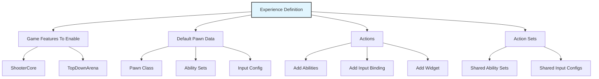
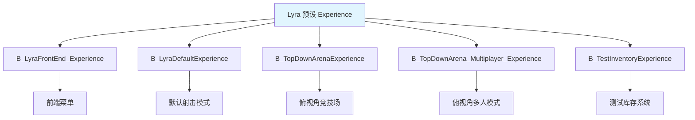
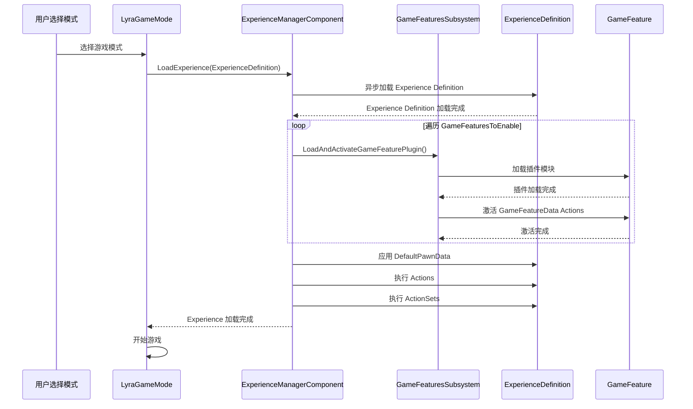
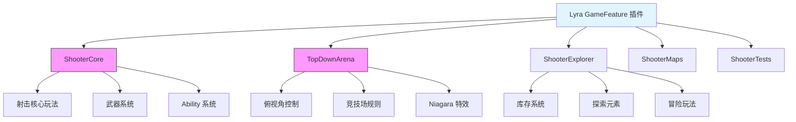
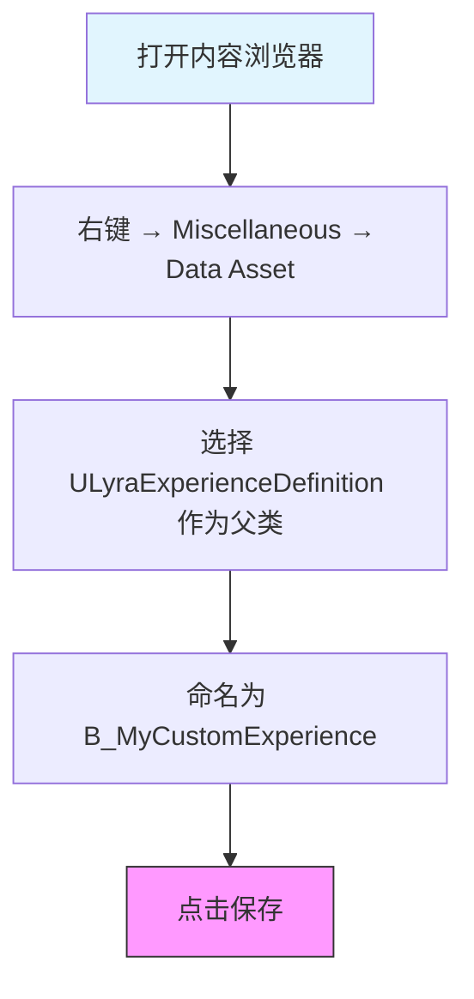
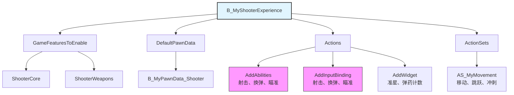

# Lyra中的ExperienceSystem实践

> 结合 Lyra 项目，学习 Experience System 如何管理 GameFeature。

## 概述

本课时要解决的问题：
- Lyra 的 **Experience System** 是什么？
- 如何通过 **Experience Definition** 管理 GameFeature？
- Lyra 中有哪些**预设 Experience**？
- 如何**创建自定义 Experience**？

---

## 一、Experience System 概述

### 1.1 什么是 Experience System？

**定义**：Experience System 是 Lyra 的核心架构创新，通过 `ULyraExperienceDefinition` 定义游戏的完整体验。

**核心理念**：将游戏逻辑从代码中解耦，通过数据驱动的方式配置游戏体验。

### 1.2 Experience 包含什么？



**ULyraExperienceDefinition 关键属性**：

> 详见 [[30-tutorials/game-feature/01-GameFeature是什么#ULyraExperienceDefinition-关键属性]]，此处不再重复。`ULyraExperienceDefinition` 的完整属性定义和说明请在课时 1 中查看。

---

## 二、Lyra 预设 Experience

### 2.1 预设 Experience 列表

Lyra 项目预设了以下 Experience，展示了不同游戏类型的实现方式：



### 2.2 B_LyraFrontEnd_Experience（前端菜单体验）

**路径**：`Content/System/FrontEnd/B_LyraFrontEnd_Experience.uasset`

**用途**：游戏启动时的主菜单界面

**配置**：

| 属性 | 值 | 说明 |
|------|-----|------|
| **GameFeaturesToEnable** | `CommonUI`, `CommonGame` | 启用 UI 框架 |
| **DefaultPawnData** | `None` | 菜单界面不需要 Pawn |
| **Actions** | 添加 UI Widget、配置输入 | 显示菜单界面 |

**Actions 详解**：

> ⚠️ **注意**：以下代码块为**简化伪代码**，类名（如 `ULyraFrontEndWidget`）为示意用途，并非 Lyra 真实类名。实际使用时请替换为项目中的真实类名。

```cpp
// B_LyraFrontEnd_Experience 的 Actions（简化示例）
UGameFeatureAction_AddWidget* AddWidgetAction = CreateDefaultSubobject<UGameFeatureAction_AddWidget>();
AddWidgetAction->WidgetClass = ULyraFrontEndWidget::StaticClass();  // 替换为真实 Widget 类
AddWidgetAction->LayerName = TEXT("FrontEnd");
```

### 2.3 B_LyraDefaultExperience（默认游戏体验）

**路径**：`Content/System/Experiences/B_LyraDefaultExperience.uasset`

**用途**：默认的游戏体验（射击游戏模式）

**配置**：

| 属性 | 值 | 说明 |
|------|-----|------|
| **GameFeaturesToEnable** | `ShooterCore`, `ShooterMaps`, `CommonUI`, `EnhancedInput` | 启用射击核心玩法 |
| **DefaultPawnData** | `B_LyraPawnData_Default` | 默认 Pawn 数据 |
| **Actions** | 添加射击 Ability、输入绑定、HUD Widget | 配置射击游戏功能 |

**GameFeaturesToEnable 详解**：

```cpp
// B_LyraDefaultExperience 的 GameFeaturesToEnable
GameFeaturesToEnable.Add(TEXT("ShooterCore"));       // 射击核心玩法
GameFeaturesToEnable.Add(TEXT("ShooterMaps"));       // 地图资源
GameFeaturesToEnable.Add(TEXT("CommonUI"));          // 通用 UI 框架
GameFeaturesToEnable.Add(TEXT("EnhancedInput"));     // 增强输入系统
```

**Actions 详解**：

> ⚠️ **注意**：以下代码块为**简化伪代码**，类名（如 `ULyraGameplayAbility`、`ULyraInputConfig`、`ULyraHUDWidget`）为示意用途，并非 Lyra 真实类名。实际使用时请替换为项目中的真实类名。

```cpp
// B_LyraDefaultExperience 的 Actions（简化示例）
// 1. 添加射击相关 Ability
UGameFeatureAction_AddAbilities* AddAbilitiesAction = CreateDefaultSubobject<UGameFeatureAction_AddAbilities>();
AddAbilitiesAction->AbilitiesToGrant.Add(ULyraGameplayAbility::StaticClass());  // 替换为真实 Ability 类或 GameplayAbility 资产

// 2. 添加输入绑定
UGameFeatureAction_AddInputBinding* AddInputAction = CreateDefaultSubobject<UGameFeatureAction_AddInputBinding>();
AddInputAction->InputConfig = ULyraInputConfig::StaticClass();  // 替换为真实 InputConfig 类

// 3. 添加 HUD Widget
UGameFeatureAction_AddWidget* AddWidgetAction = CreateDefaultSubobject<UGameFeatureAction_AddWidget>();
AddWidgetAction->WidgetClass = ULyraHUDWidget::StaticClass();  // 替换为真实 Widget 类
```

### 2.4 B_TopDownArenaExperience（俯视角竞技场体验）

**路径**：`Plugins/GameFeatures/TopDownArena/Content/System/Experiences/B_TopDownArenaExperience.uasset`

**用途**：俯视角竞技场游戏模式

**配置**：

| 属性 | 值 | 说明 |
|------|-----|------|
| **GameFeaturesToEnable** | `TopDownArena`, `GameplayAbilities`, `Niagara`, `LyraExampleContent` | 启用俯视角玩法 |
| **DefaultPawnData** | `B_TopDownPawnData` | 俯视角 Pawn 数据 |
| **Actions** | 添加俯视角控制 Ability、俯视角相机、竞技场 HUD | 配置俯视角游戏功能 |

### 2.5 B_TestInventoryExperience（测试库存体验）

**路径**：`Plugins/GameFeatures/ShooterExplorer/Content/System/Experiences/B_TestInventoryExperience.uasset`

**用途**：测试库存系统

**配置**：

| 属性 | 值 | 说明 |
|------|-----|------|
| **GameFeaturesToEnable** | `ShooterExplorer`, `ShooterCore`, `LyraExampleContent` | 启用射击+探索玩法 |
| **DefaultPawnData** | `B_ExplorerPawnData` | 探索者 Pawn 数据 |
| **Actions** | 添加库存 UI、物品拾取 Ability、冒险元素 | 配置库存测试功能 |

---

## 三、Experience 加载流程

### 3.1 完整加载流程



### 3.2 ULyraExperienceManagerComponent 详解

**关键函数**：

```cpp
UCLASS()
class ULyraExperienceManagerComponent : public UGameStateComponent
{
    GENERATED_BODY()

public:
    // 设置当前 Experience 并开始加载
    void SetCurrentExperience(FPrimaryAssetId ExperienceId);

    // 检查 Experience 是否已加载
    bool IsExperienceLoaded() const;

    // 注册 Experience 加载完成回调（三优先级）
    void CallOrRegister_OnExperienceLoaded_HighPriority(FOnLyraExperienceLoaded::FDelegate&& Delegate);
    void CallOrRegister_OnExperienceLoaded(FOnLyraExperienceLoaded::FDelegate&& Delegate);
    void CallOrRegister_OnExperienceLoaded_LowPriority(FOnLyraExperienceLoaded::FDelegate&& Delegate);

private:
    void StartExperienceLoad();
    void OnExperienceLoadComplete();
    void OnGameFeaturePluginLoadComplete(const UE::GameFeatures::FResult& Result);
    void OnExperienceFullLoadCompleted();
};
```

**加载流程实现**（源码：`LyraExperienceManagerComponent.cpp`）：

```cpp
void ULyraExperienceManagerComponent::SetCurrentExperience(FPrimaryAssetId ExperienceId)
{
    // 通过 AssetManager 解析并加载 Experience
    ULyraAssetManager& AssetManager = ULyraAssetManager::Get();
    FSoftObjectPath AssetPath = AssetManager.GetPrimaryAssetPath(ExperienceId);
    TSubclassOf<ULyraExperienceDefinition> AssetClass = Cast<UClass>(AssetPath.TryLoad());
    const ULyraExperienceDefinition* Experience = GetDefault<ULyraExperienceDefinition>(AssetClass);

    CurrentExperience = Experience;
    StartExperienceLoad();
}

void ULyraExperienceManagerComponent::OnExperienceLoadComplete()
{
    // 收集所有需要加载的 GameFeature 插件 URL
    for (const FString& PluginName : CurrentExperience->GameFeaturesToEnable)
    {
        FString PluginURL;
        if (UGameFeaturesSubsystem::Get().GetPluginURLByName(PluginName, PluginURL))
        {
            GameFeaturePluginURLs.AddUnique(PluginURL);
        }
    }

    // 加载并激活所有 Game Feature
    for (const FString& PluginURL : GameFeaturePluginURLs)
    {
        UGameFeaturesSubsystem::Get().LoadAndActivateGameFeaturePlugin(PluginURL,
            FGameFeaturePluginLoadComplete::CreateUObject(this, &ThisClass::OnGameFeaturePluginLoadComplete));
    }
}

void ULyraExperienceManagerComponent::OnExperienceFullLoadCompleted()
{
    // 执行所有 Actions（含 Context 参数）
    FGameFeatureActivatingContext Context;
    for (UGameFeatureAction* Action : CurrentExperience->Actions)
    {
        Action->OnGameFeatureRegistering();
        Action->OnGameFeatureLoading();
        Action->OnGameFeatureActivating(Context);
    }
    // 同样处理 ActionSets 中的 Actions...

    // 按优先级广播加载完成
    OnExperienceLoaded_HighPriority.Broadcast(CurrentExperience);
    OnExperienceLoaded.Broadcast(CurrentExperience);
    OnExperienceLoaded_LowPriority.Broadcast(CurrentExperience);
}
```

---

## 四、Lyra GameFeature 插件架构

### 4.1 插件列表

Lyra 在 `Plugins/GameFeatures/` 目录下提供了多个 GameFeature 插件：



### 4.2 ShooterCore 插件详解

**路径**：`Plugins/GameFeatures/ShooterCore/`

**描述**：射击游戏核心玩法系统

**依赖**：
- GameplayAbilities
- ModularGameplay
- CommonUI
- EnhancedInput

**提供的功能**：
- 射击、换弹、瞄准等核心功能
- 武器系统设计
- 射击相关 Ability

**GameFeatureData 配置**：

> ⚠️ **注意**：以下代码块为**简化伪代码**，类名（如 `ULyraShootAbility`、`ULyraShooterInputConfig`）为示意用途，并非 Lyra 真实类名。实际使用时请替换为项目中的真实类名或 GameplayAbility 资产。

```cpp
// ShooterCore_GameFeatureData 的 Actions（简化示例）
// 1. 添加射击相关组件
UGameFeatureAction_AddComponents* AddCompAction = CreateDefaultSubobject<UGameFeatureAction_AddComponents>();
AddCompAction->ActorClass = ALyraCharacter::StaticClass();
AddCompAction->ComponentClass = ULyraHeroComponent::StaticClass();  // 替换为真实 Component 类

// 2. 添加射击相关 Ability
UGameFeatureAction_AddAbilities* AddAbilitiesAction = CreateDefaultSubobject<UGameFeatureAction_AddAbilities>();
AddAbilitiesAction->AbilitiesToGrant.Add(ULyraShootAbility::StaticClass());  // 替换为真实 Ability 类或资产
AddAbilitiesAction->AbilitiesToGrant.Add(ULyraReloadAbility::StaticClass());
AddAbilitiesAction->AbilitiesToGrant.Add(ULyraAimAbility::StaticClass());

// 3. 添加输入绑定
UGameFeatureAction_AddInputBinding* AddInputAction = CreateDefaultSubobject<UGameFeatureAction_AddInputBinding>();
AddInputAction->InputConfig = ULyraShooterInputConfig::StaticClass();  // 替换为真实 InputConfig 类

// 4. 添加 HUD Widget
UGameFeatureAction_AddWidget* AddWidgetAction = CreateDefaultSubobject<UGameFeatureAction_AddWidget>();
AddWidgetAction->WidgetClass = ULyraShooterHUDWidget::StaticClass();  // 替换为真实 Widget 类
```

### 4.3 TopDownArena 插件详解

**路径**：`Plugins/GameFeatures/TopDownArena/`

**描述**：俯视角竞技场玩法

**依赖**：
- GameplayAbilities
- Niagara

**提供的功能**：
- 俯视角控制
- 竞技场规则
- Niagara 特效

---

## 五、创建自定义 Experience

### 5.1 步骤

**步骤 1：创建 Experience Definition 资产**



**步骤 2：配置 Experience**

```cpp
// 在 Experience Definition 中配置
ULyraExperienceDefinition* MyExperience = LoadObject<ULyraExperienceDefinition>(...);

// 1. 配置 GameFeaturesToEnable
MyExperience->GameFeaturesToEnable.Add(TEXT("MyCustomGameFeature"));

// 2. 配置 DefaultPawnData
MyExperience->DefaultPawnData = LoadObject<ULyraPawnData>(...);

// 3. 配置 Actions
UGameFeatureAction_AddAbilities* AddAbilitiesAction = CreateDefaultSubobject<UGameFeatureAction_AddAbilities>();
MyExperience->Actions.Add(AddAbilitiesAction);

// 4. 配置 ActionSets（可选）
MyExperience->ActionSets.Add(LoadObject<ULyraExperienceActionSet>(...));
```

**步骤 3：在 Game Mode 中使用**

```cpp
// 在 ALyraGameMode 中指定要使用的 Experience Definition
ALyraGameMode::ALyraGameMode()
{
    // 指定默认的 Experience Definition
    DefaultExperience = TSoftClassPtr<ULyraExperienceDefinition>(TEXT("/Game/System/Experiences/B_MyCustomExperience.B_MyCustomExperience_C"));
}
```

### 5.2 示例：创建射击游戏 Experience



---

## 六、最佳实践

### 6.1 模块化设计

**原则**：将可复用的逻辑放到 `ULyraExperienceActionSet` 中。

**正例**：

> ⚠️ **注意**：以下代码块为**简化伪代码**，Ability 类名（如 `ULyraMoveAbility`）为示意用途，并非 Lyra 真实类名。实际使用时请替换为真实 GameplayAbility 资产或类。

```cpp
// ✅ 正确：将可复用逻辑放到 ActionSet 中（简化示例）
ULyraExperienceActionSet* MovementActionSet = CreateDefaultSubobject<ULyraExperienceActionSet>();
MovementActionSet->AbilitiesToGrant.Add(ULyraMoveAbility::StaticClass());  // 替换为真实 Ability 类或资产
MovementActionSet->AbilitiesToGrant.Add(ULyraJumpAbility::StaticClass());
MovementActionSet->AbilitiesToGrant.Add(ULyraSprintAbility::StaticClass());

// 在多个 Experience 中复用
B_LyraDefaultExperience->ActionSets.Add(MovementActionSet);
B_TopDownArenaExperience->ActionSets.Add(MovementActionSet);
```

**反例**：

```cpp
// ❌ 错误：在每个 Experience 中重复配置相同逻辑
B_LyraDefaultExperience->Actions.Add(MoveAbility);
B_LyraDefaultExperience->Actions.Add(JumpAbility);
B_LyraDefaultExperience->Actions.Add(SprintAbility);

B_TopDownArenaExperience->Actions.Add(MoveAbility);
B_TopDownArenaExperience->Actions.Add(JumpAbility);
B_TopDownArenaExperience->Actions.Add(SprintAbility);
```

### 6.2 数据驱动

**原则**：尽量通过数据配置游戏逻辑，减少 C++ 代码中的硬编码。

**正例**：

```cpp
// ✅ 正确：通过数据配置
MyExperience->GameFeaturesToEnable.Add(TEXT("ShooterCore"));
MyExperience->DefaultPawnData = LoadObject<ULyraPawnData>(...);
```

**反例**：

```cpp
// ❌ 错误：硬编码
void AMyGameMode::StartGame()
{
    UGameFeaturesSubsystem::Get().LoadAndActivateGameFeaturePlugin(TEXT("ShooterCore"));
    // ...
}
```

### 6.3 异步加载

**原则**：Experience 是异步加载的，需要处理加载完成前的状态。

**正例**：

```cpp
// ✅ 正确：使用 CallOrRegister 方法注册回调
UGameFrameworkComponentManager* Manager = UGameFrameworkComponentManager::GetForActor(this);
if (ULyraExperienceManagerComponent* EMC = GetGameState()->FindComponentByClass<ULyraExperienceManagerComponent>())
{
    EMC->CallOrRegister_OnExperienceLoaded(
        FOnLyraExperienceLoaded::FDelegate::CreateUObject(this, &ThisClass::OnExperienceReady)
    );
}
```

或使用蓝图异步节点：

```cpp
// ✅ 正确：使用 AsyncAction_ExperienceReady 等待 Experience 加载
UAsyncAction_ExperienceReady* AsyncAction = UAsyncAction_ExperienceReady::WaitForExperienceReady(this);
AsyncAction->OnReady.AddDynamic(this, &ThisClass::OnExperienceReady);
```

---

## 动手练习

### 练习 1：查看并修改 Lyra 预设 Experience
1. 在内容浏览器中打开 `B_LyraDefaultExperience.uasset`
2. 查看 `GameFeaturesToEnable` 列表，记录已启用的插件
3. 尝试添加一个自定义 GameFeature 到列表（需先创建对应插件）
4. PIE 运行游戏，在 Output Log 中观察 GameFeature 加载日志

### 练习 2：创建自定义 Experience Definition
1. 右键 → **Miscellaneous → Data Asset**，选择 `ULyraExperienceDefinition` 作为父类
2. 命名为 `B_MyCustomExperience`，保存到 `Content/System/Experiences/`
3. 配置 `DefaultPawnData`（可复用 `B_LyraPawnData_Default`）
4. 添加 `Actions`：使用 `AddWidget` Action 添加一个测试 Widget
5. 在 GameMode 中指定使用此 Experience，PIE 运行验证

### 练习 3：注册 Experience 加载完成回调
1. 在 C++ 中获取 `ULyraExperienceManagerComponent`（通过 `GetGameState()->FindComponentByClass()`）
2. 调用 `CallOrRegister_OnExperienceLoaded` 注册回调
3. 在回调中打印日志：`UE_LOG(LogTemp, Log, TEXT("Experience 加载完成！"))`
4. PIE 运行游戏，观察 Output Log 验证回调在 Experience 加载完成后才触发

---

## 总结与要点

### 本课重点

1. **Experience System 是什么？**
   - Lyra 的核心架构创新
   - 通过数据驱动的方式配置游戏体验

2. **Experience Definition 包含什么？**
   - GameFeaturesToEnable
   - DefaultPawnData
   - Actions
   - ActionSets

3. **Lyra 预设 Experience**
   - B_LyraFrontEnd_Experience（前端菜单）
   - B_LyraDefaultExperience（默认射击模式）
   - B_TopDownArenaExperience（俯视角竞技场）
   - B_TestInventoryExperience（测试库存系统）

4. **如何创建自定义 Experience？**
   - 创建 Experience Definition 资产
   - 配置 GameFeaturesToEnable、DefaultPawnData、Actions、ActionSets
   - 在 Game Mode 中指定要使用的 Experience Definition

### 下一步

→ [[30-tutorials/game-feature/05-GameFeature高级主题与最佳实践|课时 5：高级主题与最佳实践]]

---

## 相关页面

- [[30-tutorials/game-feature/03-生命周期与加载流程]] - 课时 3：生命周期与加载流程
- [[30-tutorials/game-feature/05-GameFeature高级主题与最佳实践]] - 课时 5：高级主题与最佳实践
- [[30-tutorials/lyra-practical/02-ExperienceSystem详解]] - Lyra Experience 系统详解
- [[30-tutorials/modular-gameplay/01-ModularGameplay是什么]] - Modular GamePlay 架构详解

---

## 参考资料

- [《InsideUE5》GameFeatures架构（二）基础用法](https://zhuanlan.zhihu.com/p/470184973)
- Lyra 项目源码：`Source/LyraGame/GameModes/LyraExperienceDefinition.h`

---
> 最后更新：2026-05-17

<!-- nav:auto -->

---

**导航**: ← [[30-tutorials/game-feature/03-生命周期与加载流程|03-生命周期与加载流程]] · [[30-tutorials/game-feature/05-GameFeature高级主题与最佳实践|05-GameFeature高级主题与最佳实践]] →

<!-- /nav:auto -->
