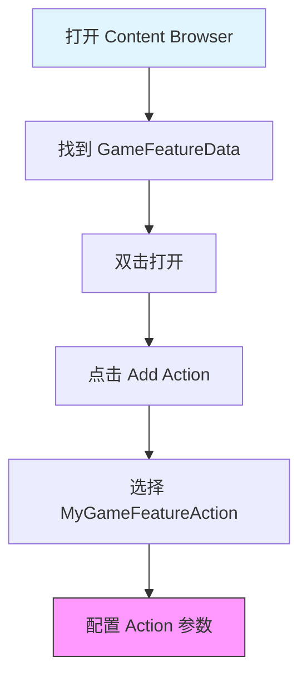
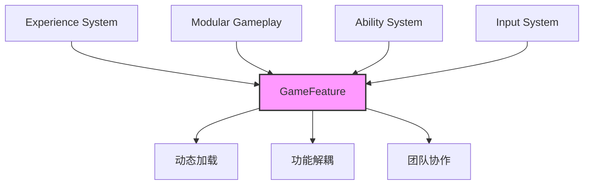

# GameFeature高级主题与最佳实践

> 学习自定义 GameFeatureAction，掌握高级开发技巧与最佳实践。

## 概述

本课时要解决的问题：
- 如何**自定义 GameFeatureAction**？
- **最佳实践**有哪些？
- **常见陷阱**有哪些，如何避免？
- **高级主题**：热更新、性能优化？

---

## 一、自定义 GameFeatureAction

### 1.1 为什么需要自定义 Action？

内置的 `GameFeatureAction` 类型有限，实际项目中经常需要自定义操作。

**示例场景**：
- 加载特定配置文件
- 注册自定义 Subsystem
- 执行特定初始化脚本
- 配置自定义渲染参数

### 1.2 创建自定义 Action

**步骤 1：创建 Action 类**

```cpp
// MyGameFeatureAction.h
#pragma once

#include "CoreMinimal.h"
#include "GameFeatureAction_WorldActionBase.h"
#include "MyGameFeatureAction.generated.h"

UCLASS()
class UMyGameFeatureAction : public UGameFeatureAction_WorldActionBase
{
    GENERATED_BODY()

public:
    // 自定义属性
    UPROPERTY(EditAnywhere, Category = "My Game Feature")
    TSoftObjectPtr<UWorld> WorldToLoad;

    UPROPERTY(EditAnywhere, Category = "My Game Feature")
    FString ConfigName;

protected:
    // 重写激活函数（注意 Context 参数）
    virtual void OnGameFeatureActivating(FGameFeatureActivatingContext& Context) override;

    // 重写停用函数（注意 Context 参数）
    virtual void OnGameFeatureDeactivating(FGameFeatureDeactivatingContext& Context) override;

    // 重写 AddToWorld（WorldActionBase 的核心方法）
    virtual void AddToWorld(const FWorldContext& WorldContext, const FGameFeatureStateChangeContext& ChangeContext) override;

private:
    // 自定义逻辑
    void InitializeMySystem();
    void ShutdownMySystem();
};
```

> **注意**：GameFeatureAction 的生命周期方法都带有 `Context` 参数，不能省略。Lyra 中常用的基类是 `UGameFeatureAction_WorldActionBase`，它封装了按 World 过滤的逻辑，只需重写 `AddToWorld()` 即可。

**步骤 2：实现激活/停用逻辑**

```cpp
// MyGameFeatureAction.cpp
#include "MyGameFeatureAction.h"
#include "GameFramework/GameFeatureSubsystem.h"
#include "Subsystems/GameInstanceSubsystem.h"

void UMyGameFeatureAction::OnGameFeatureActivating(FGameFeatureActivatingContext& Context)
{
    Super::OnGameFeatureActivating(Context);

    UE_LOG(LogTemp, Log, TEXT("MyGameFeatureAction: Activating..."));
}

void UMyGameFeatureAction::OnGameFeatureDeactivating(FGameFeatureDeactivatingContext& Context)
{
    Super::OnGameFeatureDeactivating(Context);

    UE_LOG(LogTemp, Log, TEXT("MyGameFeatureAction: Deactivating..."));
}

void UMyGameFeatureAction::AddToWorld(const FWorldContext& WorldContext, const FGameFeatureStateChangeContext& ChangeContext)
{
    // 在这里实现具体的世界相关逻辑
    // 该方法会在合适的时机被 WorldActionBase 调用

    UGameInstance* GameInstance = WorldContext.OwningGameInstance;
    if (GameInstance)
    {
        // 示例 1：加载配置文件
        if (!ConfigName.IsEmpty())
        {
            // 执行配置加载逻辑...
        }

        // 示例 2：注册自定义 Subsystem
        // 注意：GameInstanceSubsystem 不能动态注册/注销，
        // 这里通常是在 AddToWorld 中做初始化而非注册
    }
}
```

### 1.3 在 GameFeatureData 中使用

**步骤 1：编译自定义 Action 模块**

```cpp
// MyGameFeature.Build.cs
PublicDependencyModuleNames.AddRange(new string[] {
    "Core",
    "CoreUObject",
    "Engine",
    "GameFeatures",
});
```

**步骤 2：在 Content Browser 中打开 GameFeatureData**



**步骤 3：配置 Action 参数**

在 `MyGameFeatureData` 中：
1. 点击 `Add Action`
2. 选择 `MyGameFeatureAction`
3. 配置 `WorldToLoad` 和 `ConfigName`
4. 保存

---

## 二、最佳实践

### 2.1 合理划分 GameFeature

**原则**：每个 GameFeature 只负责一个独立功能。

> 详细正反例代码请参考 [[30-tutorials/game-feature/02-核心机制详解#五、最佳实践|课时 2 最佳实践]]。

### 2.2 使用 Experience Definition 管理 GameFeature

> 详见 [[30-tutorials/game-feature/02-核心机制详解#六、最佳实践|课时 2 最佳实践]]、[[30-tutorials/game-feature/03-生命周期与加载流程#六、最佳实践|课时 3 最佳实践]]。

### 2.3 异步加载处理

> 详见 [[30-tutorials/game-feature/02-核心机制详解#六、最佳实践|课时 2 异步加载]]、[[30-tutorials/game-feature/03-生命周期与加载流程#五、异步加载处理|课时 3 异步加载]]。

### 2.4 组件生命周期管理

> 详见 [[30-tutorials/game-feature/01-GameFeature是什么#四、与 Modular GamePlay 的关系|课时 1 Modular GamePlay]]、[[30-tutorials/game-feature/02-核心机制详解#四、注册 Actor 为 Receiver|课时 2 Receiver 注册]]。

---

## 三、常见陷阱

> 以下陷阱在前面课时中已有详细说明，此处仅做摘要。完整内容请参考对应课时。

### 3.1 忘记注册 Receiver

**问题**：配置了 `AddComponent` Action，但 Actor 没有变化。
**解决**：在 `PreInitializeComponents` 中调用 `AddGameFrameworkComponentReceiver(this)`，或继承自 `AModularCharacter`。

→ 详见 [[30-tutorials/game-feature/01-GameFeature是什么#四、与 Modular GamePlay 的关系]]、[[30-tutorials/game-feature/02-核心机制详解#四、注册 Actor 为 Receiver]]

### 3.2 GameFeatureData 名称不匹配

**问题**：创建 GameFeature 后，激活没反应。
**原因**：GameFeatureData 名称必须与插件名称一致（`ShooterCore` → `ShooterCore_GameFeatureData`）。

→ 详见 [[30-tutorials/game-feature/01-GameFeature是什么#二、GameFeature 核心概念]]

### 3.3 AssetManager 未配置

**问题**：编辑器启动时报错，GameFeatureData 无法加载。
**解决**：在 `Project Settings` → `Asset Manager` 中添加 `GameFeatureData` 到 `Primary Asset Types`。

### 3.4 在 Active 状态编辑

**问题**：无法编辑 GameFeature 配置。
**解决**：将状态改为 `Installed` 或 `Registered`，编辑完成后重新 Activate。

---

## 四、高级主题

### 4.1 热更新集成

> 热更新属于高级主题，Lyra 未使用此模式。详见 GameFeature 技术专题（`Docs/70-topics/game-feature-system.md` §六、扩展：自定义 GameFeatureAction）。

**核心思路**：GameFeature 插件包（.pak）可从 CDN 下载后放入 `Plugins/GameFeatures/` 目录，再通过 `LoadAndActivateGameFeaturePlugin()` 加载。

**注意事项**：
- 引擎对此支持有限，需自行处理版本管理和依赖关系
- Lyra 未使用此模式（见 `LyraExperienceManagerComponent.cpp` 注释：`// @TODO: Handle deactivating game features...`）

### 4.2 性能优化

> 详细正反例代码请参考 [[30-tutorials/game-feature/02-核心机制详解#六、最佳实践|课时 2 性能优化]]、[[30-tutorials/game-feature/03-生命周期与加载流程#六、最佳实践|课时 3 性能优化]]。

**核心原则**：
1. **按需加载**：只在真正需要时才加载 GameFeature，避免在 Tick 中频繁操作
2. **状态驱动**：在状态变化时加载/卸载，而非每帧判断
3. **异步优先**：始终使用委托或 AsyncAction 处理加载完成，避免阻塞

### 4.3 调试技巧

> 详见 [[30-tutorials/game-feature/02-核心机制详解#六、最佳实践|课时 2 调试技巧]]、[[30-tutorials/game-feature/03-生命周期与加载流程#六、最佳实践|课时 3 调试技巧]]。

**核心方法**：
1. **使用日志**：在 `OnGameFeatureActivating` 中输出关键状态
2. **控制台命令**：`DumpGameFeatures`、`ShowGameFeatureState <Name>`
3. **Visual Studio 断点**：在 Action 的生命周期函数中设断点

---

## 动手练习

### 练习 1：创建自定义 GameFeatureAction
1. 创建 C++ 类 `UMyGameFeatureAction`，继承自 `UGameFeatureAction`
2. 重写 `OnGameFeatureActivating(FGameFeatureActivatingContext& Context)`，打印日志：`UE_LOG(LogTemp, Log, TEXT("My Action Activated!"))`
3. 重写 `OnGameFeatureDeactivating(FGameFeatureDeactivatingContext& Context)`，打印日志
4. 编译后，在 GameFeatureData 中添加此 Action，激活/停用插件验证日志输出

### 练习 2：基于 WorldActionBase 创建自定义 Action
1. 创建 C++ 类 `UMyWorldAction`，继承自 `UGameFeatureAction_WorldActionBase`
2. 重写 `AddToWorld(const FWorldContext& WorldContext, const FGameFeatureStateChangeContext& ChangeContext)`
3. 在 `AddToWorld` 中 Spawn 一个测试 Actor
4. 编译并在 GameFeatureData 中使用，PIE 运行验证 Actor 被正确创建

### 练习 3：使用调试技巧排查 GameFeature 问题
1. 在自定义 Action 的 `OnGameFeatureActivating` 中设置断点
2. PIE 运行游戏，触发 GameFeature 激活，观察断点是否被命中
3. 使用控制台命令 `DumpGameFeatures` 查看当前所有 GameFeature 状态
4. 在 Output Log 中过滤 `GameFeature` 关键字，分析加载顺序和错误信息

---

## 五、总结与展望

### 5.1 核心要点

| 要点 | 说明 |
|------|------|
| **自定义 Action** | 继承 `UGameFeatureAction_WorldActionBase`，重写 `OnGameFeatureActivating(Context)` 和 `OnGameFeatureDeactivating(Context)`，实现 `AddToWorld()` |
| **最佳实践** | 合理划分、使用 Experience 管理、处理异步加载、管理生命周期 |
| **常见陷阱** | 忘记注册 Receiver、名称不匹配、AssetManager 未配置、在 Active 状态编辑 |
| **高级主题** | 热更新集成、性能优化、调试技巧 |

### 5.2 与 Lyra 子系统的关系



### 5.3 未来展望

1. **热更新集成**：GameFeature 支持从网络下载并加载，可用于热更新
2. **更细粒度**：未来可能支持更细粒度的功能模块划分
3. **工具完善**：编辑器工具会更加完善，降低使用门槛

---

## 总结与要点

### 本课重点

1. **自定义 GameFeatureAction**
   - 继承 `UGameFeatureAction_WorldActionBase`
   - 重写 `OnGameFeatureActivating(FGameFeatureActivatingContext& Context)` 和 `OnGameFeatureDeactivating(FGameFeatureDeactivatingContext& Context)`
   - 实现 `AddToWorld()` 放置世界相关逻辑

2. **最佳实践**
   - 合理划分 GameFeature
   - 使用 Experience Definition 管理
   - 处理异步加载
   - 管理组件生命周期

3. **常见陷阱**
   - 忘记注册 Receiver
   - GameFeatureData 名称不匹配
   - AssetManager 未配置
   - 在 Active 状态编辑

4. **高级主题**
   - 热更新集成
   - 性能优化
   - 调试技巧

### 系列总结

通过本系列 5 个课时的学习，你应该已经掌握：

| 课时 | 内容 | 掌握技能 |
|------|------|----------|
| 01 | GameFeature 是什么？ | 理解概念、核心价值 |
| 02 | 核心机制详解 | 掌握 Plugin/Data/Action |
| 03 | 生命周期与加载流程 | 控制加载与激活 |
| 04 | Lyra 中的 Experience System 实践 | 实际应用 |
| 05 | 高级主题与最佳实践 | 自定义扩展、避免陷阱 |

---

## 相关页面

- [[30-tutorials/game-feature/04-Lyra中的ExperienceSystem实践]] - 课时 4：Lyra 中的 Experience System 实践
- [[30-tutorials/lyra-practical/02-ExperienceSystem详解]] - Lyra Experience 系统详解
- [[30-tutorials/modular-gameplay/01-ModularGameplay是什么]] - Modular GamePlay 架构详解

---

## 参考资料

- [《InsideUE5》GameFeatures架构（一）发展由来](https://zhuanlan.zhihu.com/p/467236675)
- [《InsideUE5》GameFeatures架构（二）基础用法](https://zhuanlan.zhihu.com/p/470184973)
- [【UE5】聊聊ModularGameplay](https://zhuanlan.zhihu.com/p/377632346)
- UE5 官方文档：Game Features and Modular Gameplay

---
> 最后更新：2026-05-17

<!-- nav:auto -->

---

**导航**: ← [[30-tutorials/game-feature/04-Lyra中的ExperienceSystem实践|04-Lyra中的ExperienceSystem实践]]

<!-- /nav:auto -->
