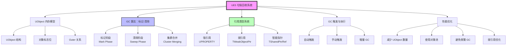

# GC垃圾回收系列概览

> 系统学习 UE5 的自动内存管理机制，掌握 UObject 生命周期、GC 算法原理、引用类型使用，以及在 Lyra 项目中的最佳实践。

## 概述

### 什么是垃圾回收（GC）？

**垃圾回收（Garbage Collection）** 是 UE5 提供的自动内存管理机制，负责自动回收不再使用的 `UObject` 对象，避免手动内存管理带来的内存泄漏和野指针问题。

**核心类比**：
- **手动内存管理**（C++ `new`/`delete`）：像自己收拾房间，容易忘记收拾（内存泄漏）或提前扔掉还在用的东西（野指针）
- **垃圾回收**（GC）：像有了智能保洁系统，自动识别哪些东西不再使用，然后回收它们

### 为什么 GC 对 UE 开发至关重要？

1. **安全性**：自动回收 UObject，避免内存泄漏和野指针
2. **便利性**：无需手动管理 UObject 生命周期
3. **性能影响**：GC 触发时会带来性能开销，需要理解并优化
4. **Lyra 实践**：Lyra 大量使用 UObject（AbilitySystemComponent、GameplayAbility、DataAsset 等），正确管理 GC 是性能关键

### UE5 GC 的核心特点

- **标记-清除算法**（Mark-Sweep）：分两个阶段回收内存
- **根集（Root Set）**：从根对象开始标记所有可达对象
- **引用类型系统**：`UPROPERTY()`、`TWeakObjectPtr`、`TSharedPtr` 等
- **增量 GC**：将 GC 工作分摊到多帧，减少卡顿

## 核心概念全景图

## 学习路径（由浅入深）

本系列分为 **4 个阶段**，建议按顺序学习：

### 阶段 1：基础概念（课时 1-2）

**目标**：理解 UObject 内存模型和 GC 的基本工作原理

- **课时 1：UObject 基础与内存模型** — UObject 结构、对象标志位、Outer 关系
- **课时 2：GC 算法详解** — 标记-清除算法、标记阶段、清除阶段、集群合并

**学习成果**：理解 UObject 如何在内存中表示，GC 如何识别和回收垃圾对象

### 阶段 2：核心机制（课时 3-4）

**目标**：掌握引用类型和 UObject 生命周期管理

- **课时 3：引用类型系统** — `UPROPERTY()` 强引用、`TWeakObjectPtr` 弱引用、`TSharedPtr` 智能指针
- **课时 4：UObject 生命周期与 GC 交互** — 对象创建、销毁、延迟删除、`BeginDestroy` 流程

**学习成果**：知道如何正确使用不同类型的引用，避免内存泄漏和野指针

### 阶段 3：实战优化（课时 5-6）

**目标**：掌握 GC 触发时机、性能分析和优化策略

- **课时 5：GC 触发时机与收集流程** — 自动触发条件、手动触发 API、GC 日志分析
- **课时 6：GC 性能优化策略** — 减少 UObject 数量、对象池、增量 GC、弱引用优化

**学习成果**：能够诊断 GC 性能问题，并应用优化策略

### 阶段 4：Lyra 实战（课时 7）

**目标**：学习 Lyra 项目中的 GC 最佳实践

- **课时 7：Lyra 项目中的 GC 实践** — Lyra 如何使用 UObject、GC 优化技巧、常见 pitfalls

**学习成果**：理解 Lyra 的 UObject 管理模式，能够为自己的项目设计 GC 友好的架构

## 与 Lyra 项目的关系

Lyra 大量使用 UObject 派生类，理解 GC 对以下模块至关重要：

| Lyra 模块 | UObject 使用情况 | GC 相关要点 |
|-----------|------------------|--------------|
| **AbilitySystemComponent** | ASC 是 UActorComponent | 正确管理 Ability/Effect 的生命周期 |
| **GameplayAbility** | GA 是 UObject | 激活时持有引用，结束时要正确清理 |
| **GameplayEffect** | GE 是 UObject | 持续时间由 GE 管理，到期自动清理 |
| **DataAsset** | 数据资产是 UObject | 通常强引用，需避免循环引用 |
| **Experience Definition** | 体验定义是 UObject | 加载/卸载时需要管理引用 |

**Lyra 案例预告**：在课时 7 中，我们会深入分析：
- Lyra 如何使用 `TWeakObjectPtr` 避免循环引用
- Lyra 的对象池实现（武器、特效）
- Lyra 如何优化 GC 性能（减少 UObject 数量、使用 FastArray）

## 前置知识

开始本系列前，建议你已经了解：

- **C++ 基础**：指针、引用、智能指针（`std::shared_ptr`/`std::weak_ptr`）
- **UE 框架基础**：建议先学习 `ue-framework` 系列，至少读完 Actor 和 UObject 部分
- **内存管理基础**：堆/栈、内存分配、内存泄漏概念

如果缺少前置知识，不用担心，本系列会从基础讲起，但进度会稍快。

## 系列导航

| 课时 | 标题 | 难度 | 内容概要 |
|------|------|------|----------|
| 00 | **本页** | 入门 | 系列概览和学习路径 |
| 01 | [UObject 基础与内存模型](#) | 入门 | UObject 结构、标志位、Outer |
| 02 | [GC 算法详解](#) | 中级 | 标记-清除、集群合并 |
| 03 | [引用类型系统](#) | 中级 | UPROPERTY、TWeakObjectPtr、TSharedPtr |
| 04 | [UObject 生命周期与 GC 交互](#) | 中级 | 创建、销毁、延迟删除 |
| 05 | [GC 触发时机与收集流程](#) | 中高级 | 触发条件、手动 API、日志分析 |
| 06 | [GC 性能优化策略](#) | 高级 | 对象池、增量 GC、优化技巧 |
| 07 | [Lyra 项目中的 GC 实践](#) | 高级 | Lyra 案例分析、最佳实践 |

> **注意**：课时 01-07 会逐步发布，请关注知识库更新。

## 相关页面

- [[30-tutorials/performance-optimization/04-内存优化]] - 性能优化系列：内存优化（包含 GC 优化内容）
- [[30-tutorials/ue-framework/40-actor-system/00-AActor架构概述]] - UE 框架系列：Actor 系统概述
- [[30-tutorials/ue-framework/40-actor-system/01-AActor完整生命周期]] - UE 框架系列：Actor 生命周期

## 参考资料

- [UE5 官方文档：垃圾回收](https://docs.unrealengine.com/5.0/en-US/objects-in-unreal-engine/)
- UE5 源码：`Engine/Source/Runtime/CoreUObject/Private/UObject/GarbageCollection.cpp`
- UE5 源码：`Engine/Source/Runtime/CoreUObject/Public/UObject/UnrealObjectGC.h`

---

> 最后更新：2026-05-17

<!-- nav:auto -->

---

**导航**: [[30-tutorials/garbage-collection/01-UObject基础与内存模型|01-UObject基础与内存模型]] →

<!-- /nav:auto -->
