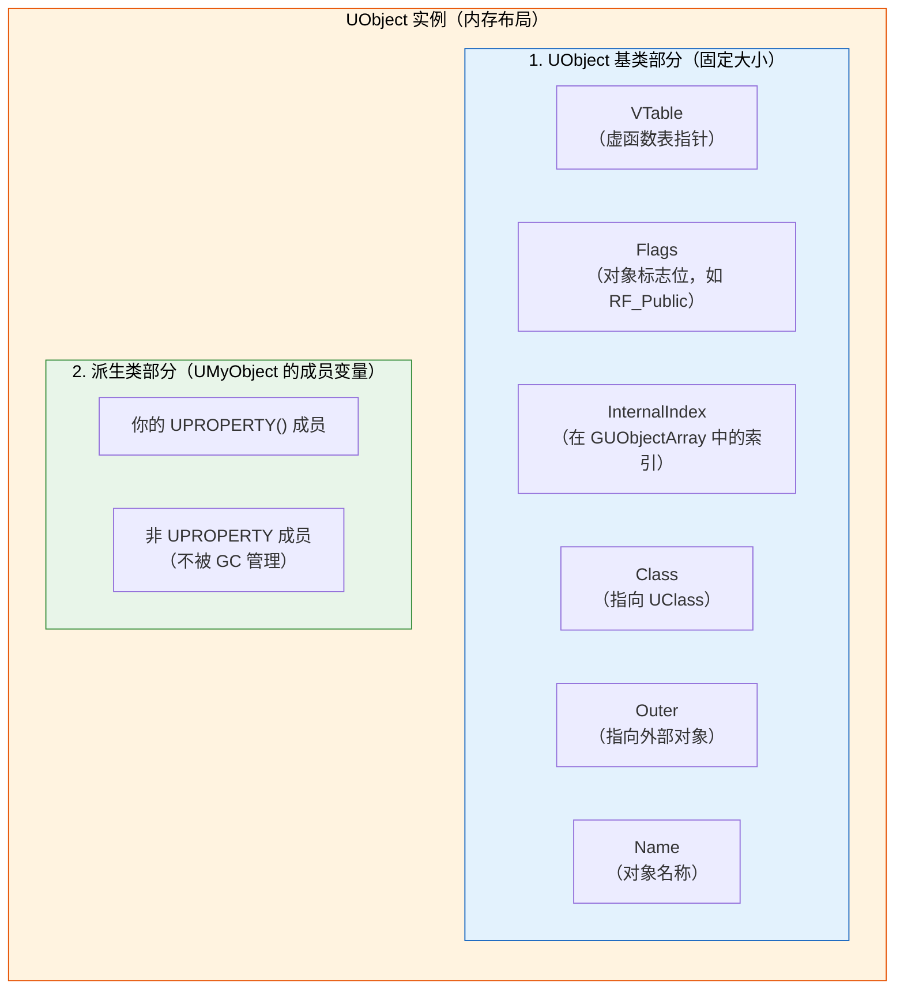
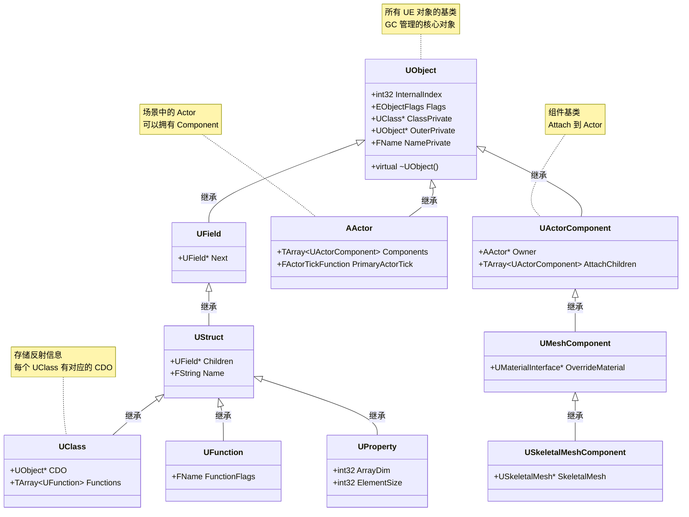
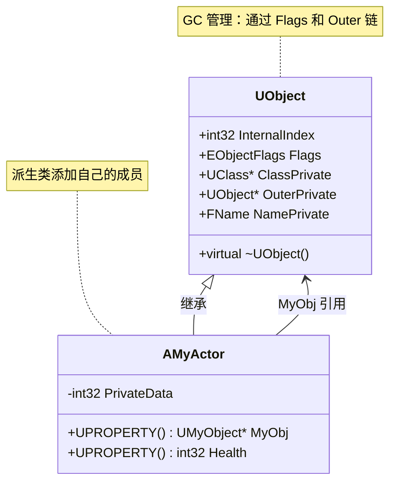
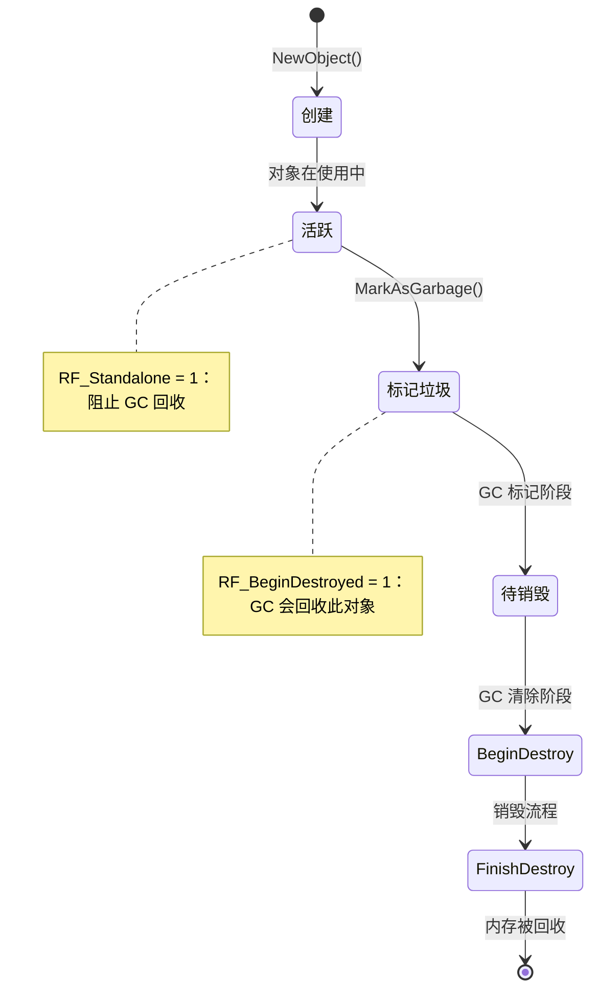
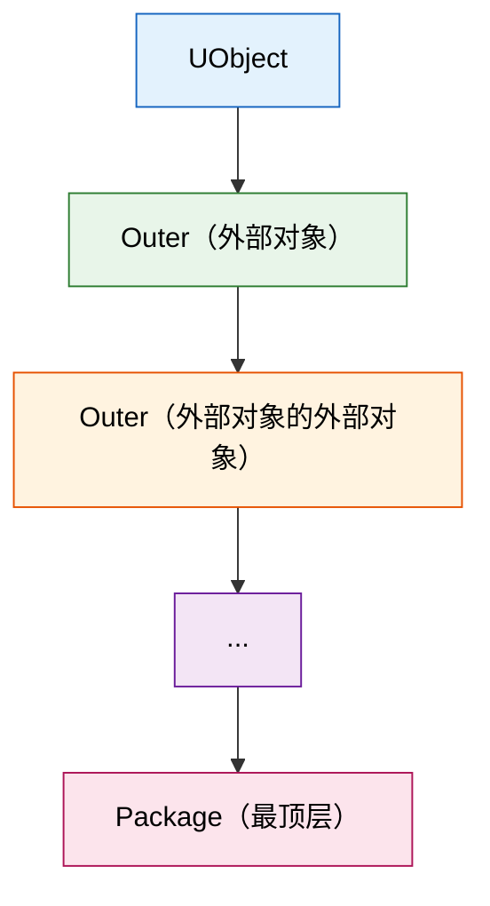

# UObject基础与内存模型

> 理解 UObject 的内存布局和 GC 相关标志位，是掌握 UE 垃圾回收机制的基础。

**术语说明**（首次出现）：
- `GUObjectArray`：UE 的全局对象数组，存储所有 UObject 指针，GC 通过它遍历对象
- `RF_Public`、`RF_Standalone` 等：UObject 的标志位（Flags），控制 GC 行为（详见第 2 节）
- `Outer`：UObject 的"外部对象"，形成引用链，影响 GC 可达性判断

## 本课目标

学完本课，你将能够：
1. 理解 UObject 在内存中的布局结构
2. 识别 UObject 的 GC 相关标志位（`RF_Public`、`RF_Standalone`、`RF_PendingKill` 等）
3. 理解 UObject 的 `Outer` 关系及其对 GC 的影响
4. 知道如何正确使用 `UObject`（创建、引用、销毁）

## 1. UObject 内存模型

### 1.1 UObject 在内存中的布局

UObject 在内存中分为两部分：



**关键点**：
- `GUObjectArray` 是全局对象数组，存储所有 UObject 的指针
- `InternalIndex` 是对象在 `GUObjectArray` 中的索引，GC 使用它来遍历对象

### 1.2 mermaid 图示：UObject 继承关系



### 1.3 代码示例：UObject 结构

```cpp
// Engine/Source/Runtime/CoreUObject/Public/UObject/Object.h (简化)

class UObject
{
public:
    // 虚函数表指针（vtable）
    virtual ~UObject() {}
    
    // 对象标志位（GC 核心）
    EObjectFlags Flags;
    
    // 在 GUObjectArray 中的索引
    int32 InternalIndex;
    
    // 指向 UClass（反射信息）
    UClass* ClassPrivate;
    
    // 外部对象（Outer 链）
    UObject* OuterPrivate;
    
    // 对象名称
    FName NamePrivate;
    
    // ... 其他方法
};
```

### 1.4 mermaid 图示：UObject 内存布局



## 2. UObject 标志位（Flags）

### 2.1 核心标志位（EObjectFlags）

UObject 的标志位决定了 GC 如何处理该对象。以下是 GC 相关的核心标志位：

| 标志位 | 值 | 含义 | GC 影响 |
|--------|-----|------|---------|
| `RF_Public` | 0x00000001 | 对象对外可见 | 不影响 GC |
| `RF_Standalone` | 0x00000002 | 对象是"独立"的，不会被 GC 回收 | **阻止 GC 回收** |
| `RF_Transactional` | 0x00000004 | 支持撤销/重做 | 不影响 GC |
| `RF_ClassDefaultObject` | 0x00000008 | 是类的默认对象（CDO） | **永远不被 GC 回收** |
| `RF_ArchetypeObject` | 0x00000010 | 是原型对象 | 不影响 GC |
| `RF_Transient` | 0x00000020 | 对象是"临时"的，不会保存到磁盘 | 不影响 GC |
| `RF_Cooked` | 0x00000040 | 对象已被 Cook | 不影响 GC |
| `RF_LoadCompleted` | 0x00000080 | 加载完成 | 不影响 GC |
| `RF_InheritableFlags` | 0x00000100 | 标志位可被继承 | 不影响 GC |
| `RF_PendingKill` | 0x00000200 | **等待销毁**（已废弃，用 RF_BeginDestroyed） | **GC 会回收** |
| `RF_BeginDestroyed` | 0x00000400 | 已开始销毁流程 | **GC 会回收** |
| `RF_FinishDestroyed` | 0x00000800 | 已完成销毁流程 | **GC 会回收** |
| `RF_EndOfObjectFlags` | 0x00001000 | 标志位结束标记 | 不影响 GC |

**最重要的标志位**（必须记住）：
1. **`RF_Standalone`**：对象不会被 GC 回收（除非手动清除此标志位）
2. **`RF_PendingKill` / `RF_BeginDestroyed`**：对象已标记为"待销毁"，GC 会回收

### 2.2 代码示例：检查标志位

```cpp
// 检查对象是否会被 GC 回收

UObject* MyObj = NewObject<UMyObject>();

// 检查是否为 Standalone（不会被 GC 回收）
if (MyObj->HasAnyFlags(RF_Standalone))
{
    UE_LOG(LogTemp, Warning, TEXT("MyObj is Standalone, won't be GC'd"));
}

// 标记对象为 Standalone（阻止 GC 回收）
MyObj->SetFlags(RF_Standalone);

// 清除 Standalone 标志位（允许 GC 回收）
MyObj->ClearFlags(RF_Standalone);

// 标记对象为 PendingKill（告诉 GC 可以回收）
// ⚠️ UE4 风格，UE5 推荐使用 MarkAsGarbage()
MyObj->MarkPendingKill();

// UE5 推荐方式：标记为垃圾
MyObj->MarkAsGarbage();
```

### 2.3 mermaid 图示：标志位与 GC 的关系



## 3. UObject 的 Outer 关系

### 3.1 什么是 Outer？

`Outer` 是 UObject 的"外部对象"，形成一条 **Outer 链**：



**核心规则**：
- 如果一个对象 **有被引用的 Outer**，那么它的 **Outer 被引用 = 它也被引用**
- GC 从 **根对象（Root Set）** 开始，沿着 **引用链 + Outer 链** 标记所有可达对象

### 3.2 代码示例：Outer 链

```cpp
// 创建一个 UObject，指定 Outer
UMyObject* MyObj = NewObject<UMyObject>(GetTransientPackage(), TEXT("MyObj"));

// 查看 Outer 链
UObject* Current = MyObj;
while (Current)
{
    UE_LOG(LogTemp, Log, TEXT("Object: %s, Outer: %s"),
        *Current->GetName(),
        Current->GetOuter() ? *Current->GetOuter()->GetName() : TEXT("None"));
    Current = Current->GetOuter();
}

// 输出示例：
// Object: MyObj, Outer: TransientPackage
// Object: TransientPackage, Outer: None
```

### 3.3 mermaid 图示：Outer 链与 GC

```mermaid
graph TB
    Root[根对象<br/>Root Set] --> A[UObject A]
    Root --> B[UObject B]
    
    A --> A1[UObject A1<br/>Outer = A]
    A --> A2[UObject A2<br/>Outer = A]
    
    A1 --> A11[UObject A11<br/>Outer = A1]
    
    B --> B1[UObject B1<br/>Outer = B]
    
    style Root fill:#f9f,stroke:#333,stroke-width:4px
    style A fill:#bbf,stroke:#333,stroke-width:2px
    style A1 fill:#bbf,stroke:#333,stroke-width:2px
    style A11 fill:#bbf,stroke:#333,stroke-width:2px
    style B fill:#bfb,stroke:#333,stroke-width:2px
    style B1 fill:#bfb,stroke:#333,stroke-width:2px
    
    note right of Root
        GC 从根对象开始标记：
        1. 标记 Root 可达的所有对象
        2. 沿着引用链 + Outer 链遍历
        3. 未标记的对象 = 垃圾，会被回收
    end note
```

## 4. 正确使用 UObject

### 4.1 创建 UObject

```cpp
// ✅ 正确：使用 NewObject()
UMyObject* MyObj = NewObject<UMyObject>();

// ✅ 正确：指定 Outer
UMyObject* MyObj = NewObject<UMyObject>(this, TEXT("MyObj"));

// ❌ 错误：不要使用 new
// UMyObject* MyObj = new UMyObject();  // 错误！不会被 GC 管理
```

### 4.2 引用 UObject

```cpp
// ✅ 正确：使用 UPROPERTY() 保持强引用
UCLASS()
class AMyActor : public AActor
{
    GENERATED_BODY()
    
public:
    // UPROPERTY() 会被 GC 识别，防止对象被回收
    UPROPERTY()
    UMyObject* MyObj;
};

// ❌ 错误：裸指针，不会阻止 GC 回收
UMyObject* MyObj;  // 危险！GC 可能回收 MyObj
```

### 4.3 销毁 UObject

```cpp
// ✅ UE5 推荐方式：标记为垃圾，等待 GC 回收
MyObj->MarkAsGarbage();

// ✅ 立即销毁（慎用，可能线程不安全）
MyObj->ConditionalBeginDestroy();

// ❌ 不要手动 delete
// delete MyObj;  // 错误！应该让 GC 管理
```

## Lyra 中的实践

Lyra 项目大量使用 UObject 派生类来管理游戏数据和逻辑。理解 UObject 基础对于正确管理 Lyra 中的对象生命周期至关重要。

### Lyra 中的关键 UObject 类

| Lyra 类 | 作用 | GC 注意事项 |
|----------|------|----------------|
| `ULyraAssetManager` | 资源管理器（继承自 `UObject`） | 使用 `UPROPERTY()` 保持 AssetManager 引用的对象存活 |
| `ULyraExperienceDefinition` | 体验定义（数据资产） | 通常设为 `RF_Standalone`，不会被 GC 回收 |
| `ULyraGameplayAbility` | Gameplay Ability（继承自 `UObject`） | Ability 激活时持有引用，结束时清理 |
| `ULyraWeaponDefinition` | 武器定义（数据资产） | 通过 `TSoftObjectPtr` 延迟加载，避免占用内存 |

### Lyra 中的 UObject 使用模式

```cpp
// Lyra 示例：使用 UPROPERTY() 保持强引用
UCLASS()
class ULyraInventoryManagerComponent : public UActorComponent
{
    GENERATED_BODY()

public:
    // ✅ 使用 UPROPERTY() 防止 GC 回收
    UPROPERTY()
    TArray<TObjectPtr<ULyraInventoryItemDefinition>> InventoryItems;

    // ✅ 使用 TWeakObjectPtr 避免循环引用
    TArray<TWeakObjectPtr<ULyraInventoryItemDefinition>> CachedItems;
};
```

**要点**：
- Lyra 中的 UObject 派生类都应通过 `UPROPERTY()` 引用，确保 GC 正确管理生命周期
- 数据资产（如 `ULyraWeaponDefinition`）通常设为 `RF_Standalone`，在游戏生命周期内保持存活
- 使用 `TWeakObjectPtr` 打破潜在循环引用（如 Inventory ↔ Item）

## 总结与要点

| 知识点 | 核心内容 | 记住这个 |
|--------|----------|----------|
| **UObject 内存布局** | 基类部分 + 派生类部分 | `GUObjectArray` 存储所有 UObject |
| **标志位** | `RF_Standalone` 阻止 GC，`RF_BeginDestroyed` 允许 GC | `MarkAsGarbage()` 标记对象为垃圾 |
| **Outer 链** | Outer 关系影响 GC 可达性 | 引用一个对象 = 引用它的所有 Outer |
| **正确使用** | `NewObject()` 创建，`UPROPERTY()` 引用，`MarkAsGarbage()` 销毁 | 不要 `new`/`delete` UObject |

## 相关页面

- [[30-tutorials/garbage-collection/00-GC垃圾回收系列概览]] - GC 系列概览
- [[30-tutorials/garbage-collection/02-GC算法详解]] - 下一课：GC 算法详解
- [[30-tutorials/ue-framework/40-actor-system/00-AActor架构概述]] - UE 框架系列：Actor 系统概述

---


> 最后更新：2026-05-17

<!-- nav:auto -->

---

**导航**: ← [[30-tutorials/garbage-collection/00-GC垃圾回收系列概览|00-GC垃圾回收系列概览]] · [[30-tutorials/garbage-collection/02-GC算法详解|02-GC算法详解]] →

<!-- /nav:auto -->
