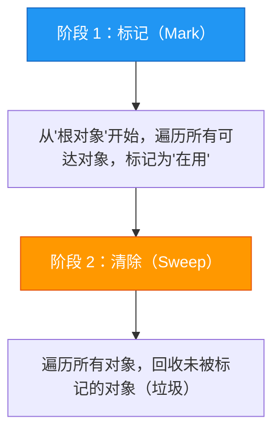
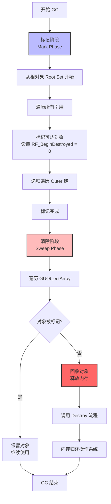

# GC算法详解

> 深入 UE5 的垃圾回收算法（标记-清除），理解 GC 如何识别和回收垃圾对象。

## 本课目标

学完本课，你将能够：
1. 理解 **标记-清除（Mark-Sweep）** 算法的工作原理
2. 识别 GC 的 **标记阶段（Mark Phase）** 和 **清除阶段（Sweep Phase）**
3. 理解 **集群合并（Cluster Merging）** 如何优化 GC 性能
4. 使用 GC 日志和调试工具分析 GC 行为

## 1. 标记-清除（Mark-Sweep）算法

### 1.1 算法概述

UE5 使用 **标记-清除** 算法进行垃圾回收，分为两个阶段：



**核心类比**：
- **标记阶段** = 保洁员从大门（根对象）开始，进入每个房间（对象），标记所有还在使用的物品
- **清除阶段** = 保洁员再次巡视，把没有标记的物品当垃圾扔掉

### 1.2 mermaid 图示：标记-清除流程



### 1.3 代码示例：标记阶段核心逻辑

```cpp
// Engine/Source/Runtime/CoreUObject/Private/UObject/GarbageCollection.cpp (简化)

// 标记阶段核心函数
void FUObjectHashTables::MarkObjectsAsReachable(...)
{
    // 1. 从根对象开始
    for (UObject* Root : RootSet)
    {
        // 2. 标记此对象为"可达"
        Root->SetFlags(RF_BeginDestroyed);  // 注意：这里 RF_BeginDestroyed = 0 表示可达
        
        // 3. 递归遍历所有引用
        MarkReferencedObjects(Root);
    }
}

void MarkReferencedObjects(UObject* Obj)
{
    // 遍历此对象的所有 UPROPERTY() 引用
    ForEachObjectWithOuter(Obj, [](UObject* Inner)
    {
        // 标记 Inner 为可达
        Inner->ClearFlags(RF_BeginDestroyed);  // 清除 = 可达
        
        // 递归处理 Inner 的引用
        MarkReferencedObjects(Inner);
    });
}
```

## 2. 根对象（Root Set）

### 2.1 什么是根对象？

**根对象（Root Set）** 是 GC 的起点，包括：
1. **全局变量**中的 UObject 指针
2. **本地变量**（在栈上）中的 UObject 指针
3. **UPROPERTY()** 引用的对象（被某个根对象引用）
4. **RF_Standalone** 标志位的对象
5. **AddToRoot()** 调用的对象

**核心规则**：
- 从根对象 **可达** 的对象 = 不会被回收
- 从根对象 **不可达** 的对象 = 垃圾，会被回收

### 2.2 代码示例：根对象管理

```cpp
// 示例 1：UPROPERTY() 保持根引用
UCLASS()
class AMyActor : public AActor
{
    GENERATED_BODY()
    
public:
    // ✅ 此对象被 AMyActor 引用，不会被 GC 回收
    UPROPERTY()
    UMyObject* MyObj;
};

// 示例 2：AddToRoot() 手动添加到根集
UMyObject* MyObj = NewObject<UMyObject>();
MyObj->AddToRoot();  // 手动添加到根集，不会被 GC 回收

// 使用完毕后，从根集移除
MyObj->RemoveFromRoot();  // 允许 GC 回收
```

### 2.3 mermaid 图示：根对象与可达性

```mermaid
graph TB
    Root[根对象<br/>Root Set] --> A[UObject A<br/>被根引用]
    Root --> B[UObject B<br/>被根引用]
    
    A --> A1[UObject A1<br/>被 A 引用]
    A --> A2[UObject A2<br/>被 A 引用]
    
    A1 --> A11[UObject A11<br/>被 A1 引用]
    
    B --> B1[UObject B1<br/>被 B 引用]
    
    C[UObject C<br/>无引用]
    C1[UObject C1<br/>仅被 C 引用]
    
    style Root fill:#f9f,stroke:#333,stroke-width:4px
    style A fill:#bfb,stroke:#333,stroke-width:2px
    style A1 fill:#bfb,stroke:#333,stroke-width:2px
    style A11 fill:#bfb,stroke:#333,stroke-width:2px
    style B fill:#bfb,stroke:#333,stroke-width:2px
    style B1 fill:#bfb,stroke:#333,stroke-width:2px
    
    style C fill:#fbb,stroke:#333,stroke-width:2px
    style C1 fill:#fbb,stroke:#333,stroke-width:2px
    
    note right of Root
        GC 从根对象开始：
        1. 标记 A、B 为"可达"
        2. 递归标记 A1、A2、A11、B1
        3. C 和 C1 不可达 = 垃圾
    end note
```

## 3. 集群合并（Cluster Merging）

### 3.1 为什么需要集群合并？

**问题**：如果 UObject 数量非常多（如 100 万个），GC 遍历每个对象的开销很大。

**解决方案**：**集群合并（Cluster Merging）** — 将"总是一起使用的对象"合并成一个集群，GC 只标记集群的根，而不是每个对象。

### 3.2 集群合并规则

UE5 自动合并满足以下条件的对象：
1. **Outer 关系**：一个对象是另一个的 Outer
2. **UPROPERTY() 强引用**：对象 A 通过 `UPROPERTY()` 引用对象 B
3. **相同 Class**：相同类型的对象可能被合并（可配置）

### 3.3 代码示例：集群合并配置

```cpp
// 在 DefaultEngine.ini 中配置集群合并

[/Script/Engine.GarbageCollectionSettings]
; 启用集群合并（默认开启）
gc.MaxObjectsInEditor=2097152
gc.MaxObjectsInGame=2097152

; 集群合并阈值（对象数量超过此值才合并）
gc.ClusterForwardingThreshold=0

; 禁用特定类的集群合并
gc.CreateClusterForDerivedClasses=False
```

### 3.4 mermaid 图示：集群合并优化

```mermaid
graph TB
    subgraph "合并前（无集群）"
        A1[UObject A] --> B1[UObject B]
        A1 --> C1[UObject C]
        B1 --> D1[UObject D]
        B1 --> E1[UObject E]
    end
    
    subgraph "合并后（有集群）"
        Root2[集群根] --> Cluster[集群 A-B-C-D-E]
        Cluster --> F2[标记为 1 个单元]
    end
    
    style Cluster fill:#bbf,stroke:#333,stroke-width:2px
    
    note right of Cluster
        优化效果：
        - 合并前：GC 遍历 5 个对象
        - 合并后：GC 只遍历 1 个集群
        - 性能提升：5x（示例）
    end note
```

## 4. GC 日志与调试

### 4.1 启用 GC 日志

```cpp
// 在 Console 中输入：
gc.LogGarbage=true  // 启用 GC 日志

// 或编辑 DefaultEngine.ini：
[/Script/Engine.GarbageCollectionSettings]
gc.LogGarbage=true
```

### 4.2 分析 GC 日志

```
LogGarbage: Display: GC start
LogGarbage: Display: Mark phase: 1234 objects marked reachable
LogGarbage: Display: Sweep phase: 567 objects collected, 89.0 MB freed
LogGarbage: Display: GC took 15.3 ms
```

**关键指标**：
- `objects marked reachable`：标记阶段找到的活跃对象数量
- `objects collected`：清除阶段回收的垃圾对象数量
- `MB freed`：回收的内存大小
- `GC took X ms`：GC 耗时（影响帧率）

### 4.3 常用 GC 控制台命令

| 命令 | 作用 |
|------|------|
| `gc` | 手动触发一次完整 GC |
| `gc.IncrementalBegin` | 开始增量 GC |
| `gc.IncrementalEnd` | 结束增量 GC |
| `gc.MaxObjectsInEditor` | 设置编辑器最大对象数 |
| `gc.MaxObjectsInGame` | 设置游戏最大对象数 |
| `gc.LogGarbage` | 启用/禁用 GC 日志 |
| `gc.CreateClusterForDerivedClasses` | 启用/禁用集群合并 |
| `gc.DestroyOnLoad` | 加载时立即销毁对象 |
```

## Lyra 中的实践

Lyra 项目虽然不直接操作 GC 算法，但其对象管理策略对 GC 性能有重要影响。

### Lyra 中的 GC 相关实践

1. **Experience 加载与 GC**：
   - Lyra 的 `ULyraExperienceDefinition` 通常设为 `RF_Standalone`，确保整个游戏会话期间不被 GC 回收
   - 切换 Experience 时，旧 Experience 的引用被清除，相关对象在下次 GC 时被回收

2. **GameFeature 插件与 GC**：
   - 卸载 GameFeature 插件时，插件创建的对象需要正确清理引用
   - Lyra 使用 `UGameFrameworkComponentManager` 管理组件生命周期，确保在插件卸载时正确清理

3. **性能监控**：
   - 在 Lyra 开发中会启用 GC 日志（`gc.LogGarbage=true`）监控 GC 性能
   - 如果在加载界面或切换 Experience 时帧率突然下降，可能是 GC 触发导致

### Lyra 代码示例：安全的对象引用

```cpp
// Lyra 示例：使用 AddReferencedObjects 保持对象存活（非 UPROPERTY 引用）
UCLASS()
class ULyraSomeComponent : public UActorComponent
{
    GENERATED_BODY()

public:
    // ❌ 裸指针 - GC 可能回收
    UMyObject* UnsafePtr;

    // ✅ 使用 UPROPERTY() - GC 会识别
    UPROPERTY()
    UMyObject* SafePtr;

    // ✅ 非 UPROPERTY 引用需要手动告诉 GC
    UMyObject* CustomRef;

    // 重写 AddReferencedObjects 告诉 GC 此对象被引用
    static void AddReferencedObjects(UObject* InThis, FReferenceCollector& Collector)
    {
        Collector.AddReferencedObject(CastChecked<ULyraSomeComponent>(InThis)->CustomRef);
    }
};
```

**要点**：
- Lyra 中大部分引用都通过 `UPROPERTY()` 管理，GC 自动处理
- 少数特殊情况（如动态数组、自定义容器）需要手动实现 `AddReferencedObjects`

## 总结与要点

| 知识点 | 核心内容 | 记住这个 |
|--------|----------|----------|
| **标记-清除算法** | 标记阶段（标记可达对象）+ 清除阶段（回收不可达对象） | 分两阶段，先标记再清除 |
| **根对象（Root Set）** | 全局变量、UPROPERTY()、AddToRoot() | 从根可达 = 不被回收 |
| **集群合并** | 合并相关对象，减少 GC 遍历次数 | 优化 GC 性能的关键 |
| **GC 日志** | `gc.LogGarbage=true`，分析 `GC took X ms` | 监控 GC 性能影响 |

## 相关页面

- [[30-tutorials/garbage-collection/01-UObject基础与内存模型]] - 上一课：UObject 基础
- [[30-tutorials/garbage-collection/03-引用类型系统]] - 下一课：引用类型系统
- [[30-tutorials/performance-optimization/04-内存优化]] - 性能优化：内存优化

---


> 最后更新：2026-05-17

<!-- nav:auto -->

---

**导航**: ← [[30-tutorials/garbage-collection/01-UObject基础与内存模型|01-UObject基础与内存模型]] · [[30-tutorials/garbage-collection/03-引用类型系统|03-引用类型系统]] →

<!-- /nav:auto -->
