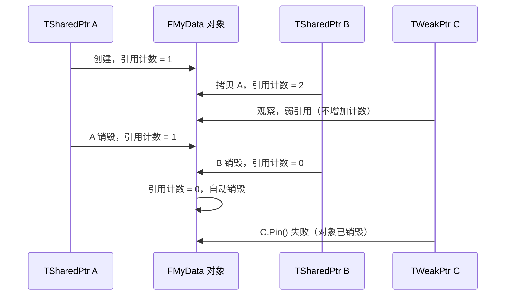

# 引用类型系统

> 掌握 UE 中不同的引用类型，避免内存泄漏、野指针和循环引用问题。

## 本课目标

学完本课，你将能够：
1. 区分 **强引用** 和 **弱引用**
2. 正确使用 `UPROPERTY()` 保持强引用
3. 使用 `TWeakObjectPtr` 避免循环引用
4. 理解 `TSharedPtr`/`TSharedRef` 与 `UObject` 的区别
5. 识别和修复常见的引用问题

## 1. 强引用 vs 弱引用

### 1.1 核心概念

| 引用类型 | 是否阻止 GC | 用途 | UE 实现 |
|---------|-------------|------|---------|
| **强引用** | ✅ 是 | 保持对象存活 | `UPROPERTY()`、`AddToRoot()` |
| **弱引用** | ❌ 否 | 观察对象，不阻止 GC | `TWeakObjectPtr`、`TWeakPtr` |

**核心类比**：
- **强引用** = 紧紧抓住某物，垃圾回收时不会被扔掉
- **弱引用** = 看着某物但不抓住，垃圾回收时可能被扔掉（但你会收到通知）

### 1.2 mermaid 图示：强引用 vs 弱引用

```mermaid
graph TB
    subgraph "强引用（阻止 GC）"
        A1[根对象] -->|UPROPERTY| B1[UObject A]
        A1 -->|UPROPERTY| C1[UObject B]
        B1 -->|UPROPERTY| D1[UObject C]
        
        style A1 fill:#f9f,stroke:#333,stroke-width:4px
        style B1 fill:#bfb,stroke:#333,stroke-width:2px
        style C1 fill:#bfb,stroke:#333,stroke-width:2px
        style D1 fill:#bfb,stroke:#333,stroke-width:2px
        
        note1[这些对象都会被 GC 标记为"可达"<br/>不会被回收]
    end
    
    subgraph "弱引用（不阻止 GC）"
        A2[根对象] -->|TWeakObjectPtr| B2[UObject X]
        A2 -.->|观察，不引用| B2
        
        style A2 fill:#f9f,stroke:#333,stroke-width:4px
        style B2 fill:#fbb,stroke:#333,stroke-width:2px
        
        note2[UObject X 不会被此引用标记为"可达"<br/>如果没有其他强引用，会被 GC 回收]
    end
```

## 2. UPROPERTY() 强引用

### 2.1 基本用法

```cpp
UCLASS()
class AMyActor : public AActor
{
    GENERATED_BODY()
    
public:
    // ✅ 强引用：MyObj 不会被 GC 回收
    UPROPERTY()
    UMyObject* MyObj;
    
    // ✅ 强引用：数组中的对象都不会被 GC 回收
    UPROPERTY()
    TArray<UMyObject*> MyObjArray;
    
    // ✅ 强引用：Map 中的 Value 不会被 GC 回收
    UPROPERTY()
    TMap<FString, UMyObject*> MyObjMap;
    
    // ❌ 危险：裸指针，不会阻止 GC 回收
    UMyObject* DangerousPtr;  // 野指针风险！
};
```

### 2.2 代码示例：正确使用 UPROPERTY()

```cpp
// MyActor.h
UCLASS()
class AMyActor : public AActor
{
    GENERATED_BODY()
    
public:
    UPROPERTY(EditAnywhere, BlueprintReadWrite, Category="MyCategory")
    UMyObject* MyObj;
    
    UFUNCTION(BlueprintCallable, Category="MyCategory")
    void CreateMyObj();
};

// MyActor.cpp
void AMyActor::CreateMyObj()
{
    // ✅ 正确：创建对象并赋值给 UPROPERTY() 成员
    MyObj = NewObject<UMyObject>(this);
    
    // ✅ MyObj 现在被强引用，不会被 GC 回收
}
```

### 2.3 常见错误

```cpp
// ❌ 错误 1：忘记 UPROPERTY()
UCLASS()
class AMyActor : public AActor
{
    GENERATED_BODY()
    
private:
    UMyObject* MyObj;  // ❌ 没有 UPROPERTY()，会被 GC 回收！
    
public:
    void CreateMyObj()
    {
        MyObj = NewObject<UMyObject>(this);
        // ⚠️ 危险：MyObj 可能在下次 GC 时被回收
    }
};

// ✅ 正确：添加 UPROPERTY()
UCLASS()
class AMyActor : public AActor
{
    GENERATED_BODY()
    
private:
    UPROPERTY()  // ✅ 添加 UPROPERTY()
    UMyObject* MyObj;
};
```

## 3. TWeakObjectPtr 弱引用

### 3.1 为什么需要弱引用？

**问题**：循环引用
```
UObject A →（强引用）→ UObject B
UObject B →（强引用）→ UObject A
```
结果：A 和 B 互相引用，永远不会被 GC 回收 = **内存泄漏**

**解决方案**：使用 `TWeakObjectPtr` 打破循环
```
UObject A →（强引用）→ UObject B
UObject B →（弱引用）→ UObject A  （不阻止 A 被 GC）
```

### 3.2 基本用法

```cpp
// 示例：使用 TWeakObjectPtr 避免循环引用

UCLASS()
class UMyObjectA : public UObject
{
    GENERATED_BODY()
    
public:
    // 强引用：持有 B
    UPROPERTY()
    UMyObjectB* ObjB;
    
    void SetObjB(UMyObjectB* B)
    {
        ObjB = B;
    }
};

UCLASS()
class UMyObjectB : public UObject
{
    GENERATED_BODY()
    
private:
    // ❌ 错误：强引用会导致循环引用
    // UPROPERTY()
    // UMyObjectA* ObjA;
    
    // ✅ 正确：弱引用，打破循环
    TWeakObjectPtr<UMyObjectA> ObjAWeak;
    
public:
    void SetObjA(UMyObjectA* A)
    {
        // 存储弱引用
        ObjAWeak = TWeakObjectPtr<UMyObjectA>(A);
    }
    
    void UseObjA()
    {
        // 使用弱引用前，先检查是否有效
        if (UMyObjectA* A = ObjAWeak.Get())
        {
            // ✅ A 还存活，可以使用
            A->DoSomething();
        }
        else
        {
            // ❌ A 已被 GC 回收，不要使用
            UE_LOG(LogTemp, Warning, TEXT("ObjA has been garbage collected"));
        }
    }
};
```

### 3.3 常用方法

```cpp
TWeakObjectPtr<UMyObject> WeakPtr;

// 1. 赋值
WeakPtr = MyObj;

// 2. 检查是否有效（不为 nullptr 且对象未被 GC）
if (WeakPtr.IsValid())
{
    // 对象还存活
}

// 3. 获取原始指针（需检查有效性）
if (UMyObject* Obj = WeakPtr.Get())
{
    Obj->DoSomething();
}

// 4. 检查是否为 nullptr（不检查 GC 状态）
if (WeakPtr.Get() == nullptr)
{
    // 指针为 nullptr
}

// 5. 重置（清除引用）
WeakPtr.Reset();
```

## 4. TSharedPtr / TSharedRef（非 UObject）

### 4.1 与 UObject 的区别

| 特性 | UObject | 普通 C++ 对象（如 FMyStruct） |
|------|---------|-------------------------------|
| **内存管理** | GC 自动管理 | 手动管理 / 智能指针 |
| **引用类型** | `UPROPERTY()` / `TWeakObjectPtr` | `TSharedPtr` / `TWeakPtr` |
| **适用场景** | Actor、Component、DataAsset 等 | FStruct、非 UObject 数据类 |

### 4.2 TSharedPtr 基本用法

```cpp
// 定义一个非 UObject 类
class FMyData : public TSharedFromThis<FMyData>
{
public:
    int32 Value;
    
    void DoSomething()
    {
        UE_LOG(LogTemp, Log, TEXT("Value: %d"), Value);
    }
};

// 使用 TSharedPtr 管理
TSharedPtr<FMyData> MyDataPtr = MakeShared<FMyData>();
MyDataPtr->Value = 42;

// 使用 TWeakPtr 避免循环引用
TWeakPtr<FMyData> WeakDataPtr = MyDataPtr;

// 检查并获取
if (TSharedPtr<FMyData> Pinned = WeakDataPtr.Pin())
{
    Pinned->DoSomething();
}
```

### 4.3 mermaid 图示：TSharedPtr 引用计数



## 5. 常见引用问题及修复

### 5.1 问题 1：忘记 UPROPERTY()

**症状**：UObject 指针随机变成野指针
**原因**：没有 `UPROPERTY()`，GC 回收了对象
**修复**：添加 `UPROPERTY()`

### 5.2 问题 2：循环引用

**症状**：两个 UObject 互相引用，内存泄漏
**原因**：都是强引用（`UPROPERTY()`）
**修复**：将其中一个改为 `TWeakObjectPtr`

### 5.3 问题 3：在 GameThread 外使用 UObject

**症状**：崩溃或野指针
**原因**：GC 只在 GameThread 运行
**修复**：使用 `TWeakObjectPtr`，并在使用前检查 `IsValid()`

### 5.4 代码示例：修复循环引用

```cpp
// ❌ 错误：循环引用
UCLASS()
class UObjectA : public UObject
{
    GENERATED_BODY()
    
public:
    UPROPERTY()
    UObjectB* ObjB;  // 强引用
};

UCLASS()
class UObjectB : public UObject
{
    GENERATED_BODY()
    
public:
    UPROPERTY()
    UObjectA* ObjA;  // 强引用 → 循环！
};

// ✅ 正确：打破循环
UCLASS()
class UObjectA : public UObject
{
    GENERATED_BODY()
    
public:
    UPROPERTY()
    UObjectB* ObjB;  // 强引用
};

UCLASS()
class UObjectB : public UObject
{
    GENERATED_BODY()
    
private:
    TWeakObjectPtr<UObjectA> ObjAWeak;  // 弱引用，打破循环
    
public:
    void SetObjA(UObjectA* A)
    {
        ObjAWeak = TWeakObjectPtr<UObjectA>(A);
    }
};
```

## Lyra 中的实践

Lyra 项目大量使用 `UPROPERTY()` 和 `TWeakObjectPtr` 来管理 UObject 引用。理解引用类型对于避免内存泄漏和野指针至关重要。

### Lyra 中的引用类型使用模式

| Lyra 类 | 引用类型 | 用途 |
|----------|---------|------|
| `ULyraAbilitySystemComponent` | `UPROPERTY()` | 强引用 GameplayAbility |
| `ULyraInventoryManagerComponent` | `TArray<TWeakObjectPtr<ULyraInventoryItemDefinition>>` | 弱引用，避免循环引用 |
| `ULyraEquipmentManagerComponent` | `UPROPERTY()` | 强引用装备实例 |

### Lyra 代码示例：安全的对象引用

```cpp
// Lyra 示例：使用 UPROPERTY() 保持强引用
UCLASS()
class ULyraAbilitySystemComponent : public UAbilitySystemComponent
{
    GENERATED_BODY()

public:
    // ✅ 使用 UPROPERTY() 防止 GC 回收
    UPROPERTY()
    TArray<TObjectPtr<ULyraGameplayAbility>> GrantedAbilities;

    // ✅ 使用 TWeakObjectPtr 避免循环引用
    TWeakObjectPtr<ALyraCharacter> CachedCharacter;
};
```

**要点**：
- Lyra 中的 UObject 派生类都应通过 `UPROPERTY()` 引用，确保 GC 正确管理生命周期
- 使用 `TWeakObjectPtr` 打破潜在循环引用（如 Inventory ↔ Item）
- 在使用弱引用前，始终检查 `IsValid()`

## 总结与要点

| 引用类型 | 阻止 GC？ | 用途 | 记住这个 |
|---------|-----------|------|----------|
| `UPROPERTY()` | ✅ 是 | 强引用，保持对象存活 | 必须用于 UObject 成员 |
| `TWeakObjectPtr` | ❌ 否 | 弱引用，避免循环引用 | 使用前检查 `IsValid()` |
| `TSharedPtr` | ✅ 是（引用计数） | 非 UObject 对象 | 用于 FStruct 等 |
| `TWeakPtr` | ❌ 否 | 弱引用，避免循环引用 | `Pin()` 获取 `TSharedPtr` |

## 相关页面

- [[30-tutorials/garbage-collection/02-GC算法详解]] - 上一课：GC 算法详解
- [[30-tutorials/garbage-collection/04-UObject生命周期与GC交互]] - 下一课：UObject 生命周期与 GC 交互
- [[30-tutorials/ue-framework/40-actor-system/00-AActor架构概述]] - UE 框架：Actor 系统

---


> 最后更新：2026-05-17

<!-- nav:auto -->

---

**导航**: ← [[30-tutorials/garbage-collection/02-GC算法详解|02-GC算法详解]] · [[30-tutorials/garbage-collection/04-UObject生命周期与GC交互|04-UObject生命周期与GC交互]] →

<!-- /nav:auto -->
