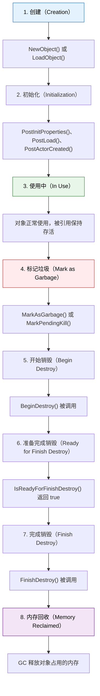
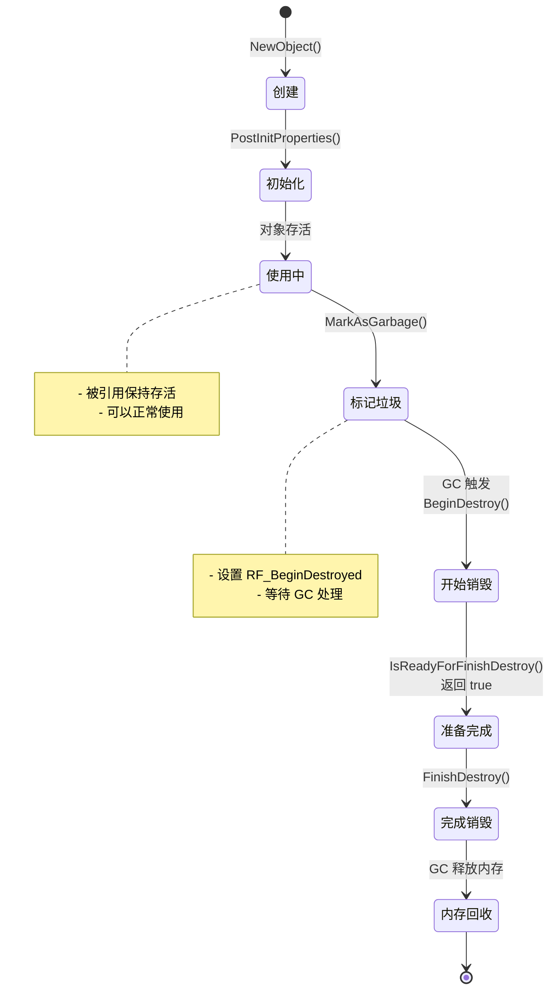
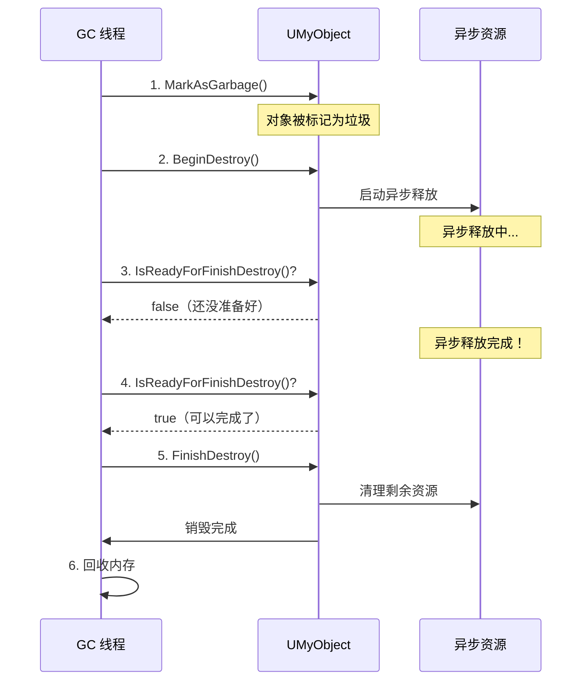
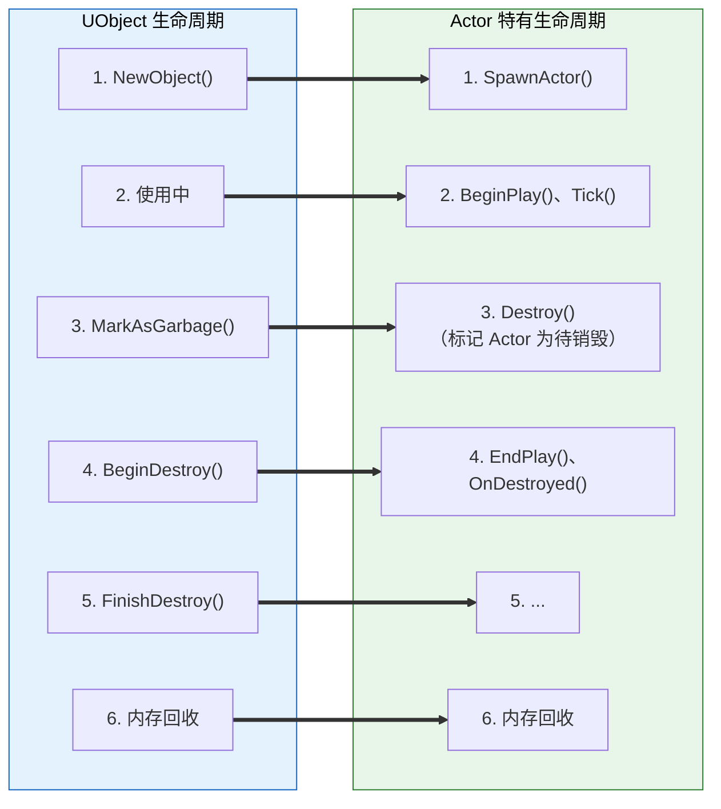

# UObject生命周期与GC交互

> 深入理解 UObject 从创建到销毁的完整生命周期，以及与 GC 的交互时机。

## 本课目标

学完本课，你将能够：
1. 描述 UObject 的完整生命周期（创建 → 使用 → 销毁）
2. 理解 `BeginDestroy()`、`IsReadyForFinishDestroy()`、`FinishDestroy()` 的调用时机
3. 正确使用 `MarkAsGarbage()` 和 `ConditionalBeginDestroy()`
4. 避免在销毁后访问对象（野指针问题）
5. 使用 `IsValidLowLevel()` 和 `IsValidObject()` 安全检查

## 1. UObject 完整生命周期

### 1.1 生命周期阶段

UObject 的生命周期分为以下阶段：



### 1.2 mermaid 图示：UObject 生命周期



### 1.3 代码示例：完整的生命周期

```cpp
// 1. 创建对象
UMyObject* MyObj = NewObject<UMyObject>();

// 2. 使用对象
MyObj->DoSomething();

// 3. 标记对象为垃圾（告诉 GC 可以回收）
MyObj->MarkAsGarbage();

// 4. GC 会在适当时候触发，自动调用：
//    - BeginDestroy()
//    - IsReadyForFinishDestroy()
//    - FinishDestroy()

// 5. 内存被回收
```

## 2. 销毁流程详解

### 2.1 三个关键方法

UObject 的销毁流程涉及三个可重写的虚函数：

| 方法 | 调用时机 | 用途 |
|------|---------|------|
| `BeginDestroy()` | GC 开始销毁对象时 | 启动异步销毁操作（如销毁渲染资源） |
| `IsReadyForFinishDestroy()` | 每帧检查 | 返回 true 时，才调用 `FinishDestroy()` |
| `FinishDestroy()` | `IsReadyForFinishDestroy()` 返回 true 后 | 完成销毁，清理剩余资源 |

### 2.2 代码示例：重写销毁方法

```cpp
UCLASS()
class UMyObjectWithResource : public UObject
{
    GENERATED_BODY()
    
private:
    // 假设有一个需要异步销毁的资源
    FAsyncResource* AsyncResource;
    
public:
    // 1. 开始销毁：启动异步操作
    virtual void BeginDestroy() override
    {
        Super::BeginDestroy();
        
        // 启动异步销毁（如通知渲染线程释放资源）
        if (AsyncResource)
        {
            AsyncResource->ReleaseAsync();
        }
        
        UE_LOG(LogTemp, Log, TEXT("MyObject: BeginDestroy() called"));
    }
    
    // 2. 检查是否可以完成销毁
    virtual bool IsReadyForFinishDestroy() override
    {
        // 等待异步资源释放完成
        if (AsyncResource && !AsyncResource->IsReleased())
        {
            return false;  // 还没准备好，等待下一帧
        }
        
        return Super::IsReadyForFinishDestroy();
    }
    
    // 3. 完成销毁：清理剩余资源
    virtual void FinishDestroy() override
    {
        // 清理剩余资源
        if (AsyncResource)
        {
            delete AsyncResource;
            AsyncResource = nullptr;
        }
        
        UE_LOG(LogTemp, Log, TEXT("MyObject: FinishDestroy() called"));
        
        Super::FinishDestroy();
    }
};
```

### 2.3 mermaid 图示：销毁流程



## 3. 正确使用销毁 API

### 3.1 MarkAsGarbage() vs ConditionalBeginDestroy()

| API | 用途 | 线程安全 | 推荐度 |
|-----|------|----------|--------|
| `MarkAsGarbage()` | 告诉 GC 此对象是垃圾，等待 GC 自动回收 | ✅ 线程安全 | ✅ **推荐**（UE5） |
| `MarkPendingKill()` | UE4 遗留，功能同 `MarkAsGarbage()` | ✅ 线程安全 | ⚠️ 已废弃，不推荐 |
| `ConditionalBeginDestroy()` | 立即开始销毁流程 | ❌ 只能在 GameThread | ⚠️ 谨慎使用 |

### 3.2 代码示例：正确使用

```cpp
UMyObject* MyObj = NewObject<UMyObject>();

// ✅ UE5 推荐方式：标记为垃圾，等待 GC 回收
MyObj->MarkAsGarbage();

// ⚠️ UE4 遗留方式（不推荐）
// MyObj->MarkPendingKill();

// ⚠️ 立即销毁（谨慎使用，可能线程不安全）
// MyObj->ConditionalBeginDestroy();
```

### 3.3 常见错误

```cpp
// ❌ 错误 1：销毁后继续访问
UMyObject* MyObj = NewObject<UMyObject>();
MyObj->MarkAsGarbage();
MyObj->DoSomething();  // ❌ 危险！对象可能已被销毁

// ✅ 正确：销毁后清除指针
UMyObject* MyObj = NewObject<UMyObject>();
MyObj->MarkAsGarbage();
MyObj = nullptr;  // ✅ 清除指针

// ❌ 错误 2：手动 delete UObject
UMyObject* MyObj = NewObject<UMyObject>();
delete MyObj;  // ❌ 错误！应该让 GC 管理

// ✅ 正确：让 GC 管理
MyObj->MarkAsGarbage();
```

## 4. 安全检查

### 4.1 检查对象是否有效

```cpp
UMyObject* MyObj = NewObject<UMyObject>();

// 方法 1：IsValidLowLevel()（快速检查）
if (MyObj && MyObj->IsValidLowLevel())
{
    // 对象可能还有效（但不保证一定未被 GC）
}

// 方法 2：使用 TWeakObjectPtr（推荐）
TWeakObjectPtr<UMyObject> WeakPtr(MyObj);

if (WeakPtr.IsValid())
{
    // ✅ 对象一定未被 GC
    UMyObject* Obj = WeakPtr.Get();
    Obj->DoSomething();
}

// 方法 3：IsValidObject()（UE 宏）
if (IsValidObject(MyObj))
{
    // 对象有效
}
```

### 4.2 代码示例：安全的对象使用

```cpp
UCLASS()
class AMyActor : public AActor
{
    GENERATED_BODY()
    
private:
    // ✅ 使用 TWeakObjectPtr 安全引用
    TWeakObjectPtr<UMyObject> MyObjWeak;
    
public:
    void SetMyObj(UMyObject* Obj)
    {
        MyObjWeak = TWeakObjectPtr<UMyObject>(Obj);
    }
    
    void UseMyObj()
    {
        // ✅ 安全：先检查再使用
        if (UMyObject* Obj = MyObjWeak.Get())
        {
            Obj->DoSomething();
        }
        else
        {
            UE_LOG(LogTemp, Warning, TEXT("MyObj has been destroyed"));
        }
    }
};
```

## 5. 与 Actor 生命周期的关系

### 5.1 Actor 的特殊性

Actor 是 UObject 的派生类，但有额外的生命周期管理：



### 5.2 代码示例：Actor 销毁

```cpp
// Actor 的销毁方式不同
AMyActor* MyActor = GetWorld()->SpawnActor<AMyActor>();

// ✅ 正确：使用 Destroy()（而不是 MarkAsGarbage()）
MyActor->Destroy();

// Destroy() 内部会：
// 1. 调用 EndPlay()
// 2. 从 World 移除
// 3. 标记 UObject 为垃圾（MarkAsGarbage()）
// 4. 等待 GC 回收
```

## Lyra 中的实践

Lyra 项目中的 UObject 生命周期管理遵循 UE5 的最佳实践。理解生命周期对于正确管理 Lyra 中的对象至关重要。

### Lyra 中的生命周期管理

1. **AbilitySystemComponent 生命周期**：
   - `ULyraAbilitySystemComponent` 在 `ALyraCharacter` 创建时初始化
   - 在 Character 销毁时，`BeginDestroy()` 会被调用，清理 GrantedAbilities
   - 使用 `UPROPERTY()` 保持 AbilitySet 引用，确保 GC 不回收

2. **Experience 生命周期**：
   - `ULyraExperienceDefinition` 通常设为 `RF_Standalone`，确保整个游戏会话期间不被 GC 回收
   - 切换 Experience 时，旧 Experience 的引用被清除，相关对象在下次 GC 时被回收

3. **Inventory 生命周期**：
   - `ULyraInventoryManagerComponent` 使用 `TArray<TWeakObjectPtr<ULyraInventoryItemDefinition>>` 避免循环引用
   - 物品销毁时，从数组中移除引用，允许 GC 回收

### Lyra 代码示例：安全的生命周期管理

```cpp
// Lyra 示例：重写 BeginDestroy() 清理引用
UCLASS()
class ULyraAbilitySystemComponent : public UAbilitySystemComponent
{
    GENERATED_BODY()

public:
    // ✅ 使用 UPROPERTY() 防止 GC 回收
    UPROPERTY()
    TArray<TObjectPtr<ULyraGameplayAbility>> GrantedAbilities;

    // 重写 BeginDestroy() 清理引用
    virtual void BeginDestroy() override
    {
        // 清理引用
        GrantedAbilities.Empty();

        Super::BeginDestroy();
    }
};
```

**要点**：
- Lyra 中的 UObject 派生类都应通过 `UPROPERTY()` 引用，确保 GC 正确管理生命周期
- 在 `BeginDestroy()` 中清理引用，避免悬空指针
- 使用 `TWeakObjectPtr` 打破潜在循环引用

## 总结与要点

| 知识点 | 核心内容 | 记住这个 |
|--------|----------|----------|
| **生命周期** | 创建 → 使用 → 标记垃圾 → 销毁 → 回收 | 6 个阶段 |
| **三个关键方法** | `BeginDestroy()`、`IsReadyForFinishDestroy()`、`FinishDestroy()` | 异步销毁流程 |
| **正确销毁** | `MarkAsGarbage()`（UE5 推荐） | 不要 `delete` UObject |
| **安全检查** | `TWeakObjectPtr::IsValid()` | 使用前先检查 |
| **Actor 特殊性** | 使用 `Destroy()` 而不是 `MarkAsGarbage()` | Actor 有额外生命周期 |

## 相关页面

- [[30-tutorials/garbage-collection/03-引用类型系统]] - 上一课：引用类型系统
- [[30-tutorials/garbage-collection/05-GC触发时机与收集流程]] - 下一课：GC 触发时机与收集流程
- [[30-tutorials/ue-framework/40-actor-system/01-AActor完整生命周期]] - UE 框架：Actor 生命周期

---


> 最后更新：2026-05-17

<!-- nav:auto -->

---

**导航**: ← [[30-tutorials/garbage-collection/03-引用类型系统|03-引用类型系统]] · [[30-tutorials/garbage-collection/05-GC触发时机与收集流程|05-GC触发时机与收集流程]] →

<!-- /nav:auto -->
