# GC触发时机与收集流程

> 掌握 GC 何时触发、如何手动控制，以及增量 GC 的使用。

## 本课目标

1. 列举 GC 自动触发条件
2. 使用控制台命令和 C++ API 手动触发 GC
3. 理解增量 GC 原理和使用场景
4. 配置 GC 参数优化性能

## 1. GC 自动触发条件

GC 在以下情况自动触发：

| 条件 | 说明 | 可配置 |
|------|------|--------|
| 对象数超阈值 | `GUObjectArray` 超过 `gc.MaxObjectsInGame` | ✅ |
| 手动调用 | 控制台 `gc` 或 C++ `GEngine->Exec(TEXT("gc"))` | ✅ |
| World 切换 | 切换 Map 时自动触发 | ❌ |
| PIE 结束 | 停止 Play In Editor 时 | ❌ |

### 配置触发阈值（DefaultEngine.ini）

```ini
[/Script/Engine.GarbageCollectionSettings]
gc.MaxObjectsInEditor=2097152
gc.MaxObjectsInGame=2097152
gc.MaxTimeSinceLastCollection=60  ; GC 间隔（秒）
gc.IncrementalBeginDestroyEnabled=True  ; 启用增量 GC
```

## 2. 手动触发 GC

### 控制台命令

| 命令 | 作用 |
|------|------|
| `gc` | 立即触发完整 GC（会卡顿） |
| `gc.IncrementalBegin` | 开始增量 GC |
| `gc.IncrementalEnd` | 立即完成当前增量 GC |
| `gc.LogGarbage` | 启用 GC 日志 |

### C++ API

```cpp
// 方法 1：通过 GEngine（推荐）
if (GEngine)
{
    GEngine->Exec(GetWorld(), TEXT("gc"));
}

// 方法 2：增量 GC
GEngine->Exec(GetWorld(), TEXT("gc.IncrementalBegin"));
// ... 稍后 ...
GEngine->Exec(GetWorld(), TEXT("gc.IncrementalEnd"));

// ❌ 避免：每帧触发 GC
void Tick(float DeltaTime)
{
    // GEngine->Exec(GetWorld(), TEXT("gc"));  // 错误！
}
```

## 3. 增量 GC（Incremental GC）

### 为什么需要增量 GC？

**问题**：完整 GC 可能耗时 10-100+ ms → 游戏卡顿。

**解决方案**：增量 GC 将工作分摊到多帧，每帧只做一小部分。

### mermaid 图示：增量 GC vs 完整 GC

```mermaid
gantt
    title 完整 GC vs 增量 GC
    dateFormat X
    axisFormat %L ms
    
    section 完整 GC
    卡顿 100ms :crit, 0, 100
    
    section 增量 GC
    帧1 :active, 0, 20
    帧2 :active, 20, 40
    帧3 :active, 40, 60
    帧4 :active, 60, 80
    帧5 :active, 80, 100
```



## 4. GC 日志分析

### 启用日志

```ini
[/Script/Engine.GarbageCollectionSettings]
gc.LogGarbage=true
```

### 日志示例

```
LogGarbage: Display: GC start
LogGarbage: Display: Mark phase: 1234 objects marked
LogGarbage: Display: Sweep phase: 567 objects collected, 89.0 MB freed
LogGarbage: Display: GC took 15.3 ms
```

**关键指标**：
- `objects collected`：回收的对象数
- `MB freed`：回收的内存
- `GC took X ms`：GC 耗时（影响帧率）

## Lyra 中的实践

Lyra 项目通常依赖引擎自动触发 GC，而不手动调用。但理解 GC 触发时机对于性能优化很重要。

### Lyra 中的 GC 实践

1. **Experience 切换与 GC**：
   - 切换 Experience 时，旧 Experience 的引用被清除
   - 相关对象在下次 GC 时被回收
   - 如果切换频繁，可能导致 GC 频繁触发

2. **加载界面与 GC**：
   - Lyra 在加载界面时可以主动触发增量 GC（`gc.IncrementalBegin`）
   - 利用加载时间分摊 GC 工作，减少游戏中的卡顿

3. **性能监控**：
   - 在 Lyra 开发中启用 GC 日志（`gc.LogGarbage=true`）监控 GC 性能
   - 如果在切换 Experience 时帧率突然下降，可能是 GC 触发导致

### Lyra 代码示例：安全的 GC 管理

```cpp
// Lyra 示例：在加载界面时主动触发增量 GC
void ALyraGameMode::StartExperienceLoad()
{
    // 开始增量 GC，利用加载时间分摊工作
    GEngine->Exec(GetWorld(), TEXT("gc.IncrementalBegin"));

    // 继续加载 Experience
    LoadNextExperience();
}

void ALyraGameMode::OnExperienceLoaded()
{
    // 加载完成后，结束增量 GC
    GEngine->Exec(GetWorld(), TEXT("gc.IncrementalEnd"));
}
```

**要点**：
- Lyra 依赖引擎自动 GC，不手动调用 `ForceGarbageCollection()`
- 在加载界面时主动触发增量 GC，减少游戏中的卡顿
- 监控 GC 日志，确保 GC 不影响游戏体验

## 总结

| 知识点 | 记住这个 |
|--------|----------|
| 自动触发 | 对象数超阈值、World 切换、PIE 结束 |
| 手动触发 | `GEngine->Exec(TEXT("gc"))` |
| 增量 GC | 分摊 GC 工作到多帧，减少卡顿 |
| 日志分析 | `gc.LogGarbage=true`，关注 `GC took X ms` |

## 相关页面

- [[30-tutorials/garbage-collection/04-UObject生命周期与GC交互]] - 上一课：UObject 生命周期
- [[30-tutorials/garbage-collection/06-GC性能优化策略]] - 下一课：GC 性能优化
- [[30-tutorials/performance-optimization/04-内存优化]] - 性能优化：内存优化

---

> 最后更新：2026-05-17

<!-- nav:auto -->

---

**导航**: ← [[30-tutorials/garbage-collection/04-UObject生命周期与GC交互|04-UObject生命周期与GC交互]] · [[30-tutorials/garbage-collection/06-GC性能优化策略|06-GC性能优化策略]] →

<!-- /nav:auto -->
