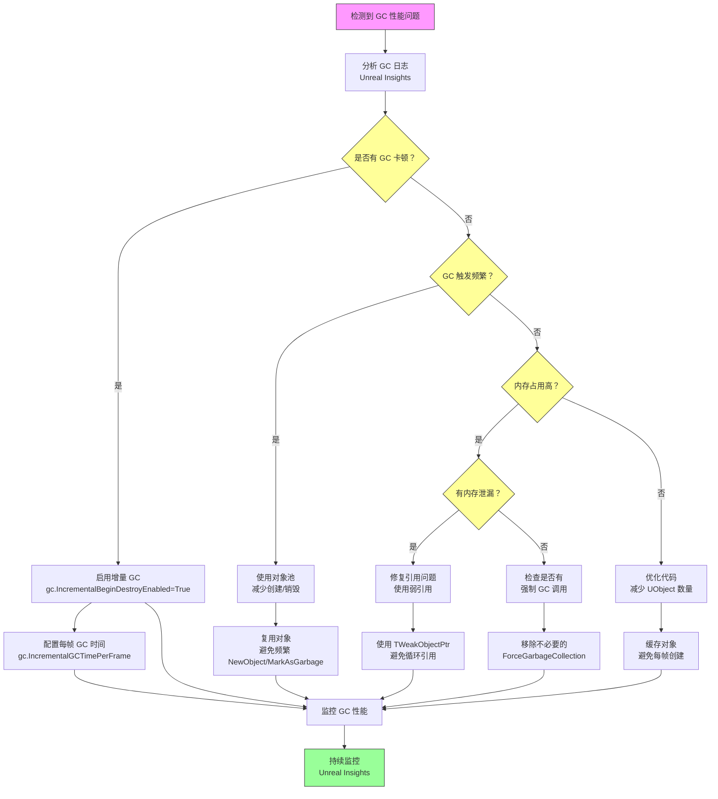
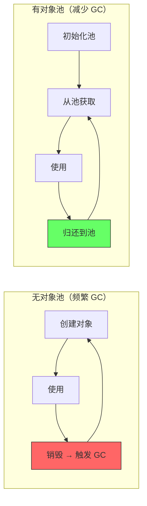

# GC性能优化策略

> 掌握减少 GC 卡顿、优化内存管理的实战技巧。

## 本课目标

1. 识别常见的 GC 性能问题
2. 使用对象池减少 GC 压力
3. 配置增量 GC 减少卡顿
4. 优化 UObject 使用模式
5. 使用性能分析工具诊断 GC 问题

## 1. 常见 GC 性能问题

### 问题清单

| 问题 | 症状 | 原因 | 解决方案 |
|------|------|------|----------|
| GC 卡顿 | 游戏突然卡顿 | GC 在主线程执行 | 增量 GC、对象池 |
| GC 时间长 | `GC took 100+ ms` | UObject 数量过多 | 减少对象数量 |
| 内存占用高 | 内存持续增长 | 内存泄漏（循环引用） | 使用弱引用 |
| GC 频繁触发 | GC 每几秒触发一次 | 对象创建/销毁频繁 | 对象池 |

### 1.2 GC 优化决策流程图



**决策指南**：
1. **GC 卡顿** → 启用增量 GC（分摊到多帧）
2. **GC 频繁** → 使用对象池（减少创建/销毁）
3. **内存占用高 + 泄漏** → 使用弱引用（打破循环引用）
4. **内存占用高 + 无泄漏** → 减少 UObject 数量（缓存对象）

## 2. 对象池（Object Pool）

### 为什么需要对象池？

**问题**：频繁创建/销毁 UObject → 频繁触发 GC → 卡顿。

**解决方案**：**对象池** — 预先创建一定数量的对象，重复利用，避免频繁 GC。

### 代码示例：简单对象池

```cpp
UCLASS()
class UMyObjectPool : public UObject
{
    GENERATED_BODY()
    
private:
    // 对象池
    UPROPERTY()
    TArray<UMyObject*> Pool;
    
    // 空闲对象索引
    int32 CurrentIndex = 0;
    
public:
    // 初始化对象池
    void InitPool(int32 PoolSize)
    {
        Pool.Reserve(PoolSize);
        for (int32 i = 0; i < PoolSize; i++)
        {
            UMyObject* Obj = NewObject<UMyObject>();
            Pool.Add(Obj);
        }
    }
    
    // 从池中获取对象（复用）
    UMyObject* GetObject()
    {
        if (Pool.Num() == 0)
        {
            return nullptr;  // 池已空
        }
        
        UMyObject* Obj = Pool[CurrentIndex];
        CurrentIndex = (CurrentIndex + 1) % Pool.Num();
        return Obj;
    }
};
```

### mermaid 图示：对象池 vs 频繁创建/销毁



## 3. 增量 GC 配置

### 启用增量 GC

```ini
; DefaultEngine.ini

[/Script/Engine.GarbageCollectionSettings]
; 启用增量 GC（默认开启）
gc.IncrementalBeginDestroyEnabled=True

; 增量 GC 每帧最大耗时（毫秒）
gc.IncrementalGCTimePerFrame=2.0
```

### C++ 控制增量 GC

```cpp
// 开始增量 GC
GEngine->Exec(GetWorld(), TEXT("gc.IncrementalBegin"));

// 游戏循环中，增量 GC 会自动执行
// 你可以在加载界面时加速增量 GC
void AMyGameMode::Tick(float DeltaTime)
{
    Super::Tick(DeltaTime);
    
    // 在加载界面时，允许 GC 占用更多时间
    if (bIsLoading)
    {
        GEngine->Exec(GetWorld(), TEXT("gc.IncrementalEnd"));
    }
}
```

## 4. 优化 UObject 使用模式

### 4.1 减少 UObject 数量

```cpp
// ❌ 错误：每帧创建新对象
void Tick(float DeltaTime)
{
    UMyObject* Obj = NewObject<UMyObject>();  // ❌ 每帧创建！
    // ...
    Obj->MarkAsGarbage();  // ❌ 每帧销毁 → 频繁 GC
}

// ✅ 正确：复用对象
UMyObject* CachedObj = nullptr;

void BeginPlay()
{
    CachedObj = NewObject<UMyObject>();  // ✅ 只创建一次
}

void Tick(float DeltaTime)
{
    if (CachedObj)
    {
        CachedObj->DoSomething();  // ✅ 复用
    }
}
```

### 4.2 使用弱引用减少强引用

```cpp
// ❌ 错误：不必要的强引用
UCLASS()
class AMyActor : public AActor
{
    GENERATED_BODY()
    
public:
    // ❌ 强引用会阻止 GC
    UPROPERTY()
    TArray<UMyObject*> MyObjects;  // 可能持有大量对象
};

// ✅ 正确：使用弱引用（如果不需要保持存活）
UCLASS()
class AMyActor : public AActor
{
    GENERATED_BODY()
    
public:
    // ✅ 弱引用，允许 GC 回收
    TArray<TWeakObjectPtr<UMyObject>> MyObjectsWeak;
};
```

## 5. 性能分析工具

### 5.1 Unreal Insights

1. 启动 Unreal Insights
2. 运行游戏，触发 GC
3. 查看 **Garbage Collection** 追踪事件
4. 分析 GC 耗时和频率

### 5.2 GC 日志分析

```ini
; 启用详细 GC 日志
[/Script/Engine.GarbageCollectionSettings]
gc.LogGarbage=true
gc.LogGarbageVerbose=true  ; 更详细
```

**日志示例**：

```
LogGarbage: Display: GC start
LogGarbage: Display: Mark phase took 10.2 ms
LogGarbage: Display: Sweep phase took 5.1 ms
LogGarbage: Display: 567 objects collected, 89.0 MB freed
LogGarbage: Display: GC total took 15.3 ms
```

### 5.3 代码示例：监控 GC 时间

```cpp
// 在 GameMode 中监控 GC 时间
void AMyGameMode::Tick(float DeltaTime)
{
    Super::Tick(DeltaTime);
    
    // 简单监控：如果帧率突然下降，可能是 GC
    static float LastFrameTime = 0.0f;
    float CurrentFrameTime = FApp::GetDeltaTime();
    
    if (CurrentFrameTime > 0.05f)  // 帧率低于 20 FPS
    {
        UE_LOG(LogTemp, Warning, TEXT("Possible GC hitch: Frame time %f ms"), CurrentFrameTime * 1000.0f);
    }
    
    LastFrameTime = CurrentFrameTime;
}
```

## Lyra 中的实践

Lyra 项目使用了多种 GC 优化策略，理解这些实践对于开发高性能 UE 游戏至关重要。

### Lyra 中的 GC 优化实践

1. **对象池（Projectile Pool）**：
   - Lyra 的 `ALyraProjectile` 使用对象池复用抛射物
   - 避免频繁创建/销毁 UObject，减少 GC 压力

2. **增量 GC 配置**：
   - Lyra 在加载界面时主动触发增量 GC
   - 利用加载时间分摊 GC 工作，减少游戏中的卡顿

3. **弱引用使用**：
   - `ULyraInventoryManagerComponent` 使用 `TArray<TWeakObjectPtr<ULyraInventoryItemDefinition>>`
   - 避免循环引用，允许 GC 回收未使用的物品

### Lyra 代码示例：对象池

```cpp
// Lyra 示例：抛射物对象池
UCLASS()
class ALyraProjectile : public AActor
{
    GENERATED_BODY()

public:
    // ✅ 使用 UPROPERTY() 保持强引用
    UPROPERTY()
    TObjectPtr<ULyraProjectileDefinition> ProjectileDef;

    // ✅ 对象池复用
    void Deactivate()
    {
        // 归还到对象池，不销毁
        SetActorHiddenInGame(true);
        SetActorTickEnabled(false);
        // 不调用 Destroy()，等待池复用
    }
};
```

**要点**：
- Lyra 通过对象池减少 GC 压力
- 增量 GC 配置在加载界面时主动触发
- 使用弱引用打破循环引用

## 总结

| 优化策略 | 核心思想 | 记住这个 |
|----------|----------|----------|
| **对象池** | 复用对象，减少创建/销毁 | 避免频繁 GC |
| **增量 GC** | 分摊 GC 工作到多帧 | `gc.IncrementalBegin` |
| **减少对象数** | 缓存对象，避免每帧创建 | 复用 > 创建 |
| **弱引用** | 不阻止 GC，减少内存占用 | `TWeakObjectPtr` |
| **性能分析** | Unreal Insights + GC 日志 | 诊断 GC 问题 |

## 相关页面

- [[30-tutorials/garbage-collection/05-GC触发时机与收集流程]] - 上一课：GC 触发时机
- [[30-tutorials/garbage-collection/07-Lyra项目中的GC实践]] - 下一课：Lyra 项目实践
- [[30-tutorials/performance-optimization/04-内存优化]] - 性能优化：内存优化

---

> 最后更新：2026-05-17

<!-- nav:auto -->

---

**导航**: ← [[30-tutorials/garbage-collection/05-GC触发时机与收集流程|05-GC触发时机与收集流程]] · [[30-tutorials/garbage-collection/07-Lyra项目中的GC实践|07-Lyra项目中的GC实践]] →

<!-- /nav:auto -->
