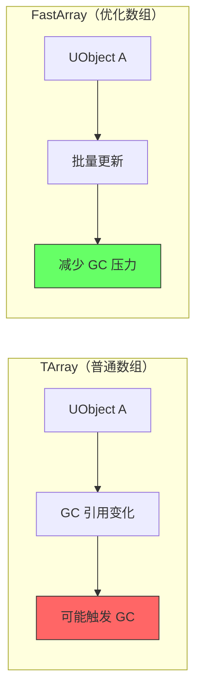

# Lyra项目中的GC实践

> 分析 Lyra 项目如何管理 UObject 生命周期，学习 GC 最佳实践。

## 本课目标

1. 分析 Lyra 中 UObject 的使用模式
2. 学习 Lyra 如何避免 GC 性能问题
3. 掌握 Lyra 的引用管理技巧（弱引用、FastArray）
4. 提取可复用到自己项目的 GC 最佳实践

## 1. Lyra 中的 UObject 使用模式

### 1.1 Lyra 主要 UObject 类

| Lyra 类 | 类型 | GC 管理要点 |
|----------|------|-------------|
| `ULyraGameplayAbility` | UGameplayAbility 派生 | 由 ASC 管理生命周期 |
| `ULyraGameplayEffect` | UGameplayEffect 派生 | 持续时间由 GE 系统管理 |
| `ULyraAbilitySet` | UPrimaryDataAsset | 作为资产加载，需管理引用 |
| `ULyraExperienceDefinition` | UPrimaryDataAsset | 体验系统核心，需避免循环引用 |
| `ULyraEquipmentManagerComponent` | UActorComponent | 使用 FastArray 减少 GC |

### 1.2 mermaid 图示：Lyra 对象引用关系

```mermaid
graph TB
    A[ALyraCharacter] -->|UPROPERTY| B[ULyraAbilitySystemComponent]
    A -->|UPROPERTY| C[ULyraEquipmentManagerComponent]
    
    B -->|UPROPERTY 数组| D[ULyraGameplayAbility]
    B -->|UPROPERTY 数组| E[ULyraGameplayEffect]
    
    C -->|FastArray| F[FLyraEquipmentEntry]
    F -->|TWeakObjectPtr| G[ULyraItemDefinition]
    
    style A fill:#bbf,stroke:#333,stroke-width:2px
    style B fill:#bfb,stroke:#333,stroke-width:2px
    style C fill:#bfb,stroke:#333,stroke-width:2px
    style G fill:#fbb,stroke:#333,stroke-width:2px
    
    note right of G
        TWeakObjectPtr 避免循环引用
        不阻止 GC 回收 ULyraItemDefinition
    end note
```

## 2. Lyra 的 GC 优化技巧

### 2.1 使用弱引用避免循环引用

**代码示例**：Lyra 中的弱引用使用

```cpp
// Source/LyraGame/AbilitySystem/LyraGameplayAbility.h (简化)

UCLASS()
class ULyraGameplayAbility : public UGameplayAbility
{
    GENERATED_BODY()
    
private:
    // ✅ 使用弱引用指向 Owner（避免循环引用）
    TWeakObjectPtr<ALyraCharacter> OwnerCharacterWeak;
    
public:
    virtual bool CanActivateAbility(...) override
    {
        // ✅ 使用前检查有效性
        if (ALyraCharacter* Owner = OwnerCharacterWeak.Get())
        {
            return Owner->CanActivateAbilities();
        }
        return false;
    }
};
```

### 2.2 使用 FastArray 减少 GC 压力

**问题**：`TArray<UObject*>` 每次增删都会触发 UObject 引用变化 → 可能增加 GC 压力。

**解决方案**：`FFastArraySerializer` + `FFastArrayElement` — 网络复制友好，且减少 GC 压力。

**代码示例**：Lyra 装备系统使用 FastArray

```cpp
// Source/LyraGame/Equipment/LyraEquipmentManagerComponent.h (简化)

UCLASS()
class ULyraEquipmentManagerComponent : public UActorComponent
{
    GENERATED_BODY()
    
private:
    // ✅ 使用 FastArray 而不是 TArray<UObject*>
    UPROPERTY()
    FLyraEquipmentList EquipmentList;  // 继承自 FFastArraySerializer
};

// FLyraEquipmentList 继承自 FFastArraySerializer
struct FLyraEquipmentList : public FFastArraySerializer
{
    // 元素继承自 FFastArraySerializerElement
    TArray<FLyraEquipmentEntry> Items;
};

// 每个元素
struct FLyraEquipmentEntry : public FFastArraySerializerElement
{
    // ✅ 使用弱引用
    TWeakObjectPtr<ULyraItemDefinition> ItemDefinition;
};
```

### 2.3 mermaid 图示：FastArray 优势



## 3. Lyra 中的 GC 最佳实践

### 3.1 实践 1：正确管理 Ability 生命周期

```cpp
// ✅ Lyra 实践：GA 由 ASC 管理，不要手动销毁

// 激活 GA（ASC 会保持强引用）
ASC->TryActivateAbilityByClass(ULyraGameplayAbility::StaticClass());

// ❌ 不要手动 MarkAsGarbage()
// MyAbility->MarkAsGarbage();  // 错误！让 ASC 管理

// ✅ 正确：让 GA 自然结束（EndAbility）
void ULyraGameplayAbility::ActivateAbilityFromEvent(...)
{
    // ... 能力逻辑 ...
    
    // 结束能力（ASC 会自动清理）
    EndAbility(Handle, ActorInfo, ...);
}
```

### 3.2 实践 2：使用 TWeakObjectPtr 打破循环

```cpp
// ❌ 错误：循环引用
UCLASS()
class ULyraAbilitySystemComponent : public UAbilitySystemComponent
{
    GENERATED_BODY()
    
    // ❌ 强引用 GA，GA 又引用 ASC → 循环
    UPROPERTY()
    TArray<ULyraGameplayAbility*> GrantedAbilities;
};

// ✅ 正确：ASC 持有强引用，GA 使用弱引用指向 ASC
UCLASS()
class ULyraGameplayAbility : public UGameplayAbility
{
    GENERATED_BODY()
    
private:
    // ✅ 弱引用 ASC
    TWeakObjectPtr<ULyraAbilitySystemComponent> ASCWeak;
};
```

### 3.3 实践 3：避免频繁创建/销毁 UObject

```cpp
// ❌ 错误：每帧创建新对象
void ULyraAbilitySystemComponent::TickComponent(...)
{
    UMyObject* Obj = NewObject<UMyObject>();  // ❌ 每帧创建
    // ...
    Obj->MarkAsGarbage();  // ❌ 每帧销毁 → 频繁 GC
}

// ✅ 正确：缓存对象，复用
UCLASS()
class ULyraAbilitySystemComponent : public UAbilitySystemComponent
{
    GENERATED_BODY()
    
private:
    // ✅ 缓存的对象
    UPROPERTY()
    UMyObject* CachedObject;
    
    virtual void BeginPlay() override
    {
        Super::BeginPlay();
        // ✅ 只创建一次
        CachedObject = NewObject<UMyObject>(this);
    }
};
```

## 4. 从 Lyra 提取的最佳实践清单

### 4.1 对象创建

- ✅ 使用 `NewObject()` 创建 UObject
- ✅ 缓存常用对象，避免频繁创建/销毁
- ❌ 不要使用 `new`/`delete` 管理 UObject

### 4.2 引用管理

- ✅ 使用 `UPROPERTY()` 保持强引用
- ✅ 使用 `TWeakObjectPtr` 打破循环引用
- ✅ 使用前检查 `TWeakObjectPtr::IsValid()`
- ❌ 不要使用裸指针持有 UObject（会被 GC 回收）

### 4.3 对象销毁

- ✅ 使用 `MarkAsGarbage()`（UE5 推荐）
- ✅ 让 GAS/Experience 等系统自动管理生命周期
- ❌ 不要手动调用 `ConditionalBeginDestroy()`（除非必要）
- ❌ 不要 `delete` UObject

### 4.4 性能优化

- ✅ 使用对象池减少创建/销毁
- ✅ 使用 FastArray 替代普通 `TArray<UObject*>`
- ✅ 启用增量 GC（`gc.IncrementalBeginDestroyEnabled=True`）
- ✅ 在低负载时手动触发 GC（如加载界面）

## 总结与要点

| 实践 | Lyra 示例 | 应用到你的项目 |
|------|-----------|----------------|
| **弱引用打破循环** | `TWeakObjectPtr<ALyraCharacter>` | 互相引用的对象，一方用弱引用 |
| **FastArray 减少 GC** | `FLyraEquipmentList` | 网络同步的数组用 FastArray |
| **让系统管理生命周期** | ASC 管理 GA/GE | 不要手动销毁被系统管理的对象 |
| **缓存对象复用** | `CachedObject` | 避免每帧创建/销毁 UObject |

## 相关页面

- [[30-tutorials/garbage-collection/06-GC性能优化策略]] - 上一课：GC 性能优化
- [[30-tutorials/performance-optimization/06-Lyra性能实战]] - Lyra 性能优化案例
- [[30-tutorials/gas/02-GA执行流程详解]] - GAS 执行流程（理解 GA 生命周期）

---

> 最后更新：2026-05-17

<!-- nav:auto -->

---

**导航**: ← [[30-tutorials/garbage-collection/06-GC性能优化策略|06-GC性能优化策略]]

<!-- /nav:auto -->
