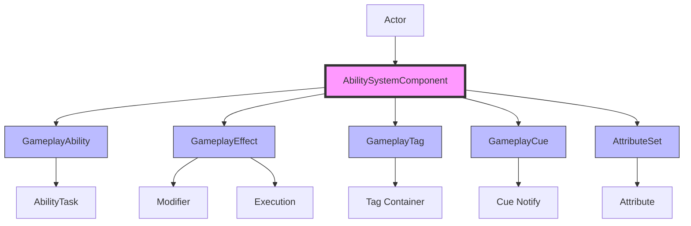
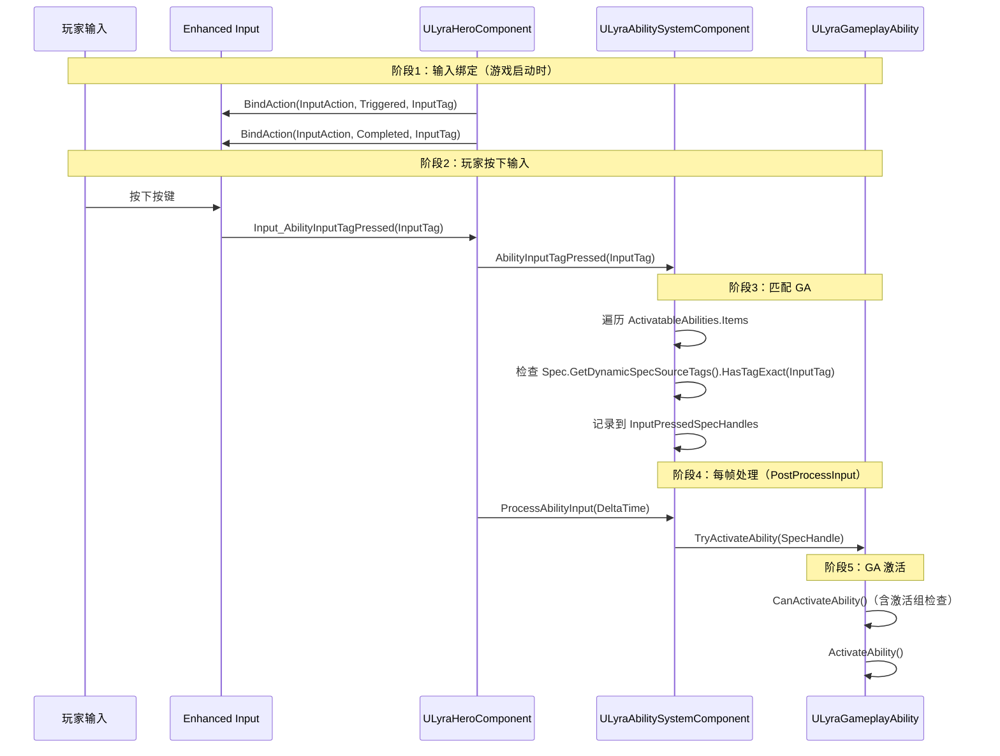

# GAS系统总览

> **基于 UE 5.7 的 GAS 技术深度解析**
>
> 本文档是 GAS 教程系列的开篇，介绍 GAS 系统的核心概念和架构。

## 概述

**Gameplay Ability System (GAS)** 是 Unreal Engine 提供的一套完备的、可扩展性强的能力系统。它不仅可以实现传统意义上的技能（Skill，如主动施法技能、被动天赋技能）、Buff 玩法，还可以用于实现使用道具、跳跃、射击开火、开镜、换弹等通用能力（Ability）。

GAS 系统在 UE 5.7 中继续完善，提供了更稳定和高性能的能力管理方案。

## 核心概念

GAS 系统由以下几个核心组件构成：



### 1. AbilitySystemComponent (ASC)

**GAS 系统的管理组件**，负责管理 GAS 模块对外接口，管理着：
- **GameplayAbility (GA)**：技能/能力
- **AbilityTask (Task)**：任务节点
- **GameplayEffect (GE)**：游戏效果（Buff/Debuff）
- **GameplayCue (GC)**：表现效果
- **GameplayTag (Tag)**：标签系统
- **AttributeSet**：属性集

**启用 GAS**：
任意 Actor 都可以通过挂载 `AbilitySystemComponent` (ASC) 启用 GAS 功能：

```cpp
// 1. 继承 IAbilitySystemInterface 并实现 GetAbilitySystemComponent
class AMyCharacter : public ACharacter, public IAbilitySystemInterface
{
    GENERATED_BODY()
    
public:
    virtual UAbilitySystemComponent* GetAbilitySystemComponent() const override
    {
        return AbilitySystemComponent;
    }
    
protected:
    UPROPERTY()
    TObjectPtr<UAbilitySystemComponent> AbilitySystemComponent;
};

// 2. 在构造函数中创建 ASC
AMyCharacter::AMyCharacter(const FObjectInitializer& ObjectInitializer)
    : Super(ObjectInitializer)
{
    AbilitySystemComponent = CreateDefaultSubobject<UAbilitySystemComponent>(
        TEXT("AbilitySystemComponent"));
    AbilitySystemComponent->SetIsReplicated(true);  // 网络复制
    AbilitySystemComponent->SetReplicationMode(EGameplayEffectReplicationMode::Mixed);
}
```

**ASC 主要接口**：
- `GiveAbility`：赋予 GA（GA 要先赋予才能使用）
- `TryActivateAbility`：尝试激活 GA
- `ApplyGameplayEffectSpecToSelf`：应用 GE
- `AddGameplayCue` / `ExecuteGameplayCue` / `RemoveGameplayCue`：GameplayCue 操作
- `AddLooseGameplayTag` / `RemoveLooseGameplayTag`：Tag 管理

**ASC 核心属性**（UE 5.7）：
```cpp
class GAMEPLAYABILITIES_API UAbilitySystemComponent : public UGameplayTasksComponent
{
    // 可使用的 GA 列表
    UPROPERTY(ReplicatedUsing = OnRep_ActivateAbilities)
    FGameplayAbilitySpecContainer ActivatableAbilities;
    
    // 激活的 GE 列表
    UPROPERTY(Replicated)
    FActiveGameplayEffectsContainer ActiveGameplayEffects;
    
    // 激活的 GC 列表
    UPROPERTY(Replicated)
    FActiveGameplayCueContainer ActiveGameplayCues;
    
    // 拥有的 Tag 列表
    FGameplayTagCountContainer GameplayTagCountContainer;
    
    // AttributeSet 列表
    UPROPERTY(Replicated)
    TArray<TObjectPtr<UAttributeSet>> SpawnedAttributes;
};
```

### 2. GameplayAbility (GA)

**用于定义角色可以执行的各种技能和能力**，如攻击、施法、跳跃、使用道具、射击等。

> **核心理解**：GA 本质上是一个或多个行为（Task）的组合。

**GA 网络执行策略**（UE 5.7）：
- `LocalPredicted`：由主控端拉起 GA 激活流程（取消可以在主控端和 DS 端发起，GA 逻辑在双端执行）
- `ServerInitiated`：由 DS 端（主权端）拉取 GA 的执行流程
- `LocalOnly`：只会在主控端执行 GA 逻辑
- `ServerOnly`：只会在 DS 端（主权端）执行 GA 逻辑

**GA 网络权限策略**（UE 5.7）：
- `ClientOrServer`：主控客户端和 DS（主权端）都有权限执行激活和取消激活
- `ServerOnlyExecution`：只有 DS（主权端）有权限执行激活
- `ServerOnlyTermination`：只有 DS（主权端）有权限执行取消激活
- `ServerOnly`：只有 DS（主权端）有权限执行激活和取消激活

### 3. GameplayEffect (GE)

**描述一个游戏效果**，即我们常说的 **Buff/Debuff**。例如治疗、伤害、加攻、减速、驱散、免疫等。

**GE 类型**（UE 5.7）：
- **Instant（即时效果）**：一次性的，立即生效
- **Duration（持续效果）**：有持续时间
- **Infinite（永久效果）**：持续到主动移除

**GE 作用方式**：
1. **属性修正**：通过 GE 的属性修正配置直接修正角色属性数值
2. **扩展效果**：
   - 通过配置 **GameplayEffectExecutionCalculation**（自定义执行类）
   - 通过配置 **GameplayEffectComponent**（GE 组件，UE 5.3+ 新特性）

### 4. GameplayTag (Tag)

**标签系统**，用于标记状态和类别。可以用来表示一个游戏对象的特性、状态、行为等信息。

**Tag 特性**：
- **层级结构**：支持父子层级关系，使用 `.` 来分隔不同的层级
  - 例如：`Ability.Attack`、`Ability.Attack.Melee`
- **查询和过滤**：可以使用 Tag 来查询和过滤游戏对象
- **触发行为**：可以使用 Tag 来触发特定的行为

**Tag 网络复制**（UE 5.7）：
- 支持快速复制（Fast Replication）：复制 Tag 的索引而不是 Tag 的名称
- 支持网络索引分段，优化网络传输

### 5. GameplayCue (GC)

**用于播放客户端表现**，如特效、音效、材质效果、后处理之类的。

**GC 特性**：
- **解耦逻辑和表现**：通过 GameplayCue，可以将游戏逻辑与表现分开
- **通过 GameplayTag 触发**：每个 GameplayCue 都绑定了一个对应的 GameplayTag

**GC 状态**（UE 5.7）：
- `OnActive`：对于具有生命周期的持续效果，首次激活时触发
- `WhileActive`：对于具有生命周期的持续效果，每次复制到客户端都会触发
- `Removed`：对于具有生命周期的持续效果，移除时触发
- `Executed`：对于一次性的即时效果，执行时触发

**GC 类型**（UE 5.7）：
- `UGameplayCueNotify_Static`：继承自 UObject，不使用实例对象
- `AGameplayCueNotify_Actor`：继承自 Actor，会产生一个 Actor 实例对象
- `AGameplayCueNotify_Burst`：一次性即时表现效果
- `AGameplayCueNotify_BurstLatent`：一次性即时表现效果（带延迟）
- `AGameplayCueNotify_Looping`：持续性循环表现效果

### 6. AttributeSet

**属性集**，定义角色属性，比如攻击力、防御力、血量等。

**属性系统**：
- 分为 **基础值（Base Value）** 和 **当前值（Current Value）**
- 一般是通过 GE 在其基础值的基础上通过各种运算（加减乘除或者自定义运算规则）计算出当前值
- GE 失效后其修正部分也会被回退

## GAS 调试方法（UE 5.7）

GAS 提供了两种调试信息的显示方式：

### 1. 通用 HUD 显示调试信息

**控制台指令**：
```
ShowDebug AbilitySystem  // 开启/关闭 GAS 的调试信息输出
AbilitySystem.Debug.NextCategory  // 切换 GAS 调试信息输出类型
```

**调试信息分类**：
- `Attributes`：属性相关
- `Ability`：GA 相关
- `GameplayEffects`：GE 相关

**切换调试目标**：
```
NextDebugTarget  // PageDown
PreviousDebugTarget  // PageUp
```

### 2. 专属 HUD 显示调试信息

**AbilitySystemDebugHUD** 是显示 GAS 系统调试信息的专属 HUD。

**控制台指令**：
```
AbilitySystem.DebugBasicHUD  // 打开/关闭显示当前主控角色的 GAS 常用信息
AbilitySystem.DebugAbilityTags  // 打开/关闭显示角色拥有的 Tag 信息
AbilitySystem.DebugAttribute [AttributeName]  // 打开/关闭显示角色属性信息
AbilitySystem.DebugBlockedAbilityTags  // 显示角色的 BlockedAbilityTags 信息
```

### 3. 其他调试指令

```
AbilitySystem.IgnoreCooldowns 1  // 忽略技能冷却
AbilitySystem.IgnoreCosts 1  // 忽略技能消耗
Log AbilitySystem VeryVerbose  // 修改 LogAbilitySystem 日志的输出等级
```

## GAS 在 Lyra 项目中的应用

Lyra Starter Game 对 GAS 进行了深度扩展和定制：

### 1. LyraAbilitySystemComponent

```cpp
class ULyraAbilitySystemComponent : public UAbilitySystemComponent
{
    // 输入标签系统 - Lyra 使用 GameplayTag 来处理输入
    void AbilityInputTagPressed(const FGameplayTag& InputTag);
    void AbilityInputTagReleased(const FGameplayTag& InputTag);
    
    // Ability 激活组管理
    bool IsActivationGroupBlocked(ELyraAbilityActivationGroup Group) const;
    void AddAbilityToActivationGroup(ELyraAbilityActivationGroup Group, 
                                   ULyraGameplayAbility* LyraAbility);
    
    // 动态 Tag 管理
    void AddDynamicTagGameplayEffect(const FGameplayTag& Tag);
    void RemoveDynamicTagGameplayEffect(const FGameplayTag& Tag);
};
```

### 2. LyraGameplayAbility

```cpp
class ULyraGameplayAbility : public UGameplayAbility
{
    // 激活策略
    UPROPERTY(EditDefaultsOnly, Category = "Lyra|Ability Activation")
    ELyraAbilityActivationPolicy ActivationPolicy;
    
    // 激活组
    UPROPERTY(EditDefaultsOnly, Category = "Lyra|Ability Activation")
    ELyraAbilityActivationGroup ActivationGroup;
    
    // 相机模式集成
    void SetCameraMode(TSubclassOf<ULyraCameraMode> CameraMode);
    void ClearCameraMode();
};
```

### 3. Lyra 属性集

- `ULyraHealthSet`：生命值属性集
- `ULyraCombatSet`：战斗属性集（基础伤害和治疗属性）

### 4. Lyra 输入标签驱动 GA 激活调用链

Lyra 通过 `GameplayTag` 替代传统 `InputID` 驱动技能激活，完整调用链如下：



**关键源码路径**：

| 步骤 | 文件 | 函数 |
|------|------|------|
| 输入绑定 | `LyraHeroComponent.cpp` L283 | `InitializePlayerInput()` → `BindAbilityActions()` |
| 输入转发 | `LyraHeroComponent.cpp` L343 | `Input_AbilityInputTagPressed()` |
| 标签匹配 | `LyraAbilitySystemComponent.cpp` L186 | `AbilityInputTagPressed()` |
| 每帧处理 | `LyraAbilitySystemComponent.cpp` L216 | `ProcessAbilityInput()` |
| 激活策略判断 | `LyraGameplayAbility.h` L38 | `ELyraAbilityActivationPolicy` 枚举 |

> 详见 [[30-tutorials/gas/01-GA简介与配置|GA 简介与配置]] 的 Lyra 扩展章节。

## UE 5.7 中的 GAS 变化

> **注意**：以下内容基于 UE 5.7 源码分析和官方文档整理

### 新增特性

1. **性能优化**：
   - 优化了 `FGameplayTagCountContainer` 的性能
   - 改进了 `FActiveGameplayEffectsContainer` 的查找算法

2. **网络复制改进**：
   - 增强了 PredictionKey 的同步机制
   - 改进了 `FGameplayAbilitySpec` 的复制逻辑

3. **Lyra 扩展**：
   - `LyraAbilitySystemComponent` 的输入标签系统
   - `LyraGameplayAbility` 的激活组系统
   - 动态 Tag 管理

### 废弃接口

> **需要验证**：以下接口可能在 UE 5.7 中被废弃或移除

- `UGameplayAbility::GetClassFromActorInfo()` → 使用 `GetClass()`
- `FGameplayEffectSpec::GetContext()` → 使用 `GetEffectContext()`

## 相关页面

- [[30-tutorials/gas/01-GA简介与配置]] - GA 详解
- [[30-tutorials/gas/06-GE简介与配置]] - GE 详解
- [[30-tutorials/gas/15-Tag简介与配置]] - Tag 详解
- [[30-tutorials/gas/20-GC简介与配置]] - GC 详解

## 参考资料

1. [Unreal Engine 5 Documentation - Gameplay Ability System](https://docs.unrealengine.com/5.7/en-US/gameplay-ability-system-for-unreal-engine/)
2. [Lyra Sample Game](https://docs.unrealengine.com/5.7/en-US/lyra-sample-game-in-unreal-engine/)
3. 现有 GAS 教程系列（基于 UE 5.3+）

---
> 最后更新：2026-05-16

<!-- nav:auto -->

---

**导航**: [[30-tutorials/gas/01-GA简介与配置|01-GA简介与配置]] →

<!-- /nav:auto -->
