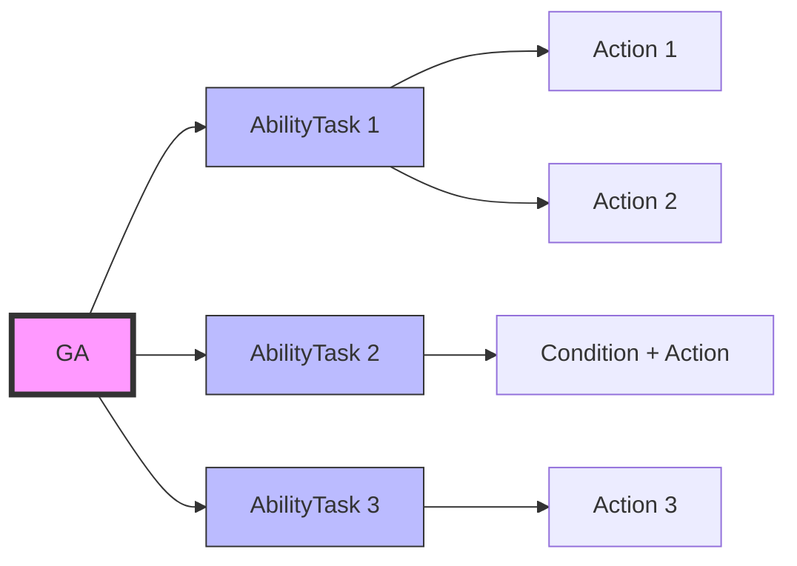
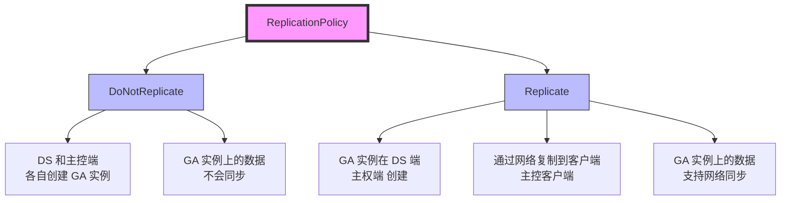
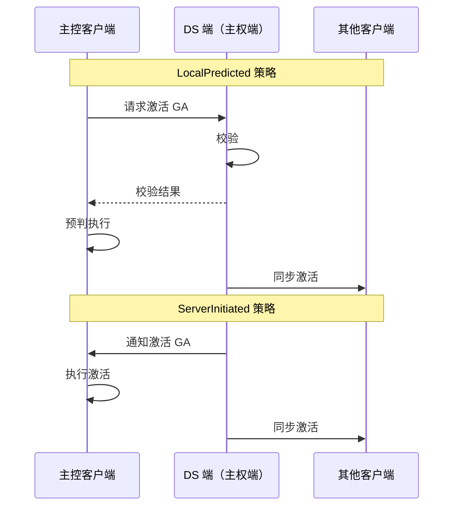
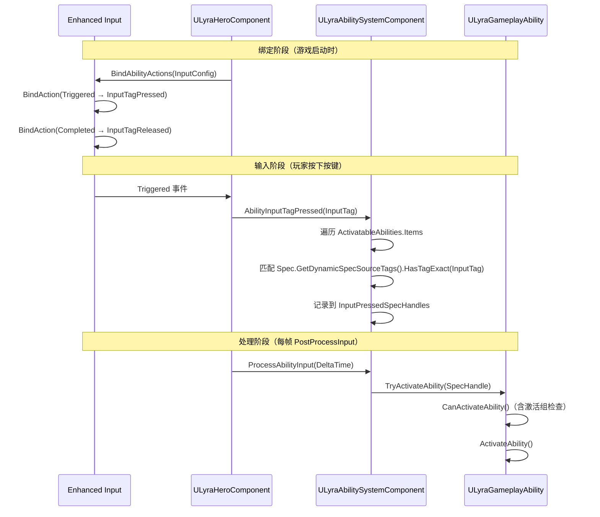

# GA简介与配置

> **基于 UE 5.7 的 GameplayAbility 技术深度解析**
>
> GameplayAbility（后面统一简称 GA）是 Gameplay Ability System (GAS) 中的核心类，用于定义角色可以执行的各种**技能和能力**。

## 概述

**GameplayAbility (GA)** 用于定义角色可以执行的各种**技能和能力**（如攻击、施法、跳跃、使用道具、射击等）。通过与 GameplayEffect (GE)、GameplayCue (GC)、AttributeSet（属性集合）搭配使用搭建 UE 的能力体系（GAS 系统）。

> **核心理解**：GA 不单指传统意义上的技能，其他操作（能力）也可以通过 GA 实现，比如跳跃、使用道具、射击游戏的开火、换弹、开镜之类的。

### GA 的本质

GA 可以理解成一个个独立的行为节点的拼装组合。GAS 系统提供了一套 AbilityTask 用于定制各种 Task（任务，行为）节点，可以将一些常用的行为封装成 Task 节点然后在 GA 的蓝图进行组装。

**GA 本身就是一个蓝图**，自然可以直接在蓝图写逻辑，**蓝图逻辑搭配 Task 节点使用兼顾了定制化的灵活性和模板化的可复用性**。



## 配置字段说明（UE 5.7）

GA 配置需要**创建一个继承 `UGameplayAbility` 或者其子类的蓝图**。根据需求在创建的蓝图中配置 GA 的各项数据。

### 1. AbilityTags

**该 GA 拥有的标记（GameplayTags）集合。**

用于标记该 GA，比如获取到一个 GA 的实例，可以通过判断其 AbilityTag 来确定是否是目标 GA。

```cpp
// 在 C++ 中定义 AbilityTags
UProperty(EditDefaultsOnly, Category = "Ability")
FGameplayTagContainer AbilityTags;
```

### 2. CancelAbilitiesWithTag

**用于配置 GA 之间的打断关系**。已激活的 GA 列表中如果有 GA 的 AbilityTags 配置跟该 GA 配置的 `CancelAbilitiesWithTag` 匹配，则当前该 GA 激活时，GA 列表中匹配的 GA 会被打断。

**示例**：比如开火 GA 打断使用物品的 GA，则可以在使用物品 GA 的 AbilityTags 配置 Tag `Ability.UseItem`，同时将 Tag `Ability.UseItem` 配置到开火 GA 的 `CancelAbilitiesWithTag` 中，则开火 GA 激活时就会打断使用物品的 GA。

### 3. BlockedAbilityTags

**用于配置 GA 之间的互斥关系。**该 GA 激活时，会阻止后续 AbilityTags 中拥有 `BlockedAbilityTags` 集合中任一 Tag 的 GA 激活。

**示例**：比如开火 GA 执行期间无法执行使用物品的 GA，则可以在使用物品 GA 的 AbilityTags 配置 Tag `Ability.UseItem`，同时将 Tag `Ability.UseItem` 配置到开火 GA 的 `BlockedAbilityTags` 中，则开火 GA 执行期间无法执行使用物品的 GA。

### 4. ActivationOwnedTags

**该 GA 激活时会给 GA 的拥有者附加的 Tag**

GA 取消激活时会移除附加的 Tag。

### 5. ActivationRequiredTags

**想要该 GA 能被激活，GA 的拥有者必须要有的 Tag 集合**

GA 的拥有者必须要有 `ActivationRequiredTags` 指定的所有 Tag。

### 6. ActivationBlockedTags

**想要该 GA 能被激活，GA 的拥有者必需不能有的 Tag 集合**

GA 的拥有者必须不能有 `ActivationBlockedTags` 指定的任一 Tag。

### 7. SourceRequiredTags / SourceBlockedTags

**想要该 GA 能被激活，SourceTags 集合（激活 GA 时按需传入的参数）必须要有的 Tag 集合 / 必需不能有的 Tag 集合**

SourceTags 集合必须要有 `SourceRequiredTags` 指定的所有 Tag（可以用来检测来源身上的 Tag）。

> **应用场景**：如果通过 GE 触发了一个 GA，而 GE 是可以捕获到 GE 来源的 Tags 集合（SourceTags）和 GE 目标的 Tags 集合（TargetTags）。可以将其传给 GA，再在 GA 激活时通过 `SourceRequiredTags` / `SourceBlockedTags` 进行判定。

### 8. TargetRequiredTags / TargetBlockedTags

**想要该 GA 能被激活，TargetTags 集合（激活 GA 时按需传入的参数）必须要有的 Tag 集合 / 必需不能有的 Tag 集合**

TargetTags 集合必须要有 `TargetRequiredTags` 指定的所有 Tag（可以用来检测目标身上的 Tag）。

> **代码参考**：`UGameplayAbility::DoesAbilitySatisfyTagRequirements`

### 9. bReplicateInputDirectly

**是否总是将 GA 的输入事件（技能键的按下/松开）通过 RPC 上报给 DS**

### 10. ReplicationPolicy

**GA 网络复制策略**

- `DoNotReplicate`：不复制（DS 和主控端各自创建 GA 实例）
- `Replicate`：复制给技能的拥有者的客户端（主控端）

**网络复制策略详解**：



**代码示例**（UE 5.7）：
```cpp
class GAMEPLAYABILITIES_API UAbilitySystemComponent 
{
    UPROPERTY(ReplicatedUsing = OnRep_ActivateAbilities)
    FGameplayAbilitySpecContainer ActivatableAbilities;
};

struct GAMEPLAYABILITIES_API FGameplayAbilitySpecContainer : public FFastArraySerializer
{
    UPROPERTY()
    TArray<FGameplayAbilitySpec> Items;
};

struct GAMEPLAYABILITIES_API FGameplayAbilitySpec : public FFastArraySerializerItem
{
    UPROPERTY(NotReplicated)
    TArray<TObjectPtr<UGameplayAbility>> NonReplicatedInstances;

    UPROPERTY()
    TArray<TObjectPtr<UGameplayAbility>> ReplicatedInstances;
};
```

**简单说明下网络复制策略**：

1. 赋予角色的 GA 都会放入可激活 GA 列表 `ActivatableAbilities` 中（`FGameplayAbilitySpecContainer` 的实例），`ActivatableAbilities` 是开启了属性复制的，可以进行网络同步。
2. `FGameplayAbilitySpecContainer` 存放的是 GA 运行时数据结构 `FGameplayAbilitySpec` 实例数组。
3. `FGameplayAbilitySpec` 包含了一个支持网络复制的 GA 实例列表 `ReplicatedInstances` 和一个不支持网络复制的 GA 实例列表 `NonReplicatedInstances`。
4. 创建 GA 实例时，会根据 GA 配置的网络复制策略决定 GA 实例放到 `ReplicatedInstances` 或者 `NonReplicatedInstances` 中。在对 `ActivatableAbilities` 进行网络同步时，只会同步 `ReplicatedInstances` 中的数据。

### 11. InstancingPolicy

**GA 的实例化策略**

- `NonInstanced`：不实例化，直接用 CDO（只读）
- `InstancedPerActor`：在赋予时实例化（激活不再创建新的实例，每个 `GameplayAbilitySpec` 只会创建一个 GA 实例）
- `InstancedPerExecution`：每次激活都实例化一次（每个 `GameplayAbilitySpec` 可能创建多个 GA 实例）

> `GameplayAbilitySpec` 是 GA 运行时的数据结构。每次赋予一个 GA 都会创建一份对应的 `GameplayAbilitySpec` 实例放入可激活的 GA 列表中。

### 12. bServerRespectsRemoteAbilityCancellation

**是否能被客户端取消激活（打断）GA**

默认设置为 `True`。

### 13. bRetriggerInstancedAbility

**如果该 GA 已经被激活，再次触发激活时是否重新终止原有的 GA 实例重新激活**

仅限实例化策略为 `InstancedPerActor` 的 GA，其他策略用不到这个配置。为 `False` 则已经激活时再次触发激活则激活失败。

### 14. NetExecutionPolicy

**GA 的网络执行策略**

设置由哪个执行端（主控客户端或者 DS 端）拉取 GA 的激活流程及 GA 逻辑在双端都执行还是只在其中一个端执行。

| 策略 | 说明 |
|------|------|
| `LocalPredicted` | 由主控端拉起 GA 激活流程（取消可以在主控端和 DS 端发起，GA 逻辑在双端执行） |
| `ServerInitiated` | 由 DS 端（主权端）拉取 GA 的执行流程（取消可以在主控端和 DS 端发起，GA 逻辑在双端执行） |
| `LocalOnly` | 只会在主控端执行 GA 逻辑（GA 逻辑只在主控端执行） |
| `ServerOnly` | 只会 DS 端（主权端）执行 GA 逻辑（GA 逻辑只在主权端执行） |

> **重要说明**：
> - `LocalPredicted` 和 `ServerInitiated` 都会在双端（主控客户端和 DS 端）执行 GA 逻辑
> - 区别在于：`LocalPredicted` 是由主控端拉取 GA 激活流程，`ServerInitiated` 是由 DS 端拉取 GA 激活流程

**执行流程示意图**：



**代码参考**（UE 5.7）：
```cpp
bool UAbilitySystemComponent::TryActivateAbility(...)
{
    // 非主控客户端（DS 端）想激活网络执行策略为 LocalOnly 和 LocalPredicted 的 GA
    // 通过 RPC 转发到主控客户端
    if (!bIsLocal && 
        (Ability->GetNetExecutionPolicy() == EGameplayAbilityNetExecutionPolicy::LocalOnly ||
         Ability->GetNetExecutionPolicy() == EGameplayAbilityNetExecutionPolicy::LocalPredicted))
    {
        if (bAllowRemoteActivation)
        {
            ClientTryActivateAbility(AbilityToActivate);
            return true;
        }
        return false;
    }

    // 非 DS 端（主控客户端）想激活网络执行策略为 ServerOnly 和 ServerInitiated 的 GA
    // 通过 RPC 转发到 DS 端
    if (NetMode != ROLE_Authority && 
        (Ability->GetNetExecutionPolicy() == EGameplayAbilityNetExecutionPolicy::ServerOnly || 
         Ability->GetNetExecutionPolicy() == EGameplayAbilityNetExecutionPolicy::ServerInitiated))
    {
        if (bAllowRemoteActivation)
        {
            FScopedCanActivateAbilityLogEnabler LogEnabler;
            if (Ability->CanActivateAbility(...))
            {
                CallServerTryActivateAbility(...);
                return true;
            }
        }
    }
    
    // 当前端符合网络执行策略，直接执行激活
    // ...
}
```

### 15. NetSecurityPolicy

**GA 的网络权限策略**

**主控客户端是否有对 GA 发起激活或者发起取消激活的权限**（对 `NetExecutionPolicy` 的补充说明）。

| 策略 | 说明 |
|------|------|
| `ClientOrServer` | 主控客户端和 DS（主权端）**都有权限执行激活和取消激活（终止/中断）** |
| `ServerOnlyExecution` | **只有 DS（主权端）有权限执行激活**。主控客户端和 DS（主权端）**都有权限执行取消激活（终止/中断）** |
| `ServerOnlyTermination` | **只有 DS（主权端）有权限执行取消激活（终止/中断）**。主控客户端和 DS（主权端）**都有权限执行激活** |
| `ServerOnly` | **只有 DS（主权端）有权限执行激活和取消激活（终止/中断）** |

> **代码参考**（UE 5.7）：
> ```cpp
> bool UGameplayAbility::ShouldActivateAbility(ENetRole Role) const
> {
>     return Role != ROLE_SimulatedProxy && 		
>         (Role == ROLE_Authority ||
>          (NetSecurityPolicy != EGameplayAbilityNetSecurityPolicy::ServerOnly && 
>           NetSecurityPolicy != EGameplayAbilityNetSecurityPolicy::ServerOnlyExecution));
> }
> ```

### 16. CostGameplayEffectClass

**处理技能消耗的 GE**

参照 `UGameplayAbility::CheckCost` / `UGameplayAbility::ApplyCost`

### 17. AbilityTriggers

**配置通过 Tag 来激活或者取消激活 GA**

在赋予 GA 的接口 `OnGiveAbility` 中会根据 `AbilityTriggers` 配置将配置的 Tag 和对应的 GA Handle 绑定。这样就可以通过 Tag 在 GA 列表查找到对应的 GA。支持一个 Tag 绑定多个 GA。

根据 Tag 的触发方式分为：

| 触发方式 | 说明 |
|---------|------|
| `GameplayEvent` | 通过 `SendGameplayEventToActor` 的方式触发（参照 `UAbilitySystemComponent::HandleGameplayEvent`） |
| `OwnedTagAdded` | 通过添加 Tag 的方式触发，只负责触发（参照 `UAbilitySystemComponent::MonitoredTagChanged`） |
| `OwnedTagPresent` | 通过添加 Tag 的方式触发，并且在 Tag 移除时会中断 GA（参照 `UAbilitySystemComponent::MonitoredTagChanged`） |

**代码示例**（UE 5.7）：
```cpp
void UAbilitySystemComponent::OnGiveAbility(FGameplayAbilitySpec& Spec)
{
    for (const FAbilityTriggerData& TriggerData : Spec.Ability->AbilityTriggers)
    {
        FGameplayTag EventTag = TriggerData.TriggerTag;
   
        // 根据 Tag 的触发方式放到不同的绑定列表
        auto& TriggeredAbilityMap = 
            (TriggerData.TriggerSource == EGameplayAbilityTriggerSource::GameplayEvent) ?
            GameplayEventTriggeredAbilities : OwnedTagTriggeredAbilities;

        if (TriggeredAbilityMap.Contains(EventTag))
        {
            // 支持一个 Tag 绑定多个 GA
            TriggeredAbilityMap[EventTag].AddUnique(Spec.Handle);
        }
        else
        {
            TArray<FGameplayAbilitySpecHandle> Triggers;
            Triggers.Add(Spec.Handle);
            TriggeredAbilityMap.Add(EventTag, Triggers);
        }

        if (TriggerData.TriggerSource != EGameplayAbilityTriggerSource::GameplayEvent)
        {
            // 如果需要监听 Tag 添加移除事件，在这里处理，绑定处理接口 MonitoredTagChanged
            FOnGameplayEffectTagCountChanged& CountChangedEvent = 
                RegisterGameplayTagEvent(EventTag);
            if (!CountChangedEvent.IsBoundToObject(this))
            {
                MonitoredTagChangedDelegateHandle = 
                    CountChangedEvent.AddUObject(this, &UAbilitySystemComponent::MonitoredTagChanged);
            }
        }
    }
}
```

### 18. CooldownGameplayEffectClass

**标记 CD 的 GE**

一个带有持续时间和标记的 GE，通过判定是否持有 GE 附加的 Tag 来判定是否处于 CD 之中。

参照 `UGameplayAbility::CheckCooldown` / `UGameplayAbility::ApplyCooldown`

## 关于 Ability 的思考

GA 作为 GAS 系统中的主体部分，用于描述一个能力（Ability）具体要执行哪些行为。以 GA 最典型的应用：技能为例。

**简单技能示例**：火球术，发射一个火球攻击目标。
- 拆分下这个技能需要执行行为：播放一个施法动作、一个施法特效和音效、创建一个火球子弹。
- 播放动作、特效、音效、创建子弹都是一个个独立的行为。
- 将这些行为进行组合就能拼装成一个 GA 所代表的能力（Ability）。

所以 **Ability 可以理解成一个个独立的行为节点的拼装组合**，GAS 系统提供了一套 AbilityTask 用于定制各种 Task（任务，行为）节点，可以将一些常用的行为封装成 Task 节点然后在 GA 的蓝图进行组装。

**GA 本身就是一个蓝图**，自然可以直接在蓝图写逻辑，**蓝图逻辑搭配 Task 节点使用兼顾了定制化的灵活性和模板化的可复用性**。

> **再举一个复杂一点技能描述**：释放后增加 30% 移动速度持续 10 秒，移除自身的减速效果，且疾跑期间减少 50% 受到的减速效果，脱战时额外增加 20% 的移速。
>
> 将上面的技能描述进行拆解，发现这里的部分行为有个前置条件（疾跑状态，脱战），类似代码的 if 条件分支，以此完善下对能力（Ability）的归纳总结：**能力（Ability）就是收到某个触发事件后（Trigger）执行一系列行为（Actions）（派发伤害、增加攻击），行为节点（Actions）可设置依赖条件（Conditions）（目标血量低于 XXX，目标处于 XXX 状态）来控制节点是否执行（类似 if-else/switch-case）**。即 **Ability = Conditions + Actions**。
>
> 在 GA 中，封装的 Task 或者直接通过蓝图实现的行为即 **Actions**，蓝图中的一些 if 分支即 **Conditions**。

此外，UE 还有一套非官方的 Ability 插件 **Able Ability System**，其基本思路就是就是将能力（Ability）拆解成一个个行为节点（AblAbilityTask），并且在时间轴上就行组装，将 Conditions 和 Actions 部分以一种更加直观的方式展现出来。提供了一种兼顾可扩展、高复用、直观化、易编辑的 Ability 解决方案。**插件 Able Ability System 搭配着 GAS 系统一起使用效果更佳**。

## Lyra 项目中的 GA 扩展

Lyra 项目对 GA 进行了深度扩展，提供了更灵活的能力系统：

### LyraGameplayAbility 扩展

```cpp
// LyraGameplayAbility.h L38-L49
UENUM(BlueprintType)
enum class ELyraAbilityActivationPolicy : uint8
{
    OnInputTriggered,    // 输入触发时激活（一次）
    WhileInputActive,   // 输入按住期间持续尝试激活
    OnSpawn             // Avatar 生成时激活
};

// LyraGameplayAbility.h L57-L70
UENUM(BlueprintType)
enum class ELyraAbilityActivationGroup : uint8
{
    Independent,           // 独立运行，不与其他 Ability 冲突
    Exclusive_Replaceable, // 可被其他 Exclusive Ability 替换
    Exclusive_Blocking,    // 阻塞其他 Exclusive Ability
    MAX
};
```

`ULyraGameplayAbility` 的关键扩展字段：

```cpp
// LyraGameplayAbility.h
UCLASS()
class ULyraGameplayAbility : public UGameplayAbility
{
    GENERATED_BODY()

    // 激活策略（决定输入如何触发此 GA）
    UPROPERTY(EditDefaultsOnly, Category = "Lyra|Ability Activation")
    ELyraAbilityActivationPolicy ActivationPolicy;

    // 激活组（决定 GA 之间的互斥关系）
    UPROPERTY(EditDefaultsOnly, Category = "Lyra|Ability Activation")
    ELyraAbilityActivationGroup ActivationGroup;

    // 额外费用（Lyra 扩展的费用系统）
    UPROPERTY(EditDefaultsOnly, Instanced, Category = Costs)
    TArray<TObjectPtr<ULyraAbilityCost>> AdditionalCosts;

    // 相机模式（激活时自动切换）
    void SetCameraMode(TSubclassOf<ULyraCameraMode> CameraMode);
    void ClearCameraMode();
};
```

#### 激活组阻塞检查（调用链）

`CanActivateAbility()` 中会检查激活组是否被阻塞（`LyraGameplayAbility.cpp` L136-L160）：

```cpp
// LyraGameplayAbility.cpp L136-L160
bool ULyraGameplayAbility::CanActivateAbility(
    const FGameplayAbilitySpecHandle Handle,
    const FGameplayAbilityActorInfo* ActorInfo,
    const FGameplayTagContainer* SourceTags,
    const FGameplayTagContainer* TargetTags,
    FGameplayTagContainer* OptionalRelevantTags) const
{
    if (!Super::CanActivateAbility(Handle, ActorInfo,
                                  SourceTags, TargetTags,
                                  OptionalRelevantTags))
        return false;

    ULyraAbilitySystemComponent* LyraASC =
        CastChecked<ULyraAbilitySystemComponent>(
            ActorInfo->AbilitySystemComponent.Get());

    // 关键：检查激活组是否被阻塞
    if (LyraASC->IsActivationGroupBlocked(ActivationGroup))
    {
        if (OptionalRelevantTags)
        {
            OptionalRelevantTags->AddTag(
                LyraGameplayTags::Ability_ActivateFail_ActivationGroup);
        }
        return false;
    }
    return true;
}
```

### Lyra 的输入标签系统（完整调用链）

Lyra 使用 `GameplayTag` 替代传统 `InputID` 驱动 GA 激活，完整调用链：



**关键源码路径**：

| 步骤 | 文件 | 函数 |
|------|------|------|
| 输入绑定 | `LyraHeroComponent.cpp` L283 | `InitializePlayerInput()` → `BindAbilityActions()` |
| 输入转发 | `LyraHeroComponent.cpp` L343 | `Input_AbilityInputTagPressed()` |
| 标签匹配 | `LyraAbilitySystemComponent.cpp` L186 | `AbilityInputTagPressed()` |
| 每帧处理 | `LyraAbilitySystemComponent.cpp` L216 | `ProcessAbilityInput()` |
| 激活策略判断 | `LyraAbilitySystemComponent.cpp` L260 | 根据 `ActivationPolicy` 筛选 |
| 激活组检查 | `LyraGameplayAbility.cpp` L136 | `CanActivateAbility()` |

## 相关页面

- [[30-tutorials/gas/00-GAS系统总览]] - GAS 系统总览
- [[30-tutorials/gas/02-GA执行流程详解]] - GA 执行流程详解

## 参考资料

1. [Unreal Engine 5 Documentation - Gameplay Ability](https://docs.unrealengine.com/5.7/en-US/)
2. Lyra Sample Game - GameplayAbility 实现
3. 现有 GAS 教程系列（基于 UE 5.3+）

---
> 最后更新：2026-05-16

<!-- nav:auto -->

---

**导航**: ← [[30-tutorials/gas/00-GAS系统总览|00-GAS系统总览]] · [[30-tutorials/gas/02-GA执行流程详解|02-GA执行流程详解]] →

<!-- /nav:auto -->
