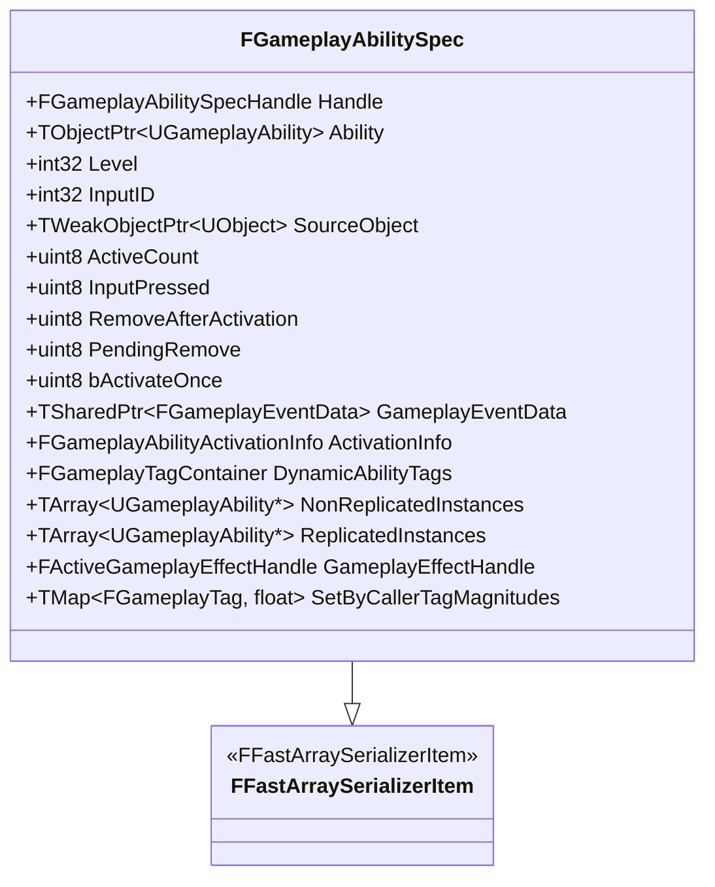
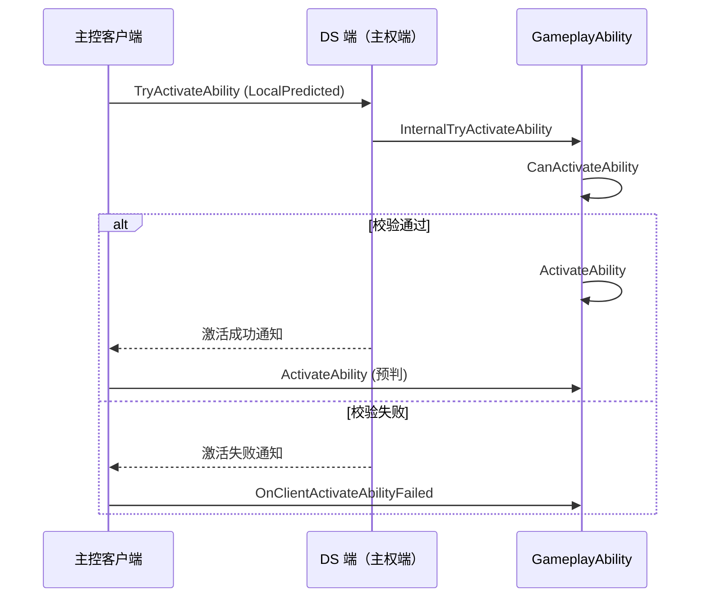

# GA执行流程详解

> **基于 UE 5.7 的 GameplayAbility 执行流程技术深度解析**

## 概述

**GameplayAbility (GA)** 的执行流程是 GAS 系统的核心。理解 GA 的执行流程对于正确使用 GAS 系统至关重要。

**GA 执行流程简述**：

1. 通过 `UAbilitySystemComponent::GiveAbility` 将 GA 赋予目标
2. 尝试激活 GA（多种方式）
3. `UAbilitySystemComponent::InternalTryActivateAbility` 实际执行 GA 的激活触发
4. `UGameplayAbility::CanActivateAbility` 判断 GA 是否可以被激活
5. 成功激活 GA 后执行 `UGameplayAbility::ActivateAbility`
6. 如果 GA 有消耗或者 CD，需要在执行 `ActivateAbility` 时调用 `CommitAbility` 来提交
7. GA 被移除（Remove）、取消激活（Cancel）、结束（End）都会通过 `UGameplayAbility::EndAbility` 来执行结束的处理

## FGameplayAbilitySpec

**FGameplayAbilitySpec** 是 GA 运行时的数据结构。每次赋予一个 GA 都会创建一份对应的 `FGameplayAbilitySpec` 实例放入可激活的 GA 列表 **ActivatableAbilities** 中。

继承自 `FFastArraySerializerItem`，支持网络复制。

> **重要**：如果 GA 是每次激活都创建一个新的实例，其在激活时创建的多个实例也是公用一份 `FGameplayAbilitySpec` 数据。



### FGameplayAbilitySpec 字段说明

| 字段 | 说明 |
|-------|------|
| `FGameplayAbilitySpecHandle Handle` | `FGameplayAbilitySpec` 的句柄（全局唯一编号） |
| `TObjectPtr<UGameplayAbility> Ability` | GA CDO 实例（只读 GA 实例，配置数据模板） |
| `int32 Level` | GA 当前等级 |
| `int32 InputID` | GA 绑定的触发按键（UE 5.7 推荐使用 Tag 替代） |
| `TWeakObjectPtr<UObject> SourceObject` | GA 赋予来源 Object |
| `uint8 ActiveCount` | 激活次数（激活计数+1，取消激活计数-1） |
| `uint8 InputPressed` | 绑定的按键是否按下 |
| `uint8 RemoveAfterActivation` | GA 结束后是否直接移除 |
| `uint8 PendingRemove` | 是否即将移除 |
| `uint8 bActivateOnce` | 是否是在赋予技能时就立即激活的 |
| `TSharedPtr<FGameplayEventData> GameplayEventData` | 激活 GA 时附带的上下文信息 |
| `FGameplayAbilityActivationInfo ActivationInfo` | GA 当前激活状态 |
| `FGameplayTagContainer DynamicAbilityTags` | 运行时动态添加的 AbilityTags |
| `TArray<UGameplayAbility*> NonReplicatedInstances` | GA 运行时创建的实例（不需要网络复制） |
| `TArray<UGameplayAbility*> ReplicatedInstances` | GA 运行时创建的实例（需要网络复制） |
| `FActiveGameplayEffectHandle GameplayEffectHandle` | 通过 GE 赋予的 GA 其赋予 GE 的句柄 |
| `TMap<FGameplayTag, float> SetByCallerTagMagnitudes` | 实现部分数据在 GA 和 GE 之间传承 |

## GA 赋予与移除

### GA 赋予

**UAbilitySystemComponent::GiveAbility** 将 GA 赋予目标，**赋予操作只能在主权端（DS 端）执行**。赋予成功后会添加到可激活 GA 列表 **ActivatableAbilities** 中。该列表会复制到主控客户端。

> **相关接口**：`GiveAbilityAndActivateOnce`
> 对 `GiveAbility` 的封装，先调用 `GiveAbility` 赋予 GA 再通过 `InternalTryActivateAbility` 立即尝试激活 GA，激活失败则立即移除。

```cpp
FGameplayAbilitySpecHandle UAbilitySystemComponent::GiveAbility(...)
{
    // 只有主权端才有赋予权限
    if (!IsOwnerActorAuthoritative())
    {
        return FGameplayAbilitySpecHandle();
    }
    
    // 如有操作锁则先放入待赋予列表
    if (AbilityScopeLockCount > 0)
    {
        AbilityPendingAdds.Add(Spec);
        return Spec.Handle;
    }
    
    // 添加到可激活 GA 列表中（操作锁）
    ABILITYLIST_SCOPE_LOCK();
    FGameplayAbilitySpec& OwnedSpec = 
        ActivatableAbilities.Items[ActivatableAbilities.Items.Add(Spec)];
    
    ...
    
    OnGiveAbility(OwnedSpec);
    
    // InstancedPerActor 类型的 GA 在赋予时创建实例
    if (OwnedSpec.Ability->GetInstancingPolicy() == 
        EGameplayAbilityInstancingPolicy::InstancedPerActor)
    {
        CreateNewInstanceOfAbility(OwnedSpec, Spec.Ability);
    }
    
    ....
    
    return OwnedSpec.Handle;
}
```

**除了直接调用 `GiveAbility` 赋予 GA 之外，还有多种方式可以赋予 GA**：

1. **通过配置 DataAsset（数据资产）方式赋予 GA**
   - UE 提供了一个 `UGameplayAbilitySet` 的数据资产来配置 GA 的赋予
   - 可以指定 GA 及其绑定的输入
   - 运行时读取数据资产的配置，然后调用 `GiveAbilities` 进行 GA 的赋予

```cpp
void UGameplayAbilitySet::GiveAbilities(...) const
{
    for (const FGameplayAbilityBindInfo& BindInfo : Abilities)
    {
        if (BindInfo.GameplayAbilityClass)
        {
            AbilitySystemComponent->GiveAbility(FGameplayAbilitySpec(
                BindInfo.GameplayAbilityClass, 1, (int32)BindInfo.Command));
        }
    }
}
```

2. **通过 GE 来赋予 GA**
   - GE 的组件 `UAbilitiesGameplayEffectComponent` 支持在 GE 激活时赋予 GA
   - GE 效果被激活时会赋予拥有者额外的技能

```cpp
void UAbilitiesGameplayEffectComponent::GrantAbilities(...) const
{
    const TArray<FGameplayAbilitySpecConfig>& AllAbilities = ASC->GetActivatableAbilities();
    for (const FGameplayAbilitySpecConfig& AbilityConfig : GrantAbilityConfigs)
    {
        ...
        FGameplayAbilitySpec AbilitySpec{ 
            AbilityConfig.Ability, 
            Level, 
            AbilityConfig.InputID, 
            ActiveGESpec.GetEffectContext().GetSourceObject() 
        };
        
        AbilitySpec.SetByCallerTagMagnitudes = ActiveGESpec.SetByCallerTagMagnitudes;
        AbilitySpec.GameplayEffectHandle = ActiveGEHandle;
        
        ASC->GiveAbility(AbilitySpec);
        ...
    }
}
```

   - GE 效果失效或者移除时根据配置策略决定是否移除赋予技能

```cpp
void UAbilitiesGameplayEffectComponent::RemoveAbilities(...) const
{
    for (const FGameplayAbilitySpecConfig& AbilityConfig : GrantAbilityConfigs)
    {
        ...
        switch (AbilityConfig.RemovalPolicy)
        {
            case EGameplayEffectGrantedAbilityRemovePolicy::CancelAbilityImmediately:
            {
                ASC->ClearAbility(AbilitySpecDef->Handle);
                break;
            }
            case EGameplayEffectGrantedAbilityRemovePolicy::RemoveAbilityOnEnd:
            {
                ASC->SetRemoveAbilityOnEnd(AbilitySpecDef->Handle);
                break;
            }
        }
        ...
    }
}
```

### GA 移除

**UAbilitySystemComponent::ClearAbility** 执行 GA 的移除，**移除操作只能在主权端执行**。从可激活 GA 列表 **ActivatableAbilities** 移除。

```cpp
void UAbilitySystemComponent::ClearAbility(const FGameplayAbilitySpecHandle& Handle)
{
    // 移除操作只能在主权端执行
    if (!IsOwnerActorAuthoritative())
    {
        return;
    }
    
    // 如果在待赋予列表中，直接移除
    for (int Idx = 0; Idx < AbilityPendingAdds.Num(); ++Idx)
    {
        if (AbilityPendingAdds[Idx].Handle == Handle)
        {
            AbilityPendingAdds.RemoveAtSwap(Idx, 1, false);
            return;
        }
    }
    
    for (int Idx = 0; Idx < ActivatableAbilities.Items.Num(); ++Idx)
    {
        check(ActivatableAbilities.Items[Idx].Handle.IsValid());
        if (ActivatableAbilities.Items[Idx].Handle == Handle)
        {
            // 有操作锁则先放入待移除列表
            if (AbilityScopeLockCount > 0)
            {
                if (ActivatableAbilities.Items[Idx].PendingRemove == false)
                {
                    ActivatableAbilities.Items[Idx].PendingRemove = true;
                    AbilityPendingRemoves.Add(Handle);
                }
            }
            else
            {
                // 移除操作（操作锁）
                ABILITYLIST_SCOPE_LOCK();
                OnRemoveAbility(ActivatableAbilities.Items[Idx]);
                ActivatableAbilities.Items.RemoveAtSwap(Idx);
                ActivatableAbilities.MarkArrayDirty();
            }
            return;
        }
    }
}
```

## 操作锁

GA 的赋予和移除都会增加操作锁 **ABILITYLIST_SCOPE_LOCK()**，处理一些递归嵌套操作，同时可以规避死循环的递归风险。

> **应用场景**：比如赋予 GA 时立即激活触发了一个 GE，触发的 GE 又赋予了一个 GA。

操作锁的逻辑就是在构造时计数+1，析构时计数-1。当计数为 0，会将缓存在临时列表的 GA 执行赋予或者移除操作。

```cpp
#define ABILITYLIST_SCOPE_LOCK() FScopedAbilityListLock ActiveScopeLock(*this);

struct GAMEPLAYABILITIES_API FScopedAbilityListLock
{
    FScopedAbilityListLock(UAbilitySystemComponent& InContainer);
    ~FScopedAbilityListLock();

private:
    UAbilitySystemComponent& AbilitySystemComponent;
};

FScopedAbilityListLock::FScopedAbilityListLock(...)
{
    AbilitySystemComponent.IncrementAbilityListLock();
}

FScopedAbilityListLock::~FScopedAbilityListLock()
{
    AbilitySystemComponent.DecrementAbilityListLock();
}
```

```cpp
void UAbilitySystemComponent::IncrementAbilityListLock()
{
    AbilityScopeLockCount++;
}

void UAbilitySystemComponent::DecrementAbilityListLock()
{
    if (--AbilityScopeLockCount == 0 &&
        (AbilityPendingAdds.Num() > 0 || AbilityPendingRemoves.Num() > 0))
    {
        FAbilityListLockActiveChange ActiveChange(*this, AbilityPendingAdds, AbilityPendingRemoves);
        
        // 执行赋予
        for (FGameplayAbilitySpec& Spec : ActiveChange.Adds)
        {
            if (Spec.bActivateOnce)
            {
                GiveAbilityAndActivateOnce(Spec, Spec.GameplayEventData.Get());
            }
            else
            {
                GiveAbility(Spec);
            }
        }
        
        // 执行移除
        for (FGameplayAbilitySpecHandle& Handle : ActiveChange.Removes)
        {
            ClearAbility(Handle);
        }
    }
}
```

## GA 激活

**UAbilitySystemComponent::InternalTryActivateAbility** 是 GA 激活的入口。

> **相关接口**：
> - `TryActivateAbility` / `TryActivateAbilitiesByTag` / `TryActivateAbilityByClass`：对 `InternalTryActivateAbility` 的封装
> - `TriggerAbilityFromGameplayEvent`：对 `InternalTryActivateAbility` 的封装，附带了上下文信息 `FGameplayEventData`
> - `MonitoredTagChanged`：对 `InternalTryActivateAbility` 的封装，当 GA 的拥有者 Tag 变化时触发

### GA 激活流程



1. **先通过 `UGameplayAbility::CanActivateAbility` 判定 GA 是否可以被执行**
   - 检测执行网络权限策略 `NetSecurityPolicy` 是否匹配（`UGameplayAbility::ShouldActivateAbility`）
   - 检测 CD 是否满足（`UGameplayAbility::CheckCooldown`）
   - 检测技能消耗是否满足（`UGameplayAbility::CheckCost`）
   - 检测是否 Tag 配置是否满足（`UGameplayAbility::DoesAbilitySatisfyTagRequirements`）
   - 检测 GA 绑定的按键是否被禁用（`UAbilitySystemComponent::IsAbilityInputBlocked`）
   - 检测 GA 蓝图定制的激活限制（`K2_CanActivateAbility`）

2. **检测通过后通过 GA 实例执行激活操作**
   - 对于在 DS（主权端）发起的激活，如果 GA 不只是在 DS 端执行（即网络执行策略 `NetExecutionPolicy` 配置为 `ServerInitiated` 的 GA），则需要通过 RPC 通知主控客户端同步执行激活操作
   - 对于玩家在主控客户端发起的激活，如果 GA 不只是在主控端执行（即网络执行策略 `NetExecutionPolicy` 配置为 `LocalPredicted` 的 GA），则需要通过 RPC 通知 DS 端
   - 对于每次执行激活都需要创建实例的 GA（`InstancedPerExecution`），还需创建新的 GA 实例
   - 最后 `UGameplayAbility::CallActivateAbility` 执行激活操作

```cpp
void UGameplayAbility::CallActivateAbility(...)
{
    PreActivate(...);
    ActivateAbility(...);
}
```

**`UGameplayAbility::PreActivate` 执行操作前的一些处理**：
- 标记 GA 已被激活
- 缓存 GA 的拥有者信息 `CurrentActivationInfo`
- 缓存传入的上下文信息 `FGameplayEventData` 参数
- 给 GA 拥有者附加 Tag（`ActivationOwnedTags`）
- 让 `BlockAbilitiesWithTag` 和 `CancelAbilitiesWithTag` 配置生效（`UAbilitySystemComponent::ApplyAbilityBlockAndCancelTags`）

**`UGameplayAbility::ActivateAbility` 就是真正执行激活操作的地方了**：
- 可以直接在 C++ 中重载该接口
- 或者在蓝图中实现该接口

### 代码参考（UE 5.7）

```cpp
bool UAbilitySystemComponent::InternalTryActivateAbility(...)
{
    // 模拟端不会执行
    if (NetMode == ROLE_SimulatedProxy)
    {
        return false;
    }
    
    // 网络执行策略 NetExecutionPolicy 不满足直接失败
    if (!bIsLocal)
    {
        if (Ability->GetNetExecutionPolicy() == 
            EGameplayAbilityNetExecutionPolicy::LocalOnly || 
            (Ability->GetNetExecutionPolicy() == 
             EGameplayAbilityNetExecutionPolicy::LocalPredicted && 
             !InPredictionKey.IsValidKey()))
        {
            return false;
        }		
    }
    
    if (NetMode != ROLE_Authority && 
        (Ability->GetNetExecutionPolicy() == 
         EGameplayAbilityNetExecutionPolicy::ServerOnly || 
         Ability->GetNetExecutionPolicy() == 
         EGameplayAbilityNetExecutionPolicy::ServerInitiated))
    {
        return false;
    }
    
    // UGameplayAbility::CanActivateAbility 判定 GA 是否可以被执行
    if (!CanActivateAbilitySource->CanActivateAbility(...))
    {
        return false;
    }
    
    // 对于 InstancedPerActor 配置的 GA 如果当前实例已经被激活
    // 则需要根据配置 bRetriggerInstancedAbility 决定是直接激活失败还是将之实例结束再重新激活
    if (Ability->GetInstancingPolicy() == 
        EGameplayAbilityInstancingPolicy::InstancedPerActor)
    {
        if (Spec->IsActive())
        {
            if (Ability->bRetriggerInstancedAbility && InstancedAbility)
            {
                InstancedAbility->EndAbility(...);
            }
            else
            {
                return false;
            }
        }
    }
    
    // 对于玩家在 DS（主权端）发起的激活，如果 GA 不是只在 DS（主权端）执行
    // 则需要通过 RPC 通知主控客户端同步执行激活操作
    if (!bIsLocal && Ability->GetNetExecutionPolicy() != 
        EGameplayAbilityNetExecutionPolicy::ServerOnly)
    {
        if (TriggerEventData)
        {
            ClientActivateAbilitySucceedWithEventData(...);
        }
        else
        {
            ClientActivateAbilitySucceed(...);
        }
    }
    
    // 对于玩家在主控客户端发起的激活，如果 GA 不是只在主控端执行
    // 则需要通过 RPC 通知 DS 端同步执行激活操作	
    else if (Ability->GetNetExecutionPolicy() == 
             EGameplayAbilityNetExecutionPolicy::LocalPredicted)
    {
        if (TriggerEventData)
        {
            ServerTryActivateAbilityWithEventData(...);
        }
        else
        {
            CallServerTryActivateAbility(...);
        }
    }
    
    // 对于每次执行激活都需要创建实例的 GA（InstancedPerExecution），还需创建新的 GA 实例
    if (Ability->GetInstancingPolicy() == 
        EGameplayAbilityInstancingPolicy::InstancedPerExecution)
    {
        InstancedAbility = CreateNewInstanceOfAbility(*Spec, Ability);
        InstancedAbility->CallActivateAbility(...);
    }
    else if (InstancedAbility)
    {
        InstancedAbility->CallActivateAbility(...);
    }
    else
    {
        Ability->CallActivateAbility(...);
    }
    
    return true;
}
```

## GA 结束

**UGameplayAbility::EndAbility** 是 GA 结束的入口，在 GA 蓝图中可以直接通过 `EndAbility` 结束 GA。

GA 被移除（Remove）、取消激活（Cancel）、结束（End）都会通过 `UGameplayAbility::EndAbility` 来执行结束的处理。

```cpp
void UGameplayAbility::EndAbility(...)
{
    // 标记 GA 已结束
    ActivationInfo.SetActivationState(EGameplayAbilityActivationState::Done);
    
    // 移除激活时附加的 Tag
    GetAbilitySystemComponentFromActorInfo()->RemoveLooseGameplayTags(ActivationOwnedTags);
    
    // 通知 ASC 结束 GA
    GetAbilitySystemComponentFromActorInfo()->NotifyAbilityEnded(Handle, this);
    
    // 调用蓝图 EndAbility 接口
    K2_EndAbility();
    
    // 销毁 GA 实例（如果需要）
    if (bDestroyOnEnd)
    {
        MarkAsGarbage();
    }
}
```

## Lyra 项目中的 GA 执行流程扩展

Lyra 项目对 GA 执行流程进行了深度扩展：

### 1. 输入标签系统

Lyra 使用 `FGameplayTag` 替代传统的 `InputID`，更灵活：

```cpp
void ULyraAbilitySystemComponent::AbilityInputTagPressed(const FGameplayTag& InputTag)
{
    if (AbilitySpecs.Num() > 0)
    {
        for (const FGameplayAbilitySpec& Spec : AbilitySpecs)
        {
            if (Spec.Ability && Spec.Ability->AbilityTags.HasTag(InputTag))
            {
                TryActivateAbility(Spec.Handle);
            }
        }
    }
}
```

### 2. 激活组管理

Lyra 引入了激活组（ActivationGroup）来控制 GA 之间的互斥关系：

```cpp
bool ULyraAbilitySystemComponent::IsActivationGroupBlocked(ELyraAbilityActivationGroup Group) const
{
    return ActivationGroupCounts[(uint8)Group] > 0;
}

void ULyraAbilitySystemComponent::AddAbilityToActivationGroup(
    ELyraAbilityActivationGroup Group, 
    ULyraGameplayAbility* LyraAbility)
{
    ActivationGroupCounts[(uint8)Group]++;
    
    // 处理激活组的互斥逻辑
    if (Group == ELyraAbilityActivationGroup::Exclusive_Blocking)
    {
        CancelActivationGroupAbilities(ELyraAbilityActivationGroup::Exclusive_Replaceable);
    }
}
```

### 3. 激活策略

Lyra 定义了明确的 GA 激活策略：

```cpp
void ULyraGameplayAbility::ActivateAbility(...)
{
    Super::ActivateAbility(...);
    
    // 根据激活策略处理
    if (ActivationPolicy == ELyraAbilityActivationPolicy::OnInputTriggered)
    {
        // 输入触发时激活
    }
    else if (ActivationPolicy == ELyraAbilityActivationPolicy::WhileInputActive)
    {
        // 输入按住期间持续激活
    }
    else if (ActivationPolicy == ELyraAbilityActivationPolicy::OnSpawn)
    {
        // Actor 生成时激活
    }
}
```

## 相关页面

- [[30-tutorials/gas/01-GA简介与配置]] - GA 简介与配置
- [[30-tutorials/gas/03-GA输入绑定]] - GA 输入绑定

## 参考资料

1. [Unreal Engine 5 Documentation - Gameplay Ability Activation](https://docs.unrealengine.com/5.7/en-US/)
2. Lyra Sample Game - GameplayAbility 执行流程实现
3. 现有 GAS 教程系列（基于 UE 5.3+）

---
> 最后更新：2026-05-16

<!-- nav:auto -->

---

**导航**: ← [[30-tutorials/gas/01-GA简介与配置|01-GA简介与配置]] · [[30-tutorials/gas/03-GA输入绑定|03-GA输入绑定]] →

<!-- /nav:auto -->
