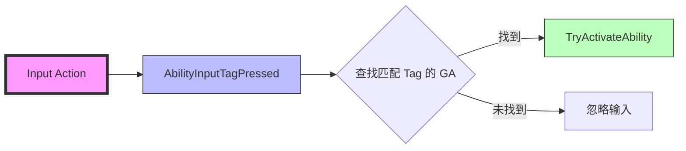

# GA输入绑定

> **基于 UE 5.7 的 GA 输入绑定技术深度解析**
>
> **注意**：UE 5.7 推荐使用 **Enhanced Input** 系统，而非旧的输入系统。

## 概述

GA 可以绑定输入，将输入与 GA 进行绑定后，就可以通过对应按键或者点击按钮使用 GA。

**UE 5.7 输入系统的基本逻辑**：
1. 一个输入 Action 绑定一个执行行为（Action）
2. 各种输入（鼠标点击、按键、触屏、按钮）去绑定这个 Action
3. 添加了中间层 Action 作为代理，而不是直接绑定 Action
4. 让输入的绑定更灵活方便，输入系统只需要绑定一个 Action 就能触发对应的 Action

## UE 5.7 的输入绑定方式

### 方式一：使用 GameplayTag 绑定（Lyra 推荐方式）

**Lyra 项目使用 `FGameplayTag` 来处理输入**，而非传统的 `InputID`。这是 UE 5.7 推荐的灵活方式。



**Lyra 的输入绑定实现**：

```cpp
// ULyraAbilitySystemComponent 的输入处理
void ULyraAbilitySystemComponent::AbilityInputTagPressed(const FGameplayTag& InputTag)
{
    if (AbilitySpecs.Num() > 0)
    {
        for (const FGameplayAbilitySpec& Spec : AbilitySpecs)
        {
            if (Spec.Ability && Spec.Ability->AbilityTags.HasTag(InputTag))
            {
                TryActivateAbility(Spec.Handle);
            }
        }
    }
}

void ULyraAbilitySystemComponent::AbilityInputTagReleased(const FGameplayTag& InputTag)
{
    if (AbilitySpecs.Num() > 0)
    {
        for (const FGameplayAbilitySpec& Spec : AbilitySpecs)
        {
            if (Spec.Ability && Spec.Ability->AbilityTags.HasTag(InputTag))
            {
                // 通知 GA 输入被释放
                if (Spec.IsActive())
                {
                    InvokeReplicatedEvent(
                        EAbilityGenericReplicatedEvent::InputReleased,
                        Spec.Handle,
                        Spec.ActivationInfo.GetActivationPredictionKey()
                    );
                }
            }
        }
    }
}
```

**Enhanced Input 绑定示例**（UE 5.7）：

```cpp
void ALyraCharacter::SetupPlayerInputComponent(UInputComponent* PlayerInputComponent)
{
    Super::SetupPlayerInputComponent(PlayerInputComponent);
    
    // 获取 Enhanced Input Component
    UEnhancedInputComponent* EnhancedInput = Cast<UEnhancedInputComponent>(PlayerInputComponent);
    if (EnhancedInput && LyraAbilitySystemComponent)
    {
        // 绑定输入 Action 到 GameplayTag
        const FLyraInputConfig& InputConfig = /* 从 Experience 获取 */;
        
        for (const FLyraInputAction& InputAction : InputConfig.InputActions)
        {
            EnhancedInput->BindAction(
                InputAction.InputAction,
                ETriggerEvent::Triggered,
                LyraAbilitySystemComponent,
                &ULyraAbilitySystemComponent::AbilityInputTagPressed,
                InputAction.InputTag
            );
            
            EnhancedInput->BindAction(
                InputAction.InputAction,
                ETriggerEvent::Completed,
                LyraAbilitySystemComponent,
                &ULyraAbilitySystemComponent::AbilityInputTagReleased,
                InputAction.InputTag
            );
        }
    }
}
```

### 方式二：使用 InputID 绑定（传统方式，UE 5.7 仍支持）

**定义输入 ID 枚举**：

```cpp
UENUM(BlueprintType)
namespace EGameplayAbilityInputBinds
{
    enum Type : int
    {
        Ability1                UMETA(DisplayName = "Ability1 (LMB)"),
        Ability2                UMETA(DisplayName = "Ability2 (RMB)"),
        Ability3                UMETA(DisplayName = "Ability3 (Q)"),
        Ability4                UMETA(DisplayName = "Ability4 (E)"),
        Ability5                UMETA(DisplayName = "Ability5 (R)"),
        Ability6                UMETA(DisplayName = "Ability6 (Shift)"),
        Ability7                UMETA(DisplayName = "Ability7 (Space)"),
        Ability8                UMETA(DisplayName = "Ability8 (B)"),
        Ability9                UMETA(DisplayName = "Ability9 (T)"),
    };
}
```

**绑定输入 ID 枚举**：

将枚举值转换成 ActionName，并绑定技能执行输入的统一接口 `UAbilitySystemComponent::AbilityLocalInputPressed`

```cpp
void ATestCharacter::SetupPlayerInputComponent(UInputComponent* PlayerInputComponent)
{
    FTopLevelAssetPath EnumPathName = FTopLevelAssetPath(
        StaticEnum<EGameplayAbilityInputBinds>()
    );
    
    ASC->BindAbilityActivationToInputComponent(
        PlayerInputComponent,
        FGameplayAbilityInputBinds(
            "AbilityInputConfirm",
            "AbilityInputCancel",
            EnumPathName
        )
    );
}
```

`BindAbilityActivationToInputComponent` 是 UE 提供的注册输入绑定的接口：

```cpp
void UAbilitySystemComponent::BindAbilityActivationToInputComponent(...)
{
    UEnum* EnumBinds = BindInfo.GetBindEnum();
    
    SetBlockAbilityBindingsArray(BindInfo);
    
    // 遍历枚举，绑定 AbilityLocalInputPressed/AbilityLocalInputReleased
    for (int32 idx = 0; idx < EnumBinds->NumEnums(); ++idx)
    {
        const FString FullStr = EnumBinds->GetNameStringByIndex(idx);
        
        // 按下事件
        {
            FInputActionBinding AB(FName(*FullStr), IE_Pressed);
            AB.ActionDelegate.GetDelegateForManualSet().BindUObject(
                this,
                &UAbilitySystemComponent::AbilityLocalInputPressed,
                idx
            );
            InputComponent->AddActionBinding(AB);
        }
        
        // 松开事件
        {
            FInputActionBinding AB(FName(*FullStr), IE_Released);
            AB.ActionDelegate.GetDelegateForManualSet().BindUObject(
                this,
                &UAbilitySystemComponent::AbilityLocalInputReleased,
                idx
            );
            InputComponent->AddActionBinding(AB);
        }
    }
}
```

## 执行输入

当输入系统接收到对应的 Action 的按下和松开事件，会将 Action 在枚举中对应的枚举值作为 `InputID` 传入 `AbilityLocalInputPressed` 和 `AbilityLocalInputReleased`。就可以与 GA 绑定的 `InputID` 进行匹配，执行激活操作。

> **按下操作**：优先尝试激活 GA，如果 GA 已经被激活后再接受到按下操作则会通知 GA 有对应输入被按下。
> *比如二段攻击技能，在激活后再次点击触发二段效果*

```cpp
void UAbilitySystemComponent::AbilityLocalInputPressed(int32 InputID)
{
    ...
    ABILITYLIST_SCOPE_LOCK();
    for (FGameplayAbilitySpec& Spec : ActivatableAbilities.Items)
    {
        if (Spec.InputID == InputID)
        {
            if (Spec.Ability)
            {
                Spec.InputPressed = true;
                if (Spec.IsActive())
                {
                    if (Spec.Ability->bReplicateInputDirectly && 
                        IsOwnerActorAuthoritative() == false)
                    {
                        ServerSetInputPressed(Spec.Handle);
                    }
                    
                    AbilitySpecInputPressed(Spec);
                    InvokeReplicatedEvent(
                        EAbilityGenericReplicatedEvent::InputPressed,
                        Spec.Handle,
                        Spec.ActivationInfo.GetActivationPredictionKey()
                    );
                }
                else
                {
                    TryActivateAbility(Spec.Handle);
                }
            }
        }
    }
}
```

> **松开操作**：就直接通知 GA 对应的输入被松开

```cpp
void UAbilitySystemComponent::AbilityLocalInputReleased(int32 InputID)
{
    ABILITYLIST_SCOPE_LOCK();
    for (FGameplayAbilitySpec& Spec : ActivatableAbilities.Items)
    {
        if (Spec.InputID == InputID)
        {
            Spec.InputPressed = false;
            if (Spec.Ability && Spec.IsActive())
            {
                if (Spec.Ability->bReplicateInputDirectly &&
                    IsOwnerActorAuthoritative() == false)
                {
                    ServerSetInputReleased(Spec.Handle);
                }
                
                AbilitySpecInputReleased(Spec);
                
                InvokeReplicatedEvent(
                    EAbilityGenericReplicatedEvent::InputReleased,
                    Spec.Handle,
                    Spec.ActivationInfo.GetActivationPredictionKey()
                );
            }
        }
    }
}
```

## 通用的确认 & 取消操作

除了通过枚举绑定 GA 专属输入之外，还支持配置两个通用的输入操作：通用确认/取消操作。所有 GA 都可以按需监听这两个操作的输入。

**通用确认/取消输入响应的接口分别是**：
- `UAbilitySystemComponent::LocalInputConfirm`
- `UAbilitySystemComponent::LocalInputCancel`

> **应用场景**：比如投掷手雷的 GA，在激活之后还需要选定目标，确认目标之后再释放，也可以取消操作。这时候就可以定制一个技能通用的确认输入、一个通用的取消输入。在手雷的 GA 监听这两个输入。

UE 提供了两个 Task 便于 GA 监听通用的确认与取消输入：
- `UAbilityTask_WaitConfirm`
- `UAbilityTask_WaitCancel`

**绑定通用确认/取消输入**：

```cpp
void UAbilitySystemComponent::BindToInputComponent(UInputComponent* InputComponent)
{
    static const FName ConfirmBindName(TEXT("AbilityConfirm"));
    static const FName CancelBindName(TEXT("AbilityCancel"));
    
    // Pressed event
    {
        FInputActionBinding AB(ConfirmBindName, IE_Pressed);
        AB.ActionDelegate.GetDelegateForManualSet().BindUObject(
            this,
            &UAbilitySystemComponent::LocalInputConfirm
        );
        
        InputComponent->AddActionBinding(AB);
    }
    
    // 
    {
        FInputActionBinding AB(CancelBindName, IE_Pressed);
        AB.ActionDelegate.GetDelegateForManualSet().BindUObject(
            this,
            &UAbilitySystemComponent::LocalInputCancel
        );
        
        InputComponent->AddActionBinding(AB);
    }
}
```

## UE 5.7 的 Enhanced Input 集成

### Lyra 项目的 Enhanced Input 配置

**1. 定义 Input Action**：

在 UE 编辑器中创建 `Input Action` 资产：
- `IA_Jump` - 跳跃
- `IA_Fire` - 开火
- `IA_Aim` - 瞄准
- `IA_Reload` - 换弹

**2. 定义 Input Mapping Context**：

创建 `Input Mapping Context` 资产，将 `Input Action` 绑定到具体的按键。

**3. 在 Character 中绑定**：

```cpp
void ALyraCharacter::SetupPlayerInputComponent(UInputComponent* PlayerInputComponent)
{
    Super::SetupPlayerInputComponent(PlayerInputComponent);
    
    // 获取 Enhanced Input Component
    UEnhancedInputComponent* EnhancedInput = Cast<UEnhancedInputComponent>(PlayerInputComponent);
    if (EnhancedInput)
    {
        // 添加 Input Mapping Context
        UEnhancedInputLocalPlayerSubsystem* Subsystem = 
            ULocalPlayer::GetSubsystem<UEnhancedInputLocalPlayerSubsystem>(
                GetLocalViewingPlayerController()->GetLocalPlayer()
            );
        
        if (Subsystem)
        {
            Subsystem->AddMappingContext(DefaultMappingContext, 0);
        }
        
        // 绑定 Input Action 到 GA
        if (LyraAbilitySystemComponent)
        {
            for (const FLyraInputAction& InputAction : InputConfig.InputActions)
            {
                EnhancedInput->BindAction(
                    InputAction.InputAction,
                    ETriggerEvent::Triggered,
                    LyraAbilitySystemComponent,
                    &ULyraAbilitySystemComponent::AbilityInputTagPressed,
                    InputAction.InputTag
                );
            }
        }
    }
}
```

### 使用 AbilityTask 监听输入

UE 提供了两个 Task 便于 GA 监听绑定输入的按下松开：
- `UAbilityTask_WaitInputPress`
- `UAbilityTask_WaitInputRelease`

**示例**：在 GA 蓝图中使用 `WaitInputPress` 和 `WaitInputRelease` 节点。

## Lyra 项目的输入标签系统

Lyra 使用 `FGameplayTag` 来处理输入，这是更灵活的方式：

```cpp
// 输入标签示例
Ability.Input.PrimaryFire
Ability.Input.SecondaryFire
Ability.Input.Aim
Ability.Input.Reload
Ability.Input.Jump
Ability.Input.Sprint
```

**配置 InputConfig 数据资产**：

Lyra 使用 `ULyraInputConfig` 数据资产来配置输入：

```cpp
UCLASS()
class ULyraInputConfig : public UPrimaryDataAsset
{
    GENERATED_BODY()
    
public:
    UPROPERTY(EditDefaultsOnly, Category = "Input")
    TArray<FLyraInputAction> InputActions;
};

USTRUCT()
struct FLyraInputAction
{
    GENERATED_BODY()
    
    UPROPERTY(EditDefaultsOnly, Category = "Input")
    TObjectPtr<UInputAction> InputAction;
    
    UPROPERTY(EditDefaultsOnly, Category = "Input")
    FGameplayTag InputTag;
};
```

## 相关页面

- [[30-tutorials/gas/02-GA执行流程详解]] - GA 执行流程详解
- [[30-tutorials/gas/04-GA事件机制]] - GA GameplayEvent

## 参考资料

1. [Unreal Engine 5 Documentation - Enhanced Input](https://docs.unrealengine.com/5.7/en-US/docs/projects/input/enhanced-input-for-unreal-engine/)
2. Lyra Sample Game - Input System Implementation
3. 现有 GAS 教程系列（基于 UE 5.3+）

---
> 最后更新：2026-05-16

<!-- nav:auto -->

---

**导航**: ← [[30-tutorials/gas/02-GA执行流程详解|02-GA执行流程详解]] · [[30-tutorials/gas/04-GA事件机制|04-GA事件机制]] →

<!-- /nav:auto -->
