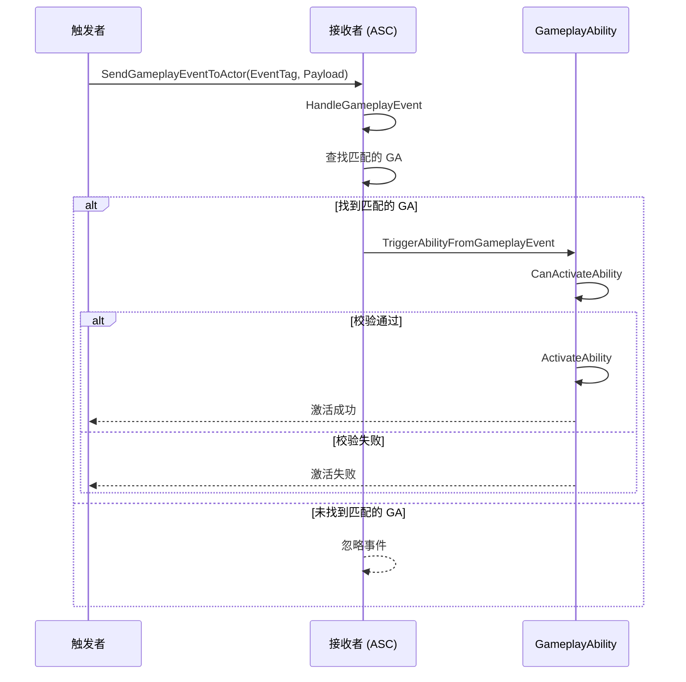

# GA事件机制

> **基于 UE 5.7 的 GameplayEvent 技术深度解析**

## 概述

**GAS 提供了一套 GameplayEvent 事件通信机制**，可以通过发送一个 Tag 和一个 `FGameplayEventData` 来完成事件通信。

**GameplayEvent 的应用场景**：
- 通过 GameplayEvent 信号告诉 GAS 尝试想激活一个 GA
- 两个不同的 GA 通过 GameplayEvent 信号进行通信交互
- GA 执行过程中将执行结果通过 GameplayEvent 信号通知外部
- GA 执行过程中等待外部输入一个 GameplayEvent 信号触发后续行为

**GameplayEvent 的组成**：
- `EventTag`：事件的标签，用以识别是什么事件
- `FGameplayEventData`：事件附带的参数信息（上下文信息）

## GameplayEvent 的发送接口

### 1. UAbilitySystemBlueprintLibrary::SendGameplayEventToActor

```cpp
void UAbilitySystemBlueprintLibrary::SendGameplayEventToActor(
    AActor* Actor,
    FGameplayTag EventTag,
    FGameplayEventData Payload)
{
    if (::IsValid(Actor))
    {
        UAbilitySystemComponent* AbilitySystemComponent = GetAbilitySystemComponent(Actor);
        if (AbilitySystemComponent != nullptr && IsValidChecked(AbilitySystemComponent))
        {
            FScopedPredictionWindow NewScopedWindow(AbilitySystemComponent, true);
            AbilitySystemComponent->HandleGameplayEvent(EventTag, &Payload);
        }
    }
}
```

### 2. UGameplayAbility::SendGameplayEvent

```cpp
void UGameplayAbility::SendGameplayEvent(
    FGameplayTag EventTag,
    FGameplayEventData Payload)
{
    if (AbilitySystemComponent)
    {
        AbilitySystemComponent->HandleGameplayEvent(EventTag, &Payload);
    }
}
```

## GameplayEvent 的接收接口

### UAbilitySystemComponent::HandleGameplayEvent

```cpp
int32 UAbilitySystemComponent::HandleGameplayEvent(...)
{
    int32 TriggeredCount = 0;
    FGameplayTag CurrentTag = EventTag;
    ABILITYLIST_SCOPE_LOCK();
    
    while (CurrentTag.IsValid())
    {
        // GA 通过 GameplayEvent 触发激活
        if (GameplayEventTriggeredAbilities.Contains(CurrentTag))
        {
            TArray<FGameplayAbilitySpecHandle>& TriggeredAbilityHandles = 
                GameplayEventTriggeredAbilities[CurrentTag];
            
            for (const FGameplayAbilitySpecHandle& AbilityHandle : TriggeredAbilityHandles)
            {
                if (TriggerAbilityFromGameplayEvent(...))
                {
                    TriggeredCount++;
                }
            }
        }
        
        // 绑定指定 Tag 的事件委托
        if (FGameplayEventMulticastDelegate* Delegate = 
            GenericGameplayEventCallbacks.Find(EventTag))
        {
            FGameplayEventMulticastDelegate DelegateCopy = *Delegate;
            DelegateCopy.Broadcast(Payload);
        }
        
        // 还会触发父 Tag 绑定的 GA
        // 比如 Tag.A 和 Tag.A.B 都绑定了一个 GA
        // 则 Tag.A.B 会同时触发 Tag.A.B 和 Tag.A 绑定的 GA
        CurrentTag = CurrentTag.RequestDirectParent();
    }
    
    ...
    return TriggeredCount;
}
```

## FGameplayEventData 字段说明

`FGameplayEventData` 是触发 GameplayEvent 附带的参数信息，提供了基本的字段，而且还可以根据需求进行定制扩展。

```cpp
struct GAMEPLAYABILITIES_API FGameplayEventData
{
    GENERATED_BODY()
    
    // 触发事件的 Tag
    UPROPERTY(BlueprintReadWrite, Category = "GameplayEvent")
    FGameplayTag EventTag;
    
    // GameplayEvent 的触发者
    UPROPERTY(BlueprintReadWrite, Category = "GameplayEvent")
    TObjectPtr<AActor> Instigator;
    
    // GameplayEvent 的接收者
    UPROPERTY(BlueprintReadWrite, Category = "GameplayEvent")
    TObjectPtr<AActor> Target;
    
    // 附加 UObject 实例 1
    UPROPERTY(BlueprintReadWrite, Category = "GameplayEvent")
    TObjectPtr<UObject> OptionalObject;
    
    // 附加 UObject 实例 2
    UPROPERTY(BlueprintReadWrite, Category = "GameplayEvent")
    TObjectPtr<UObject> OptionalObject2;
    
    // 封装的 FGameplayEffectContext
    // GAS 体系中用于传递上下文信息的数据结构
    UPROPERTY(BlueprintReadWrite, Category = "GameplayEvent")
    FGameplayEffectContextHandle ContextHandle;
    
    // GameplayEvent 的触发者触发 GameplayEvent 携带的 Tag 信息
    UPROPERTY(BlueprintReadWrite, Category = "GameplayEvent")
    FGameplayTagContainer InstigatorTags;
    
    // GameplayEvent 的接受者接收 GameplayEvent 携带的 Tag 信息
    UPROPERTY(BlueprintReadWrite, Category = "GameplayEvent")
    FGameplayTagContainer TargetTags;
    
    // 附加的一个 float 数据
    UPROPERTY(BlueprintReadWrite, Category = "GameplayEvent")
    float EventMagnitude;
    
    // 封装的 FGameplayAbilityTargetData
    // 用于存放生效的目标信息
    UPROPERTY(BlueprintReadWrite, Category = "GameplayEvent")
    FGameplayAbilityTargetDataHandle TargetData;
};
```

### 字段详细说明

| 字段 | 说明 |
|------|------|
| `EventTag` | 触发事件的 Tag |
| `Instigator` | GameplayEvent 的触发者 |
| `Target` | GameplayEvent 的接收者 |
| `OptionalObject` | 附加 UObject 实例 1 |
| `OptionalObject2` | 附加 UObject 实例 2 |
| `ContextHandle` | 封装的 `FGameplayEffectContext`，GAS 体系中用于传递上下文信息的数据结构 |
| `InstigatorTags` | GameplayEvent 的触发者触发 GameplayEvent 携带的 Tag 信息 |
| `TargetTags` | GameplayEvent 的接受者接收 GameplayEvent 携带的 Tag 信息 |
| `EventMagnitude` | 附加的一个 float 数据 |
| `TargetData` | 封装的 `FGameplayAbilityTargetData`，用于存放生效的目标信息 |

> **应用场景**：
> - `InstigatorTags`：GA 的配置项 `SourceRequiredTags`/`SourceBlockedTags` 可以在激活时通过传入的 `FGameplayEventData` 检测触发时触发者携带的 Tag 信息
> - `TargetTags`：GA 的配置项 `TargetRequiredTags`/`TargetBlockedTags` 可以在激活时通过传入的 `FGameplayEventData` 检测触发时接收者携带的 Tag 信息

## GameplayEvent 激活 GA

`UAbilitySystemComponent::TriggerAbilityFromGameplayEvent` 是通过 GameplayEvent 尝试激活一个 GA 的统一入口。

在激活 GA 的流程中，会传入一个 `FGameplayEventData` 的参数，可以携带一些激活的附加参数信息。

**两种使用 GameplayEvent 激活 GA 的方式**：

1. **能获取到 GA 的 `FGameplayAbilitySpecHandle` 实例**：直接调用 `UAbilitySystemComponent::TriggerAbilityFromGameplayEvent` 进行触发
2. **不能直接获取到 GA 的 Handle**：通过 `UAbilitySystemBlueprintLibrary::SendGameplayEventToActor` 直接向一个指定的 Actor（具备 `UAbilitySystemComponent` 组件）发送指定的 Tag 的 `FGameplayEventData`

`HandleGameplayEvent` 接口会在可激活 GA 列表查找是否有 GA 的 `AbilityTriggers` 配置跟传入的 Tag 匹配。如果有则对匹配的 GA 执行 `TriggerAbilityFromGameplayEvent`。



## UE 5.7 中的 GameplayEvent 改进

### 1. 性能优化

UE 5.7 对 `HandleGameplayEvent` 进行了性能优化：
- 减少了 `FGameplayTag` 的查找次数
- 优化了 `GameplayEventTriggeredAbilities` 的遍历算法

### 2. 网络复制改进

UE 5.7 改进了 GameplayEvent 的网络复制机制：
- 增强了 `FScopedPredictionWindow` 的同步机制
- 改进了 `PredictionKey` 的复制逻辑

### 3. 新增功能

UE 5.7 中 `FGameplayEventData` 新增了字段：
- `OptionalObject2`：第二个附加 UObject 实例
- 改进了 `TargetData` 的序列化逻辑

## Lyra 项目中的 GameplayEvent 用法

### 1. Lyra 使用 GameplayTag 触发 GA

Lyra 项目使用 `FGameplayTag` 来处理输入和事件，而非传统的 `InputID`：

```cpp
void ULyraAbilitySystemComponent::AbilityInputTagPressed(const FGameplayTag& InputTag)
{
    if (AbilitySpecs.Num() > 0)
    {
        for (const FGameplayAbilitySpec& Spec : AbilitySpecs)
        {
            if (Spec.Ability && Spec.Ability->AbilityTags.HasTag(InputTag))
            {
                FGameplayEventData EventData;
                EventData.EventTag = InputTag;
                EventData.Instigator = GetOwnerActor();
                EventData.Target = GetOwnerActor();
                
                TryActivateAbility(Spec.Handle, true, &EventData);
            }
        }
    }
}
```

### 2. Lyra 的 GameplayEvent 通信示例

**示例：武器开火事件**

```cpp
// 武器开火时发送 GameplayEvent
void ULyraWeaponComponent::FireWeapon()
{
    FGameplayEventData EventData;
    EventData.EventTag = TAG_Ability_Weapon_Fire;
    EventData.Instigator = GetOwner();
    EventData.Target = GetOwner();
    EventData.OptionalObject = CurrentWeapon;
    
    UAbilitySystemBlueprintLibrary::SendGameplayEventToActor(
        GetOwner(),
        TAG_Ability_Weapon_Fire,
        EventData
    );
}
```

**示例：GA 监听 GameplayEvent**

在 GA 蓝图中配置 `AbilityTriggers`：
- `TriggerTag`：`Ability.Weapon.Fire`
- `TriggerSource`：`GameplayEvent`

然后使用 `WaitGameplayEvent` Task 监听事件：

```cpp
// 在 GA 蓝图中
UAbilityTask_WaitGameplayEvent* Task = 
    UAbilityTask_WaitGameplayEvent::WaitGameplayEvent(
        this,
        TAG_Ability_Weapon_Fire
    );
    
Task->EventReceived.AddDynamic(this, &ULyraGameplayAbility::OnFireEventReceived);
Task->ReadyForActivation();
```

## 相关页面

- [[30-tutorials/gas/03-GA输入绑定]] - GA 输入绑定
- [[30-tutorials/gas/05-GA目标信息]] - GA 目标信息

## 参考资料

1. [Unreal Engine 5 Documentation - Gameplay Events](https://docs.unrealengine.com/5.7/en-US/)
2. Lyra Sample Game - GameplayEvent Implementation
3. 现有 GAS 教程系列（基于 UE 5.3+）

---
> 最后更新：2026-05-16

<!-- nav:auto -->

---

**导航**: ← [[30-tutorials/gas/03-GA输入绑定|03-GA输入绑定]] · [[30-tutorials/gas/05-GA目标信息|05-GA目标信息]] →

<!-- /nav:auto -->
