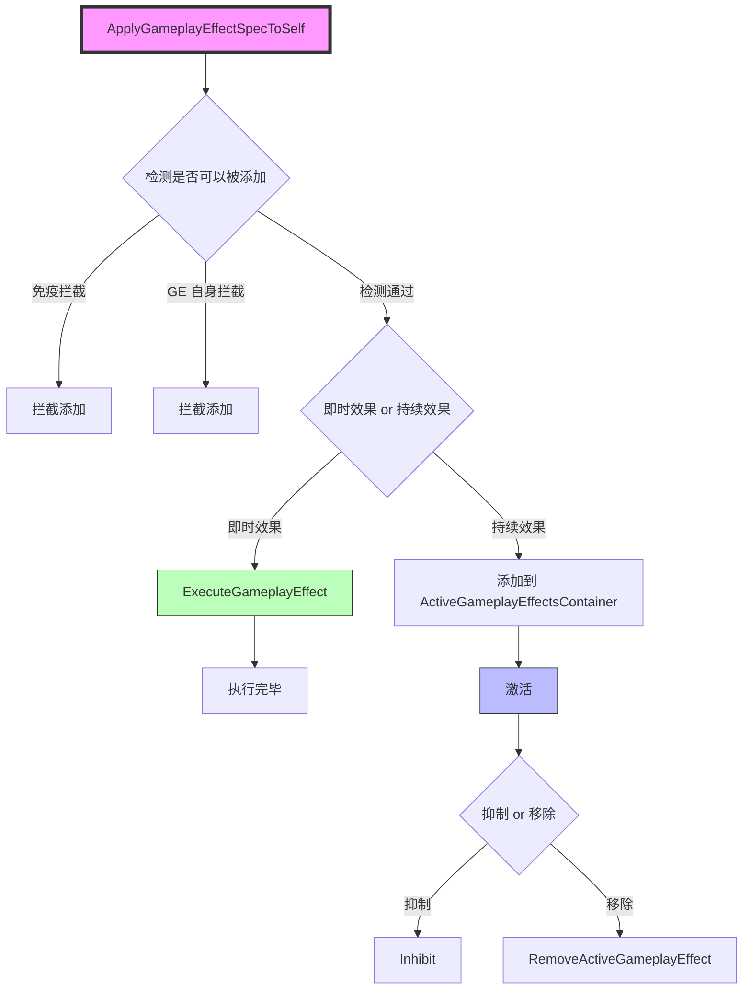

# GE运行流程详解

> **基于 UE 5.7 的 GameplayEffect 运行流程技术深度解析**

## 概述

上一章讲了 GE 的配置，通过蓝图配置的 GE 在运行时读取其 CDO 作为配置模板，应该视为只读数据。

**GE 在运行时首先会构造一个运行时实例（`FGameplayEffectSpec` 对象）**。`FGameplayEffectSpec` 包含了只读的 GE 配置模板（`UGameplayEffect`）、创建 GE 时传入的上下文信息（`Context`）及其他需要在运行时设置更改的数据（等级、捕获的来源标记、捕获的目标标记等）。

创建好运行时实例后，尝试添加（Apply）给指定的目标。此时会根据效果的时效性（持续效果还是即时效果）区分处理。

添加（Apply）成功之后：
- **对于持续效果**：会添加进统一的管理容器（`FActiveGameplayEffectsContainer`）进行统一管理。在其持续的生命周期内会经历添加、激活、抑制（取消激活）、移除。
- **对于即时效果**：添加成功后立即执行，执行完即结束其使命。

## FGameplayEffectSpec

`FGameplayEffectSpec` 是在运行时创建和使用的。当需要添加（Apply）一个 GameplayEffect 时，它会首先创建一个 `FGameplayEffectSpec`，再将其添加（Apply）到目标 Actor 上。

了解 GE 执行流程前先了解下 `FGameplayEffectSpec` 都有哪些数据。

### Def

**`TObjectPtr<const UGameplayEffect> Def`**

指向 `UGameplayEffect` CDO 的指针（只读）。

包含了这个效果的所有静态配置信息，例如效果的类型（即时、持续、周期性等）、基础强度、基础持续时间等。

### Modifiers

**`TArray<FModifierSpec> Modifiers`**

**GE 属性修正器配置 `FGameplayModifierInfo` 对应的运行时数据结构**

将属性修正器配置（`FGameplayModifierInfo`）转换为最终的修正值。

属性修正器（`FGameplayModifierInfo`）配置时会有各种数据来源，在运行时就是通过配置的数据来源计算出一个最终的修正值存放到 `Modifiers` 中，方便后续逻辑读取修正值。

```cpp
struct FModifierSpec
{
    float GetEvaluatedMagnitude() const { return EvaluatedMagnitude; }
private:
    UPROPERTY()
    float EvaluatedMagnitude;
};

void FGameplayEffectSpec::Initialize(...)
{
    // 初始化时已经设置好了数组大小，跟 GE 配置的 Modifiers 一一对应
    Modifiers.SetNum(Def->Modifiers.Num());
}

void FGameplayEffectSpec::CalculateModifierMagnitudes(float EffectElpasedTime)
{
    for (int32 ModIdx = 0; ModIdx < Modifiers.Num(); ++ModIdx)
    {
        // 将 GE 配置的修正数据计算出结果存放到 Modifiers（一一对应）
        const FGameplayModifierInfo& ModDef = Def->Modifiers[ModIdx];
        FModifierSpec& ModSpec = Modifiers[ModIdx];
        
        if (false == ModDef.ModifierMagnitude.AttemptCalculateMagnitude(...))
        {
            ModSpec.EvaluatedMagnitude = 0.f;
        }
    }
}
```

### ModifiedAttributes

**`TArray<FGameplayEffectModifiedAttribute> ModifiedAttributes`**

**记录哪些属性（Attribute）被 GE 修改了以及修改了多少**

按属性类型，统计修正值。

将属性修正器配置（`FGameplayModifierInfo`）转换最终的修正值存放到 `Modifiers` 后，按属性进行统计，方便获取某个属性累计被修正了多少（可能存在多个修正器修正同一个属性）。

```cpp
struct GAMEPLAYABILITIES_API FGameplayEffectModifiedAttribute
{
    GENERATED_USTRUCT_BODY()
    
    UPROPERTY()
    FGameplayAttribute Attribute;
    
    UPROPERTY()
    float TotalMagnitude;
};

FActiveGameplayEffect* FActiveGameplayEffectsContainer::ApplyGameplayEffectSpec(...)
{
    ....
    int32 ModifierIndex = -1;
    for (const FGameplayModifierInfo& Mod : AppliedEffectSpec.Def->Modifiers)
    {
        ++ModifierIndex;
        
        float Magnitude = 0.0f;
        if (AppliedEffectSpec.Modifiers.IsValidIndex(ModifierIndex))
        {
            const FModifierSpec& ModSpec = AppliedEffectSpec.Modifiers[ModifierIndex];
            Magnitude = ModSpec.GetEvaluatedMagnitude();
        }
        
        FGameplayEffectModifiedAttribute* ModifiedAttribute = 
            AppliedEffectSpec.GetModifiedAttribute(Mod.Attribute);
        
        if (!ModifiedAttribute)
        {
            ModifiedAttribute = AppliedEffectSpec.AddModifiedAttribute(Mod.Attribute);
        }
        ModifiedAttribute->TotalMagnitude += Magnitude;
    }
    ...
}
```

### Duration

**`float Duration`**

**GE 实例的持续时间**（持续效果才会有持续时间配置）

在 GE 添加时根据配置（`DurationMagnitude`）初始化持续时间。

可以在运行时直接调用 `SetDuration` 设置持续时间进行覆盖。

### Period

**`float Period`**

**GE 实例的定时触发时间**

对于周期（定时触发）效果，这个值表示每次效果触发的间隔时间。

### CapturedSourceTags

**`FTagContainerAggregator CapturedSourceTags`**

**用于描述 GE 的来源**

当一个 GameplayEffect 被应用时，系统会自动捕获所有相关的源标签（Tag），并存储在 `CapturedSourceTags` 中。

- GE 最终是通过 ASC 组件赋予目标的，会捕获 ASC 拥有的 Tag 集合作为来源 Tag。
- 此外 GE 还可能是在 GA 或者 GE 中通过 ASC 赋予目标的，此时还会额外捕获来源 GE 和来源 GA 的 Tag 作为来源 Tag。
- GE 还可以赋予自身 Tag 来标记来源。

**GE 赋予的来源 Tag 分为两种**：
1. GE 赋予自身的 Tag（包括 `DynamicAssetTag`）
2. 这个 GE 是通过另外一个 GE 赋予的，则会继承来源 GE 捕获的来源 Tag 集合（`CapturedSourceTags`）

```cpp
// GE 赋予自身的 Tag
void FGameplayEffectSpec::Initialize(...)
{
    ...
    CapturedSourceTags.GetSpecTags().AppendTags(Def->GetAssetTags());
}

void FGameplayEffectSpec::AddDynamicAssetTag(...)
{
    CapturedSourceTags.GetSpecTags().AddTag(TagToAdd);
}

void FGameplayEffectSpec::AppendDynamicAssetTags(...)
{
    CapturedSourceTags.GetSpecTags().AppendTags(TagsToAppend);
}

// GE 是通过另外一个 GE 赋予的，则会继承来源 GE 捕获的来源 Tag 集合（CapturedSourceTags）
void FGameplayEffectSpec::InitializeFromLinkedSpec(const UGameplayEffect* InDef, const FGameplayEffectSpec& OriginalSpec)
{
    // 复制来源 GE 的来源 Tag 集合（CapturedSourceTags），
    // 会移除来源 GE 赋予自身的 Tag，这个是独属于 GE 自身的
    CapturedSourceTags = OriginalSpec.CapturedSourceTags;
    CapturedSourceTags.GetSpecTags().RemoveTags(OriginalSpec.Def->GetAssetTags());
    
    // Initialize 继续捕获 GE 赋予自身的 Tag
    Initialize(InDef, NewContextHandle, OriginalSpec.GetLevel());
}
```

**来源 GA 赋予的 Tag**

从 GA 赋予的 GE 会捕获 GA 的 Tag 集合作为来源 Tag 集合。

```cpp
// 来源 GA 赋予的 Tag
void UGameplayAbility::ApplyAbilityTagsToGameplayEffectSpec(...) const
{
    FGameplayTagContainer& CapturedSourceTags = Spec.CapturedSourceTags.GetSpecTags();
    
    CapturedSourceTags.AppendTags(AbilityTags);
}
```

**来源 Actor（实际是 Actor 持有的 ASC 组件）赋予的 Tag**

直接通过 ASC 赋予的 GE，会捕获 ASC 拥有的 Tag 集合作为来源 Tag 集合。

```cpp
// 来源 Actor 赋予的 Tag
void FGameplayEffectSpec::Initialize(...)
{
    ...
    CaptureDataFromSource();
    ...
}

void FGameplayEffectSpec::CaptureDataFromSource(...)
{
    ...
    if (!bSkipRecaptureSourceActorTags)
    {
        RecaptureSourceActorTags();
    }
    ...
}

void FGameplayEffectSpec::RecaptureSourceActorTags()
{
    CapturedSourceTags.GetActorTags().Reset();
    EffectContext.GetOwnerGameplayTags(CapturedSourceTags.GetActorTags(),
                                 CapturedSourceTags.GetSpecTags());
}
```

> **注意**：`CapturedSourceTags` 在捕获来源 Actor 和来源 GA Tag 时只包含在 GameplayEffect 被应用时捕获的源标签，不包含在效果持续期间添加的标签。

### DynamicAssetTags

**`FGameplayTagContainer DynamicAssetTags`**

**动态添加的赋予 GE 自身拥有的 Tag**

```cpp
void FGameplayEffectSpec::AddDynamicAssetTag(...)
{
    CapturedSourceTags.GetSpecTags().AddTag(TagToAdd);
}

void FGameplayEffectSpec::AppendDynamicAssetTags(...)
{
    CapturedSourceTags.GetSpecTags().AppendTags(TagsToAppend);
}

void FGameplayEffectSpec::GetAllAssetTags(OUT FGameplayTagContainer& OutContainer) const
{
    OutContainer.AppendTags(GetDynamicAssetTags());
    if (Def)
    {
        OutContainer.AppendTags(Def->GetAssetTags());
    }
}
```

### CapturedTargetTags

**`FTagContainerAggregator CapturedTargetTags`**

**用于描述 GameplayEffect 的目标（应用于哪个角色）**

当一个 GameplayEffect 被应用（Apply）时，系统会自动捕获相关的目标标签（Tag），并存储在 `CapturedTargetTags` 中。

```cpp
// 捕获目标 Tags
FActiveGameplayEffect* FActiveGameplayEffectsContainer::ApplyGameplayEffectSpec(...)
{
    ...
    AppliedEffectSpec.CapturedTargetTags.GetActorTags().Reset();
    Owner->GetOwnedGameplayTags(AppliedEffectSpec.CapturedTargetTags.GetActorTags());
    ...
}

void FActiveGameplayEffectsContainer::ExecuteActiveEffectsFrom(...)
{
    ...
    SpecToUse.CapturedTargetTags.GetActorTags().Reset();
    Owner->GetOwnedGameplayTags(SpecToUse.CapturedTargetTags.GetActorTags());
    ...
}
```

> **注意**：`CapturedTargetTags` 只包含在 GameplayEffect 被应用时捕获的目标标签，不包含在效果持续期间添加的标签。定时触发的效果会在每次触发时更新捕获的目标标签。

> **应用场景**：有了捕获的来源/目标 Tag 就可以在某些应有场景对 GE 进行匹配筛选或者产生不同的效果。
> - 比如免疫光环或者驱散光环效果，需要匹配 GE 是否符合需求，就可能需要用到捕获的来源/目标 Tag。
> - 比如属性修正效果的修正配置，可以根据捕获的来源/目标 Tag 决定当前修正配置是否生效。
> - 比如赋予附加效果或者技能时，可以根据捕获的来源/目标 Tag 决定是否赋予。

> **`FTagContainerAggregator` 是聚合标签，用于聚合和管理一组标签（Tag）容器**。
> 参照 [17-Tag集合容器](17-Tag集合容器.md)

### DynamicGrantedTags

**`FGameplayTagContainer DynamicGrantedTags`**

**动态添加的赋予拥有者的 Tag**

会跟 GE 配置的 `GrantedTags` 一起添加到拥有者身上。

```cpp
// 赋予
void FActiveGameplayEffectsContainer::AddActiveGameplayEffectGrantedTagsAndModifiers(...)
{
    ...
    Owner->UpdateTagMap(Effect.Spec.Def->GetGrantedTags(), 1);
    Owner->UpdateTagMap(Effect.Spec.DynamicGrantedTags, 1);
    
    // 复制 Tag
    if (ShouldUseMinimalReplication())
    {
        Owner->AddMinimalReplicationGameplayTags(Effect.Spec.Def->GetGrantedTags());
        Owner->AddMinimalReplicationGameplayTags(Effect.Spec.DynamicGrantedTags);
    }
    ...
}

// 移除
void FActiveGameplayEffectsContainer::RemoveActiveGameplayEffectGrantedTagsAndModifiers(...)
{
    ...
    Owner->UpdateTagMap(Effect.Spec.Def->GetGrantedTags(), -1);
    Owner->UpdateTagMap(Effect.Spec.DynamicGrantedTags, -1);
    
    // 复制 Tag
    if (ShouldUseMinimalReplication())
    {
        Owner->RemoveMinimalReplicationGameplayTags(Effect.Spec.Def->GetGrantedTags());
        Owner->RemoveMinimalReplicationGameplayTags(Effect.Spec.DynamicGrantedTags);
    }
    ...
}

// 添加动态的 GrantedTag
FGameplayEffectSpecHandle UAbilitySystemBlueprintLibrary::AddGrantedTag(...)
{
    FGameplayEffectSpec* Spec = SpecHandle.Data.Get();
    if (Spec)
    {
        Spec->DynamicGrantedTags.AddTag(NewGameplayTag);
    }
    return SpecHandle;
}
```

### StackCount

**`int32 StackCount`**

**当前效果的堆叠数量**

### SetByCaller

**`TMap<FName, float> SetByCallerNameMagnitudes`**
**`TMap<FGameplayTag, float> SetByCallerTagMagnitudes`**

**通过 Tag 或者 `FName` 传递的变量**

> **应用场景**：在创建 GE 示例时可以通过 Tag 或者 `FName` 传递一些参数，然后在需要的用的时候在通过 Tag 取出来。

```cpp
void FGameplayEffectSpec::SetSetByCallerMagnitude(...)
{
    if (DataName != NAME_None)
    {
        SetByCallerNameMagnitudes.FindOrAdd(DataName) = Magnitude;
    }
}

void FGameplayEffectSpec::SetSetByCallerMagnitude(...)
{
    if (DataTag.IsValid())
    {
        SetByCallerTagMagnitudes.FindOrAdd(DataTag) = Magnitude;
    }
}

float FGameplayEffectSpec::GetSetByCallerMagnitude(...) const
{
    float Magnitude = DefaultIfNotFound;
    const float* Ptr = nullptr;
    
    if (DataName != NAME_None)
    {
        Ptr = SetByCallerNameMagnitudes.Find(DataName);
    }
    
    if (Ptr)
    {
        Magnitude = *Ptr;
    }
    
    return Magnitude;
}

float FGameplayEffectSpec::GetSetByCallerMagnitude(...) const
{
    float Magnitude = DefaultIfNotFound;
    const float* Ptr = nullptr;
    
    if (DataTag.IsValid())
    {
        Ptr = SetByCallerTagMagnitudes.Find(DataTag);
    }
    
    if (Ptr)
    {
        Magnitude = *Ptr;
    }
    
    return Magnitude;
}
```

### Level

**`float Level`**

**GE 实例的等级**

### EffectContext

**`FGameplayEffectContextHandle EffectContext`**

**GE 上下文信息 `FGameplayEffectContext` 的结构体封装**

存放了一个 `FGameplayEffectContext` 的智能指针，通过 Handle 去引用 `FGameplayEffectContext`。

支持网络复制。

详细说明参照 [24-GE上下文信息](24-GE上下文信息.md)

## GE 流程简介



通过添加接口尝试添加到目标身上（Apply）。

### 赋予判定

- 赋予 GE 时先判定是否有免疫效果拦截该 GE
- 其次判定 GE 自身是否有配置拦截

```cpp
// 触发 GE
FActiveGameplayEffectHandle UAbilitySystemComponent::ApplyGameplayEffectSpecToSelf(...)
{
    ...
    
    // 判定 GE 是否可以添加
    // 免疫拦截判定
    // UAbilitySystemComponent 可以绑定委托，用来判定是否可以添加指定的 GE
    // 比如是否会被其他 GE 的免疫组件免疫
    TArray<FGameplayEffectApplicationQuery> GameplayEffectApplicationQueries;
    for (const FGameplayEffectApplicationQuery& ApplicationQuery : GameplayEffectApplicationQueries)
    {
        const bool bAllowed = ApplicationQuery.Execute(ActiveGameplayEffects, Spec);
        if (!bAllowed)
        {
            return FActiveGameplayEffectHandle();
        }
    }
    
    // 自身 GE 组件拦截判定
    if (!Spec.Def->CanApply(Owner, Spec))
    {
        return FActiveGameplayEffectHandle();
    }
    
    ...
}
```

### 执行赋予操作

- 持续性效果添加到管理容器 `FActiveGameplayEffectsContainer`
- 即时效果（Instant）添加成功立即执行

```cpp
FActiveGameplayEffectHandle UAbilitySystemComponent::ApplyGameplayEffectSpecToSelf(...)
{
    ...
    
    if (Spec.Def->DurationPolicy != EGameplayEffectDurationType::Instant ||
         bTreatAsInfiniteDuration)
    {
        AppliedEffect = ActiveGameplayEffects.ApplyGameplayEffectSpec(Spec,
            PredictionKey,
            bFoundExistingStackableGE);
        
        if (!AppliedEffect)
        {
            return FActiveGameplayEffectHandle();
        }
    }
    
    ...
}

FActiveGameplayEffectHandle UAbilitySystemComponent::ApplyGameplayEffectSpecToSelf(...)
{
    ...
    
    if (Spec.Def->DurationPolicy == EGameplayEffectDurationType::Instant)
    {
        ExecuteGameplayEffect(*OurCopyOfSpec, PredictionKey);
    }
    
    ...
}
```

## 持续效果流程

**持续效果是指具备持续时长的效果（或者是永久性），具备周期性（定时触发）、叠加、激活、抑制（冻结）等特性。**

持续效果会再次封装成激活效果实例（类 `FActiveGameplayEffect` 对象）。其内包含效果运行时实例 `FGameplayEffectSpec` 对象。将激活效果实例（类 `FActiveGameplayEffect` 对象）添加进激活容器（`FActiveGameplayEffectsContainer`）统一管理。

### FActiveGameplayEffect

**描述一个运行时的持续性效果**

- 持有 GE 的运行时对象实例 `FGameplayEffectSpec`
- 持有检测持续时间何时结束的计时器
- 持有检测定时触发何时执行的计时器
- 支持网络复制（`FFastArraySerializerItem`）

```cpp
struct GAMEPLAYABILITIES_API FActiveGameplayEffect : public FFastArraySerializerItem
{
    GENERATED_BODY()
    
    // GE 运行时实例
    UPROPERTY()
    FGameplayEffectSpec Spec;
    
    // 持续时间计时器
    FTimerHandle DurationHandle;
    
    // 定时触发计时器
    FTimerHandle PeriodHandle;
    
    // 是否处于抑制状态
    bool bIsInhibited;
    
    // 激活时间
    float StartServerWorldTime;
    
    // 上次周期触发时间
    float LastPeriodicApplyTime;
};
```

### GE 添加流程

```cpp
FActiveGameplayEffect* FActiveGameplayEffectsContainer::ApplyGameplayEffectSpec(...)
{
    ...
    
    // 检查堆叠
    FActiveGameplayEffect* ExistingStackableGE = 
        FindStackableGE(Spec);
    
    if (ExistingStackableGE)
    {
        // 处理堆叠逻辑
        // ...
    }
    else
    {
        // 创建新的激活效果实例
        FActiveGameplayEffect* NewActiveGE = 
            new FActiveGameplayEffect();
        
        // 初始化
        NewActiveGE->Spec = Spec;
        
        // 添加到容器
        int32 NewIndex = Items.Add(NewActiveGE);
        
        // 触发 GE 组件回调
        Spec.Def->OnActiveGameplayEffectAdded(NewActiveGE, Owner);
        
        // 设置持续时间计时器
        if (Spec.Duration > 0)
        {
            NewActiveGE->DurationHandle = Owner->GetWorldTimerManager().SetTimer(
                Spec.Duration,
                FTimerDelegate::CreateRaw(this, &FActiveGameplayEffectsContainer::OnDurationExpired,
                NewIndex)
            );
        }
        
        // 设置定时触发计时器
        if (Spec.Period > 0)
        {
            NewActiveGE->PeriodHandle = Owner->GetWorldTimerManager().SetTimer(
                Spec.Period,
                FTimerDelegate::CreateRaw(this, &FActiveGameplayEffectsContainer::OnPeriodExpired,
                NewIndex),
                true  // 循环触发
            );
        }
        
        return NewActiveGE;
    }
}
```

### GE 激活流程

持续效果添加后会激活，激活时会：
1. 应用属性修正
2. 应用 GrantedTags
3. 触发 GameplayCue（OnActive）

```cpp
void FActiveGameplayEffectsContainer::OnActiveGameplayEffectAdded(...)
{
    // 应用属性修正
    for (const FGameplayModifierInfo& Modifier : Effect.Spec.Def->Modifiers)
    {
        // 应用属性修正
        Owner->ApplyModToAttribute(Modifier.Attribute, Modifier.ModifierOp, ...);
    }
    
    // 应用 GrantedTags
    AddActiveGameplayEffectGrantedTagsAndModifiers(Effect);
    
    // 触发 GameplayCue
    Owner->AddGameplayCue(Effect.Spec.Def->GameplayCues, ...);
}
```

### GE 抑制流程

GE 支持通过 Tag 使 GE 暂时失效（Inhibition），仍然在激活容器里但不起作用，有效时间内可以被重新激活生效。

```cpp
void FActiveGameplayEffectsContainer::InhibitActiveGameplayEffect(...)
{
    if (!Effect->bIsInhibited)
    {
        Effect->bIsInhibited = true;
        
        // 移除属性修正
        RemoveActiveGameplayEffectGrantedTagsAndModifiers(*Effect);
        
        // 移除 GameplayCue
        Owner->RemoveGameplayCue(Effect->Spec.Def->GameplayCues, ...);
    }
}

void FActiveGameplayEffectsContainer::UnInhibitActiveGameplayEffect(...)
{
    if (Effect->bIsInhibited)
    {
        Effect->bIsInhibited = false;
        
        // 重新应用属性修正
        AddActiveGameplayEffectGrantedTagsAndModifiers(*Effect);
        
        // 重新触发 GameplayCue
        Owner->AddGameplayCue(Effect->Spec.Def->GameplayCues, ...);
    }
}
```

### GE 移除流程

持续效果的持续时间到了（过期）或者被其他原因中断，则需要移除 GE。

```cpp
void FActiveGameplayEffectsContainer::RemoveActiveGameplayEffect(...)
{
    ...
    
    // 清除持续时间计时器
    if (Effect->DurationHandle.IsValid())
    {
        Owner->GetWorldTimerManager().ClearTimer(Effect->DurationHandle);
    }
    
    // 清除定时触发计时器
    if (Effect->PeriodHandle.IsValid())
    {
        Owner->GetWorldTimerManager().ClearTimer(Effect->PeriodHandle);
    }
    
    // 移除属性修正
    RemoveActiveGameplayEffectGrantedTagsAndModifiers(*Effect);
    
    // 移除 GameplayCue
    Owner->RemoveGameplayCue(Effect->Spec.Def->GameplayCues, ...);
    
    // 触发 GE 组件回调
    Effect->Spec.Def->OnActiveGameplayEffectRemoved(*Effect, Owner);
    
    // 从容器中移除
    Items.RemoveAtSwap(Index);
    
    ...
}
```

## 即时效果流程

即时效果是一次性的，在添加成功后立即执行，执行完即结束其使命。

```cpp
void UAbilitySystemComponent::ExecuteGameplayEffect(...)
{
    ...
    
    // 执行属性修正
    for (const FGameplayModifierInfo& Modifier : Spec.Def->Modifiers)
    {
        // 应用属性修正
        Owner->ApplyModToAttribute(Modifier.Attribute, Modifier.ModifierOp, ...);
    }
    
    // 执行自定义执行类
    for (const FGameplayEffectExecutionDefinition& Exec : Spec.Def->Executions)
    {
        UGameplayEffectExecutionCalculation* Execution = 
            Exec.CalculationClass->GetDefaultObject<UGameplayEffectExecutionCalculation>();
        
        FGameplayEffectCustomExecutionParameters ExecutionParams(...);
        Execution->Execute(ExecutionParams, ...);
    }
    
    // 触发 GameplayCue（OnExecute）
    for (const FGameplayEffectCue& Cue : Spec.Def->GameplayCues)
    {
        Owner->ExecuteGameplayCue(Cue.CueTag, ...);
    }
    
    ...
}
```

## UE 5.7 中的 GE 执行流程改进

> **注意**：以下内容基于 UE 5.7 源码分析和官方文档整理。

### 1. 性能优化

UE 5.7 对 `FActiveGameplayEffectsContainer` 进行了性能优化：
- 优化了属性修正的计算效率
- 改进了堆叠（Stack）的处理逻辑
- 优化了定时触发（Period）的计时器管理

### 2. 网络复制改进

UE 5.7 改进了 GE 的网络复制机制：
- 增强了 `FGameplayEffectSpec` 的复制逻辑
- 改进了 `FActiveGameplayEffect` 的同步机制
- 优化了 `SetByCaller` 的网络传输

### 3. GE 组件增强

UE 5.7 增强了 `UGameplayEffectComponent` 的功能：
- 新增了更多回调函数
- 改进了组件的生命周期管理
- 增强了与 `FGameplayEffectSpec` 的交互

## Lyra 项目中的 GE 执行流程用法

Lyra 项目对 GE 的执行流程进行了深度扩展：

### 1. Lyra 的 GE 配置示例

**治疗 GE 配置**：

```cpp
// LyraHealthRecovery GE
ULyraHealthRecovery_GE::ULyraHealthRecovery_GE()
{
    // 持续时间策略
    DurationPolicy = EGameplayEffectDurationType::Infinite;
    
    // 属性修正
    FGameplayModifierInfo Modifier;
    Modifier.ModifierOp = EGameplayModOp::Additive;
    Modifier.ModifierMagnitude = FScalableFloat(10.0f);  // 每秒恢复 10 点生命值
    Modifier.Attribute = ULyraHealthSet::GetHealthAttribute();
    Modifiers.Add(Modifier);
}
```

### 2. Lyra 的 GE 组件使用

Lyra 使用 GE 组件来实现复杂的游戏逻辑：

**免疫组件示例**：

```cpp
// LyraImmunityComponent
bool ULyraImmunityComponent::CanApplyGameplayEffect(...) const
{
    // 检查是否免疫该 GE
    return !bIsImmune;
}
```

### 3. Lyra 的 GE 网络复制

Lyra 对 GE 的网络复制进行了优化：

```cpp
// LyraAbilitySystemComponent 中的 GE 复制优化
void ULyraAbilitySystemComponent::OnActiveGameplayEffectAdded(...)
{
    Super::OnActiveGameplayEffectAdded(...);
    
    // Lyra 的 GE 复制优化逻辑
    if (ShouldReplicateActiveGameplayEffects())
    {
        ReplicateActiveGameplayEffect(...);
    }
}
```

## 相关页面

- [[30-tutorials/gas/06-GE简介与配置]] - GE 简介与配置
- [[30-tutorials/gas/08-GE数值修正]] - GE 数值修正

## 参考资料

1. [Unreal Engine 5 Documentation - Gameplay Effect Execution](https://docs.unrealengine.com/5.7/en-US/)
2. Lyra Sample Game - GameplayEffect Execution Implementation
3. 现有 GAS 教程系列（基于 UE 5.3+）

---
> 最后更新：2026-05-16

<!-- nav:auto -->

---

**导航**: ← [[30-tutorials/gas/06-GE简介与配置|06-GE简介与配置]] · [[30-tutorials/gas/08-GE数值修正|08-GE数值修正]] →

<!-- /nav:auto -->
