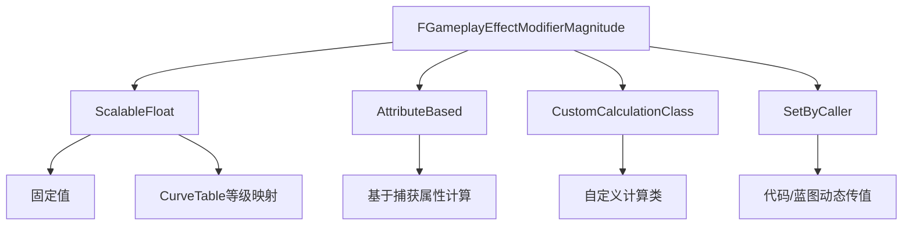

# GE数值修正
>  基于UE5.7的 GE数值修正

## 概述

GameplayEffect（GE）的数值修正机制是GAS实现属性驱动玩法的核心，所有属性修改、临时数值加成、动态效果数值都依赖这套机制实现。

UE5.7中，数值修正的核心逻辑围绕**FAggregator（数值计算聚合器）**展开：
- 每个被GE修正/捕获的属性或临时数值都会绑定一个独立的FAggregator实例
- FAggregator负责汇总所有针对该数值的修正项，按照预设运算规则计算最终值
- 支持加、乘、除、覆盖四种基础运算，以及多通道（Channel）的分组计算

> 💡 **UE5.7公式更新**
> 相比UE5.3及更早版本，UE5.5+（含UE5.7）优化了最终值的计算公式，解决了多百分比修正叠加的逻辑不合理问题：
> ```
> FinalValue = ((BaseValue + PreAdditive) * MultiplicitiveAdditive) / Division * MultiplicitiveComposite + PostAdditive
> ```
> 各参数含义：
> | 参数                | 含义                                                                 |
> |---------------------|----------------------------------------------------------------------|
> | BaseValue           | 数值的基础值（如属性的初始值）                                       |
> | PreAdditive         | 前置加法修正累计值（多个加法修正直接相加）                           |
> | MultiplicitiveAdditive | 乘法加法混合修正累计值（公式为`1 + (P1-1) + (P2-1) + ...`，适合百分比增强叠加） |
> | Division            | 除法修正累计值（公式为`1 + (P1-1) + (P2-1) + ...`，适合百分比削弱叠加） |
> | MultiplicitiveComposite | 乘法修正累计值（公式为`P1 * P2 * P3 * ...`，适合指数级增强/削弱） |
> | PostAdditive        | 后置加法修正累计值（多个后置加法修正直接相加）                       |



---

## 修正值配置类型

所有GE数值修正的配置都基于`FGameplayEffectModifierMagnitude`结构体，通过`MagnitudeCalculationType`字段指定修正值的来源计算方式，UE5.7支持四种类型：

### ScalableFloat（固定/曲线映射值）

#### 配置说明
直接将修正值设置为固定值，或通过`CurveTable`根据GE等级映射对应数值，对应结构体字段为`FScalableFloat ScalableFloatMagnitude`。

计算逻辑：
1. 如果配置了有效的`CurveTable`，则根据GE当前等级从曲线中读取映射值，再乘以`ScalableFloat`的初始值
2. 如果没有配置`CurveTable`，则直接使用`ScalableFloat`的初始值作为修正值

#### UE5.7更新
- 支持`CurveTable`的运行时动态更新，修正值会自动重算
- 新增`FScalableFloat::GetValueAtLevel`的重载，支持传入上下文字符串，方便调试时定位数值来源

#### Lyra实践示例
Lyra中大量属性的基础修正使用`ScalableFloat`配置，例如：
- 角色基础移动速度的GE：直接用固定值设置速度加成
- 技能冷却缩减GE：通过`CurveTable`根据技能等级映射不同的缩减比例

```cpp
// Lyra中移动速度加成的GE配置示例
FGameplayModifierInfo Modifier;
Modifier.Attribute = ULyraCharacterMovementComponent::MovementSpeedAttribute();
Modifier.ModifierOp = EGameplayModOp::Additive;
Modifier.ModifierMagnitude.MagnitudeCalculationType = EGameplayEffectMagnitudeCalculation::ScalableFloat;
Modifier.ModifierMagnitude.ScalableFloatMagnitude = 100.f; // 固定加成100点移动速度
```

---

### AttributeBased（基于属性计算值）

#### 配置说明
基于捕获到的属性值，通过预设公式计算出修正值，对应结构体为`FAttributeBasedFloat AttributeBasedMagnitude`。

计算公式：
```
CalculatedValue = Coefficient * (CapturedAttributeValue + PreMultiplyAdditiveValue) + PostMultiplyAdditiveValue
```
- `CapturedAttributeValue`：通过属性捕获获得的属性值，可通过`AttributeCalculationType`指定获取方式（基础值/当前值/修正值等）
- `Coefficient`：乘法系数（FScalableFloat类型，支持固定值或等级映射）
- `PreMultiplyAdditiveValue`：乘法前置附加值（FScalableFloat类型）
- `PostMultiplyAdditiveValue`：乘法后置附加值（FScalableFloat类型）

#### UE5.7更新
- 新增`AttributeCurve`支持，可对捕获到的属性值做二次曲线映射修正
- 支持通过`SourceTagFilter`和`TargetTagFilter`筛选参与计算的GE Tag，实现更精细的数值控制

#### Lyra实践示例
Lyra中伤害GE常使用`AttributeBased`基于攻击力计算伤害：
```cpp
// 伤害GE配置：基于攻击力计算伤害，系数为1.5
FAttributeBasedFloat AttribBasedConfig;
AttribBasedConfig.AttributeToCapture = ULyraCombatSet::AttackPowerAttribute();
AttribBasedConfig.AttributeCalculationType = EAttributeBasedFloatCalculationType::AttributeMagnitude;
AttribBasedConfig.Coefficient = 1.5f;
AttribBasedConfig.PreMultiplyAdditiveValue = 0.f;
AttribBasedConfig.PostMultiplyAdditiveValue = 0.f;
```

---

### CustomCalculationClass（自定义计算规则）

#### 配置说明
通过自定义`UGameplayModMagnitudeCalculation`子类实现复杂的数值计算逻辑，对应结构体为`FCustomCalculationBasedFloat CustomMagnitude`。

计算流程：
1. 获取自定义计算类的CDO（Class Default Object）
2. 调用`CalculateBaseMagnitude`得到自定义基础值
3. 按公式`Coefficient * (CustomBaseValue + PreMultiplyAdditiveValue) + PostMultiplyAdditiveValue`计算最终修正值
4. 可选通过`FinalLookupCurve`对最终结果做二次曲线映射

#### UE5.7更新
- 支持在自定义计算类中访问GE的`SetByCaller`数据，实现更复杂的动态数值计算
- 新增调试接口，可在自定义计算类中输出详细的计算日志

#### Lyra实践示例
Lyra中自定义暴击伤害计算类：
```cpp
// 自定义暴击伤害计算类
float ULyraCritDamageCalculation::CalculateBaseMagnitude(const FGameplayEffectSpec& Spec) const
{
    float BaseDamage = Spec.GetSetByCallerMagnitude(DamageTag);
    float CritMultiplier = 2.0f; // 暴击倍率
    return BaseDamage * CritMultiplier;
}
```

---

### SetByCaller（动态传值）

#### 配置说明
修正值不在GE配置中预设，而是在运行时通过代码/蓝图动态设置，对应结构体为`FSetByCallerFloat SetByCallerMagnitude`。

核心接口：
- `FGameplayEffectSpec::SetSetByCallerMagnitude`：通过Tag或FName设置修正值
- `FGameplayEffectSpec::GetSetByCallerMagnitude`：通过Tag或FName获取修正值

#### UE5.7更新
- 支持更多数据类型的`SetByCaller`（如整型、向量），不再局限于浮点数
- 优化了网络同步逻辑，主控端的`SetByCaller`数值会可靠同步到模拟端
- 新增`UAbilitySystemComponent::UpdateActiveGameplayEffectSetByCallerMagnitude`接口，支持运行时动态更新已激活GE的`SetByCaller`值

#### Lyra实践示例
Lyra中技能给予伤害GE时，动态设置最终伤害值：
```cpp
// 技能中计算最终伤害并设置到GE Spec
FGameplayEffectSpecHandle SpecHandle = MakeOutgoingGameplayEffectSpec(DamageGEClass, 1.f);
float FinalDamage = CalculateFinalDamage(); // 自定义伤害计算函数
SpecHandle.Data->SetSetByCallerMagnitude(DamageTag, FinalDamage);
GetAbilitySystemComponentFromActorInfo()->ApplyGameplayEffectSpecToTarget(*SpecHandle.Data, TargetASC);
```

---

## 属性修正配置（FGameplayModifierInfo）

`FGameplayModifierInfo`是属性修正的完整配置结构体，定义了**要修正的属性、修正方式、修正值来源**等核心信息。

### 配置字段说明
| 字段                          | 含义                                                                 |
|-------------------------------|----------------------------------------------------------------------|
| `Attribute`                   | 要修正的`FGameplayAttribute`（如生命值、攻击力）                     |
| `ModifierOp`                  | 修正方式（加、乘、除、覆盖，对应`EGameplayModOp`枚举）               |
| `ModifierMagnitude`           | 修正值配置（即前面讲的四种`FGameplayEffectModifierMagnitude`类型）   |
| `EvaluationChannelSettings`   | 评估通道设置（默认不启用，用于将修正分组计算）                       |
| `SourceTags`                  | 源Tag限制：只有GE来源的Tag匹配该配置，修正才会生效                   |
| `TargetTags`                  | 目标Tag限制：只有GE目标的Tag匹配该配置，修正才会生效                 |

### UE5.7更新
- `SourceTags`和`TargetTags`支持`FGameplayTagQuery`复杂表达式，可实现嵌套的逻辑匹配规则
- 评估通道（Channel）支持运行时动态调整，无需修改GE配置

---

## 自定义效果执行类修正配置

当GE使用自定义执行类（`UGameplayEffectExecutionCalculation`）时，需要为执行类定义输入数值的修正配置，对应结构体为`FGameplayEffectExecutionScopedModifierInfo`。

### 与属性修正的区别
| 维度                | 属性修正配置               | 自定义执行类修正配置               |
|---------------------|----------------------------|------------------------------------|
| 作用对象            | 直接修正目标属性           | 为执行类提供输入数值               |
| 计算时机            | GE应用时直接计算           | 执行类的`Execute`函数中手动触发计算 |
| 典型场景            | 生命值、攻击力等属性修正   | 伤害计算、治疗效果计算等复杂逻辑   |

---

## 数值计算聚合器（FAggregator）

`FAggregator`是数值修正的运行时核心数据结构，负责汇总所有修正项并计算最终值。

### 核心结构
```cpp
struct FAggregator : public TSharedFromThis<FAggregator>
{
    float BaseValue; // 基础值
    FAggregatorModChannelContainer ModChannels; // 修正项容器（按通道分组）
    TArray<FActiveGameplayEffectHandle> Dependents; // 依赖该聚合器的GE列表（属性捕获用）
};
```

### 修正项分组逻辑
FAggregator的修正项（Mod）按三个维度分组：
1. **通道（Channel）**：按`EvaluationChannelSettings`分组，计算时可指定只计算特定通道的修正
2. **运算方式**：按`EGameplayModOp`（加、乘、除、覆盖）分组
3. **具体修正项**：每个修正项的数值、Tag限制、来源GE等信息


---

### 创建聚合器
当某个属性第一次被GE修正或捕获时，会为其创建对应的FAggregator实例：
```cpp
// UE5.7源码：为属性创建聚合器
FAggregatorRef& FActiveGameplayEffectsContainer::FindOrCreateAttributeAggregator(const FGameplayAttribute& Attribute)
{
    // 1. 检查是否已有聚合器，有则直接返回
    FAggregatorRef* RefPtr = AttributeAggregatorMap.Find(Attribute);
    if (RefPtr) return *RefPtr;

    // 2. 获取属性的当前基础值
    float CurrentBaseValue = Owner->GetNumericAttributeBase(Attribute);
    
    // 3. 创建新的聚合器
    FAggregator* NewAggregator = new FAggregator(CurrentBaseValue);
    
    // 4. 绑定属性变动回调（属性变化时触发重算）
    if (!Attribute.IsSystemAttribute())
    {
        NewAggregator->OnDirty.AddUObject(Owner, &UAbilitySystemComponent::OnAttributeAggregatorDirty, Attribute, false);
    }
    
    // 5. 存入映射表
    return AttributeAggregatorMap.Add(Attribute, FAggregatorRef(NewAggregator));
}
```

---

### 将修改添加到聚合器
GE应用时，会将其修正项转换为`FAggregatorMod`并添加到目标属性的聚合器中：
```cpp
void FAggregator::AddAggregatorMod(
    float EvaluatedMagnitude,
    EGameplayModOp::Type ModifierOp,
    const FGameplayTagRequirements* SourceTagReqs,
    const FGameplayTagRequirements* TargetTagReqs,
    EGameplayModEvaluationChannel Channel,
    FActiveGameplayEffectHandle ActiveHandle)
{
    // 1. 获取对应通道的修正项列表
    FAggregatorModChannel& ModChannel = ModChannels.FindOrAddModChannel(Channel);
    
    // 2. 添加修正项到对应运算方式的列表
    TArray<FAggregatorMod>& ModList = ModChannel.Mods[ModifierOp];
    FAggregatorMod& NewMod = ModList.AddDefaulted_GetRef();
    
    // 3. 设置修正项信息
    NewMod.EvaluatedMagnitude = EvaluatedMagnitude;
    NewMod.SourceTagReqs = SourceTagReqs;
    NewMod.TargetTagReqs = TargetTagReqs;
    NewMod.ActiveHandle = ActiveHandle;
    
    // 4. 触发聚合器重算
    BroadcastOnDirty();
}
```

---

### 修改器变动触发重算
当聚合器的修正项发生变动（添加、移除、更新）时，会触发重算逻辑：
1. 重新计算属性的最终值
2. 更新属性集的当前值
3. 通知所有依赖该属性的GE重算（针对非快照属性捕获的情况）

UE5.7优化了重算的递归处理逻辑，避免了无限递归的问题：
```cpp
void FAggregator::BroadcastOnDirty()
{
    // 1. 触发自身脏标记广播（更新属性值）
    OnDirty.Broadcast(this);
    
    // 2. 通知所有依赖的GE重算（先拷贝列表，清空原列表避免递归）
    TArray<FActiveGameplayEffectHandle> DependantsCopy = Dependents;
    Dependents.Empty();
    
    for (FActiveGameplayEffectHandle Handle : DependantsCopy)
    {
        UAbilitySystemComponent* ASC = Handle.GetOwningAbilitySystemComponent();
        if (ASC)
        {
            ASC->OnMagnitudeDependencyChange(Handle, this);
            Dependents.Add(Handle); // 重算完成后重新添加依赖
        }
    }
}
```

---

## 计算与获取目标值

### 核心计算接口
`FAggregator::Evaluate`是计算最终值的核心接口，支持传入`FAggregatorEvaluateParameters`筛选需要参与计算的修正项：
```cpp
float FAggregator::Evaluate(const FAggregatorEvaluateParameters& Parameters) const
{
    // 1. 先筛选所有符合条件的修正项
    EvaluateQualificationForAllMods(Parameters);
    
    // 2. 按优化后的公式计算最终值
    return ModChannels.EvaluateWithBase(BaseValue, Parameters);
}
```

### 筛选参数说明
`FAggregatorEvaluateParameters`用于筛选参与计算的修正项：
| 字段                          | 含义                                                                 |
|-------------------------------|----------------------------------------------------------------------|
| `SourceTags`                  | 匹配的源Tag，只有修正项的SourceTagReqs匹配该Tag才会参与计算           |
| `TargetTags`                  | 匹配的目标Tag，只有修正项的TargetTagReqs匹配该Tag才会参与计算         |
| `IgnoreHandles`               | 忽略指定GE的修正项                                                   |
| `AppliedSourceTagFilter`      | 额外源Tag筛选（通常传入GE的来源Tag）                                 |
| `AppliedTargetTagFilter`      | 额外目标Tag筛选（通常传入GE的目标Tag）                               |
| `IncludePredictiveMods`       | 是否包含预测修正项                                                   |

### UE5.7新增接口
- `EvaluateToChannel`：只计算指定通道的修正项
- `ReverseEvaluate`：根据最终值反向推导基础值
- `EvaluateBonus`：计算修正值（最终值 - 基础值）
- `EvaluateContribution`：计算指定GE对最终值的贡献度

---

## 自定义属性修正检查规则

UE5.7支持通过`FAggregatorEvaluateMetaData`自定义修正项的筛选逻辑，满足特殊玩法的数值计算需求。

### 使用流程
1. 创建自定义筛选委托`FCustomQualifiesFunc`
2. 将委托绑定到聚合器的`EvaluationMetaData`字段
3. 计算时，会额外调用自定义委托筛选修正项

### Lyra实践示例
Lyra中自定义生命值修正规则：只有在战斗状态下，生命值才会被伤害GE修正：
```cpp
// 为Health属性的聚合器绑定自定义筛选规则
void ULyraHealthSet::OnAttributeAggregatorCreated(const FGameplayAttribute& Attribute, FAggregator* Aggregator) const
{
    if (Attribute == GetHealthAttribute())
    {
        // 创建自定义筛选委托
        FAggregatorEvaluateMetaData::FCustomQualifiesFunc CustomFunc;
        CustomFunc.BindLambda([](const FAggregatorEvaluateParameters& Parameters, const FAggregator* Agg)
        {
            // 只有在战斗状态下，才允许伤害GE的修正生效
            const FGameplayTagContainer* TargetTags = Parameters.TargetTags;
            if (TargetTags && TargetTags->HasTag(LyraGameplayTags::Status_Combat))
            {
                // 允许所有修正项生效
                // 可在这里实现自定义筛选逻辑
            }
        });
        
        // 绑定到聚合器
        Aggregator->EvaluationMetaData = MakeShared<FAggregatorEvaluateMetaData>(CustomFunc);
    }
}
```

---

## UE5.7更新说明

相比UE5.3，UE5.7在GE数值修正方面的核心更新：
1. **公式优化**：重构最终值计算公式，解决多百分比修正叠加的逻辑问题
2. **SetByCaller增强**：支持更多数据类型、优化网络同步、支持运行时动态更新
3. **Tag筛选增强**：支持`FGameplayTagQuery`复杂表达式，实现更灵活的修正项筛选
4. **性能优化**：优化聚合器重算的递归逻辑，减少不必要的重算次数
5. **调试增强**：新增大量数值计算相关的调试接口和日志输出

---

## Lyra中的实践示例

### 完整伤害计算流程
1. 技能激活，计算基础伤害、暴击、距离衰减等，得到最终伤害值
2. 创建伤害GE的Spec，通过`SetSetByCallerMagnitude`将最终伤害值设置到GE中
3. 将GE应用到目标ASC
4. 目标的生命值聚合器收到修正通知，调用`Evaluate`计算最终生命值
5. 生命值更新，触发`OnAttributeAggregatorDirty`回调，更新UI和游戏逻辑

---

## 调试与常见问题

### 调试方法
1. 控制台输入`showdebug abilitysystem`，查看属性的当前值、基础值、修正值
2. 在`FAggregator::Evaluate`函数中打断点，查看参与计算的修正项列表
3. 使用`GameplayDebugger`插件，可视化GE的应用和数值计算流程

### 常见问题
1. **修正不生效**：检查`ModifierOp`是否正确、`SourceTags`/`TargetTags`是否匹配、修正值是否为0
2. **多修正叠加结果不符合预期**：检查运算方式是否正确（增强用`MultiplicitiveAdditive`，削弱用`Division`或`MultiplicitiveComposite`）
3. **SetByCaller值获取失败**：检查设置和使用时的Tag/FName是否一致，是否在GE应用前设置

---

## 参考资料
- [UE5.7 GAS官方文档](https://docs.unrealengine.com/5.7/en-US/gameplay-ability-system-for-unreal-engine/)
- Lyra源码：`LyraGame/Plugins/LyraGame/Source/LyraGame/AbilitySystem`
- UE5.7源码：`Engine/Plugins/Runtime/GameplayAbilities/Source/GameplayAbilities/Public/GameplayEffectTypes.h`

<!-- nav:auto -->

---

**导航**: ← [[30-tutorials/gas/07-GE运行流程详解|07-GE运行流程详解]] · [[30-tutorials/gas/09-GE属性捕获|09-GE属性捕获]] →

<!-- /nav:auto -->
