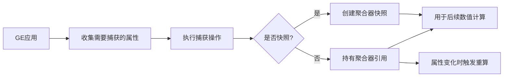

# GE属性捕获

## 概述

属性捕获（Attribute Capture）是GE实现动态数值计算的核心机制：**在GE应用时捕获指定属性的当前值，后续用于数值修正、自定义执行类等场景**。

UE5.7中属性捕获分为两种模式：
1. **快照捕获（Snapshot）**：捕获GE应用时刻的属性值，后续属性变化不会影响已捕获的值，适合一次性计算（如伤害、治疗）
2. **非快照捕获（Non-Snapshot）**：持有属性聚合器的引用，属性变化时会触发重新计算，适合持续效果（如光环、减益buff）



---

## 核心数据结构

### FGameplayEffectAttributeCaptureDefinition（捕获配置）

定义需要捕获的属性及捕获方式，是属性捕获的静态配置：
```cpp
struct FGameplayEffectAttributeCaptureDefinition
{
    // 要捕获的属性（如攻击力、生命值）
    FGameplayAttribute AttributeToCapture;
    
    // 属性来源：捕获GE来源者（Source）还是目标者（Target）的属性
    EGameplayEffectAttributeCaptureSource AttributeSource;
    
    // 是否启用快照捕获
    bool bSnapshot;
};
```

### FGameplayEffectAttributeCaptureSpec（运行时捕获数据）

存储捕获后的运行时数据，每个捕获配置对应一个实例：
```cpp
struct FGameplayEffectAttributeCaptureSpec
{
    // 对应的捕获配置
    FGameplayEffectAttributeCaptureDefinition BackingDefinition;
    
    // 属性聚合器引用（快照捕获会持有快照副本，非快照捕获持有原聚合器引用）
    FAggregatorRef AttributeAggregator;
};
```

### FGameplayEffectAttributeCaptureSpecContainer（捕获容器）

统一管理一个GE的所有属性捕获，按来源（Source/Target）分组存储：
```cpp
struct FGameplayEffectAttributeCaptureSpecContainer
{
    // GE来源者的属性捕获列表
    TArray<FGameplayEffectAttributeCaptureSpec> SourceAttributes;
    
    // GE目标者的属性捕获列表
    TArray<FGameplayEffectAttributeCaptureSpec> TargetAttributes;
    
    // 是否存在非快照捕获
    bool bHasNonSnapshottedAttributes;
};
```

---

## 捕获配置类型

### 按属性来源分类
| 来源类型                | 含义                                                                 | 典型场景                     |
|-------------------------|----------------------------------------------------------------------|------------------------------|
| `Source`                | 捕获GE的施加者（Instigator）的属性                                   | 伤害GE捕获施法者的攻击力     |
| `Target`                | 捕获GE的目标者（Target）的属性                                       | 减速GE捕获目标的移动速度     |

### 按捕获模式分类
| 模式                | 含义                                                                 | 典型场景                     |
|---------------------|----------------------------------------------------------------------|------------------------------|
| 快照（Snapshot）    | 捕获GE应用时刻的属性值，后续不随属性变化而更新                       | 一次性伤害计算、暴击伤害计算 |
| 非快照（Non-Snapshot） | 持有属性聚合器引用，属性变化时会触发依赖该捕获的GE重算               | 光环效果、持续伤害、减益buff |

---

## 捕获流程

### 1. 收集捕获配置
在`FGameplayEffectSpec`初始化时，自动收集GE中所有需要属性捕获的配置：
- 持续时间配置的捕获定义
- 属性修正（FGameplayModifierInfo）中的捕获定义
- 自定义执行类（FGameplayEffectExecutionDefinition）中的捕获定义

```cpp
// UE5.7源码：收集GE中的所有属性捕获配置
void FGameplayEffectSpec::SetupAttributeCaptureDefinitions()
{
    // 1. 收集持续时间相关的属性捕获（如OutgoingDuration、IncomingDuration）
    if (Def->DurationPolicy == EGameplayEffectDurationType::HasDuration)
    {
        CapturedRelevantAttributes.AddCaptureDefinition(UAbilitySystemComponent::GetOutgoingDurationCapture());
        CapturedRelevantAttributes.AddCaptureDefinition(UAbilitySystemComponent::GetIncomingDurationCapture());
    }
    
    // 2. 收集属性修正中的捕获定义
    for (const FGameplayModifierInfo& ModDef : Def->Modifiers)
    {
        TArray<FGameplayEffectAttributeCaptureDefinition> CaptureDefs;
        ModDef.ModifierMagnitude.GetAttributeCaptureDefinitions(CaptureDefs);
        for (const FGameplayEffectAttributeCaptureDefinition& CaptureDef : CaptureDefs)
        {
            CapturedRelevantAttributes.AddCaptureDefinition(CaptureDef);
        }
    }
    
    // 3. 收集自定义执行类中的捕获定义
    for (const FGameplayEffectExecutionDefinition& ExecDef : Def->Executions)
    {
        TArray<FGameplayEffectAttributeCaptureDefinition> CaptureDefs;
        ExecDef.GetAttributeCaptureDefinitions(CaptureDefs);
        for (const FGameplayEffectAttributeCaptureDefinition& CaptureDef : CaptureDefs)
        {
            CapturedRelevantAttributes.AddCaptureDefinition(CaptureDef);
        }
    }
}
```

### 2. 执行捕获操作
在GE应用时，遍历捕获容器中的所有捕获配置，执行实际捕获：
- 快照捕获：创建属性聚合器的快照副本
- 非快照捕获：持有属性聚合器的引用，并注册依赖回调（属性变化时触发GE重算）

```cpp
// UE5.7源码：执行属性捕获
void FActiveGameplayEffectsContainer::CaptureAttributeForGameplayEffect(FGameplayEffectAttributeCaptureSpec& OutCaptureSpec)
{
    // 1. 查找或创建属性对应的聚合器
    FAggregatorRef& AttributeAggregator = FindOrCreateAttributeAggregator(OutCaptureSpec.BackingDefinition.AttributeToCapture);
    
    // 2. 根据配置决定是否创建快照
    if (OutCaptureSpec.BackingDefinition.bSnapshot)
    {
        // 快照捕获：创建聚合器副本
        OutCaptureSpec.AttributeAggregator.TakeSnapshotOf(AttributeAggregator);
    }
    else
    {
        // 非快照捕获：持有原聚合器引用，并注册依赖
        OutCaptureSpec.AttributeAggregator = AttributeAggregator;
        OutCaptureSpec.RegisterLinkedAggregatorCallback(OutCaptureSpec.Handle);
    }
}
```

### 3. 使用捕获的属性值
通过`FGameplayEffectAttributeCaptureSpec`提供的接口获取捕获的属性值：
| 接口                                  | 含义                                                                 |
|---------------------------------------|----------------------------------------------------------------------|
| `AttemptCalculateAttributeBaseValue`   | 获取属性的基础值（BaseValue）                                       |
| `AttemptCalculateAttributeMagnitude`   | 获取属性的当前值（经过所有修正后的最终值）                           |
| `AttemptCalculateAttributeBonusMagnitude` | 获取属性的修正值（当前值 - 基础值）                               |
| `AttemptCalculateAttributeMagnitudeUpToChannel` | 按指定通道计算属性值                                               |

---

## UE5.7更新说明

相比UE5.3，UE5.7在属性捕获方面的核心更新：
1. **性能优化**：优化捕获配置的收集逻辑，减少不必要的捕获操作
2. **同步增强**：非快照捕获的属性变化会可靠同步到所有客户端
3. **接口扩展**：新增批量捕获接口，支持一次性捕获多个属性
4. **调试增强**：新增捕获相关的调试日志，可详细查看每个捕获的属性值来源

---

## Lyra中的实践示例

### 示例1：伤害GE捕获攻击力（快照捕获）
Lyra中伤害GE使用快照捕获施法者的攻击力，确保伤害计算基于施法时刻的攻击力：
```cpp
// 伤害GE配置片段
FGameplayEffectAttributeCaptureDefinition CaptureDef;
CaptureDef.AttributeToCapture = ULyraCombatSet::AttackPowerAttribute();
CaptureDef.AttributeSource = EGameplayEffectAttributeCaptureSource::Source;
CaptureDef.bSnapshot = true; // 启用快照捕获
```

### 示例2：光环GE捕获队友属性（非快照捕获）
Lyra中队友的光环效果使用非快照捕获，属性变化时动态更新效果：
```cpp
// 光环GE配置片段
FGameplayEffectAttributeCaptureDefinition CaptureDef;
CaptureDef.AttributeToCapture = ULyraHealthSet::HealthAttribute();
CaptureDef.AttributeSource = EGameplayEffectAttributeCaptureSource::Target;
CaptureDef.bSnapshot = false; // 非快照捕获
```

### 示例3：自定义执行类中使用捕获的属性值
Lyra中自定义伤害执行类使用捕获的攻击力计算最终伤害：
```cpp
void ULyraDamageExecution::Execute_Implementation(
    const FGameplayEffectCustomExecutionParameters& ExecutionParams,
    FGameplayEffectCustomExecutionOutput& OutExecutionOutput) const
{
    // 获取捕获的攻击力属性值
    float AttackPower = 0.f;
    ExecutionParams.AttemptCalculateCapturedAttributeMagnitude(
        ULyraCombatSet::AttackPowerAttribute(),
        AttackPower
    );
    
    // 计算最终伤害
    float FinalDamage = AttackPower * 1.5f;
    OutExecutionOutput.AddOutputModifier(
        FGameplayModifierEvaluatedData(
            ULyraHealthSet::HealthAttribute(),
            EGameplayModOp::Additive,
            -FinalDamage
        )
    );
}
```

---

## 调试与常见问题

### 调试方法
1. 控制台输入`showdebug abilitysystem`，查看GE的捕获属性列表及对应值
2. 在`FActiveGameplayEffectsContainer::CaptureAttributeForGameplayEffect`函数中打断点，查看捕获的属性值是否正确
3. 使用`GameplayDebugger`插件，可视化属性捕获流程

### 常见问题
1. **捕获的属性值为0**：检查属性来源是否正确、属性是否已经被初始化、是否启用了正确的捕获配置
2. **快照捕获的值不更新**：确认`bSnapshot`是否设置为true，快照捕获的值不会随属性变化而更新
3. **非快照捕获不触发重算**：检查是否正确注册了依赖回调，属性的聚合器是否触发了`OnDirty`广播

---

## 参考资料
- [UE5.7 GAS官方文档](https://docs.unrealengine.com/5.7/en-US/gameplay-ability-system-for-unreal-engine/)
- Lyra源码：`LyraGame/Plugins/LyraGame/Source/LyraGame/AbilitySystem/Execution`
- UE5.7源码：`Engine/Plugins/Runtime/GameplayAbilities/Source/GameplayAbilities/Public/GameplayEffectTypes.h`

<!-- nav:auto -->

---

**导航**: ← [[30-tutorials/gas/08-GE数值修正|08-GE数值修正]] · [[30-tutorials/gas/10-GE属性修正|10-GE属性修正]] →

<!-- /nav:auto -->
