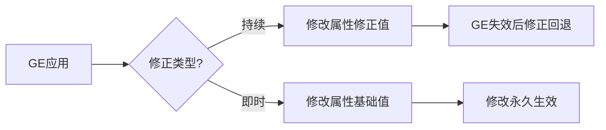

# GE属性修正

## 概述

属性修正（Attribute Modification）是GE实现数值影响的核心机制，分为两种类型：
1. **持续属性修正**：修改属性的修正值（Modifier），GE失效后修正自动回退，不直接修改基础值（BaseValue）
2. **即时属性修正**：直接修改属性的基础值（BaseValue），修改不可逆（除非主动再次修改）

UE5.7优化了属性修正的计算逻辑和同步机制，解决了UE5.3中多修正叠加不合理、预测失败等问题。



---

## 持续属性修正

持续属性修正仅影响属性的当前值（CurrentValue），通过`FAggregator`汇总所有修正项并计算最终值，GE失效后自动移除修正。

### 1. 收集属性修正配置
在`FGameplayEffectSpec`初始化时，自动收集GE中所有的属性修正配置（`FGameplayModifierInfo`）：
```cpp
// UE5.7源码：收集属性修正配置
void FGameplayEffectSpec::SetupAttributeCaptureDefinitions()
{
    // 1. 收集持续时间相关的修正配置
    if (Def->DurationPolicy == EGameplayEffectDurationType::HasDuration)
    {
        CapturedRelevantAttributes.AddCaptureDefinition(UAbilitySystemComponent::GetOutgoingDurationCapture());
        CapturedRelevantAttributes.AddCaptureDefinition(UAbilitySystemComponent::GetIncomingDurationCapture());
    }
    
    // 2. 收集属性修正中的捕获定义
    for (const FGameplayModifierInfo& ModDef : Def->Modifiers)
    {
        TArray<FGameplayEffectAttributeCaptureDefinition> CaptureDefs;
        ModDef.ModifierMagnitude.GetAttributeCaptureDefinitions(CaptureDefs);
        for (const FGameplayEffectAttributeCaptureDefinition& CaptureDef : CaptureDefs)
        {
            CapturedRelevantAttributes.AddCaptureDefinition(CaptureDef);
        }
    }
}
```

### 2. 激活时赋予属性修正
GE激活时，将修正项添加到对应属性的`FAggregator`中，触发聚合器重算并更新属性当前值：
```cpp
// UE5.7源码：激活GE时赋予属性修正
void FActiveGameplayEffectsContainer::AddActiveGameplayEffectGrantedTagsAndModifiers(FActiveGameplayEffect& Effect)
{
    if (Effect.Spec.GetPeriod() <= UGameplayEffect::NO_PERIOD)
    {
        for (int32 ModIdx = 0; ModIdx < Effect.Spec.Modifiers.Num(); ++ModIdx)
        {
            const FGameplayModifierInfo& ModInfo = Effect.Spec.Def->Modifiers[ModIdx];
            float EvaluatedMagnitude = Effect.Spec.GetModifierMagnitude(ModIdx, true);
            
            // 获取或创建属性对应的聚合器
            FAggregator* Aggregator = FindOrCreateAttributeAggregator(ModInfo.Attribute).Get();
            if (Aggregator)
            {
                // 将修正项添加到聚合器
                Aggregator->AddAggregatorMod(
                    EvaluatedMagnitude,
                    ModInfo.ModifierOp,
                    ModInfo.EvaluationChannelSettings.GetEvaluationChannel(),
                    &ModInfo.SourceTags,
                    &ModInfo.TargetTags,
                    Effect.PredictionKey.WasLocallyGenerated(),
                    Effect.Handle
                );
            }
        }
    }
}
```

### 3. GE失效时移除属性修正
GE失效或从激活列表移除时，从对应属性的`FAggregator`中移除该GE的修正项，触发重算并回退修正：
```cpp
// UE5.7源码：移除GE时移除属性修正
void FActiveGameplayEffectsContainer::RemoveActiveGameplayEffectGrantedTagsAndModifiers(FActiveGameplayEffect& Effect)
{
    if (Effect.Spec.GetPeriod() <= UGameplayEffect::NO_PERIOD)
    {
        for (const FGameplayModifierInfo& Mod : Effect.Spec.Def->Modifiers)
        {
            if (Mod.Attribute.IsValid())
            {
                FAggregatorRef* RefPtr = AttributeAggregatorMap.Find(Mod.Attribute);
                if (RefPtr)
                {
                    // 移除该GE的修正项
                    RefPtr->Get()->RemoveAggregatorMod(Effect.Handle);
                }
            }
        }
    }
}
```

### 堆叠对持续修正的影响
UE5.7优化了堆叠修正值的计算逻辑，堆叠数会按修正类型影响最终修正值：
```cpp
// UE5.7源码：计算堆叠修正值
float GameplayEffectUtilities::ComputeStackedModifierMagnitude(float BaseComputedMagnitude, int32 StackCount, EGameplayModOp::Type ModOp)
{
    const float OperationBias = GameplayEffectUtilities::GetModifierBiasByModifierOp(ModOp);
    float StackMag = BaseComputedMagnitude;
    
    if (ModOp != EGameplayModOp::Override)
    {
        StackMag -= OperationBias;
        StackMag *= StackCount;
        StackMag += OperationBias;
    }
    
    return StackMag;
}
```

---

## 即时属性修正

即时属性修正直接修改属性的基础值（BaseValue），修改后永久生效（除非主动再次修改），常用于即时伤害、治疗等场景。

### 执行即时修正
即时GE（`Instant`类型）或持续定时触发GE（`DurationAndPeriod`类型）会触发`ExecuteActiveEffectsFrom`执行即时修正：
```cpp
// UE5.7源码：执行即时属性修正
void FActiveGameplayEffectsContainer::ExecuteActiveEffectsFrom(const FGameplayEffectSpec& SpecToUse, float Level, int32 StackCount)
{
    // 1. 根据属性修正配置执行即时修正
    for (int32 ModIdx = 0; ModIdx < SpecToUse.Modifiers.Num(); ++ModIdx)
    {
        const FGameplayModifierInfo& ModDef = SpecToUse.Def->Modifiers[ModIdx];
        FGameplayModifierEvaluatedData EvalData(
            ModDef.Attribute,
            ModDef.ModifierOp,
            SpecToUse.GetModifierMagnitude(ModIdx, true)
        );
        InternalExecuteMod(SpecToUse, EvalData);
    }
    
    // 2. 根据自定义执行类的结果执行即时修正
    for (const FGameplayEffectExecutionDefinition& CurExecDef : SpecToUse.Def->Executions)
    {
        // 执行自定义执行类逻辑...
        for (FGameplayModifierEvaluatedData& CurExecMod : OutModifiers)
        {
            InternalExecuteMod(SpecToUse, CurExecMod);
        }
    }
}
```

### 修改属性基础值
即时修正通过`ApplyModToAttribute`直接修改属性的基础值：
```cpp
// UE5.7源码：修改属性基础值
void FActiveGameplayEffectsContainer::ApplyModToAttribute(const FGameplayAttribute& Attribute, EGameplayModOp::Type ModifierOp, float ModifierMagnitude, const FGameplayEffectModifiedAttribute* ModData)
{
    float CurrentBase = GetAttributeBaseValue(Attribute);
    float NewBase = FAggregator::StaticExecModOnBaseValue(CurrentBase, ModifierOp, ModifierMagnitude);
    SetAttributeBaseValue(Attribute, NewBase);
}
```

---

## 属性修正重算触发条件

持续属性修正在以下情况会触发重算：
1. **GE等级变化**：重新计算修正值并更新聚合器
2. **GE堆叠变化**：重新计算堆叠修正值并更新聚合器
3. **SetByCaller值变化**：重新计算依赖SetByCaller的修正值
4. **自定义计算类依赖变化**：触发依赖委托重新计算修正值

### UE5.7优化
- 重算逻辑优化了递归处理，避免无限递归导致的崩溃
- 新增批量重算接口，减少不必要的重算次数
- 支持动态调整重算的触发条件，提升性能

---

## 属性修正预测

UE5.7优化了属性修正的预测逻辑，支持客户端预判GE的属性修正效果，提升响应速度：

### 预测流程
1. 客户端执行预判操作，生成预测密钥（`FPredictionKey`）
2. 客户端预先应用GE的属性修正（标记为预测修正）
3. 服务器验证通过后，确认预测结果，客户端移除预测标记
4. 服务器验证失败后，回滚客户端的预测修正

### Lyra实践示例
Lyra中技能消耗体力的预判逻辑：
```cpp
// 客户端预判消耗体力
FPredictionKey PredictionKey = GetAbilitySystemComponentFromActorInfo()->GetPredictionKey();
FGameplayEffectSpecHandle SpecHandle = MakeOutgoingGameplayEffectSpec(StaminaCostGEClass, 1.f);
GetAbilitySystemComponentFromActorInfo()->ApplyGameplayEffectSpecToTarget(*SpecHandle.Data, GetAbilitySystemComponentFromActorInfo(), PredictionKey);
```

---

## 属性网络复制

UE5.7优化了属性修正的网络复制逻辑，支持两种同步通道：
1. **属性直接复制**：属性的基础值和当前值通过UE网络复制直接同步
2. **GE同步**：GE的修正项通过`FAggregator`同步，客户端重新计算属性当前值

### UE5.7优化
- 减少不必要的属性同步次数，提升网络性能
- 支持预测修正的可靠同步，避免客户端与服务器数值不一致
- 新增属性同步调试工具，方便排查同步问题

---

## UE5.7更新说明

相比UE5.3，UE5.7在属性修正方面的核心更新：
1. **公式优化**：重构修正值计算公式，解决多百分比修正叠加不合理问题
2. **预测优化**：优化预测逻辑，减少预测失败的情况
3. **网络优化**：优化属性同步逻辑，提升网络性能
4. **性能优化**：优化重算逻辑，减少不必要的计算
5. **接口扩展**：新增批量操作接口，方便大规模属性修正管理

---

## Lyra中的实践示例

### 示例1：持续护盾buff（持续修正）
Lyra中护盾GE使用持续修正，GE失效后护盾值自动回退：
```cpp
// 护盾GE配置
FGameplayModifierInfo Modifier;
Modifier.Attribute = ULyraShieldSet::ShieldAttribute();
Modifier.ModifierOp = EGameplayModOp::Additive;
Modifier.ModifierMagnitude.MagnitudeCalculationType = EGameplayEffectMagnitudeCalculation::ScalableFloat;
Modifier.ModifierMagnitude.ScalableFloatMagnitude = 50.f; // 增加50点护盾
```

### 示例2：即时伤害（即时修正）
Lyra中伤害GE使用即时修正，直接修改生命值的基础值：
```cpp
// 伤害GE执行类
void ULyraDamageExecution::Execute_Implementation(const FGameplayEffectCustomExecutionParameters& ExecutionParams, FGameplayEffectCustomExecutionOutput& OutExecutionOutput) const
{
    float FinalDamage = CalculateFinalDamage(); // 计算最终伤害
    OutExecutionOutput.AddOutputModifier(FGameplayModifierEvaluatedData(
        ULyraHealthSet::HealthAttribute(),
        EGameplayModOp::Additive,
        -FinalDamage
    ));
}
```

---

## 调试与常见问题

### 调试方法
1. 控制台输入`showdebug abilitysystem`，查看属性的基础值、当前值、修正项列表
2. 在`FActiveGameplayEffectsContainer::AddActiveGameplayEffectGrantedTagsAndModifiers`函数中打断点，查看修正项添加逻辑
3. 使用`GameplayDebugger`插件，可视化属性修正的同步流程

### 常见问题
1. **持续修正不生效**：检查GE是否正确激活、修正项是否正确添加到聚合器、Tag限制是否匹配
2. **即时修正不生效**：检查GE类型是否为`Instant`、修正值是否为0、属性是否可修改
3. **预测失败**：检查预测密钥是否正确生成、服务器验证是否通过、网络延迟是否过高
4. **属性同步不一致**：检查网络连接是否正常、属性复制是否启用、GE同步是否正确

---

## 参考资料
- [UE5.7 GAS官方文档](https://docs.unrealengine.com/5.7/en-US/gameplay-ability-system-for-unreal-engine/)
- Lyra源码：`LyraGame/Plugins/LyraGame/Source/LyraGame/AbilitySystem`
- UE5.7源码：`Engine/Plugins/Runtime/GameplayAbilities/Source/GameplayAbilities/Public/GameplayEffectTypes.h`

<!-- nav:auto -->

---

**导航**: ← [[30-tutorials/gas/09-GE属性捕获|09-GE属性捕获]] · [[30-tutorials/gas/11-GE自定义执行类|11-GE自定义执行类]] →

<!-- /nav:auto -->
