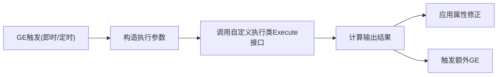
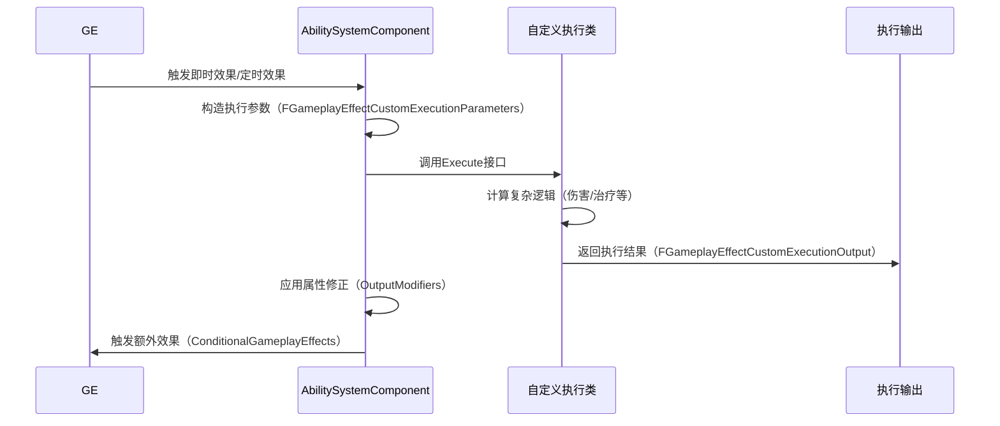

# GE自定义执行类
自定义执行类（`UGameplayEffectExecutionCalculation`子类）是GE实现复杂即时效果的核心扩展方式，适用于以下场景：
- 复杂伤害/治疗计算（需考虑暴击、距离衰减、护甲穿透等多元因素）
- 非属性数值的即时效果（如体力消耗、法力值恢复）
- 条件触发额外效果（如击杀后触发额外buff）

相比属性修正，自定义执行类的优势在于**支持完全自定义的运算逻辑**，可灵活处理属性修正无法覆盖的复杂玩法需求。



---

## 配置说明

GE通过`FGameplayEffectExecutionDefinition`结构体配置自定义执行类相关信息，每个GE可配置多个执行类：

```cpp
struct FGameplayEffectExecutionDefinition
{
    // 自定义执行类（UGameplayEffectExecutionCalculation子类）
    TSubclassOf<UGameplayEffectExecutionCalculation> CalculationClass;
    
    // 执行类输入数据配置（数值修正、Tag参数等）
    TArray<FGameplayEffectExecutionScopedModifierInfo> CalculationModifiers;
    
    // 传递给执行类的Tag参数（需执行类开启bRequiresPassedInTags）
    FGameplayTagContainer PassedInTags;
    
    // 执行成功后触发的额外GE列表（支持条件限制）
    TArray<FConditionalGameplayEffect> ConditionalGameplayEffects;
};
```

### 字段说明
| 字段                          | 含义                                                                 | UE5.7更新说明                     |
|-------------------------------|----------------------------------------------------------------------|----------------------------------|
| `CalculationClass`            | 自定义执行类的UClass，运行时使用其CDO（只读配置模板）                   | 无变化                           |
| `CalculationModifiers`       | 配置执行类的输入数值（支持属性捕获、非属性Tag数值、直接设置值）       | 支持更多数值计算类型               |
| `PassedInTags`               | 传递给执行类的Tag参数，用于区分不同执行逻辑                           | 支持`FGameplayTagQuery`复杂表达式 |
| `ConditionalGameplayEffects`  | 执行成功后触发的额外GE，支持`RequiredSourceTags`条件限制             | 优化条件判断性能                   |

---

## 输入数据

自定义执行类的输入数据通过`FGameplayEffectCustomExecutionParameters`结构体传递，分为三类：
1. **属性捕获数据**：从GE来源/目标捕获的属性值（支持快照/非快照）
2. **非属性数值**：通过Tag关联的临时数值（使用`FAggregator`计算）
3. **Tag参数**：用于控制执行逻辑的Tag集合

### 声明输入数据
在自定义执行类子类中，通过以下字段声明需要输入的参数：
```cpp
UCLASS()
class ULyraDamageExecution : public UGameplayEffectExecutionCalculation
{
    GENERATED_BODY()
    
public:
    ULyraDamageExecution();
    
protected:
    // 需要捕获的属性列表（如攻击力、护甲值）
    UPROPERTY(EditDefaultsOnly, Category=Input)
    TArray<FGameplayEffectAttributeCaptureDefinition> RelevantAttributesToCapture;
    
    // 需要传入的Tag参数（如是否暴击、是否远程攻击）
    UPROPERTY(EditDefaultsOnly, Category=Input)
    bool bRequiresPassedInTags = false;
};
```

### 配置输入数据
在GE的`FGameplayEffectExecutionDefinition`中配置输入数据：
- **属性捕获**：在`CalculationModifiers`中添加`FGameplayEffectExecutionScopedModifierInfo`，设置`CapturedAttribute`
- **非属性数值**：在`CalculationModifiers`中设置`TransientAggregatorIdentifier`（关联Tag）
- **Tag参数**：开启`bRequiresPassedInTags`后，配置`PassedInTags`

### 运行时输入数据结构
```cpp
struct FGameplayEffectCustomExecutionParameters
{
    // 属性捕获对应的聚合器（用于二次修正计算）
    TMap<FGameplayEffectAttributeCaptureDefinition, FAggregator> ScopedModifierAggregators;
    
    // 非属性数值对应的聚合器（通过Tag关联）
    TMap<FGameplayTag, FAggregator> ScopedTransientAggregators;
    
    // 传入的Tag参数
    FGameplayTagContainer PassedInTags;
    
    // 获取捕获属性的数值（支持二次修正计算）
    bool AttemptCalculateCapturedAttributeMagnitude(
        const FGameplayEffectAttributeCaptureDefinition& CaptureDef,
        float& OutMagnitude,
        const FAggregatorEvaluateParameters& EvaluateParameters = FAggregatorEvaluateParameters()) const;
};
```

---

## 输出数据

自定义执行类通过`FGameplayEffectCustomExecutionOutput`结构体返回执行结果：

```cpp
struct FGameplayEffectCustomExecutionOutput
{
    // 输出的属性修正列表（直接修改属性基础值）
    TArray<FGameplayModifierEvaluatedData> OutputModifiers;
    
    // 是否触发额外GE（ConditionalGameplayEffects）
    uint32 bTriggerConditionalGameplayEffects : 1;
    
    // 是否手动处理GameplayCue（不自动触发）
    uint32 bAreGameplayCuesHandledManually : 1;
};
```

### 核心用法
1. **返回属性修正**：通过`AddOutputModifier`添加属性修正，直接修改目标属性的基础值
2. **触发额外GE**：设置`bTriggerConditionalGameplayEffects`为true，GE会自动附加配置的额外效果
3. **手动处理GameplayCue**：设置`bAreGameplayCuesHandledManually`为true，在执行类中手动触发GameplayCue

---

## 执行流程

### 全流程概览


### 关键代码逻辑（UE5.7源码）
```cpp
void FActiveGameplayEffectsContainer::ExecuteActiveEffectsFrom(const FGameplayEffectSpec& SpecToUse, float Level, int32 StackCount)
{
    TArray<FGameplayEffectSpecHandle> ConditionalEffectSpecs;
    bool bGameplayCuesWereManuallyHandled = false;
    
    // 遍历所有配置的执行类
    for (const FGameplayEffectExecutionDefinition& CurExecDef : SpecToUse.Def->Executions)
    {
        if (CurExecDef.CalculationClass)
        {
            // 1. 获取执行类CDO
            const UGameplayEffectExecutionCalculation* ExecCDO = CurExecDef.CalculationClass->GetDefaultObject<UGameplayEffectExecutionCalculation>();
            check(ExecCDO);
            
            // 2. 构造执行输入参数
            FGameplayEffectCustomExecutionParameters ExecutionParams(
                SpecToUse,
                CurExecDef.CalculationModifiers,
                Owner,
                CurExecDef.PassedInTags,
                PredictionKey
            );
            
            // 3. 调用执行类的Execute接口
            FGameplayEffectCustomExecutionOutput ExecutionOutput;
            ExecCDO->Execute(ExecutionParams, ExecutionOutput);
            
            // 4. 处理执行结果：应用属性修正
            TArray<FGameplayModifierEvaluatedData>& OutModifiers = ExecutionOutput.GetOutputModifiersRef();
            for (FGameplayModifierEvaluatedData& CurExecMod : OutModifiers)
            {
                // 支持堆叠数加成
                if (bApplyStackCountToEmittedMods && SpecStackCount > 1)
                {
                    CurExecMod.Magnitude = GameplayEffectUtilities::ComputeStackedModifierMagnitude(
                        CurExecMod.Magnitude,
                        SpecStackCount,
                        CurExecMod.ModifierOp
                    );
                }
                InternalExecuteMod(SpecToUse, CurExecMod);
            }
            
            // 5. 处理执行结果：触发额外GE
            if (ExecutionOutput.ShouldTriggerConditionalGameplayEffects())
            {
                for (const FConditionalGameplayEffect& ConditionalEffect : CurExecDef.ConditionalGameplayEffects)
                {
                    if (ConditionalEffect.CanApply(Owner, SourceASC))
                    {
                        FGameplayEffectSpecHandle SpecHandle = ConditionalEffect.CreateSpec(Owner, SourceASC, Level);
                        if (SpecHandle.IsValid())
                        {
                            ConditionalEffectSpecs.Add(SpecHandle);
                        }
                    }
                }
            }
        }
    }
    
    // 6. 统一应用额外GE
    for (const FGameplayEffectSpecHandle& TargetSpec : ConditionalEffectSpecs)
    {
        Owner->ApplyGameplayEffectSpecToTarget(*TargetSpec.Data.Get(), Owner->GetOwnerActor());
    }
}
```

---

## UE5.7更新说明

相比UE5.3，UE5.7在自定义执行类方面的核心更新：
1. **性能优化**：优化输入数据的构造逻辑，减少不必要的聚合器拷贝
2. **接口扩展**：新增`AttemptCalculateTransientAggregatorMagnitudeWithBase`接口，支持自定义基础值计算
3. **调试增强**：新增执行类调试日志，可详细查看输入/输出数据
4. **网络优化**：优化执行结果的同步逻辑，减少网络带宽占用

---

## Lyra中的实践示例

### 示例1：伤害执行类（ULyraDamageExecution）
Lyra中伤害计算通过自定义执行类实现，考虑攻击力、护甲、暴击等因素：
```cpp
void ULyraDamageExecution::Execute_Implementation(
    const FGameplayEffectCustomExecutionParameters& ExecutionParams,
    FGameplayEffectCustomExecutionOutput& OutExecutionOutput) const
{
    // 1. 获取捕获的属性值（攻击力、护甲）
    float AttackPower = 0.f;
    ExecutionParams.AttemptCalculateCapturedAttributeMagnitude(
        ULyraCombatSet::AttackPowerAttribute(),
        AttackPower
    );
    
    float Armor = 0.f;
    ExecutionParams.AttemptCalculateCapturedAttributeMagnitude(
        ULyraCombatSet::ArmorAttribute(),
        Armor
    );
    
    // 2. 计算最终伤害（考虑护甲穿透、暴击等）
    float FinalDamage = CalculateFinalDamage(AttackPower, Armor, ExecutionParams.GetPassedInTags());
    
    // 3. 返回属性修正（修改生命值）
    OutExecutionOutput.AddOutputModifier(
        FGameplayModifierEvaluatedData(
            ULyraHealthSet::HealthAttribute(),
            EGameplayModOp::Additive,
            -FinalDamage  // 伤害为负值
        )
    );
}
```

### 示例2：治疗执行类（ULyraHealExecution）
Lyra中治疗计算通过自定义执行类实现，考虑治疗强度、目标生命值上限等：
```cpp
void ULyraHealExecution::Execute_Implementation(
    const FGameplayEffectCustomExecutionParameters& ExecutionParams,
    FGameplayEffectCustomExecutionOutput& OutExecutionOutput) const
{
    // 1. 获取治疗强度属性
    float HealPower = 0.f;
    ExecutionParams.AttemptCalculateCapturedAttributeMagnitude(
        ULyraCombatSet::HealPowerAttribute(),
        HealPower
    );
    
    // 2. 计算最终治疗量（不超过生命值上限）
    float MaxHealth = 0.f;
    ExecutionParams.AttemptCalculateCapturedAttributeMagnitude(
        ULyraHealthSet::MaxHealthAttribute(),
        MaxHealth
    );
    
    float CurrentHealth = ExecutionParams.GetOwningSpec().GetSetByCallerMagnitude(LyraGameplayTags::SetByCaller_Health_Current);
    float FinalHeal = FMath::Min(HealPower * 0.5f, MaxHealth - CurrentHealth);
    
    // 3. 返回属性修正（修改生命值）
    if (FinalHeal > 0.f)
    {
        OutExecutionOutput.AddOutputModifier(
            FGameplayModifierEvaluatedData(
                ULyraHealthSet::HealthAttribute(),
                EGameplayModOp::Additive,
                FinalHeal
            )
        );
    }
}
```

### 示例3：GE配置示例
在Lyra的伤害GE中配置自定义执行类：
1. 创建`GameplayEffect`资产，设置`DurationPolicy`为`Instant`
2. 在`Executions`数组中添加`FGameplayEffectExecutionDefinition`
3. 设置`CalculationClass`为`ULyraDamageExecution`
4. 在`CalculationModifiers`中配置需要捕获的属性（攻击力、护甲）
5. 在`ConditionalGameplayEffects`中配置击杀后触发的额外buff

---

## 调试与常见问题

### 调试方法
1. 控制台输入`showdebug abilitysystem`，查看GE的执行日志
2. 在自定义执行类的`Execute`接口中打断点，查看输入/输出数据
3. 使用`GameplayDebugger`插件，可视化执行流程

### 常见问题
1. **执行类不被调用**：检查GE的`DurationPolicy`是否为`Instant`或`HasDuration`（定时触发），持续效果不会调用执行类
2. **输入数据不正确**：检查属性捕获配置是否正确、Tag参数是否传递成功
3. **输出修正不生效**：检查属性是否有效、修正值是否为0、修改器操作类型是否正确
4. **额外GE不触发**：检查`ConditionalGameplayEffects`的`RequiredSourceTags`是否匹配、执行类的`bTriggerConditionalGameplayEffects`是否为true

---

## 参考资料
- [UE5.7 GAS官方文档](https://docs.unrealengine.com/5.7/en-US/gameplay-ability-system-for-unreal-engine/)
- Lyra源码：`LyraGame/Plugins/LyraGame/Source/LyraGame/AbilitySystem/Execution`
- UE5.7源码：`Engine/Plugins/Runtime/GameplayAbilities/Source/GameplayAbilities/Public/GameplayEffectExecutionCalculation.h`

<!-- nav:auto -->

---

**导航**: ← [[30-tutorials/gas/10-GE属性修正|10-GE属性修正]] · [[30-tutorials/gas/12-GE组件|12-GE组件]] →

<!-- /nav:auto -->
