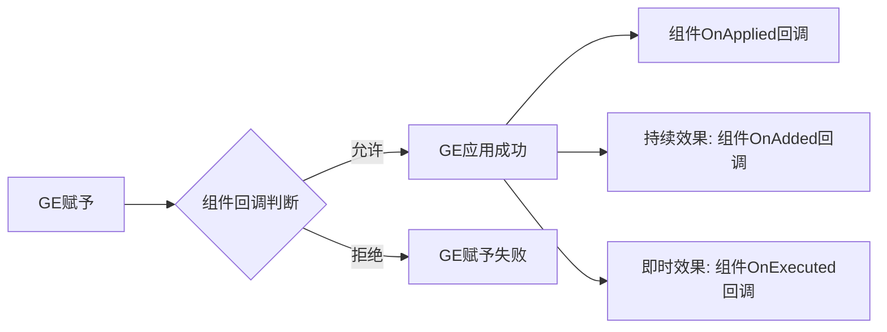

# GE组件
GE组件（Gameplay Effect Component）是UE5.3引入的扩展机制，基于**组合模式**替代传统的继承扩展，用于灵活定义GE的行为逻辑。

相比自定义执行类（仅支持即时效果），GE组件的优势在于：
1. 同时支持**持续效果**和**即时效果**
2. 覆盖GE全生命周期的关键节点（赋予前、赋予后、激活后、执行后、移除后）
3. 可通过组合多个组件实现复杂效果（如免疫+驱散+额外技能赋予）



---

## GE流程中的组件回调

UE5.7中，`UGameplayEffectComponent`提供了以下核心回调接口，覆盖GE全生命周期：

### 1. 赋予前判定：`CanGameplayEffectApply`
```cpp
virtual bool CanGameplayEffectApply(
    const FActiveGameplayEffectsContainer& ActiveGEContainer,
    const FGameplayEffectSpec& GESpec) const
```
- **触发时机**：GE尝试赋予目标前
- **作用**：判断是否允许GE赋予，所有组件的该回调都返回`true`时才会允许赋予
- **典型应用**：概率判定、自定义条件判定

### 2. 赋予成功通知：`OnGameplayEffectApplied`
```cpp
virtual void OnGameplayEffectApplied(
    const FActiveGameplayEffectsContainer& ActiveGEContainer,
    const FGameplayEffectSpec& GESpec,
    FPredictionKey PredictionKey) const
```
- **触发时机**：GE成功赋予目标后（持续效果和即时效果都会触发）
- **作用**：通知组件GE已成功应用，可用于初始化组件状态
- **典型应用**：赋予额外GE、触发GameplayCue

### 3. 持续效果添加通知：`OnActiveGameplayEffectAdded`
```cpp
virtual bool OnActiveGameplayEffectAdded(
    FActiveGameplayEffectsContainer& ActiveGEContainer,
    FActiveGameplayEffect& ActiveGE,
    FPredictionKey PredictionKey) const
```
- **触发时机**：持续效果GE成功添加到激活容器后
- **返回值**：是否允许GE立即激活（`false`时GE会进入抑制状态）
- **典型应用**：绑定GE状态变化事件（堆叠、持续时间、抑制状态）

### 4. 即时效果执行通知：`OnGameplayEffectExecuted`
```cpp
virtual void OnGameplayEffectExecuted(
    const FActiveGameplayEffectsContainer& ActiveGEContainer,
    const FGameplayEffectSpec& GESpec,
    FPredictionKey PredictionKey) const
```
- **触发时机**：即时效果（或持续效果的定时触发）成功执行后
- **典型应用**：触发额外逻辑（如击杀后附加buff）

### 5. 配置变化通知：`OnGameplayEffectChanged`
```cpp
virtual void OnGameplayEffectChanged() const
```
- **触发时机**：GE配置在编辑器中发生变化时
- **典型应用**：重新计算缓存数据（如标签、属性需求）

---

## 常用GE组件说明

UE5.7内置了多种常用GE组件，可直接配置使用：

### 1. `UAssetTagsGameplayEffectComponent`
- **用途**：为GE自身添加标签（用于标记GE类型，方便其他系统识别）
- **核心配置**：`FInheritedTagContainer InheritableAssetTags`
  - `Added`：额外添加的标签
  - `Removed`：从父类继承的标签中需要移除的标签
  - `CombinedTags`：最终合并后的标签（自动计算，只读）
- **Lyra实践**：Lyra中GE常用该组件标记效果类型（如`GameplayCue.Lyra.Damage`）

### 2. `UTargetTagsGameplayEffectComponent`
- **用途**：为GE的拥有者添加标签（GE生效时添加，失效时移除）
- **核心配置**：`FInheritedTagContainer InheritableGrantedTags`
- **Lyra实践**：Lyra中护盾GE使用该组件添加`Status.ShieldActive`标签，用于UI显示

### 3. `UBblockAbilityTagsGameplayEffectComponent`
- **用途**：阻挡拥有者激活特定标签的GA
- **核心配置**：`FGameplayTagContainer BlockedAbilityTags`
- **Lyra实践**：Lyra中眩晕GE使用该组件阻挡所有移动、攻击类技能

### 4. `UTargetTagRequirementsGameplayEffectComponent`
- **用途**：配置GE添加、持续、移除的标签条件
- **核心配置**：
  - `FGameplayTagRequirements ApplicationTagRequirements`：GE赋予时的标签条件
  - `FGameplayTagRequirements OngoingTagRequirements`：GE持续期间的标签条件（不满足时进入抑制状态）
  - `FGameplayTagRequirements RemovalTagRequirements`：GE移除时的标签条件（满足时强制移除）
- **Lyra实践**：Lyra中潜行GE使用该组件配置`OngoingTagRequirements`，当目标脱离潜行状态时自动移除GE

### 5. `UChanceToApplyGameplayEffectComponent`
- **用途**：配置GE赋予的概率
- **核心配置**：`FScalableFloat ChanceToApplyToTarget`（支持按等级映射概率）
- **Lyra实践**：Lyra中火焰附加GE配置30%概率触发燃烧效果

### 6. `UAbilitiesGameplayEffectComponent`
- **用途**：GE生效时赋予拥有者额外的GA，失效时根据策略移除
- **核心配置**：`TArray<FGameplayAbilitySpecConfig> GrantAbilityConfigs`
  - `Ability`：要赋予的GA类
  - `LevelScalableFloat`：GA等级
  - `RemovalPolicy`：GE失效时GA的移除策略（立即取消/执行完再移除/不处理）
- **Lyra实践**：Lyra中狂暴GE使用该组件赋予狂暴状态下的额外技能

### 7. `UAdditionalEffectsGameplayEffectComponent`
- **用途**：GE赋予成功、正常结束、提前结束时额外赋予其他GE
- **核心配置**：
  - `TArray<FConditionalGameplayEffect> OnApplicationGameplayEffects`：赋予成功时额外添加的GE
  - `TArray<TSubclassOf<UGameplayEffect>> OnCompleteNormal`：正常结束时额外添加的GE
  - `TArray<TSubclassOf<UGameplayEffect>> OnCompletePrematurely`：提前结束时额外添加的GE
- **Lyra实践**：Lyra中护盾破裂时，使用该组件触发护盾破裂的GE（如反伤效果）

### 8. `UImmunityGameplayEffectComponent`
- **用途**：配置免疫哪些GE
- **核心配置**：`TArray<FGameplayEffectQuery> ImmunityQueries`（用于匹配要免疫的GE）
- **Lyra实践**：Lyra中无敌GE使用该组件免疫所有伤害类GE

### 9. `URemoveOtherGameplayEffectComponent`
- **用途**：GE赋予时驱散符合条件的其他GE
- **核心配置**：`TArray<FGameplayEffectQuery> RemoveGameplayEffectQueries`（用于匹配要驱散的GE）
- **Lyra实践**：Lyra中净化GE使用该组件驱散所有减益效果

---

## UE5.7更新说明

相比UE5.3，UE5.7在GE组件方面的核心更新：
1. **性能优化**：优化组件回调的触发逻辑，减少不必要的回调执行
2. **接口扩展**：新增`OnGameplayEffectChanged`回调，支持编辑器配置变化的动态响应
3. **条件判定增强**：`FGameplayEffectQuery`支持更复杂的匹配规则
4. **网络优化**：优化组件数据的同步逻辑，减少网络带宽占用

---

## Lyra中的实践示例

### 示例1：护盾GE配置（使用`UTargetTagsGameplayEffectComponent`）
1. 创建GE蓝图，添加`UTargetTagsGameplayEffectComponent`组件
2. 在`InheritableGrantedTags`的`Added`中添加`Status.ShieldActive`标签
3. GE生效时，拥有者会被添加`Status.ShieldActive`标签，用于UI显示护盾状态
4. GE失效时，标签自动移除

### 示例2：免疫GE配置（使用`UImmunityGameplayEffectComponent`）
1. 创建GE蓝图，添加`UImmunityGameplayEffectComponent`组件
2. 在`ImmunityQueries`中添加`FGameplayEffectQuery`，配置匹配所有伤害类GE（标签包含`GameplayCue.Lyra.Damage`）
3. GE生效时，拥有者免疫所有匹配的GE

### 示例3：净化GE配置（使用`URemoveOtherGameplayEffectComponent`）
1. 创建GE蓝图，添加`URemoveOtherGameplayEffectComponent`组件
2. 在`RemoveGameplayEffectQueries`中添加`FGameplayEffectQuery`，配置匹配所有减益效果（标签包含`Status.Debuff`）
3. GE赋予时，自动驱散拥有者身上的所有减益效果

---

## 调试与常见问题

### 调试方法
1. 控制台输入`showdebug abilitysystem`，查看GE的组件配置和标签状态
2. 在组件回调函数中打断点，查看触发时机和参数
3. 使用`GameplayDebugger`插件，可视化GE组件的状态

### 常见问题
1. **组件回调不触发**：检查GE是否正确添加组件、回调逻辑是否正确、网络权限是否正确
2. **配置的标签不生效**：检查标签是否正确配置、GE是否正常激活、是否有其他逻辑覆盖了标签
3. **免疫不生效**：检查`ImmunityQueries`配置是否正确、匹配的GE标签是否准确
4. **额外技能不赋予**：检查`GrantAbilityConfigs`配置是否正确、GA是否有效、移除策略是否合理

---

## 参考资料
- [UE5.7 GAS官方文档](https://docs.unrealengine.com/5.7/en-US/gameplay-ability-system-for-unreal-engine/)
- Lyra源码：`LyraGame/Plugins/LyraGame/Source/LyraGame/AbilitySystem/GEComponents`
- UE5.7源码：`Engine/Plugins/Runtime/GameplayAbilities/Source/GameplayAbilities/Public/GameplayEffectComponent.h`

<!-- nav:auto -->

---

**导航**: ← [[30-tutorials/gas/11-GE自定义执行类|11-GE自定义执行类]] · [[30-tutorials/gas/13-GE匹配查询|13-GE匹配查询]] →

<!-- /nav:auto -->
