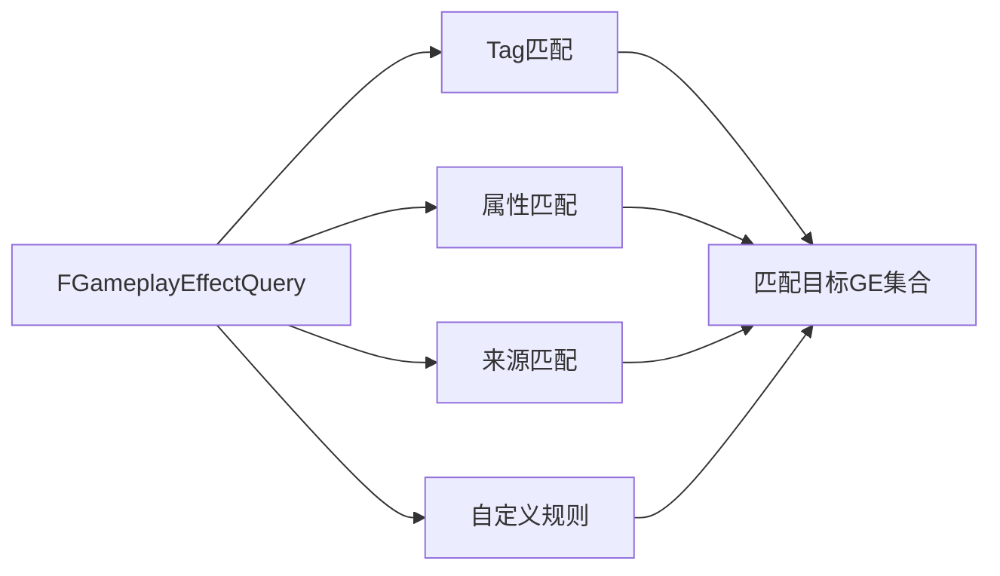

# GE匹配查询
`FGameplayEffectQuery`是GAS中用于**筛选/匹配GE**的核心工具，广泛应用于免疫、驱散、效果查找等场景。

UE5.7优化了查询性能并扩展了匹配规则，相比UE5.3支持更灵活的条件组合。



---

## FGameplayEffectQuery核心配置

`FGameplayEffectQuery`提供多维度匹配条件，所有条件需同时满足（逻辑与）：

```cpp
struct FGameplayEffectQuery
{
    // 自定义匹配委托（C++）
    FActiveGameplayEffectQueryCustomMatch CustomMatchDelegate;
    
    // 自定义匹配委托（蓝图）
    FActiveGameplayEffectQueryCustomMatch_Dynamic CustomMatchDelegate_BP;
    
    // 匹配GE自身Tag（含动态添加的Tag）
    FGameplayTagQuery OwningTagQuery;
    
    // 匹配GE来源Tag（仅Spec和SourceObject的Tag）
    FGameplayTagQuery EffectTagQuery;
    
    // 匹配GE所有来源Tag（含Actor、Spec、SourceObject的Tag）
    FGameplayTagQuery SourceAggregateTagQuery;
    
    // 匹配修正的属性类型
    FGameplayAttribute ModifyingAttribute;
    
    // 匹配GE来源对象（SourceObject）
    TObjectPtr<const UObject> EffectSource;
    
    // 匹配GE配置类（UGameplayEffect子类）
    TSubclassOf<UGameplayEffect> EffectDefinition;
    
    // 忽略指定GE句柄
    TArray<FActiveGameplayEffectHandle> IgnoreHandles;
};
```

---

## 根据Tag匹配

### 1. 匹配GE自身Tag（`OwningTagQuery`）
匹配GE自身携带的Tag（包括`AssetTags`和运行时动态添加的`DynamicTags`）：
```cpp
// 匹配所有携带`Status.Debuff`Tag的GE
FGameplayEffectQuery Query;
FGameplayTagQuery TagQuery = FGameplayTagQuery::MakeQuery_MatchTag(ULyraGameplayTags::Status_Debuff);
Query.OwningTagQuery = TagQuery;
```

### 2. 匹配GE来源Tag（`EffectTagQuery`）
仅匹配GE的Spec和SourceObject携带的Tag：
```cpp
// 匹配所有来源为`Character.Player`的GE
FGameplayEffectQuery Query;
FGameplayTagQuery TagQuery = FGameplayTagQuery::MakeQuery_MatchTag(ULyraGameplayTags::Character_Player);
Query.EffectTagQuery = TagQuery;
```

### 3. 匹配所有来源Tag（`SourceAggregateTagQuery`）
匹配GE所有来源相关的Tag（包括SourceActor、Spec、SourceObject）：
```cpp
// 匹配所有来源携带`Status.Burning`Tag的GE
FGameplayEffectQuery Query;
FGameplayTagQuery TagQuery = FGameplayTagQuery::MakeQuery_MatchTag(ULyraGameplayTags::Status_Burning);
Query.SourceAggregateTagQuery = TagQuery;
```

---

## 匹配修正属性

通过`ModifyingAttribute`匹配**修正指定属性**的GE：
```cpp
// 匹配所有修正`Health`属性的GE
FGameplayEffectQuery Query;
Query.ModifyingAttribute = ULyraHealthSet::HealthAttribute();
```

---

## 匹配GE来源

通过`EffectSource`匹配**指定来源对象**赋予的GE：
```cpp
// 匹配所有由指定Actor赋予的GE
FGameplayEffectQuery Query;
Query.EffectSource = TargetActor;
```

---

## 匹配GE配置

通过`EffectDefinition`匹配**指定GE类**的实例：
```cpp
// 匹配所有`GE_Damage_Fire`类的GE实例
FGameplayEffectQuery Query;
Query.EffectDefinition = UGE_Damage_Fire::StaticClass();
```

---

## 自定义匹配规则

### C++自定义匹配
绑定`CustomMatchDelegate`实现复杂匹配逻辑：
```cpp
// 匹配所有剩余持续时间小于5秒的GE
FGameplayEffectQuery Query;
Query.CustomMatchDelegate.BindLambda([](const FActiveGameplayEffect& Effect)
{
    const float RemainingDuration = Effect.GetTimeRemaining();
    return RemainingDuration > 0.f && RemainingDuration < 5.f;
});
```

### 蓝图自定义匹配
绑定`CustomMatchDelegate_BP`在蓝图中实现匹配逻辑：
1. 在蓝图中创建`FActiveGameplayEffectQueryCustomMatch_Dynamic`类型委托
2. 实现自定义匹配逻辑
3. 绑定到`FGameplayEffectQuery`的`CustomMatchDelegate_BP`字段

---

## UE5.7更新说明

相比UE5.3，UE5.7在GE匹配查询方面的核心更新：
1. **性能优化**：优化Tag匹配逻辑，减少不必要的Tag容器遍历
2. **接口扩展**：新增`GetActiveEffectsDuration`和`GetActiveEffectsTimeRemaining`接口，支持按查询条件获取持续时间
3. **蓝图增强**：优化蓝图委托的绑定逻辑，支持更灵活的条件组合
4. **调试增强**：新增查询调试日志，可详细查看匹配过程和结果

---

## Lyra中的实践示例

### 示例1：免疫组件（`UImmunityGameplayEffectComponent`）
Lyra中免疫组件使用`FGameplayEffectQuery`匹配需要免疫的GE：
```cpp
// 免疫所有伤害类GE
FGameplayEffectQuery ImmunityQuery;
FGameplayTagQuery DamageQuery = FGameplayTagQuery::MakeQuery_MatchTag(ULyraGameplayTags::GameplayCue_Lyra_Damage);
ImmunityQuery.OwningTagQuery = DamageQuery;

// 将查询条件添加到免疫组件
ImmunityQueries.Add(ImmunityQuery);
```

### 示例2：驱散组件（`URemoveOtherGameplayEffectComponent`）
Lyra中驱散组件使用`FGameplayEffectQuery`匹配需要驱散的GE：
```cpp
// 驱散所有减益效果
FGameplayEffectQuery DispelQuery;
FGameplayTagQuery DebuffQuery = FGameplayTagQuery::MakeQuery_MatchTag(ULyraGameplayTags::Status_Debuff);
DispelQuery.OwningTagQuery = DebuffQuery;

// 将查询条件添加到驱散组件
RemoveGameplayEffectQueries.Add(DispelQuery);
```

### 示例3：效果查找
Lyra中查找所有激活的护盾GE：
```cpp
// 查找所有护盾GE
FGameplayEffectQuery ShieldQuery;
FGameplayTagQuery ShieldQuery = FGameplayTagQuery::MakeQuery_MatchTag(ULyraGameplayTags::Status_ShieldActive);
ShieldQuery.OwningTagQuery = ShieldQuery;

TArray<FActiveGameplayEffectHandle> ShieldEffects = ASC->GetActiveEffects(ShieldQuery);
```

---

## 调试与常见问题

### 调试方法
1. 控制台输入`showdebug abilitysystem`，查看GE查询结果
2. 在`FGameplayEffectQuery::Matches`函数中打断点，查看匹配逻辑
3. 使用`GameplayDebugger`插件，可视化GE匹配流程

### 常见问题
1. **查询结果不正确**：检查匹配条件是否设置正确、Tag是否携带正确、条件是否冲突
2. **自定义匹配不生效**：检查委托是否绑定成功、逻辑是否正确
3. **性能问题**：避免过于复杂的Tag查询条件，优化自定义匹配逻辑

---

## 参考资料
- [UE5.7 GAS官方文档](https://docs.unrealengine.com/5.7/en-US/gameplay-ability-system-for-unreal-engine/)
- Lyra源码：`LyraGame/Plugins/LyraGame/Source/LyraGame/AbilitySystem/GEComponents`
- UE5.7源码：`Engine/Plugins/Runtime/GameplayAbilities/Source/GameplayAbilities/Public/GameplayEffectQuery.h`

<!-- nav:auto -->

---

**导航**: ← [[30-tutorials/gas/12-GE组件|12-GE组件]] · [[30-tutorials/gas/14-GE网络复制|14-GE网络复制]] →

<!-- /nav:auto -->
