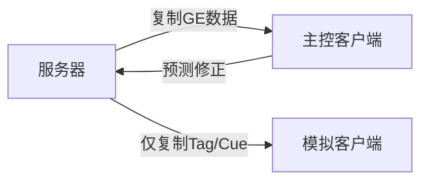

# GE网络复制
GAS的网络复制机制保证了**服务器与客户端之间的GE状态同步**，包括GE的赋予、激活、移除、属性修正等核心逻辑。

UE5.7优化了网络复制策略，支持三种复制模式，可根据项目需求灵活选择：
1. **Minimal（极简模式）**：仅复制GE的Tag和GameplayCue信息，不复制完整GE容器
2. **Full（全量模式）**：完整复制GE容器到所有客户端
3. **Mixed（混合模式）**：复制完整GE容器到主控客户端，其他客户端使用Minimal模式（官方推荐）



---

## 复制模式配置

通过`UAbilitySystemComponent`的`ReplicationMode`字段配置复制策略：

```cpp
class UAbilitySystemComponent : public UActorComponent
{
    // GE复制模式配置
    UPROPERTY(EditDefaultsOnly, Category=Replication)
    EGameplayEffectReplicationMode ReplicationMode;
    
    // 是否启用动态复制条件（根据ReplicationMode动态决定复制规则）
    static bool bUseReplicationConditionForActiveGameplayEffects = true;
};
```

### 三种复制模式对比
| 模式          | 主控客户端                     | 模拟客户端                     | 适用场景                     |
|---------------|--------------------------------|--------------------------------|------------------------------|
| Minimal       | 仅Tag/GameplayCue            | 仅Tag/GameplayCue            | 大量模拟客户端的MMO/大世界游戏 |
| Full          | 完整GE容器                    | 完整GE容器                    | 小型多人游戏                 |
| Mixed（推荐）| 完整GE容器                    | 仅Tag/GameplayCue            | 大多数多人游戏                |

---

## 复制流程详解

UE5.7中GE的网络复制基于`FFastArraySerializer`实现，仅复制变化的元素，优化网络带宽。

### 1. GE添加到激活容器（复制到客户端）
```cpp
void FActiveGameplayEffect::PostReplicatedAdd(const FActiveGameplayEffectsContainer& InArray)
{
    // 客户端收到GE添加通知，执行与服务器相同的添加逻辑
    const_cast<FActiveGameplayEffectsContainer&>(InArray).InternalOnActiveGameplayEffectAdded(*this, true);
}
```

### 2. GE属性/状态变化（复制到客户端）
```cpp
void FActiveGameplayEffect::PostReplicatedChange(const FActiveGameplayEffectsContainer& InArray)
{
    // 处理持续时间、堆叠数、属性修正等变化
    if (CachedStartServerWorldTime != StartServerWorldTime)
    {
        RecomputeStartWorldTime(InArray);
        const_cast<FActiveGameplayEffectsContainer&>(InArray).OnDurationChange(*this);
    }
    
    const int32 NewStackCount = Spec.GetStackCount();
    if (ClientCachedStackCount != NewStackCount)
    {
        const_cast<FActiveGameplayEffectsContainer&>(InArray).OnStackCountChange(*this, ClientCachedStackCount, NewStackCount);
        ClientCachedStackCount = NewStackCount;
    }
    else
    {
        // 属性修正变化，触发聚合器重算
        const_cast<FActiveGameplayEffectsContainer&>(InArray).UpdateAllAggregatorModMagnitudes(*this);
    }
}
```

### 3. GE移除（复制到客户端）
```cpp
void FActiveGameplayEffect::PreReplicatedRemove(const FActiveGameplayEffectsContainer& InArray)
{
    // 客户端收到GE移除通知，执行与服务器相同的移除逻辑
    const_cast<FActiveGameplayEffectsContainer&>(InArray).InternalOnActiveGameplayEffectRemoved(*this, FGameplayEffectRemovalInfo());
}
```

---

## 属性修正复制

属性修正的复制逻辑经过优化，仅复制必要的修正数据：
1. 服务器计算修正值并复制到客户端
2. 客户端重新构建属性聚合器（`FAggregator`）
3. 触发属性重算，更新属性当前值

```cpp
void FActiveGameplayEffectsContainer::AddActiveGameplayEffectGrantedTagsAndModifiers(FActiveGameplayEffect& Effect)
{
    if (ShouldUseMinimalReplication())
    {
        // Minimal/Mixed模式：仅复制Tag和GameplayCue
        Owner->AddMinimalReplicationGameplayTags(Effect.Spec.Def->GetGrantedTags());
        Owner->AddMinimalReplicationGameplayTags(Effect.Spec.DynamicGrantedTags);
    }
    else
    {
        // Full模式：完整复制属性修正
        for (int32 ModIdx = 0; ModIdx < Effect.Spec.Modifiers.Num(); ++ModIdx)
        {
            const FGameplayModifierInfo& ModDef = Effect.Spec.Def->Modifiers[ModIdx];
            float EvaluatedMagnitude = Effect.Spec.GetModifierMagnitude(ModIdx, true);
            
            FAggregator* Aggregator = FindOrCreateAttributeAggregator(ModDef.Attribute).Get();
            if (Aggregator)
            {
                Aggregator->AddAggregatorMod(EvaluatedMagnitude, ModDef.ModifierOp, ...);
            }
        }
    }
}
```

---

## UE5.7更新说明

相比UE5.3，UE5.7在GE网络复制方面的核心更新：
1. **性能优化**：优化`FFastArraySerializer`的复制逻辑，减少网络带宽占用
2. **预测增强**：支持客户端预测GE的属性修正，服务器验证后同步最终结果
3. **动态复制条件**：新增`bUseReplicationConditionForActiveGameplayEffects`配置，支持运行时动态调整复制策略
4. **调试工具**：新增网络复制调试接口，可详细查看GE复制数据

---

## Lyra中的实践示例

### 示例1：Mixed复制模式配置
Lyra默认使用Mixed模式，平衡网络带宽和客户端体验：
```cpp
// LyraCharacter初始化ASC时配置复制模式
void ALyraCharacter::PossessedBy(AController* NewController)
{
    UAbilitySystemComponent* ASC = GetAbilitySystemComponentFromActorInfo();
    if (ASC)
    {
        ASC->ReplicationMode = EGameplayEffectReplicationMode::Mixed;
    }
}
```

### 示例2：主控客户端的GE预测
Lyra中技能消耗体力的GE使用预测复制：
```cpp
// 客户端预判消耗体力
FPredictionKey PredictionKey = ASC->GetPredictionKey();
FGameplayEffectSpecHandle SpecHandle = MakeOutgoingGameplayEffectSpec(StaminaCostGEClass, 1.f);
ASC->ApplyGameplayEffectSpecToTarget(*SpecHandle.Data.Get(), ASC, PredictionKey);

// 服务器验证通过后，同步最终状态到客户端
```

### 示例3：模拟客户端的Minimal复制
模拟客户端仅接收GE的Tag和GameplayCue，不接收完整GE数据：
```cpp
// 模拟客户端收到Tag更新，触发对应的GameplayCue
void ULyraAbilitySystemComponent::AddMinimalReplicationGameplayTags(const FGameplayTagContainer& Tags)
{
    for (const FGameplayTag& Tag : Tags)
    {
        // 触发对应的GameplayCue效果（如燃烧、减速的粒子效果）
        InvokeGameplayCueEvent(Tag, EGameplayCueEvent::OnActive);
    }
}
```

---

## 调试与常见问题

### 调试方法
1. 控制台输入`net.Packet 1`查看网络复制数据
2. 控制台输入`AbilitySystem.Replication.Debug 1`开启GE复制调试日志
3. 在`FActiveGameplayEffect::PostReplicatedAdd`函数中打断点，查看复制数据

### 常见问题
1. **GE在客户端不生效**：检查复制模式是否正确、主控客户端是否收到完整GE数据
2. **网络带宽占用过高**：切换到Mixed或Minimal模式，减少不必要的GE复制
3. **预测失败**：检查预测密钥是否正确生成、服务器验证是否通过
4. **属性同步不一致**：检查属性聚合器是否正确重建、修正值是否准确复制

---

## 参考资料
- [UE5.7 GAS官方文档](https://docs.unrealengine.com/5.7/en-US/gameplay-ability-system-for-unreal-engine/)
- Lyra源码：`LyraGame/Plugins/LyraGame/Source/LyraGame/AbilitySystem`
- UE5.7源码：`Engine/Plugins/Runtime/GameplayAbilities/Source/GameplayAbilities/Public/GameplayEffectTypes.h`

<!-- nav:auto -->

---

**导航**: ← [[30-tutorials/gas/13-GE匹配查询|13-GE匹配查询]] · [[30-tutorials/gas/15-Tag简介与配置|15-Tag简介与配置]] →

<!-- /nav:auto -->
