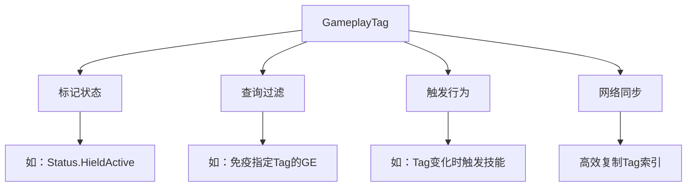
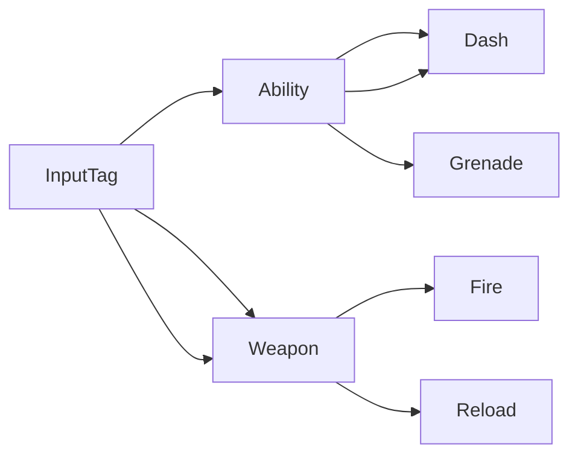
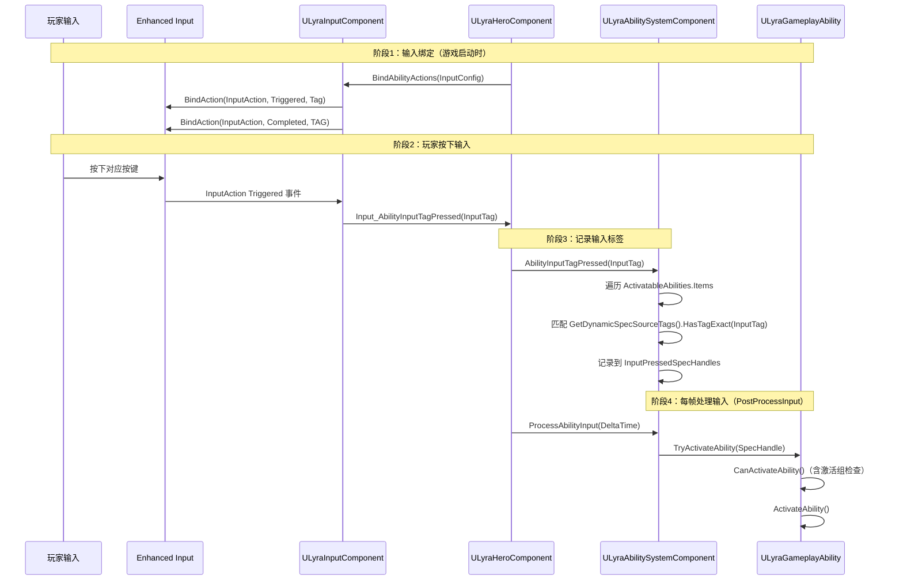

# Tag简介与配置
`GameplayTag`（简称Tag）是GAS及UE引擎中用于**描述游戏对象状态、分类、行为**的核心标签系统，广泛应用于GA/GE/GC配置、状态判断、网络同步等场景。

UE5.7对Tag系统进行了性能优化与功能扩展，相比UE5.3支持更灵活的层级管理与网络复制策略。



---

## 核心特性

### 1. 层级结构
Tag采用`.`分隔的层级命名规则，支持父子关系，子Tag自动继承父Tag的匹配规则：
- 示例：`Ability.Dash`、`Ability.Grenade`、`InputTag.Ability.Dash`
- 匹配规则：子Tag可匹配父Tag（如`Ability.Dash`可匹配`Ability`），但父Tag无法匹配子Tag



### 2. 高效存储与比较
- Tag本质是基于`FName`的封装，存储为两个`uint32`（全局FName索引 + 可选的数值后缀，如`Test_123`）
- 比较时直接通过`uint64`数值匹配，性能远高于字符串比较

### 3. 网络复制优化
- 支持复制Tag索引而非字符串，大幅降低网络带宽
- 可通过`CommonlyReplicatedTags`配置频繁复制的Tag，分配更小的索引以进一步优化

---

## Tag配置（项目设置）

在`项目设置（Project Settings）`→`Gameplay Tags`页面可配置Tag系统：

### 核心配置项
| 配置项                  | 说明                                                                 |
|-------------------------|----------------------------------------------------------------------|
| `Gameplay Tag Table List` | 引用包含Tag的DataTable（行结构为`FGameplayTagTableRow`）           |
| `新建Tag来源`            | 在项目或插件的`Config/Tags`目录生成`.ini`配置文件                 |
| `快速复制（Fast Replication）` | 启用后复制Tag索引而非字符串，大幅提升网络性能                   |
| `常见复制标签（Commonly Replicated Tags）` | 配置频繁复制的Tag，分配更小索引，降低复制带宽               |
| `容器大小的位数（Num Bits For Container Size）` | 设置Tag容器复制时的位宽，默认6位（支持最多63个Tag）             |
| `网络索引首位段（Net Index First Bit Segment）` | 拆分Tag索引为两个位段，高频复制的Tag使用更小位宽             |

### Lyra实践示例
Lyra在`DefaultGameplayTags.ini`中配置了完整的Tag层级，覆盖技能、输入、状态、效果等全场景：
```ini
; Lyra Tag配置示例（DefaultGameplayTags.ini）
[/Script/GameplayTags.GameplayTagsSettings]
+GameplayTagTableList=/Game/Lyra/Data/DataTables/DT_GameplayTags.DT_GameplayTags
+CommonlyReplicatedTags=InputTag.Move
+CommonlyReplicatedTags=Status.ShieldActive
```

---

## Tag添加方式

### 1. 编辑器界面添加
- 在`Gameplay Tag Manager`界面（项目设置→Gameplay Tags→Tag Manager）可视化添加、删除、重命名Tag
- 支持查看Tag的所有引用位置，方便管理

### 2. DataTable添加
- 创建`DataTable`，行结构选择`FGameplayTagTableRow`
- 在Table行中添加Tag路径（如`Ability.Dash`），保存后自动注册到Tag系统

### 3. C++代码添加（推荐）
使用UE提供的Tag注册宏，在模块加载时自动注册Tag：
```cpp
// 在.h文件中声明（外部可引用）
UE_DECLARE_GAMEPLAY_TAG_EXTERN(TAG_Ability_Dash, "Ability.Dash");

// 在.cpp文件中定义（注册Tag到系统）
UE_DEFINE_GAMEPLAY_TAG(TAG_Ability_Dash, "Ability.Dash");

// 不带说明的简化宏（仅当前模块可用）
UE_DEFINE_GAMEPLAY_TAG_STATIC(TAG_Ability_Dash, "Ability.Dash");
```

### 4. 运行时动态添加
通过`UAbilitySystemComponent`的接口动态添加/移除Tag：
```cpp
// 给Actor添加Tag
ASC->AddLooseGameplayTag(LyraGameplayTags::Status_ShieldActive);

// 移除Actor的Tag
ASC->RemoveLooseGameplayTag(LyraGameplayTags::Status_ShieldActive);
```

---

## 常用接口说明

| 接口函数                     | 说明                                                                 |
|------------------------------|----------------------------------------------------------------------|
| `RequestGameplayTag`           | 通过字符串查找或创建`FGameplayTag`（若不存在则按配置决定是否自动创建） |
| `IsValidGameplayTagString`    | 校验字符串是否为合法Tag格式，不合法时自动修复并输出修复结果       |
| `MatchesTag`                  | 模糊匹配（子Tag匹配父Tag，如`Ability.Dash`匹配`Ability`）         |
| `MatchesTagExact`             | 精确匹配（需Tag完全一致）                                           |
| `MatchesAny`                  | 检查当前Tag是否匹配指定容器中的任意Tag（模糊匹配）                   |
| `MatchesAnyExact`             | 检查当前Tag是否匹配指定容器中的任意Tag（精确匹配）                   |
| `MatchesTagDepth`             | 返回两个Tag的匹配深度（相同层级数量，深度越高匹配度越高）               |
| `GetSingleTagContainer`       | 返回包含当前Tag及其所有父Tag的容器（用于批量匹配）                   |
| `RequestDirectParent`         | 获取当前Tag的直接父Tag（如`Ability.Dash`的父Tag为`Ability`）      |

---

## UE5.7更新说明

相比UE5.3，UE5.7在Tag系统方面的核心更新：
1. **性能优化**：优化Tag树遍历与匹配逻辑，降低大规模Tag场景的CPU开销
2. **网络增强**：优化`Fast Replication`逻辑，支持动态位宽调整
3. **编辑器优化**：Tag Manager支持批量操作与过滤，提升编辑效率
4. **接口扩展**：新增`GetGameplayTagParents`接口，方便获取完整父Tag链

---

## Lyra 中的实践示例（真实源码分析）

### 示例1：InputTag 驱动 GA 激活（完整调用链）

Lyra 通过 `GameplayTag` 替代传统 `InputID` 驱动技能激活，完整调用链如下：



**关键源码路径**（均可在项目中直接查看）：

| 步骤 | 文件 | 函数 |
|------|------|------|
| 输入绑定 | `Source/LyraGame/Character/LyraHeroComponent.cpp` L283 | `InitializePlayerInput()` → `BindAbilityActions()` |
| 输入转发 | `Source/LyraGame/Character/LyraHeroComponent.cpp` L343 | `Input_AbilityInputTagPressed()` |
| 标签匹配 | `Source/LyraGame/AbilitySystem/LyraAbilitySystemComponent.cpp` L186 | `AbilityInputTagPressed()` |
| 每帧处理 | `Source/LyraGame/AbilitySystem/LyraAbilitySystemComponent.cpp` L216 | `ProcessAbilityInput()` |
| 激活策略判断 | `Source/LyraGame/AbilitySystem/Abilities/LyraGameplayAbility.cpp` L136 | `CanActivateAbility()` |

> 详细分析参见 [[30-tutorials/gas/01-GA简介与配置|GA 简介与配置]] 的 Lyra 扩展章节。

---

### 示例2：Tag 配置与注册（Lyra 实际做法）

Lyra 的 Tag 通过三种方式注册到 GAS 系统：

**方式一：C++ 代码注册（推荐，性能最优）**

```cpp
// Source/LyraGame/AbilitySystem/Attributes/LyraHealthSet.cpp L15-L19
UE_DEFINE_GAMEPLAY_TAG(TAG_Gameplay_Damage, "Gameplay.Damage");
UE_DEFINE_GAMEPLAY_TAG(TAG_Gameplay_DamageImmunity, "Gameplay.DamageImmunity");
UE_DEFINE_GAMEPLAY_TAG(TAG_Gameplay_DamageSelfDestruct, "Gameplay.Damage.FellOutOfWorld");
UE_DEFINE_GAMEPLAY_TAG(TAG_Lyra_Damage_Message, "Lyra.Damage.Message");
```

**方式二：DataTable 配置（`LyraGame/Data/DataTables/DT_GameplayTags`）**

```ini
; 项目设置 → Gameplay Tags → Gameplay Tag Table List
+GameplayTagTableList=/Game/Lyra/Data/DataTables/DT_GameplayTags.DT_GameplayTags
```

**方式三：INI 文件（`LyraGame/Config/DefaultGameplayTags.ini`）**

```ini
[/Script/GameplayTags.GameplayTagsSettings]
+GameplayTagList=(Tag="Ability.Dash",DevComment="冲刺技能")
+GameplayTagList=(Tag="InputTag.Ability.Dash",DevComment="冲刺输入标签")
+CommonlyReplicatedTags=InputTag.Move
+CommonlyReplicatedTags=Status.ShieldActive
```

---

### 示例3：Tag 在 GE 伤害免疫中的实际应用

`ULyraHealthSet::PreGameplayEffectExecute`（`LyraHealthSet.cpp` L68-L106）通过 Tag 实现伤害免疫：

```cpp
// LyraHealthSet.cpp L68-L106
bool ULyraHealthSet::PreGameplayEffectExecute(FGameplayEffectModCallbackData& Data)
{
    if (!Super::PreGameplayEffectExecute(Data))
        return false;

    if (Data.EvaluatedData.Attribute == GetDamageAttribute())
    {
        if (Data.EvaluatedData.Magnitude > 0.0f)
        {
            const bool bIsDamageFromSelfDestruct =
                Data.EffectSpec.GetDynamicAssetTags()
                    .HasTagExact(TAG_Gameplay_DamageSelfDestruct);

            // 关键：通过 Tag 实现伤害免疫
            if (Data.Target.HasMatchingGameplayTag(TAG_Gameplay_DamageImmunity)
                && !bIsDamageFromSelfDestruct)
            {
                Data.EvaluatedData.Magnitude = 0.0f;  // 免疫：伤害归零
                return false;
            }
        }
    }
    return true;  // 允许 GE 继续生效
}
```

**调用链**：`UAbilitySystemComponent::ApplyGameplayEffectSpecToSelf()` → `PreGameplayEffectExecute()` → [GE 修正属性] → `PostGameplayEffectExecute()`


---

## 调试与常见问题

### 调试方法
1. 控制台输入`showdebug abilitysystem`，实时查看Actor携带的所有GameplayTag
2. 在`Gameplay Tag Manager`中搜索Tag，查看所有引用该Tag的GE/GA/GC资产
3. 使用`GAMEPLAY_TAG_LOG`宏输出Tag调试信息

### 常见问题
1. **Tag无法匹配**：检查Tag层级是否正确，子Tag可匹配父Tag，但父Tag无法匹配子Tag
2. **网络复制带宽过高**：启用`Fast Replication`，并将高频复制Tag添加到`CommonlyReplicatedTags`
3. **C++注册的Tag无法找到**：确保`UE_DEFINE_GAMEPLAY_TAG`宏在模块加载时执行，且Tag路径与.ini配置一致

---

## 参考资料
- [UE5.7 GameplayTag官方文档](https://docs.unrealengine.com/5.7/zh-CN/using-gameplay-tags-in-unreal-engine/)
- Lyra源码：`LyraGame/Config/DefaultGameplayTags.ini`
- UE5.7源码：`Engine/Source/Runtime/GameplayTags/Public/GameplayTag.h`

<!-- nav:auto -->

---

**导航**: ← [[30-tutorials/gas/14-GE网络复制|14-GE网络复制]] · [[30-tutorials/gas/16-Tag收集与构建|16-Tag收集与构建]] →

<!-- /nav:auto -->
