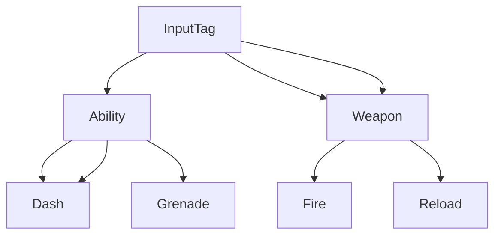
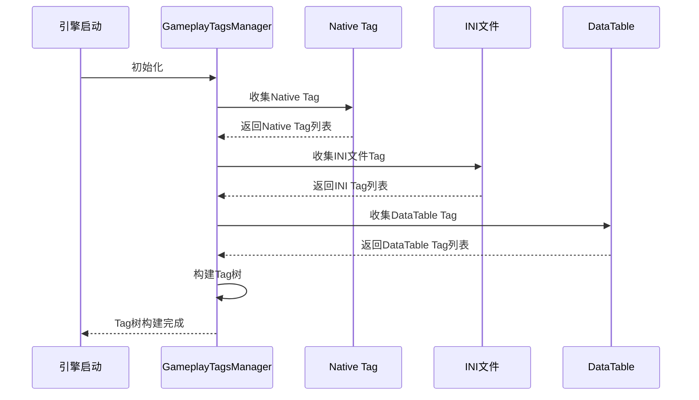

# Tag收集与构建
`GameplayTagsManager`是UE中管理GameplayTag的**全局单例**，负责在引擎启动时收集所有配置的Tag，并构建成层级化的Tag树，为Tag的查询、匹配、同步提供基础支持。

UE5.7优化了Tag收集与构建的性能，支持更复杂的Tag来源管理，相比UE5.3更加稳定高效。


---

## 核心概念

### 1. GameplayTagsManager
全局单例，负责Tag的收集、构建、查询全生命周期管理：
```cpp
// 获取GameplayTagsManager单例
static UGameplayTagsManager& Get();

// 初始化Manager
void InitializeManager();

// 构建Tag树
void ConstructGameplayTagTree();
```

### 2. Tag配置来源
UE5.7支持三种Tag配置来源，所有来源的Tag最终都会被收集到`GameplayTagsManager`中：
| 来源类型                | 配置方式                                                                 | 典型应用场景                     |
|-------------------------|----------------------------------------------------------------------|----------------------------------|
| `Native`                | C++代码中使用`UE_DEFINE_GAMEPLAY_TAG`宏注册                       | 引擎/插件内置Tag                |
| `INI文件`              | 在`Config/Tags`目录创建`.ini`配置文件                             | 项目/插件自定义Tag                |
| `DataTable`             | 创建`FGameplayTagTableRow`结构的DataTable，在项目设置中引用          | 大规模Tag管理                    |

### 3. Tag树
所有收集的Tag会被组织成**层级化树状结构**，每个Tag对应树上的一个节点：
- 子Tag节点自动继承父Tag的匹配规则
- 支持快速查询父Tag、子Tag、匹配度等信息



---

## Tag配置来源

### 1. Native Tag（C++代码注册）
使用UE提供的Tag注册宏，在模块加载时自动注册Tag：
```cpp
// 在.h文件中声明（外部可引用）
UE_DECLARE_GAMEPLAY_TAG_EXTERN(TAG_Ability_Dash, "Ability.Dash");

// 在.cpp文件中定义（注册Tag到系统）
UE_DEFINE_GAMEPLAY_TAG(TAG_Ability_Dash, "Ability.Dash");

// 不带说明的简化宏（仅当前模块可用）
UE_DEFINE_GAMEPLAY_TAG_STATIC(TAG_Ability_Dash, "Ability.Dash");
```

### 2. INI文件配置
在项目或插件的`Config/Tags`目录创建`.ini`配置文件：
```ini
; 示例：MyPlugin/Config/Tags/MyTags.ini
[/Script/GameplayTags.GameplayTagsSettings]
+GameplayTagList=/Game/MyPlugin/DataTables/DT_MyTags.DT_MyTags
```

### 3. DataTable配置
创建`DataTable`，行结构选择`FGameplayTagTableRow`：
| 行名               | Tag（FName）         | DevComment（FString）       |
|--------------------|------------------------|--------------------------|
| Ability_Dash        | Ability.Dash           | 冲刺技能Tag             |
| Weapon_Fire         | InputTag.Weapon.Fire  | 开火输入Tag             |

然后在项目设置（`Project Settings` → `Gameplay Tags`）中引用该DataTable。

---

## Tag树构建流程

UE5.7中Tag树的构建流程如下：
1. **收集所有Tag配置**：从Native、INI文件、DataTable中收集所有Tag
2. **创建Tag节点**：为每个Tag在Tag树上创建对应的节点
3. **建立层级关系**：根据Tag的`.`分隔符，建立父子节点关系
4. **生成索引**：为每个Tag分配网络复制索引，优化同步性能



---

## UE5.7更新说明

相比UE5.3，UE5.7在Tag收集与构建方面的核心更新：
1. **性能优化**：优化大规模Tag场景的收集与构建速度，降低启动时间
2. **来源管理增强**：支持动态添加/移除Tag来源，无需重启引擎
3. **编辑器优化**：Tag Manager支持批量导入/导出，提升编辑效率
4. **网络优化**：优化Tag索引分配逻辑，减少网络复制带宽

---

## Lyra中的实践示例

### 示例1：Lyra的Native Tag注册
Lyra在`LyraGameplayTags`模块中注册所有内置Tag：
```cpp
// LyraGameplayTags.h
UE_DECLARE_GAMEPLAY_TAG_EXTERN(LyraGameplayTags_Ability_Dash, "Ability.Lyra.Dash");

// LyraGameplayTags.cpp
UE_DEFINE_GAMEPLAY_TAG(LyraGameplayTags_Ability_Dash, "Ability.Lyra.Dash");
```

### 示例2：Lyra的INI文件配置
Lyra在`LyraGame/Config/Tags`目录配置了自定义Tag：
```ini
; LyraGame/Config/Tags/LyraTags.ini
[/Script/GameplayTags.GameplayTagsSettings]
+GameplayTagList=/Game/Lyra/DataTables/DT_LyraTags.DT_LyraTags
```

### 示例3：Lyra的DataTable管理
Lyra使用DataTable管理大量技能和输入Tag，方便策划配置和修改。

---

## 调试与常见问题

### 调试方法
1. 控制台输入`GameplayTags.Dump`，输出所有已注册的Tag信息
2. 在`Gameplay Tags Manager`界面（项目设置→Gameplay Tags）查看Tag层级和引用
3. 使用`GAMEPLAY_TAG_LOG`宏输出Tag调试信息

### 常见问题
1. **Tag无法找到**：检查Tag配置来源是否正确加载、Tag路径是否拼写正确
2. **Tag树构建失败**：检查Tag层级是否合法（如避免循环引用）
3. **网络同步失败**：检查是否启用了`Fast Replication`，Tag索引是否一致

---

## 参考资料
- [UE5.7 GameplayTag官方文档](https://docs.unrealengine.com/5.7/zh-CN/using-gameplay-tags-in-unreal-engine/)
- Lyra源码：`LyraGame/Source/LyraGameplayTags`
- UE5.7源码：`Engine/Source/Runtime/GameplayTags/Public/GameplayTagsManager.h`

<!-- nav:auto -->

---

**导航**: ← [[30-tutorials/gas/15-Tag简介与配置|15-Tag简介与配置]] · [[30-tutorials/gas/17-Tag集合容器|17-Tag集合容器]] →

<!-- /nav:auto -->
