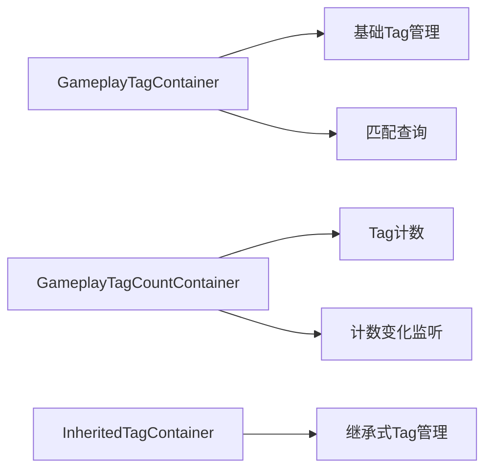

# Tag集合容器
`GameplayTag`集合容器是GAS中管理Tag分组、匹配、计数的核心工具，广泛应用于：
- 技能/效果的Tag过滤与匹配
- 角色状态同步与监听
- 输入绑定与技能激活条件判断

UE5.7优化了容器性能并扩展了监听机制，支持更灵活的批量操作。



---

## 核心容器类型

### 1. `FGameplayTagContainer`
最基础的Tag容器，存储Tag及其父级Tag：
```cpp
struct FGameplayTagContainer
{
    // 显式添加的Tag（不含父级）
    TArray<FGameplayTag> GameplayTags;
    
    // 所有父级Tag（自动填充）
    TArray<FGameplayTag> ParentTags;
};
```

#### 核心特性
- 添加Tag时自动填充所有父级Tag到`ParentTags`
- 支持模糊匹配（子Tag匹配父Tag）和精确匹配

### 2. `FInheritedTagContainer`
用于继承并合并父类的Tag配置：
```cpp
struct FInheritedTagContainer
{
    // 需要排除的Tag（模糊匹配）
    FGameplayTagContainer Removed;
    
    // 额外添加的Tag（精确匹配）
    FGameplayTagContainer Added;
    
    // 最终合并结果（自动计算，只读）
    FGameplayTagContainer CombinedTags;
};
```

#### 核心特性
- 自动合并父容器Tag，支持排除指定Tag
- 广泛用于GE/GA的Tag配置继承

### 3. `FTagContainerAggregator`
聚合多个来源的Tag容器（如角色Tag、GE赋予Tag）：
```cpp
struct FTagContainerAggregator
{
    // 来自角色的Tag
    FGameplayTagContainer CapturedActorTags;
    
    // 来自GA/GE的Tag
    FGameplayTagContainer CapturedSpecTags;
    
    // 聚合后的Tag（自动合并）
    mutable FGameplayTagContainer CachedAggregator;
};
```

#### 核心特性
- 自动聚合多个来源的Tag，支持动态更新
- 用于GC触发条件、GE匹配查询等场景

### 4. `FGameplayTagCountContainer`
跟踪Tag计数并支持计数变化监听（ASC核心属性）：
```cpp
struct FGameplayTagCountContainer
{
    // Tag到计数的映射（含父级Tag计数）
    TMap<FGameplayTag, int32> GameplayTagCountMap;
    
    // 显式添加的Tag计数（不含父级）
    TMap<FGameplayTag, int32> ExplicitTagCountMap;
    
    // 计数变化委托
    TMap<FGameplayTag, FDelegateInfo> GameplayTagEventMap;
};
```

#### 核心特性
- 自动维护Tag计数（含父级Tag累加）
- 支持精准的计数变化监听，用于触发技能/效果

---

## 常用操作接口

### `FGameplayTagContainer`常用接口
| 接口函数                     | 说明                                                                 |
|------------------------------|----------------------------------------------------------------------|
| `AddTag`                     | 添加Tag（自动填充父级Tag）                                         |
| `RemoveTag`                  | 移除Tag（自动更新父级Tag）                                         |
| `HasTag`                     | 模糊匹配（子Tag匹配父Tag）                                           |
| `HasTagExact`                | 精确匹配（仅匹配显式添加的Tag）                                   |
| `MatchesAny`                 | 匹配另一个容器中的任意Tag（模糊匹配）                             |
| `MatchesAnyExact`            | 匹配另一个容器中的任意Tag（精确匹配）                             |
| `GetGameplayTagParents`      | 获取Tag的所有父级Tag                                               |

### `FGameplayTagCountContainer`常用接口
| 接口函数                     | 说明                                                                 |
|------------------------------|----------------------------------------------------------------------|
| `AddPlayplayTag`              | 添加Tag（计数+1，自动更新父级计数）                              |
| `RemovePlayplayTag`           | 移除Tag（计数-1，自动更新父级计数）                              |
| `GetTagCount`                | 获取Tag当前计数（含父级累加）                                       |
| `RegisterGameplayTagEvent`    | 注册Tag计数变化监听委托                                         |
| `UnRegisterGameplayTagEvent`  | 取消注册Tag计数变化监听委托                                       |

---

## UE5.7更新说明

相比UE5.3，UE5.7在Tag集合容器方面的核心更新：
1. **性能优化**：优化容器批量操作，降低大规模Tag场景的CPU开销
2. **监听增强**：新增`OnAnyTagChangeDelegate`，支持监听任意Tag变化
3. **接口扩展**：新增`GetTagCount`重载，支持指定是否包含父级计数
4. **网络优化**：优化容器序列化和反序列化逻辑，减少网络带宽

---

## Lyra中的实践示例

### 示例1：技能输入Tag绑定
Lyra通过`FGameplayTagContainer`绑定输入与技能：
```cpp
// LyraInputComponent.cpp
void ULyraInputComponent::BindAbilityActions(...)
{
    for (const FLyraGameplayAbilityDat& AbilityDat : DefaultMappingContext->Abilities)
    {
        // 通过Tag匹配绑定输入
        if (AbilityDat.InputTag.MatchesAny(InputTagContainer))
        {
            BindAbilityActivationToInput Component(AbilityDat.Ability, AbilityDat.InputTag);
        }
    }
}
```

### 示例2：GE Tag继承配置
Lyra的GE通过`FInheritedTagContainer`实现Tag继承：
```ini
; LyraGame/Config/DefaultGameplayTags.ini
[/Script/GameplayTags.GameplayTagsSettings]
+GameplayTagList=/Game/Lyra/Data/DataTables/DT_GameplayTags.DT_GameplayTags

; 子类GE继承父类Tag并排除指定Tag
[/Game/Lyra/GameplayEffects/GE_Damage_Fire]
InheritedTagContainer=(Removed=(GameplayCue.Lyra.Damage.Ice), Added=(Status.Burning))
```

### 示例3：Tag计数变化监听
Lyra通过`FGameplayTagCountContainer`监听状态变化：
```cpp
// LyraAbilitySystemComponent.cpp
void ULyraAbilitySystemComponent::BeginPlay()
{
    Super::BeginPlay();
    
    // 监听燃烧状态Tag变化
    FGameplayTag BurningTag = ULyraGameplayTags::Status_Burning;
    RegisterGameplayTagEvent(BurningTag, EGameplayTagEventType::NewOrRemoved)
        .AddUObject(this, &ULyraAbilitySystemComponent::OnBurningTagChanged);
}

void ULyraAbilitySystemComponent::OnBurningTagChanged(const FGameplayTag Tag, int32 NewCount)
{
    if (NewCount > 0)
    {
        // 触发燃烧效果
        ApplyIgniteGameplayEffect();
    }
}
```

---

## 调试与常见问题

### 调试方法
1. 控制台输入`showdebug abilitysystem`，实时查看角色携带的所有Tag及计数
2. 在`FGameplayTagCountContainer::GatherTagChangeDelegates`函数中打断点，查看委托触发逻辑
3. 使用`GAMEPLAY_TAG_LOG`宏输出Tag调试信息

### 常见问题
1. **Tag匹配失败**：检查是否混淆模糊匹配与精确匹配，子Tag可匹配父Tag但父Tag无法匹配子Tag
2. **计数变化未触发**：检查委托注册类型是否正确（`NewOrRemoved`/`AnyChange`），确保Tag已正确添加
3. **性能问题**：避免频繁创建大量临时Tag容器，优先使用引用或指针传递

---

## 参考资料
- [UE5.7 GameplayTag官方文档](https://docs.unrealengine.com/5.7/zh-CN/using-gameplay-tags-in-unreal-engine/)
- Lyra源码：`LyraGame/Source/LyraGame/AbilitySystem`
- UE5.7源码：`Engine/Source/Runtime/GameplayTags/Public/GameplayTagContainer.h`

<!-- nav:auto -->

---

**导航**: ← [[30-tutorials/gas/16-Tag收集与构建|16-Tag收集与构建]] · [[30-tutorials/gas/18-Tag匹配查询|18-Tag匹配查询]] →

<!-- /nav:auto -->
