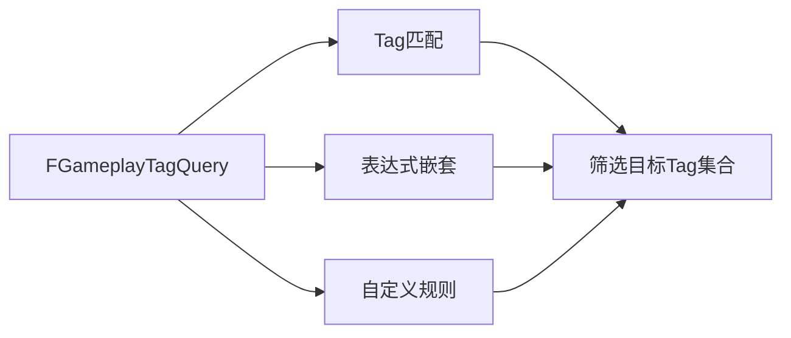

# Tag匹配查询
`FGameplayTagQuery`是GAS中用于**灵活筛选Tag集合**的核心工具，广泛应用于免疫、驱散、技能激活条件判断等场景。

UE5.7优化了查询性能并扩展了表达式支持，相比UE5.3支持更复杂的嵌套逻辑。



---

## FGameplayTagQuery核心配置

`FGameplayTagQuery`通过**表达式树**描述匹配规则，支持多种操作类型：

```cpp
struct FGameplayTagQuery
{
    // 表达式根节点
    FGameplayTagQueryExpression RootExpression;
    
    // 表达式描述（调试用）
    FString UserDescription;
};
```

### 核心操作类型
| 操作类型                | 说明                                                                 | UE5.7扩展                     |
|-------------------------|----------------------------------------------------------------------|------------------------------|
| `AnyTagsMatch`          | 有一个Tag匹配即为真（逻辑或）                                           | 支持嵌套子表达式             |
| `AllTagsMatch`          | 所有Tag匹配才为真（逻辑与）                                           | 支持嵌套子表达式             |
| `NoTagsMatch`          | 没有匹配的Tag才为真（逻辑非+与）                                      | 支持嵌套子表达式             |
| `AnyExprMatch`          | 有一个子表达式结果为真即为真（逻辑或）                                   | 新增，支持复杂嵌套逻辑       |
| `AllExprMatch`          | 所有子表达式结果为真才为真（逻辑与）                                   | 新增，支持复杂嵌套逻辑       |
| `NoExprMatch`          | 所有子表达式结果为假才为真（逻辑非+与）                                | 新增，支持复杂嵌套逻辑       |

---

## 匹配规则详解

### 1. 基础Tag匹配
通过`FGameplayTagQueryExpression`的静态方法快速创建匹配规则：
```cpp
// 匹配包含任意指定Tag的集合（逻辑或）
static FGameplayTagQuery MakeQuery_MatchAnyTags(const FGameplayTagContainer& InTags);

// 匹配包含所有指定Tag的集合（逻辑与）
static FGameplayTagQuery MakeQuery_MatchAllTags(const FGameplayTagContainer& InTags);

// 匹配不包含任何指定Tag的集合（逻辑非+与）
static FGameplayTagQuery MakeQuery_MatchNoTags(const FGameplayTagContainer& InTags);
```

### 2. 复杂嵌套表达式
UE5.7新增支持嵌套子表达式，可构造复杂逻辑：
```cpp
// 构造表达式：(HasTag(Tag1) && HasTag(Tag2)) || (HasTag(Tag3) && !HasTag(Tag4))
FGameplayTagQuery ComplexQuery;
FGameplayTagQueryExpression RootExpr;
RootExpr.AnyExprMatch()
    .AddExpr(FGameplayTagQueryExpression().AllTagsMatch()
        .AddTag(Tag1)
        .AddTag(Tag2))
    .AddExpr(FGameplayTagQueryExpression().AllTagsMatch()
        .AddTag(Tag3)
        .AddTag(FGameplayTagQueryExpression().NoTagsMatch()
            .AddTag(Tag4)));

ComplexQuery.RootExpression = RootExpr;
```

### 3. 匹配逻辑
`FGameplayTagQuery::Matches`函数用于判断目标Tag集合是否满足查询条件：
```cpp
bool FGameplayTagQuery::Matches(const FGameplayTagContainer& Tags) const
{
    if (!RootExpression.IsValid())
    {
        return false;
    }
    
    FGameplayTagQueryEvaluator Evaluator;
    return Evaluator.Evaluate(RootExpression, Tags);
}
```

---

## 自定义匹配规则

### C++自定义匹配
通过继承`FGameplayTagQueryEvaluator`并重写`Evaluate`方法实现自定义逻辑：
```cpp
class FCustomTagQueryEvaluator : public FGameplayTagQueryEvaluator
{
public:
    virtual bool Evaluate(const FGameplayTagQueryExpression& Expr, const FGameplayTagContainer& Tags) const override
    {
        // 自定义匹配逻辑
        if (Tags.HasTag(Tag1) && Tags.HasTag(Tag2))
        {
            return true;
        }
        return false;
    }
};
```

### 蓝图自定义匹配
UE5.7支持在蓝图中构造复杂查询表达式：
1. 在蓝图中创建`FGameplayTagQuery`变量
2. 使用`Make Query Match Any Tags`等节点构造表达式
3. 支持嵌套表达式和逻辑运算

---

## UE5.7更新说明

相比UE5.3，UE5.7在Tag匹配查询方面的核心更新：
1. **性能优化**：优化表达式树遍历逻辑，降低大规模Tag匹配场景的CPU开销
2. **表达式扩展**：新增`AnyExprMatch`/`AllExprMatch`/`NoExprMatch`，支持嵌套子表达式
3. **编辑器优化**：Tag查询编辑器支持实时预览匹配结果
4. **蓝图增强**：支持在蓝图中构造复杂嵌套查询表达式

---

## Lyra中的实践示例

### 示例1：免疫组件配置
Lyra中免疫组件使用`FGameplayTagQuery`匹配需要免疫的GE：
```cpp
// 匹配所有伤害类GE（Tag包含GameplayCue.Lyra.Damage）
FGameplayTagContainer DamageTags;
DamageTags.AddTag(LyraGameplayTags::GameplayCue_Lyra_Damage);
FGameplayTagQuery ImmunityQuery = FGameplayTagQuery::MakeQuery_MatchAnyTags(DamageTags);

// 将查询条件添加到免疫组件
ImmunityQueries.Add(ImmunityQuery);
```

### 示例2：驱散组件配置
Lyra中驱散组件使用`FGameplayTagQuery`匹配需要驱散的GE：
```cpp
// 匹配所有减益效果（Tag包含Status.Debuff）
FGameplayTagContainer DebuffTags;
DebuffTags.AddTag(LyraGameplayTags::Status_Debuff);
FGameplayTagQuery DispelQuery = FGameplayTagQuery::MakeQuery_MatchAnyTags(DebuffTags);

// 将查询条件添加到驱散组件
RemoveGameplayEffectQueries.Add(DispelQuery);
```

### 示例3：技能激活条件
Lyra中技能激活条件使用`FGameplayTagQuery`判断：
```cpp
// 技能激活需要：处于战斗状态且无眩晕Tag
FGameplayTagQuery ActivationQuery;
FGameplayTagQueryExpression Expr;
Expr.AllTagsMatch()
    .AddTag(LyraGameplayTags::Status_Combat)
    .AddTag(FGameplayTagQueryExpression().NoTagsMatch()
        .AddTag(LyraGameplayTags::Status_Stun));

ActivationQuery.RootExpression = Expr;
```

---

## 调试与常见问题

### 调试方法
1. 控制台输入`GameplayTags.Query.Debug 1`开启查询调试日志
2. 在`FGameplayTagQueryEvaluator::Evaluate`函数中打断点，查看匹配逻辑
3. 使用`FGameplayTagQuery::GetDescription`输出查询表达式描述

### 常见问题
1. **查询结果不正确**：检查表达式逻辑是否正确、Tag是否携带正确、父子Tag匹配规则是否预期
2. **性能问题**：避免过于复杂的嵌套表达式，优化Tag集合大小
3. **蓝图表达式不生效**：检查表达式是否正确构建、是否赋值给查询对象

---

## 参考资料
- [UE5.7 GameplayTagQuery官方文档](https://docs.unrealengine.com/5.7/en-US/API/Runtime/GameplayTags/FGameplayTagQuery/)
- Lyra源码：`LyraGame/Plugins/LyraGame/Source/LyraGame/AbilitySystem`
- UE5.7源码：`Engine/Source/Runtime/GameplayTags/Public/GameplayTagQuery.h`

<!-- nav:auto -->

---

**导航**: ← [[30-tutorials/gas/17-Tag集合容器|17-Tag集合容器]] · [[30-tutorials/gas/19-Tag网络复制|19-Tag网络复制]] →

<!-- /nav:auto -->
